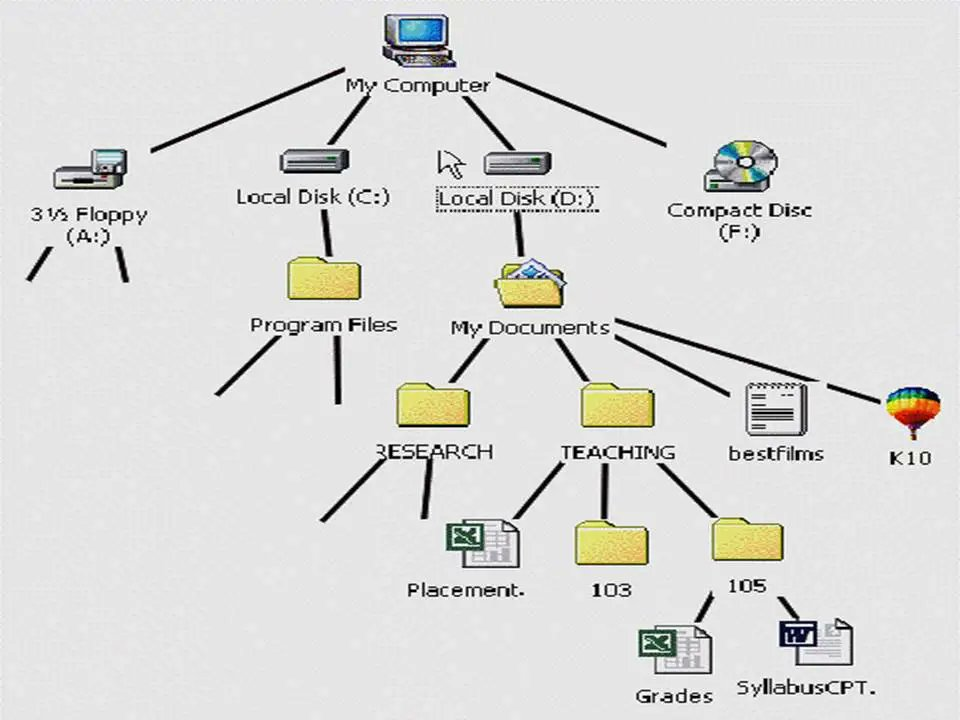

# The CLAUDE.md File That 10x'd My Output (Full File Included)

**Author:** darkzodchi ([@zodchiii](https://x.com/zodchiii))  
**Published:** Apr 27, 2026  
**Source:** [The CLAUDE.md File That 10x'd My Output (Full File Included)](https://x.com/Zephyr_hg/status/2048683276194185640)

Every Claude Code session starts by reading one file: CLAUDE.md. Before your first prompt, before any code, before anything happens, Claude reads this file and treats it as ground truth for the entire session.

Most people either don't have one, or theirs is 300 lines of personality instructions.

The difference between a good CLAUDE.md and a bad one is the difference between onboarding a senior engineer with a clear brief and throwing a new hire into a codebase with no documentation.

Here's how to write one that actually works👇

Before we dive in, I share daily notes on AI & vibe coding in my Telegram channel: https://t.me/zodchixquant🧠


## Why most CLAUDE.md files don't work

Three reasons:

**Too long.** Models can reliably follow about 150-200 instructions. Claude Code's system prompt already contains roughly 50. That means your CLAUDE.md gets maybe 100-150 instructions before Claude starts dropping things. If your file is 200+ lines, Claude isn't ignoring your rules on purpose.

**Wrong content.** Most people fill CLAUDE.md with things Claude can figure out on its own. Personality instructions like "be a senior engineer" or "think step by step." General advice that doesn't change Claude's behavior. Every line that doesn't prevent a specific mistake is a wasted instruction.

**No hierarchy.** CLAUDE.md isn't the only place to put instructions. There are three levels and most people dump everything into one:

```
~/.claude/CLAUDE.md       → Global (every project)
.claude/CLAUDE.md         → Project (shared with team, in git)  
./CLAUDE.local.md         → Local (personal overrides, gitignored)
```

Global is for rules you'd repeat in every project. Project is for stack-specific context your team needs. Local is for your personal quirks.

Using all three keeps each file short and focused.



## The 5 sections that actually matter

After going through dozens of production CLAUDE.md files from open-source projects, Anthropic's own docs, and community best practices repos, every effective file covers these 5 things:

### 1. Critical commands

Claude doesn't know how to build, test, or lint your project = tell it.

```
## Commands
- Build: `npm run build`
- Dev: `npm run dev`  
- Test single file: `npm test -- path/to/file`
- Lint + fix: `npm run lint:fix`
- Type check: `npx tsc --noEmit`
```

Short and specific. Claude runs these instead of guessing. Without this section, Claude will try `npm test` when your project uses `pnpm vitest` and waste 3 turns debugging a command that was never going to work.

### 2. Architecture map

Claude starts every session with zero knowledge of your codebase. Give it a map.

```
## Architecture  
- src/lib/services/ → all business logic
- src/components/ → stateless UI components only
- src/lib/store/ → global state (Zustand)
- src/app/api/ → API routes, no business logic here
- Database access only through Server Actions or API routes
```

Not a full directory listing. Just enough so Claude knows where things live and what goes where.

### 3. Hard rules (the things Claude gets wrong without you)

This is the most important section. Every rule here should answer: "Would removing this line cause Claude to make a mistake?"

```
## Rules
- NEVER commit .env files or secrets
- All async calls must use try/catch
- Use functional components only, no class components
- Prefix commits: feat:, fix:, docs:, refactor:
- All PRs must pass `npm run verify` before merge
- Static export only, no SSR (deployed to S3)
- IMPORTANT: run type check after every code change
```

Two things to notice:
1. negative rules are as important as positive ones ("never commit .env")
2. emphasis markers like IMPORTANT actually work.

Anthropic's own docs confirm that adding "IMPORTANT" or "YOU MUST" improves adherence.

Keep this section under 15 rules.

### 4. Workflow preferences

How do you want Claude to work? This prevents the "Claude rewrites your entire file when you asked for a one-line fix" problem.

```
## Workflow
- Ask clarifying questions before starting complex tasks
- Make minimal changes, don't refactor unrelated code
- Run tests after every change, fix failures before moving on
- Create separate commits per logical change, not one giant commit
- When unsure between two approaches, explain both and let me choose
```

### 5. What NOT to include

Equally important is what you leave out:

```
## Don't include:
- Personality instructions ("be a senior engineer")
- Code formatting rules your linter already handles  
- @-imports that embed entire docs into every session
- Duplicate rules (if global says "run tests," project doesn't repeat it)
- Anything Claude will learn on its own via auto memory
```

Auto memory is underrated here. Claude maintains its own notes at `~/.claude/projects/<project>/memory/`. Run `/memory` to see what Claude has already learned about your project.

Don't waste CLAUDE.md lines on things Claude figured out after one session.


## The full template (copy this)

Here's a production-ready CLAUDE.md you can copy and adapt. Under 60 lines. Covers everything Claude needs, nothing it doesn't.

```markdown
# CLAUDE.md

## Project
[One line: what this project does and who uses it]

## Stack  
[Framework, language, database, deployment target]

## Commands
- Dev: `[command]`
- Build: `[command]`
- Test single: `[command] -- [path]`
- Test all: `[command]`
- Lint: `[command]`
- Type check: `[command]`

## Architecture
- [folder] → [what lives here]
- [folder] → [what lives here]
- [folder] → [what lives here]
- [file] → [what this file does]

## Rules
- [Rule that prevents a specific mistake]
- [Rule that prevents a specific mistake]
- [Rule that prevents a specific mistake]
- IMPORTANT: [The one rule Claude keeps breaking]

## Workflow
- [How you want Claude to approach tasks]
- [Commit conventions]
- [Testing expectations]
- [When to ask vs when to act]

## Out of scope
- [Things Claude should not touch]
- [Files that are manually maintained]
- [Integrations Claude shouldn't modify]
```

Delete sections that don't apply.

## The rules that change everything

After testing dozens of CLAUDE.md configurations, these are the lines that made the biggest difference in output quality:

```
# The lines with highest impact:

- IMPORTANT: run type check after every code change
  (prevents Claude from shipping broken types)

- Make minimal changes, don't refactor unrelated code  
  (prevents Claude from rewriting your entire file)

- Create separate commits per logical change
  (prevents the 47-file monster commit)

- When unsure, explain both approaches and let me choose
  (prevents Claude from making architectural decisions for you)

- Static export only, no SSR
  (prevents Claude from adding server-side code to a static site)
```

Each of these prevents a specific, common mistake.

That's the test for every line in your CLAUDE.md: does removing it cause Claude to do the wrong thing?

## The mistake everyone makes

People treat CLAUDE.md like a wish list.

Your CLAUDE.md should be a technical brief, not a motivational speech. Stack, commands, architecture, rules, workflow. Everything else is noise competing for attention with the instructions that actually matter.

Keep it under 80 lines. Review it when Claude gets something wrong.

The file compounds over time. A good CLAUDE.md in month one saves you from repeating yourself.

By month six it's captured every mistake Claude has ever made in your project and prevents all of them automatically.

I share daily notes on AI, finance, and vibe coding in my Telegram channel: https://t.me/zodchixquant


