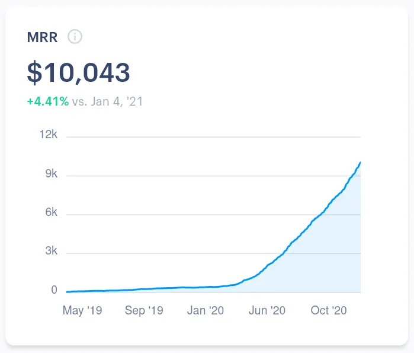
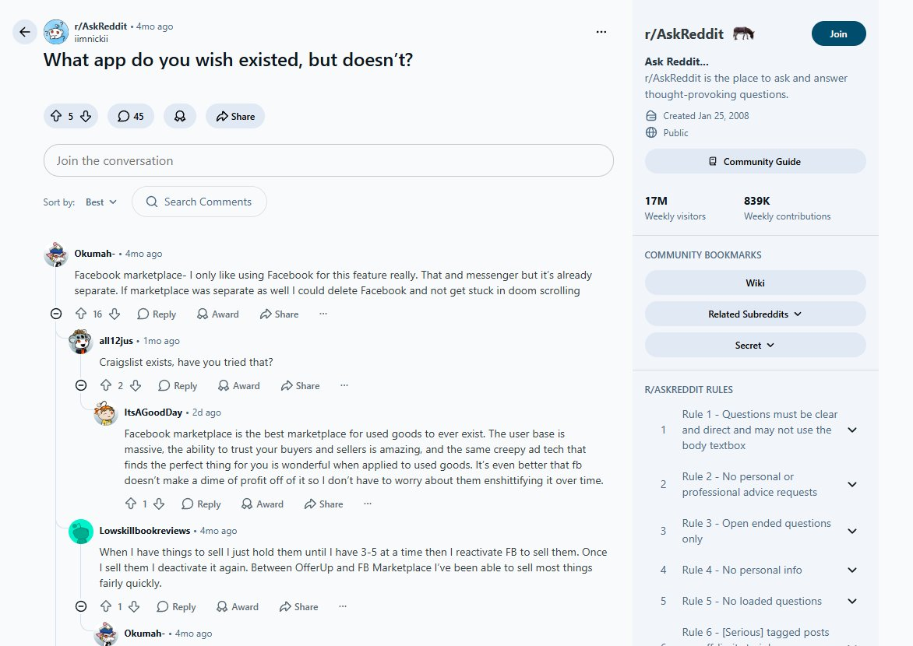
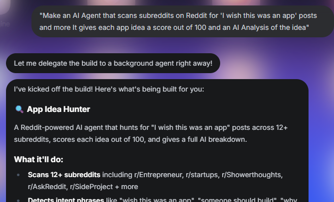
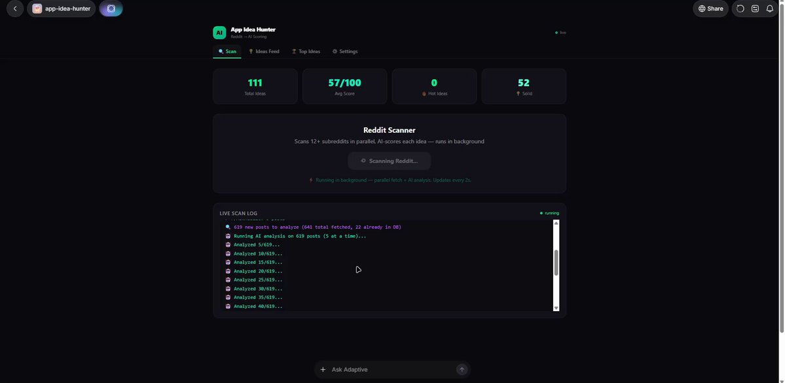
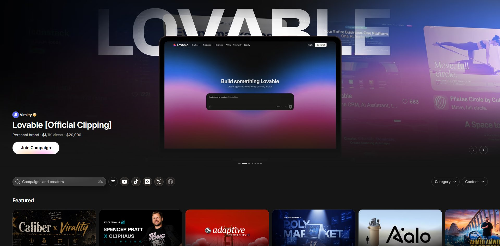
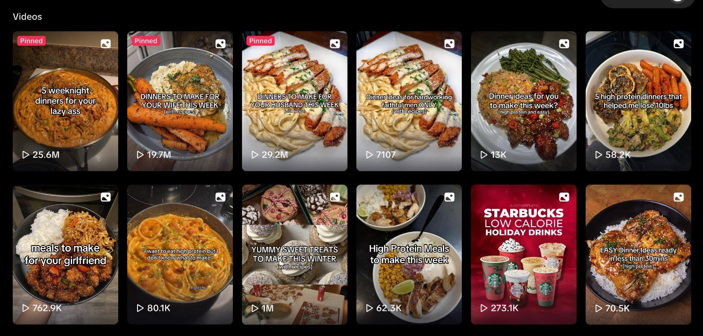
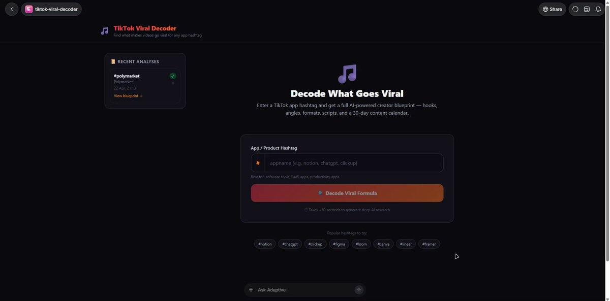
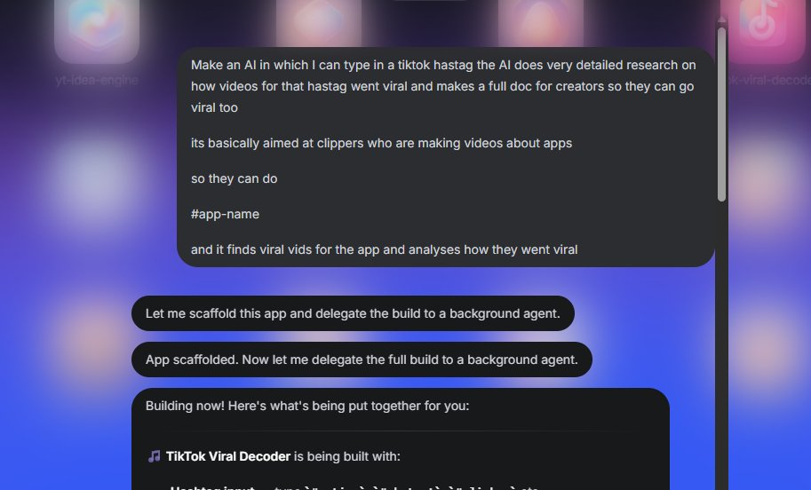
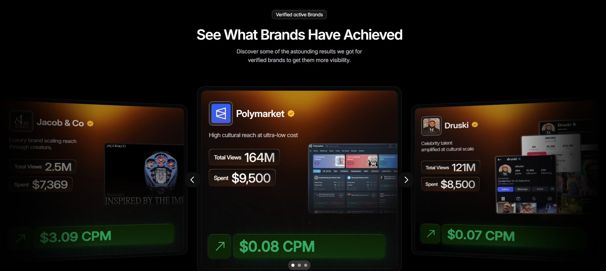

# f\*ck it. here's how i would grow an app from 0 to 10k mrr

**Author:** adam ([@adamtwtz](https://x.com/adamtwtz))  
**Published:** Apr 26, 2026  
**Source:** [f\*ck it. here's how i would grow an app from 0 to 10k mrr](https://x.com/Zephyr_hg/status/2048392706053808598)

i know what you're thinking.
this has got to be fake or larp.

but it's not. this method has been used by some of the top apps right now and has generated over $100,000 in revenue

i'll show you exactly how you can use this method to grow your app from 0 - 10k mrr.

## finding a good app idea is really important

most founders don't put real thought into their idea. they think of something that sounds cool, check if it exists, see a few competitors and build anyway assuming they'll just do it better.
that's why most apps die at zero.

ideation is the most important step. build in a saturated market and you're fighting proven apps with thousands of reviews and years of trust. you need to give users a real reason to download your app. not something they won't use. not something that's been done a hundred times already.

the idea has to solve a problem people are actively frustrated about and can't find a good answer to. that's the only brief that matters.

### how you can use reddit to find the perfect idea

reddit is insane.
there are thousands of communities of people talking about their problems, their frustrations, and the exact tools they wish existed.
every subreddit is a gold mine full of opportunities

the problem is volume. manually scrolling through thousands of posts looking for the right app idea will take hours. you'll always miss more than you catch.

so we built an agent on adaptive AI that does it for you.
the agent constantly scans subreddits looking for ideas, and gives each idea a score out of 100

what you end up with is a shortlist of validated ideas, with scores so you can validate which ideas are actually good

here's the prompt I used:

> "Make an AI Agent that scans subreddits on Reddit for 'I wish this was an app' posts and more
> It gives each app idea a score out of 100 and an AI Analysis of the idea"

5 minutes later, I had a full Agent that could scan subreddits and find the app ideas I needed.
I ran a scan and here's what the agent did

- Analysed 100s of posts on Reddit for app ideas
- Used AI to score ideas out of 100
- Gave a full AI Analysis on factors like audience, uniqueness etc
- Even made a potential name for the app

## now you have the idea, how do you promote the app?

now here's the thing
you can have the best app idea in the world
but without a proper distribution system
the app will stay at 0

thats why I use Content Rewards for clipping campaigns

**why Content Rewards?**

Content Rewards lets you open a campaign and have thousands of creators posting about your app.

you set the format, the cpm rate, and the content rules. creators apply, post, and get paid per verified view.

### which type of content do I want my creators to post?

for me, tiktok slideshows is normally the best format for apps
There's a few reasons for this

first of all, slides are getting pushed by the algorithm much more than any other format
secondly, the production barrier is very low, meaning you will have access to a very wide range of creators
thirdly, the swipe feature keeps viewers engaged longer than a normal video

don't believe me? you can check TikTok yourself
there are so many pages that went viral because of slideshows

### how to make sure your creators are maximising views

for this part, I built another agent using Adaptive

creators can type in a hashtag for a similar app to mine
and it gives them a full breakdown on why content for that app is going viral

so lets say I type in polymarket

it returns a full breakdown of content that went viral for polymarket, and how the creator can go viral as well

**Prompt Used:**

> "Make an AI in which I can type in a tiktok hastag the AI does very detailed research on how videos for that hastag went viral and makes a full doc for creators so they can go viral too
> its basically aimed at clippers who are making videos about apps
> so they can do
> \# app-name
> and it finds viral vids for the app and analyses how they went viral"

## what makes this method so good

first of all, we're automating the bits that would take you countless hours of work to do yourself.
if you want to be successful, you need to know which bits you can automate to save time

secondly, this method uses the BEST way to generate your apps MRR
Content Rewards

It's pretty much the only model that can generate MILLIONS of views for a cpm of under $1
those aren't made up numbers, the method has blown up apps and brands countless times

