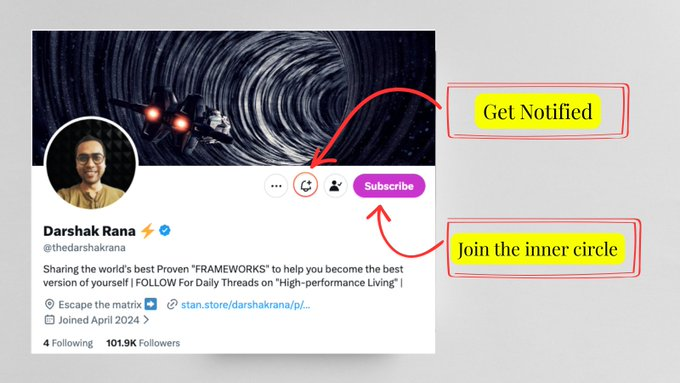

# Your Next 5 years Will Be an Exact Copy Of Your Last 5

**Author:** Darshak Rana ([@thedarshakrana](https://x.com/thedarshakrana))  
**Published:** April 28, 2026  
**Source:** [Your Next 5 years Will Be an Exact Copy Of Your Last 5](https://x.com/Zephyr_hg/status/2049151671692136778)

99.99% people are failing a test designed for four-year-olds. Every single day.

Here's the test:

In the 1960s, Stanford psychologist Walter Mischel sat children in a room with a single marshmallow.

The deal was simple: eat it now, or wait fifteen minutes and get two.

The results became legendary. Kids who waited performed better academically decades later. Lower obesity rates. Reduced substance abuse. Better careers. The "marshmallow test" became shorthand for why some people win at life and others don't.

But everyone draws the wrong lesson.

The popular interpretation: successful people have more willpower. They're better at resisting temptation. They white-knuckle through discomfort.

Wrong.

When researchers analyzed the footage, they discovered that the children who waited were exercising more than superior self-control. They were using **strategic distraction**. They sang songs. They covered their eyes. They turned around so they couldn't see the marshmallow.

In a nutshell, they made the temptation invisible.

The children who ate immediately? They stared directly at the marshmallow. They kept it in their field of vision. They relied on willpower alone.

And willpower lost. Every time.

**Environmental design helps you succeed more than willpower.**

Now consider your life.

You are surrounded by marshmallows. The scroll. The snooze button. The easier path. The conversation you're avoiding. The risk you keep postponing.

And you're staring directly at all of them.

You have no strategic distraction. No environment design. No systems. Just white-knuckling through each day, wondering why you keep eating the marshmallow while telling yourself you're the kind of person who waits.

The children in Mischel's study were tracked for 40 years. The ones who couldn't wait at four often couldn't wait at forty either. The pattern was set. The trajectory locked.

That's what nobody wants to hear:

Your behavior at four predicted your life at forty. Your behavior today is predicting 2031. The same loops. The same delays. The same traded futures. Five years ago, you had goals. Dreams. Intentions. What happened to them?

They got eaten. One marshmallow at a time. One distraction, one rationalization, one "I'll start Monday" at a time.

And unless something fundamental changes in how you structure your days, your environment, your identity — the next five years will be a shot-for-shot remake of the last five.

Different circumstances. Same patterns. Same results.

The children who succeeded didn't have more willpower than you. They had better strategy.

You're about to get one. But before that let's understand the deep psychology of a long lasting life change.

## You think you're finished becoming

The psychologist Daniel Gilbert has spent decades studying a phenomenon he calls "the end of history illusion."

When researchers ask people how much they've changed over the past 10 years, they acknowledge significant transformation — in their values, their preferences, their personalities. They can see the distance between who they were and who they've become.

But when asked how much they expect to change over the *next* 10 years, something strange happens. People consistently predict minimal change. They assume the person they are today is essentially the final version.

This happens at every age.

18-year-olds, 40-year-olds, 60-year-olds — all of them underestimate their future transformation while acknowledging their past transformation. We seem hardwired to believe that growth is something that happened *to* us rather than something that will continue happening *through* us.

I fell into this trap for years. I kept making plans for the current version of myself, optimizing my life around who I already was, leaving no room for the versions that wanted to emerge. I treated myself like a photograph — static, complete, to be preserved — when I should have treated myself like a garden — dynamic, seasonal, requiring constant attention and occasional pruning.

The first principle of breaking the 5-year loop: "You are not a fixed entity maintaining a stable identity. You are a process that either compounds or decays based on the inputs you allow.

And I'm not being motivational here.

The neuroscience is clear: **your brain physically restructures itself based on repeated experience.** The person you'll be in 5 years is being sculpted right now, whether you're paying attention or not. The question is whether you're doing the sculpting or whether you've handed the chisel to your environment, your habits, your unconscious patterns.

## Why External Change Fails

99% people are considerably poor at predicting how external changes will affect their internal states. In study after study, people consistently overestimate how much new jobs, relationships, locations, or possessions will alter their baseline happiness and stress levels.

It's called "affective forecasting error."

We imagine that changing our external circumstances will fundamentally change how we feel and behave. The reality is that most people adapt back to their emotional baseline within months of major positive or negative life changes. This adaptation happens because the external change never addressed the underlying pattern recognition system.

A person who changes jobs to escape workplace stress often recreates the same stress dynamics in their new role. Someone who moves to a new city hoping to become more social often discovers they've brought their social anxiety with them. The divorce that was supposed to solve relationship problems frequently gets followed by new relationships that replay identical emotional patterns with different actors.

Your brain is constantly running pattern recognition programs developed during your earliest years. These programmed belief systems determine what you pay attention to, what you ignore, what triggers anxiety, what makes you feel safe, how you interpret ambiguous social situations, and what you believe is possible for yourself.

Change the external situation without updating the belief system, and the belief system will simply apply its existing logic to the new circumstances.

## The Neuroscience of Behavioral Consistency

When you repeat a behavior sequence, your brain creates what neuroscientists call "chunking." Neural pathways that initially required conscious attention become automated and consolidated in the basal ganglia.

This chunking process is evolutionarily brilliant for motor skills. You don't need to consciously control every muscle movement when walking or driving. But the same process applies to emotional and cognitive responses. Your reaction to criticism, your approach to problem-solving, your methods for dealing with uncertainty all become chunked into unconscious programs.

The basal ganglia doesn't distinguish between helpful and unhelpful patterns. It just automates whatever gets repeated. A person who habitually avoids conflict will develop neural chunks that automatically trigger avoidance behaviors in the presence of disagreement. Someone who chronically overthinks decisions will chunk that overthinking pattern until it becomes their default response to any choice point.

These chunked patterns operate below the threshold of conscious awareness. You experience them as "just how you are" or "your natural reaction." But they're actually learned algorithms that your brain automated through repetition.

## The Illusion of Linear Time

Time is not a river carrying you forward. Time is a field you move through based on the actions you take.

Most people experience time as something that happens *to* them. Monday comes, then Tuesday, then a year passes, then a decade. They're passengers.

But this is an illusion created by the calendar. The calendar measures duration. It says nothing about distance traveled.

You can live 5 years and travel nowhere.

You can live 6 months and cross an ocean.

The Greeks had two words for time: *chronos* and *kairos*.

- Chronos is clock time. Sequential. Measurable. The time your boss tracks on a spreadsheet.
- Kairos is opportune time. Qualitative. Transformational. The moment when everything shifts.

Most people live entirely in chronos. They measure their lives in years survived rather than thresholds crossed.

But real change — the kind that makes your future unrecognizable from your past — happens in kairos. It happens in moments of decision, confrontation, and commitment that can't be scheduled.

You can't plan a kairos moment. But you can create the conditions for one.

The conditions are: pressure, clarity, and irreversibility.

Pressure that makes the old way unbearable. Clarity about what the new way looks like. Irreversibility that burns the bridge behind you.

Without all three, you'll keep drifting through chronos, watching years dissolve, wondering why nothing ever changes.

## The Person You'll Be in 5 Years Already Exists

This is going to sound strange, but stay with me.

The version of you that has the life you want is not a future self you need to create. That version already exists. It exists as a possibility state, a latent configuration of your potential. Your job is not to build that person from scratch. Your job is to stop being the person who blocks that version from emerging.

Think of a sculptor working with marble. The statue is already inside the stone. The sculptor's job is to remove everything that isn't the statue.

You are both the marble and the sculptor.

The person you'll be in 5 years is inside you right now, buried under layers of:

- Beliefs you inherited but never examined
- Identities you adopted for approval
- Fears you've nursed instead of confronted
- Habits you've automated without consent
- Stories you tell yourself to justify stagnation

Every day you reinforce these layers, you push that person deeper into the stone. Every day you chip away at them, that person gets closer to the surface.

This reframe matters because it changes the nature of the work.

Genuine belief system change requires a completely different approach than symptom management or external circumstance modification. Instead of learning to better manage your existing patterns, you need to recognize the patterns as learned programs that can be rewritten.

→ The first step is pattern recognition. Most people can identify their behavioral patterns when asked directly. They know they tend to avoid conflict, overthink decisions, or get defensive during criticism. What they don't recognize is that these behaviors are outputs of deeper algorithms that can be examined and modified.

→ The second step is belief archaeology. Instead of focusing on changing the behavior, you excavate the underlying logic that produces the behavior. What pattern recognition system categorizes situations as requiring avoidance? What algorithmic process transforms uncertain situations into overthinking loops? What internal code interprets feedback as attack?

→ The third step is conscious belief replacement. Rather than fighting against your existing patterns or trying to suppress them, you deliberately design and practice new pattern recognition algorithms. You don't just resist the urge to avoid conflict. You rebuild the recognition system that categorizes disagreement as dangerous.

This process takes considerably longer than learning new coping strategies, but it produces fundamentally different outcomes. Instead of becoming better at managing your existing patterns, you develop different patterns that generate different results automatically.

## The Five-Year Pattern Break

Your next five years will be a photocopy of your last five until you interrupt the code at the subconscious level. The external circumstances will shift and evolve. The internal operating system will continue running the same programs.

Most personal development focuses on upgrading your life circumstances or learning better ways to manage your existing psychological patterns. Both approaches leave the core algorithms unchanged. They produce temporary improvement followed by reversion to baseline.

Real change happens when you recognize that your personality isn't a fixed identity you discover. It's a set of learned thought patterns running on autopilot, mistaking their consistency for authenticity.

The person you've been for the past five years wasn't the real you slowly revealing itself through experience. It was a collection of unconscious programs that automated your responses to life, creating the illusion of stable identity through behavioral repetition.

Your next five years can operate on completely different code.

Most people never attempt the upgrade.

The ones who do discover they weren't nearly as fixed as they imagined.

—Darshak

P.S. If this resonated, "REPOST IT" with your thoughts + share it with someone who needs to hear it. The best ideas spread through people who care enough to pass them on.

P.P.S. Most of you aren't seeing posts anymore due to recent changes in the matrix. If you want to see everything I publish, hit the 🔔. If you want deeper access, join the inner circle by subscribing.

