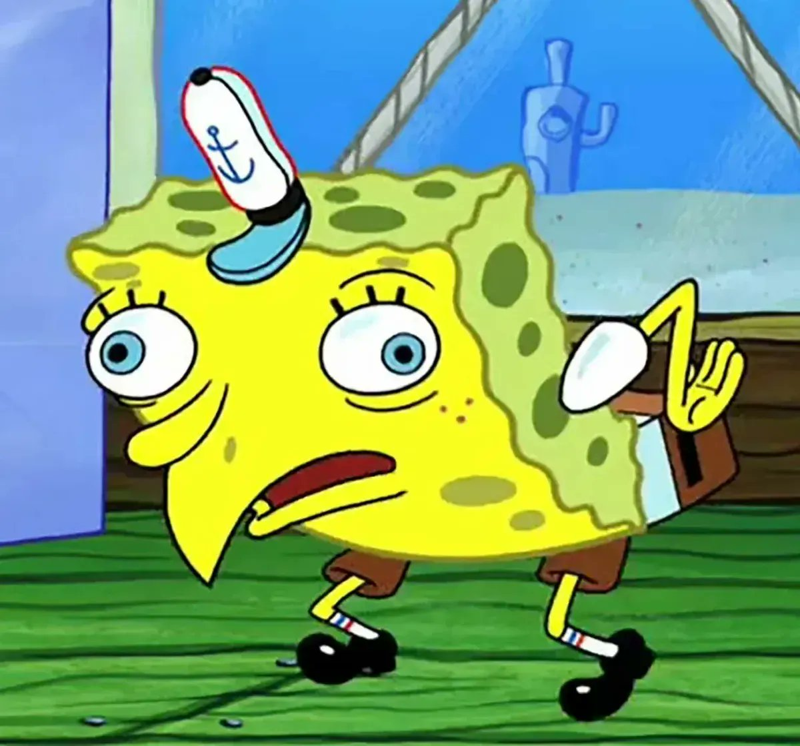
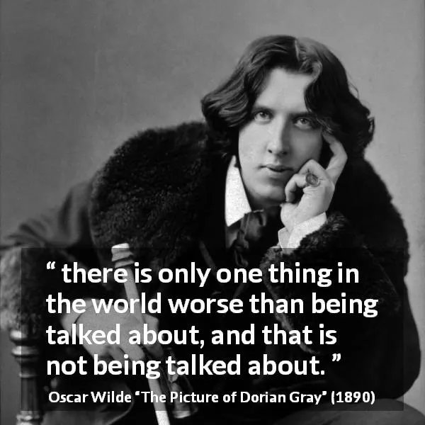
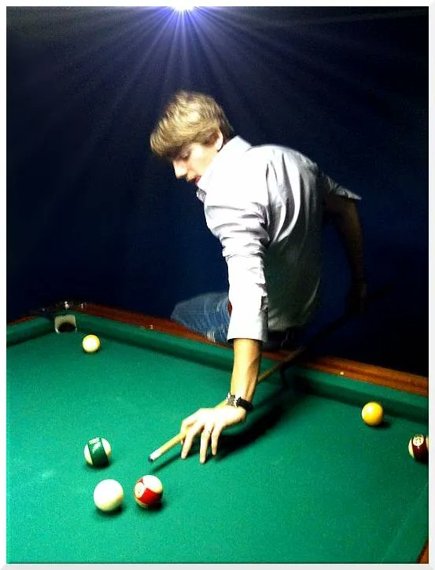
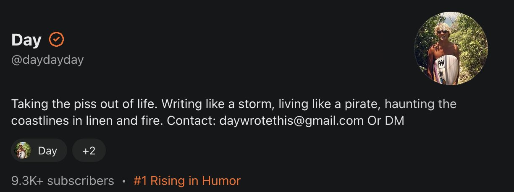
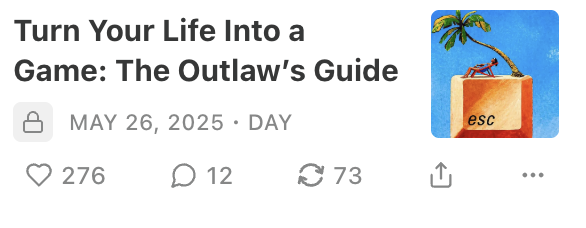

# Game Theory: The Art of Outsmarting Everyone (and Why You’re Losing Without It)

**Author:** Day ([@Daywrotethis](https://x.com/Daywrotethis))  
**Published:** Apr 30, 2026, 3:28 PM  
**Source:** [Game Theory: The Art of Outsmarting Everyone (and Why You’re Losing Without It)](https://x.com/Zephyr_hg/status/2049752634865901955)

**GAME THEORY IS A CHEAT CODE TO LIFE**

Let’s play a game.

Welly welly well, It’s 11:13 p.m., and I’m sitting shirtless on the patio of a bar where they don’t even bother to wipe down the tables. Some finance bro wearing on cloud shoes is trying to outdrink a tattooed ex stripper, a couple is fighting in the corner about who paid for dinner, (Spoiler Alert! it wasn't him) and there’s a bachelorette party in matching sashes is cackling like wild hyenas over the last dude who tried to dance. I almost chuck my fucking drink at them. Society holds me back. For once…. The air tastes like tequila, regret, and ocean salt. In other words, Welcome to paradise.

You want to know what I See? What you see when you strip all the bullshit off your eyelids and slow time down timeeeee. I see a thousand games running at once. Power games, sex games, social games. A casino where everyone’s betting their pride, their dignity, time, money or their next orgasm. I see two guys about to fight over a girl who’s already texting someone better. I see the bartender upcharging the loudest table with a courtesy tax. I see so called friends angling for status and losers angling for a ride home.

And I see most people completely fucking blind to it.

The difference between you and me, and why you’re probably losing at life while I’m out here writing the rulebook on a bar napkin so I can come home and type this before the fucking hangover kicks in is I know everything is a game. And I play to win.

If you don’t know the rules, you’re not a player you’re the plot and I’m writing.

## Game Theory Isn’t Optional It’s Survival and it’s Happening

Let me break it down before your attention span runs off to check Instagram.

Game theory isn’t a classroom thing. It’s the science of not getting fucked by people who are smarter, hungrier, or just less squeamish than you.

Textbook definition: Game theory is the study of strategic decision-making, where the outcome for each participant depends on the choices of all involved. It analyzes how individuals or entities (players) make decisions in situations of interdependence, where the best outcome for one player depends on the choices of others. Essentially, it’s a mathematical framework for understanding conflict and cooperation. BORRRRINNNG

So here’s my version: Game theory is how wolves eat and sheep get turned into dinner specials. It’s not about cooperating for the greater good. It’s about reading the room, seeing who wants what, and stacking the odds until you can flip the table and walk off with everything that matters.

The only people who aren’t playing games are already dead they just haven’t stopped breathing yet.

## Why Game Theory Actually Matters (a.k.a. Why You Keep Getting Played)

Wake up to reality.

- Social circles? Game.

  The hottest girl never texts first. She’s waiting for you to trip over your own dick and double text.

- Negotiations? Game.

  He who cares less wins, every time. The first person to show emotion, to “just want it to work out,” is the one who gets bent over the table and sent home with a participation trophy in the ass.

- Relationships, business, even family politics? Game, game, game, game, game, game, and fuckinnnhggg GAME.

Game, game, game, game, game, game, and let me check my notes yep, still fucking GAME. If you thought it was anything else, you’re playing Candyland while I’m robbing the casino.

If you’re not using game theory, you’re not nice you’re food.

You’re just hoping everyone else plays fair while you hold the honesty sign like a fucking bright neon Green idiot. Hope isn’t a strategy. Hope is how you end up paying alimony, covering the bill, or reading this essay wondering why everyone gets the girl except you.

Warning: This writing is habit forming.

## Every Decision Is a Game (And Most People Are fucking not even aware they are playing)

Every move you make is either a setup, a bluff, or an all you can eat buffet for someone smarter, faster, stronger, better, or someone with insider information. We’re interdependent. Your outcome depends on their move, and vice versa.

Every time you’re just being yourself, someone else is watching, calculating, and plotting how to use it. YOU STUPID FUCK.

Let’s play out a scene for your brain to work a little bit.

Some guy at the bar is trying to wingman his buddy into the arms of a girl who’s already made up her mind. His buddy thinks the more he laughs at her jokes, the more she’ll like him. Meanwhile, the guy she actually wants is ignoring her, focusing on the game, read her knew exactly what damaged type of girl this is and making is making her compete for attention.

Who do you think wins? The one who’s playing for approval? Or the one who treats the whole thing like chess and never plays the same move twice?

The myth of going with your gut is for people who want to lose and feel good about it.

I don’t play gut I play probability, psychology, and five move prediction. That’s game theory.

## The Core Game Theory Moves (And How to Weaponize Them)

You want cheat codes? Fine. Here’s a few you can use before you get wiped out by someone smarter

- Tit for Tat:

  You scratch my back, I scratch yours until you stab me. Then I burn your fucking house down.

  (Translation: Reciprocate only until someone tries to screw you. Never be a martyr. Fire with fire, but always escalate.)

- Nash Equilibrium:

  The point where everyone’s too scared or too smart to change moves.

  (Translation: Most groups settle into a safe, boring routine break it, and you own the board. That’s why I always leave parties when they get predictable I want to be the story, not the statistic.)

- Prisoner’s Dilemma:

  Most people betray first and lie about it later.

  (Translation: Trust nobody fully. Trust incentives, trust patterns, trust what people do when they think nobody’s watching, look for who benefits and that is the most likely choice.)

## Real life translation

Your friend “forgets” to pay you back? That’s a move. He is reading you. Your boss praises you in public but fucks you in private? That’s a move. Your girlfriend keeps bringing up her ex? That’s a move. Play the board, not your feelings.

## The Super Sexy Day Guide: How to Actually Use Game Theory and Win

1. Identify the players and what they want.

   Most people don’t even know what they want. That makes them easy to herd and easy to use. Know your own goal first. Everyone else is a bonus round.

2. Figure out who’s playing for show, who’s playing for keeps.

   There’s always a fake tough guy, a fake nice guy, and a fake “I’m not like other girls” in every room. See through the act. The real players don’t announce themselves they just play to win. So win.

3. Predict reactions.

   What happens if you disappear for a week? What if you throw a curveball? What if you call the bluff?

   If you can’t predict reactions, you’re not ready to play. Learn this first and practice (I could write something about this and how to train this skill) Pay me.

4. Hide your real move until the last possible second.

   I never show my cards until I’ve already won. Make your intentions unclear. Make people guess. Make them afraid to guess wrong.

5. Always have a backup plan never go all in unless you own the table.

   Love is a game. So is money, so is loyalty, so is revenge. If you can’t walk away with a smirk, you’re not a player you’re a fucking stupid dog pet or you just have more faith than me. Cards in your hands.

Examples:

- Social life: You only give as much as you get. If you’re always the one texting, you’re the jester, not the king.
- Love: The person who’s less invested wins every time. Withhold a little. Make them chase. Make them sweat.
- Money: The deal isn’t done until you’re holding the bag and the other guy is holding the receipt.

## What Happens When You Stop Playing Games (You Lose, Period)

Here’s a quick story before this fucking perfect essay wraps up.

I once watched a guy walk into a business deal with total honesty. Gave away his numbers, told his strategy, trusted the other guy to be fair.

Guess who got the contract, the girl, and the last laugh? Not him.

PEOPLE DO WHAT IS ADVANTAGE TO THEM. Unless of course they love you. So unless they love you fucking remember this.

Every time you turn off your strategic brain, you’re a chew toy for a pitbull who didn’t.

That’s how you end up broke, bitter, and writing Facebook posts about the good old days.

Nobody cares about your intentions. They care about what you can get away with. That’s the game.

## Real Game Theory in Action: Cheat codes for my Precious Subscribers

Want the meat? Here’s how you turn game theory from a nerd word I hate to even use but you clicked on it into savage life hacks

- The Reverse Bluff:

  When people expect you to beg, go silent. When people expect you to fold, double down. Most folks can’t handle unpredictability. It scrambles their scripts. I’ve closed deals by saying less in five minutes than most people say in an hour Won a lot of poker doing this as well, they fucking fold so quick you get a tickle in your stomach because you can’t even believe it.

- The Social Mirror:

  If you want to control a room, mirror the strongest person’s body language then flip it and see who follows. Social dynamics are game theory with hair gel and cologne.

- Escalation/Retreat:

  If you’re negotiating, threaten to walk out only if you mean it. People fold when they sense real loss.

- Invisible Kingmaker:

  I never try to be the loudest. I position myself so the real power comes to me. The king’s throne is always under attack. The kingmaker is always safe.

- Point System Living:

  Every move, every conversation, every DM is points, either you’re gaining leverage or you’re giving it away. Scoreboard never lies.

## The Fallout Why This Makes You Unpopular (And Richer, and Unbreakable, and Legendary)

If you play game theory in real life, people will hate you. They’ll call you manipulative, cold, unfeeling. If you’re not being called an asshole at least once a week, you’re not even in the arena. Want proof you’re leveling up?

- Your exes start warning their friends about you.
- Coworkers “accidentally” leave you off email chains because you make them nervous.
- Family calls you “too intense.” (Translation: You’re not predictable anymore.)
- Haters start copy pasting your words and moves and pretending they thought of them first.

The best men are loved by a few, feared by many, envied by all, and understood by none.

## Start Playing or Stay Preying

So here’s where you get to make a decision that splits your timeline.

You can close this tab and slip right back into the soft, padded cell of “real life” same screens, same excuses, same old sob story.

Or you can make the only move that matters: You take the next step and you learn to fucking play.

Because out there, right now, there’s a rare breed of men and women who know exactly what I’m talking about. The ones who move through the world like it was built for them. The victory is sure. The ones who walk into a room and change the breathing rate of everyone in it. The ones whose names get whispered long after they’ve left the party, or the company, or the continent.

The beautiful difference is They learned to treat life like a game, not a sermon. They stopped waiting for someone to hand them permission slips. They wrote the rules in blood and salt and laughter, and the world had no choice but to read along. And that can be you.

Not tomorrow. Not next year. Not when you “figure it out.” Right fucking now.

Imagine waking up every day with the feeling that you can bend reality. That you’re no longer guessing what comes next you’re making it.

Every deal, every date, every friendship, every challenge turns into a dance where you’re always leading, always a step ahead, always the one who decides how the story goes.

But

Nobody gets this for free.

Nobody gets to the mythic level just by reading the appetizer. The real playbook isn’t handed out at the door. You have to go through it. You have to choose it. You have to invest money, guts, energy, faith. You pay the price, and the universe gives you the keys. ( The price is less than a fucking subway sandwich).

The full guide How to Turn Your Life Into a Game is for the ones who are done being passengers. The ones who are done asking “why does this keep happening to me?” and ready to ask “how do I make everything happen for me?” (You actually get access to every paid guide and Post I have done and the group chat)

Inside, I’ll teach you

- How to rewire your brain so you see angles, not obstacles
- The social blueprints that make you a kingpin in any room
- The rituals and mind games that make you unforgettable to women, dangerous to men, and immune to mediocrity
- The real moves no bullshit, no recycled Instagram “hacks” that turn you into the kind of legend the world is hungry for
- Stuff I can’t fucking post in the open air

Winning isn’t about being better than everyone else it’s about making the game so rigged in your favor, even luck starts calling you ‘sir.

This is your new operating system.

The only thing between you and the wild, cinematic, outlaw life you’re meant for is whether you click, commit, and cross over.

You want more than a good story. You want your life to be the story the one people tell at midnight, in the rain, with a shot of mezcal and a look in their eyes like they’ve seen a ghost and a god at the same time.

Don’t just read. Don’t just hope. Don’t just play it safe.

Hit the upgrade.

Unlock the full guide now.

And make the rest of your life the wildest, most dangerous game ever played.

See you in the winner’s circle and watch your back. God Bless the Wolves.

God help the rest.

SVBSTACK // DAYDAYDAY

