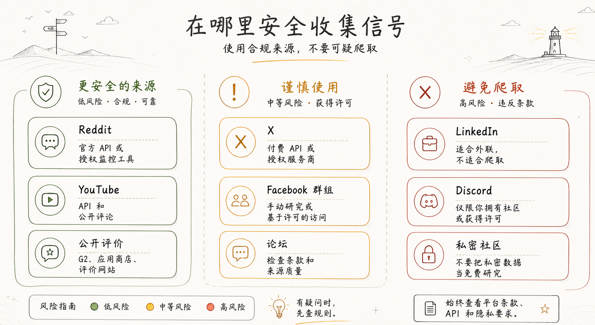
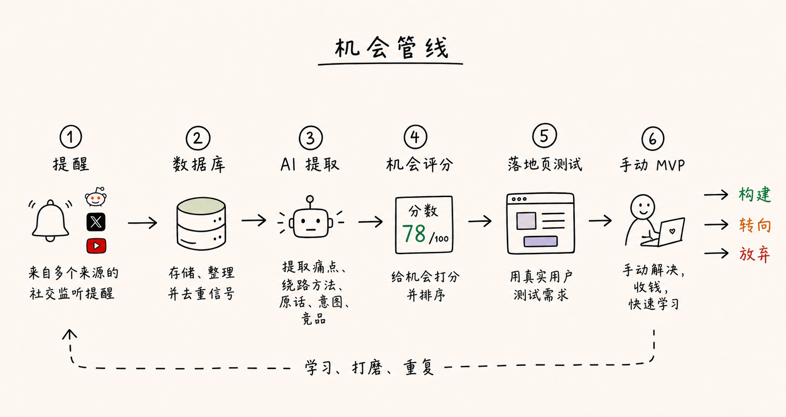

# 如何找到下一个 100 倍机会

**作者：** hoeem ([@hooeem](https://x.com/hooeem))  
**日期：** 2026年5月2日  
**来源：** [How to Find the Next 100x Idea](https://x.com/Zephyr_hg/status/2050332284675362853)

很多人有一个习惯：想找创业方向，先去问 AI。

"给我出个能赚钱的好主意。"

AI 给出一堆听起来不错、实际没用的答案。然后他们换个问法，再问一遍。还是那些话。

其实问题不在 AI，在于这个方向就是错的。

你不该让 AI 帮你想点子。你该做的，是去找痛点。

真实的痛。反复出现的痛。让人付出代价的那种痛。就是那些有人在抱怨、在网上到处搜、想方设法绕路解决，甚至花了钱买了一堆半吊子工具来凑合的问题。

我们要搭的这套系统，大概长这样：

```
社交监听提醒
→ 数据库
→ AI 提取痛点
→ 机会评分
→ 手动 MVP
→ 构建 / 转向 / 放弃
```

这套流程既能用来找新方向，也能用来打磨你已有的想法。

我们要捕捉的，是这类社交信号：

- "我讨厌手动干这件事。"
- "有没有人知道哪个工具能做这个？"
- "这个有没有替代品？"
- "太贵了。"
- "我还在用电子表格。"
- "这事每周能浪费我好几个小时。"
- "为什么这么难？"
- "X、Y、Z 我都试过了，还是一样烂。"

金矿就藏在这里。

## Reddit 和 X 的真相

做这类研究，Reddit 和 X 是最好的两个来源。

但要小心怎么用。

Reddit 的价值在于：人们会在上面写长篇大论，带着情绪抱怨。他们会解释问题是什么，自己怎么绕路应付，试过哪些没用的工具，遇到了什么奇葩情况，以及为什么被搞得这么烦。这是他们"没被采访时"说话的地方，非常真实。

X 的价值在于：人们在公开场合吐槽、找推荐、比较工具，还会实时说出市场上正在发生的变化。

有一件事别做：用个粗糙的爬虫抓数据，然后叫它"AI 调研"。

该用官方 API 的就用官方 API。API 太麻烦的场景，用经过授权的监控工具。用提醒，别爬取。只存你真正需要的数据。遵守平台规则。

AI 不会让糟糕的数据收集方式变得可以接受。



## 平台选择：我实际会用哪些

Reddit 适合：

- 挖掘痛点
- 长篇投诉
- 寻找竞品替代方案
- 小众垂直社区
- "有没有工具能做这个？"类帖子
- 带情绪的用户语言

Reddit 是了解人们"没被采访时怎么说话"的最好地方之一。这一点很重要。

X 适合：

- 实时吐槽
- 创始人和运营者的日常碎碎念
- 工具横向对比
- 市场动向
- 公开的购买意向
- 人们向圈子寻求推荐

X 适合追速度，Reddit 适合看深度。

YouTube 适合：

- 创作者市场
- 教育类产品
- 软件教程
- "我该怎么做 X？"类行为
- 评论区里抱怨现有方案太难用的内容

当一个问题已经有了教育需求，YouTube 就特别值得挖。

Facebook 适合：

- 基本没什么，哈哈。好吧，群组里可能还行。

LinkedIn 适合：

- 手动搜索
- 内容
- 主动外联
- 用户访谈
- 靠关系推进的验证

## 你要做的是什么？

你要为找机会这件事，搭一台 **AI 痛点挖掘机**。



它做这几件事：

1. 在 Reddit、X、YouTube、评论区、论坛、博客和社交平台上搜索公开对话。
2. 把有价值的提及拉进数据库。
3. 让 AI 提取痛点、绕路方法、竞品信息、紧迫程度和购买意向。
4. 给每条信号打分。
5. 把反复出现的问题归成商业机会。
6. 把最强的机会变成一个具体的提案。
7. 用落地页、表单、主动外联或手动 MVP 来测试它。

整个逻辑是这样：

```
找痛点
→ 给痛点打分
→ 痛点聚类
→ 测试痛点
→ 有人在乎，再去造
```

## 用什么工具？

```
Brand24
Airtable
Make
OpenAI / ChatGPT API
Tally
Carrd, Framer, Lovable, Bolt, 或 v0
```

不要用野路子爬虫，用官方 API 和经授权的工具。违反平台规则的爬虫别碰，不是好主意。

Reddit 的数据 API 条款限制了用户内容的使用方式，包括未经许可用 Reddit 内容训练 AI 模型，商业使用可能还需要单独签协议。

X 的 API 提供对公开对话的程序化访问，但现在改成了按量计费：先充积分，每次 API 请求扣除。

YouTube 对新手最友好，因为它的数据 API 有官方的评论接口。`commentThreads.list` 返回评论线程，每次调用消耗 1 个配额单位，YouTube 项目默认的日配额是 10,000 单位。

## 最终你会得到什么

一个仪表盘，显示：

```
原始痛点信号
AI 摘要
痛点评分
买家分群
绕路方法
竞品信息
反复出现的痛点聚类
商业想法
落地页切入角度
手动 MVP 方向
构建 / 观望 / 放弃 的判断
```

每周一份报告，大概长这样：

```
本周最强机会：
独立招聘顾问在浪费时间写候选人总结。

证据：
Reddit、X 和 YouTube 评论中共有 12 条强痛点信号。

最佳原话：
"我要花好几个小时，把一堆乱糟糟的筛选笔记整理成能发给客户的东西。"

建议测试：
落地页 + 给 20 名招聘顾问发私信 + 手动提供摘要服务。
```

# 第一阶段：先选一个市场

不要一上来就想覆盖所有人。先选一个市场。

可以从这些方向里挑：

```
独立招聘顾问
房产中介
物理治疗师
加密货币研究员
Newsletter 作者
小型物业管理者
私人教练
电商运营者
YouTuber
独立顾问
```

再对应一个具体的工作流：

```
给客户写摘要
生成每周报告
处理客户支持
管理租户维修请求
研究加密项目
写社交媒体内容
追收款
制定饮食计划
跟进潜在客户
```

举个例子：

```
买家：独立招聘顾问
工作流：把筛选电话笔记整理成可以直接发给客户的候选人总结
```

# 第二阶段：建好你的 Airtable 数据库

打开 Airtable。

新建一个数据库，命名为：**AI Pain-Mining Machine**

建这几张表：

```
1. Raw Signals（原始信号）
2. Pain Clusters（痛点聚类）
3. Business Ideas（商业想法）
4. Experiments（实验）
5. Customer Interviews（客户访谈）
6. Weekly Reports（每周报告）
```

## 表一：Raw Signals（原始信号）

每一条 Reddit 帖子、X 推文、YouTube 评论、用户评价、论坛留言或博客提及，都存在这里。

建以下字段：

```
Date Found（发现日期）
Source（来源）
Source URL（来源链接）
Keyword Matched（匹配关键词）
Raw Text（原始文本）
Author / Handle（作者/账号）
Buyer Segment（买家分群）
Workflow（工作流）
Clean Quote（精炼引用）
Pain Point（痛点）
Root Cause（根本原因）
Current Workaround（当前绕路方法）
Competitor Mentioned（提及竞品）
Buying Intent Signal（购买意向信号）
Pain Severity /10（痛苦程度 /10）
Urgency /10（紧迫性 /10）
Frequency /10（频率 /10）
Willingness To Pay /10（付费意愿 /10）
AI Automation Potential /10（AI 自动化潜力 /10）
Overall Signal Score /100（整体信号评分 /100）
Signal Quality（信号质量）
Status（状态）
Human Reviewed（人工审核）
Notes（备注）
```

字段类型：

```
Date Found = date（日期）
Source = single select（单选）
Source URL = URL
Raw Text = long text（长文本）
Clean Quote = long text（长文本）
Pain Point = long text（长文本）
Scores = number（数字）
Signal Quality = single select（单选）
Status = single select（单选）
Human Reviewed = checkbox（复选框）
```

**Source** 选项：

```
Reddit
X
YouTube
TikTok
LinkedIn
Facebook
Forum（论坛）
Review site（评论网站）
Blog（博客）
News（新闻）
Other（其他）
```

**Status** 选项：

```
New（新建）
Needs AI（待 AI 分析）
AI Analysed（AI 已分析）
High Signal（高价值信号）
Low Signal（低价值信号）
Rejected（已淘汰）
Clustered（已归类）
Used In Test（已用于测试）
```

**Signal Quality** 选项：

```
Low（低）
Medium（中）
High（高）
```

## 表二：Pain Clusters（痛点聚类）

把反复出现的信号归到一起。

字段：

```
Cluster Name（聚类名称）
Buyer Segment（买家分群）
Workflow（工作流）
Core Pain（核心痛点）
Evidence Count（证据数量）
Sources Found（信号来源）
Best Quotes（最佳原话）
Common Workarounds（常见绕路方法）
Competitors Mentioned（提及竞品）
Average Signal Score（平均信号评分）
Opportunity Score /100（机会评分 /100）
Manual MVP Idea（手动 MVP 方向）
Landing Page Angle（落地页切入角度）
Verdict（判断结果）
Notes（备注）
```

Verdict 选项：

```
Build Test（测试构建）
Watch（观望）
Ignore（放弃）
Needs More Research（需要进一步研究）
```

## 表三：Business Ideas（商业想法）

字段：

```
Idea Name（想法名称）
Buyer（买家）
Problem Solved（解决的问题）
Offer（提案）
Manual MVP Version（手动 MVP 版本）
Software Version Later（后续软件版本）
Pricing Hypothesis（定价假设）
Distribution Channel（获客渠道）
Main Risk（主要风险）
Opportunity Score /100（机会评分 /100）
Status（状态）
```

Status 选项：

```
Idea（想法）
Testing（测试中）
Validated（已验证）
Killed（已放弃）
Pivoted（已转向）
```

## 表四：Experiments（实验）

字段：

```
Experiment Name（实验名称）
Business Idea（关联商业想法）
Landing Page URL（落地页链接）
Form URL（表单链接）
CTA（行动号召）
Traffic Source（流量来源）
Visitors（访客数）
Signups（注册数）
Form Completions（表单完成数）
Booked Calls（预约通话数）
Manual MVP Trials（手动 MVP 试用数）
Paid Pilots（付费试点数）
Conversion Notes（转化备注）
Verdict（判断结果）
```

## 表五：Customer Interviews（客户访谈）

字段：

```
Name（姓名）
Role（职位）
Company（公司）
Email（邮箱）
Buyer Segment（买家分群）
Problem Confirmed?（问题已确认？）
Current Workaround（当前绕路方法）
Pain Level /10（痛苦程度 /10）
Budget Evidence（预算依据）
Would Try Manual MVP?（愿意试用手动 MVP？）
Would Pay?（愿意付费？）
Best Quote（最佳原话）
Follow-Up Needed?（需要跟进？）
Notes（备注）
```

## 表六：Weekly Reports（每周报告）

字段：

```
Week Starting（周起始日期）
Top Pain Cluster（最强痛点聚类）
Best Opportunity（最佳机会）
Key Evidence（关键证据）
Recommended Test（建议测试）
Build / Watch / Ignore Verdict（构建 / 观望 / 放弃 判断）
Report Text（报告正文）
```

# 第三阶段：设置社交监听工具

打开 Brand24，或者你用的其他社交监听工具。

新建一个项目，命名为：**Recruiter Pain Mining**

或者换成你正在研究的市场名。

目标是收集公开的提及——那些有人在网上抱怨某个工作流程的地方。

## 添加关键词

从 10 到 20 个关键词开始。

以招聘顾问为例：

```
"candidate summary"
"candidate summaries"
"screening call notes"
"recruiter notes"
"recruiter admin"
"recruitment CRM too expensive"
"alternative to recruitment CRM"
"recruiter spreadsheet"
"client-ready candidate summary"
"recruiter notes to client"
"recruiter manual admin"
"recruitment admin takes too long"
```

你要找的是能暴露痛点的短语。

好的搜索词："candidate summaries" "takes hours"  
差的搜索词："recruiting"

## 添加痛点修饰词

再建一组关键词，包含这类短语：

```
"takes hours"
"manual"
"frustrating"
"annoying"
"too expensive"
"alternative to"
"does anyone know a tool"
"how do you manage"
"spreadsheet"
"copy paste"
"wasting time"
```

最好的搜索组合是：买家 + 工作流 + 痛点修饰词

示例："recruiter" "candidate summaries" "takes hours"

## 设置来源过滤器

从这些来源开始：

```
Reddit
X
YouTube
Forums（论坛）
Reviews（用户评价）
Blogs（博客）
News（新闻）
```

LinkedIn、Facebook 和私人社区标记为"谨慎使用"。不是没用，但从权限和信号质量来说，麻烦更多。

# 第四阶段：把提及导入 Airtable

你有三个选项。先从 A 开始，再考虑 B 或 C。

## 选项 A：手动导出

先用这个。

每天做一次：

1. 打开 Brand24。
2. 进入 Mentions 信息流。
3. 按相关来源过滤。
4. 打开每条有价值的提及。
5. 复制有用的文本。
6. 粘贴到 Airtable 的 **Raw Signals** 表。
7. 把 Status 设为 Needs AI。

## 选项 B：通过邮件提醒自动导入 Airtable

等你确认关键词没问题之后，切换到这个方案。

设置路径：

```
Brand24 提醒邮件
→ Gmail
→ Make
→ Airtable Raw Signals
```

在 Gmail 里：

- 建一个标签，命名为 Pain Signals。
- 为 Brand24 的提醒邮件建一条过滤规则。
- 自动打上 Pain Signals 标签。

在 Make 里：

- 新建一个场景。
- 添加 Gmail 作为触发器。
- 选择"监听邮件"。
- 按 Pain Signals 标签过滤。
- 添加 Airtable。
- 选择"创建记录"。
- 选择数据库：AI Pain-Mining Machine。
- 选择表：Raw Signals。
- 把邮件主题和正文映射到 Airtable 字段。
- 把 Status 设为 Needs AI。

这样你就有了一套能自动跑起来的采集流程。

## 选项 C：API / Webhook 直连

留到之后再用。

进阶路径：

```
Brand24 API 或 webhook
→ Make webhook
→ Airtable
```

或者：

```
Reddit API
X API
YouTube API
→ Make / n8n / 自定义脚本
→ Airtable
```

除非你已经清楚自己要什么数据，否则不要从这里起步。

API 方式更强大，但底层逻辑是一样的。

# 第五阶段：搭 AI 分析自动化

现在让 AI 来处理每条信号。

在 Airtable 里，在 Raw Signals 里新建一个视图，命名为：**Needs AI**

过滤条件：Status = Needs AI

然后打开 Make。

新建一个场景：

```
Airtable Watch Records（监听记录）
→ OpenAI Generate Response（生成分析）
→ Airtable Update Record（更新记录）
```

Make 的 Airtable 模块可以监听视图中新建或更新的记录，OpenAI 模块可以根据提示词生成分析结果。

**Make 第一步：Airtable 触发器**

模块：Airtable > Watch Records  
配置：
- Base：AI Pain-Mining Machine
- Table：Raw Signals
- View：Needs AI

这样 Make 就会持续监听需要分析的信号。

**Make 第二步：OpenAI 分析**

粘贴以下提示词：

```
You are analysing public customer conversations for startup discovery.

Your job is to extract commercial pain from the text below.

Important rules:
- Do not invent evidence.
- Only use what is present in the text.
- If the text is vague, score it low.
- Ignore generic chatter.
- Prioritise specific workflow pain, buying intent, ugly workarounds, competitor dissatisfaction, urgency, and evidence of willingness to pay.
- Do not include personal data unless essential.
- Keep quotes short.

Return the output using this exact format:

Buyer Segment:
Workflow:
Clean Quote:
Pain Point:
Root Cause:
Current Workaround:
Competitor Mentioned:
Buying Intent Signal:
Pain Severity /10:
Urgency /10:
Frequency /10:
Willingness To Pay /10:
AI Automation Potential /10:
Overall Signal Score /100:
Signal Quality:
Recommended Status:
Notes:

Scoring guidance:
- 0 to 30 = weak signal
- 31 to 60 = possible signal
- 61 to 80 = strong signal
- 81 to 100 = excellent signal

Raw text:
{{Raw Text}}
```

把 `{{Raw Text}}` 替换为上一步从 Airtable 取到的字段内容。

**Make 第三步：更新 Airtable**

更新同一条记录，把 AI 输出的内容映射到各字段。

如果一开始觉得逐字段解析太麻烦，可以先这样处理：在 Airtable 里建一个长文本字段，命名为 **AI Analysis**，把 AI 的完整输出都塞进去就行。

# 第六阶段：人工复核

最终判断不要交给 AI。

在 Airtable 里建一个视图，命名为：**Needs Human Review**

过滤条件：
- Status = AI Analysed
- Overall Signal Score 大于 60
- Human Reviewed 未勾选

每天过一遍这个视图。

看每条信号时，问自己：

- 买家清晰吗？
- 痛点具体吗？
- 绕路方法够麻烦吗？
- 有没有购买意向？
- 这个问题会反复发生吗？
- 我能手动解决它吗？
- AI 能在这里提效吗？

然后设置：
- Human Reviewed = 勾选
- Status = High Signal 或 Low Signal 或 Rejected

你的判断力就是在这个环节里磨出来的。

AI 负责挖，你来判断哪些是金子。

# 第七阶段：每周对痛点做聚类

等你积累了 30 到 100 条高价值信号，开始分组。

建一个视图，命名为：**High Signals This Week**

过滤条件：
- Status = High Signal
- Date Found = 最近 7 天内

把这些记录复制进 ChatGPT，或者之后在 Make 里把这一步也自动化。

使用以下提示词：

```
You are a startup research analyst.

I am giving you high-quality customer pain signals.

Your job is to cluster them into repeated business opportunities.

Do not invent anything.
Only use the evidence provided.

For each cluster, return:

1. Cluster name
2. Buyer segment
3. Workflow
4. Core pain
5. Evidence count
6. Best customer quotes
7. Current workarounds
8. Competitors mentioned
9. Why existing solutions seem inadequate
10. Urgency level
11. Willingness-to-pay evidence
12. Manual MVP idea
13. Landing page test idea
14. Opportunity score out of 100
15. Verdict: build test / watch / ignore

Here are the signals:

[PASTE SIGNALS]
```

然后把结果录入 Pain Clusters 表。

# 第八阶段：给每个机会打分

用这套评分体系：

- 数量和重复性：20 分
- 痛苦严重程度：20 分
- 紧迫性：10 分
- 绕路方法有多麻烦：10 分
- 买家意向：10 分
- 与现有工具的差距：15 分
- 变现可行性：10 分
- 构建可行性：5 分

再减去扣分项：

- 重大法律或平台风险：-15
- 买家身份模糊：-10
- 获客路径不清晰：-10
- 纯靠风口、证据不足：-10

使用以下提示词：

```
You are my brutally honest startup opportunity scorer.

Score this pain cluster out of 100.

Use this scoring model:

- Volume and recurrence: 20
- Pain severity: 20
- Urgency: 10
- Workaround ugliness: 10
- Buyer intent: 10
- Gap vs existing tools: 15
- Monetisation plausibility: 10
- Build feasibility: 5

Apply deductions:
- Major legal or platform risk: minus 15
- Weak buyer identity: minus 10
- Weak distribution path: minus 10
- Hype-only trend with thin evidence: minus 10

Output:

1. Total score
2. Why it scored this way
3. Evidence supporting the score
4. Evidence against the score
5. Biggest assumption
6. Manual MVP version
7. Landing page test
8. Recommended next step
9. Verdict: build test / watch / ignore

Pain cluster:

[PASTE PAIN CLUSTER]
```

只测试评分 70 分以上的聚类。

低于 70 分的，放进观望列表。

# 第九阶段：把一个聚类变成商业想法

选一个最强的聚类。

别选五个。

使用以下提示词：

```
You are a positioning strategist.

Turn this pain cluster into 10 sharp business offers.

Pain cluster:
[PASTE CLUSTER]

Customer quotes:
[PASTE QUOTES]

Current workaround:
[PASTE WORKAROUND]

Competitors or alternatives:
[PASTE COMPETITORS]

Use this format:

I help [specific buyer] achieve [specific outcome] without [painful thing] by using [new mechanism].

For each offer, include:
- Buyer
- Outcome
- Pain removed
- New mechanism
- Why it might work
- Weakness

Then choose the strongest offer.

Rules:
- Be specific.
- Avoid hype.
- Avoid vague words like optimise, streamline, empower, transform, or revolutionise.
- Use customer language.
```

# 第十阶段：做落地页测试

产品先别急着造。

先做一个测试页面。

用 Carrd、Framer、Lovable、Bolt、v0 或 Webflow 都行。

落地页结构：

- 主标题
- 痛点列举
- 适合谁
- 旧方式 vs 新方式
- 怎么运作
- 手动内测 / 早期访问的行动号召
- 验证表单
- 常见问题

使用以下提示词：

```
Create landing page copy for this validation test.

Target buyer:
[INSERT BUYER]

Problem:
[INSERT PROBLEM]

Customer quotes:
[INSERT QUOTES]

Current workaround:
[INSERT WORKAROUND]

Offer:
[INSERT OFFER]

Primary CTA:
Apply for the manual beta

Rules:
- Be honest that this is early access or a manual beta.
- Use customer language.
- Do not use fake testimonials.
- Do not make unsupported claims.
- Keep it clear, specific, and conversion-focused.
- Write in plain British English.
- Avoid hype words.

Include:

1. Hero headline
2. Subheadline
3. CTA button text
4. Pain bullets
5. Who this is for
6. Old way vs new way
7. How it works
8. What you get
9. FAQ
10. Final CTA
11. Validation form questions
```

# 第十一阶段：做验证表单

用 Tally。

表单不是用来收邮箱的，是用来确认痛点是否真实存在的。

问这些问题：

1. 最能描述你的是哪个？
2. 你现在怎么解决这个问题的？
3. 这个问题多久出现一次？
4. 最让你头疼的是哪一步？
5. 每周在这上面花多少时间？
6. 你试过什么工具吗？
7. 那些工具哪里解决不了问题？
8. 你愿意试用手动内测版吗？
9. 如果真的解决了问题，你会付费吗？
10. 方便接受一个 15 分钟的电话吗？
11. 邮箱地址

# 第十二阶段：手动拉流量

大多数人到了这一步就退缩了。

你需要真实的人来验证，不是页面浏览量。

发 20 到 50 条消息。

用 LinkedIn、X、Reddit、你的人脉，或者垂直社区都行。

# 第十三阶段：之后接入直接 API

等系统跑起来之后，再考虑接直接 API。

我会按这个顺序来。

**YouTube API**

用来抓取你所在细分市场相关视频的评论。

**X API**

当你想要更好的实时社交痛点数据时用它。

**Reddit API**

在 subreddit 里搜索痛点短语。

抓帖子标题和评论。

不要用 Reddit 内容训练模型。遵守删除和商业使用规则。

---

**系统搭好了。**

下面是没人愿意听的部分：

这套系统去不掉对品味的需求。去不掉判断力。去不掉销售这件事。去不掉和客户面对面聊天这件事。

**结语：**

很多人把 AI 当成出点子的机器用。

这是用 AI 的弱鸡版本。

更聪明的用法，是把 AI 当成痛点雷达。

记住这几点：

- 别让 AI 随机给你出创业想法。搭一套系统，从真实对话里找反复出现的客户痛点。
- 别用野路子爬数据。用官方 API、授权监控工具，用干净的采集方式。
- 别光靠投诉就去造东西。先给机会打分，先测落地页，先和买家聊，先把手动版卖出去。

**去找那个百倍机会吧。**
