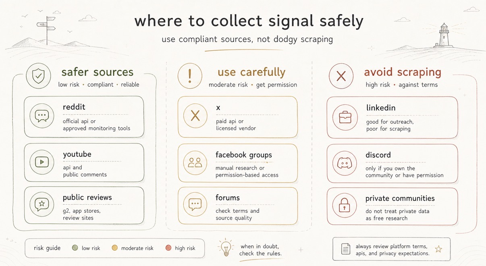
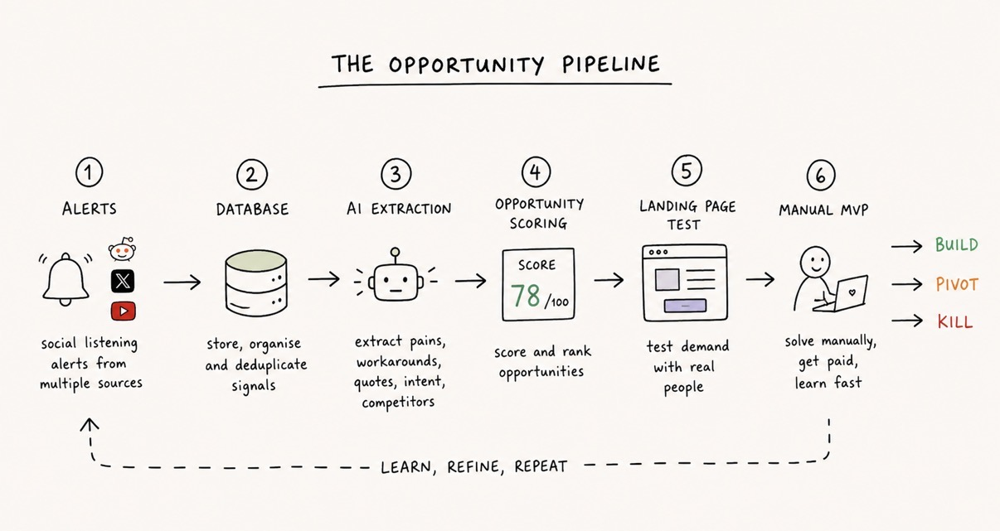

# How to Find the Next 100x Idea

**Author:** hoeem ([@hooeem](https://x.com/hooeem))  
**Published:** May 2, 2026  
**Source:** [How to Find the Next 100x Idea](https://x.com/Zephyr_hg/status/2050332284675362853)

EVERYONE wants their AI to give them a 100x idea, who wouldn't? They go to their AI, ask it questions & all it gives them is SLOP.

Stop wasting your time, build this instead.

It's time to hunt for pain.

Real pain. Repeated pain. Expensive pain. The kind people already complain about, search for, hack around, and sometimes pay badly designed tools to solve.

This is what we're going to build:

```
Social listening alerts
→ database
→ AI pain extraction
→ opportunity scoring
→ manual MVP
→ build / pivot / kill
```

And that is how we can find ideas, or even utilise it to improve your existing business or idea.

The data we're looking to collect is social cues that look like this:

- "I hate doing this manually."
- "Does anyone know a tool for this?"
- "Is there an alternative to this?"
- "This is too expensive."
- "I'm still using a spreadsheet."
- "I waste hours on this every week."
- "Why is this so hard?"
- "I tried X and Y and Z, but it still sucks."

That is where the gold is.

## The Truth About Reddit and X

Reddit and X are two of the best sources for this kind of research.

But you need to be careful.

Reddit is useful because people write long, emotional complaints. They explain their problem, the workaround, the failed tool, the weird edge case, and why they are annoyed.

X is useful because people complain in public, ask for recommendations, compare tools, and reveal what is changing in real time.

Do not build some janky scraper and call it "AI research".

- Use official APIs where possible.
- Use approved or licensed monitoring tools where APIs are messy.
- Use alerts, not theft.
- Store only what you need.
- Respect rules.

AI does not magically make bad data collection acceptable.



## The Platform Map: What I Would Actually Use

Reddit is good for:

- pain mining
- long-form complaints
- competitor alternatives
- niche communities
- "does anyone know a tool?" posts
- emotional customer language

Reddit is one of the best places to understand how people talk when they are not being interviewed.

That matters.

X is good for:

- real-time complaints
- founder/operator chatter
- tool comparisons
- market shifts
- public buying intent
- people asking their network for recommendations

X is good for speed, Reddit is better for depth.

YouTube is good for:

- creator markets
- education products
- software tutorials
- "how do I do X?" behaviour
- comments complaining that existing solutions are confusing

YouTube is especially useful when the problem already has educational demand.

Facebook is good for:

- nothing lol, well, it probably is decent but in groups only.

LinkedIn is good for:

- manual search
- content
- outbound
- interviews
- relationship-led validation

## What Are You About to Build?

You are going to build an **AI Pain-Mining Machine** for ideas.



Its job:

1. Search public conversations across Reddit, X, YouTube, reviews, forums, blogs, and social platforms.
2. Pull useful mentions into a database.
3. Ask AI to extract pain points, workarounds, competitors, urgency, and buying intent.
4. Score each signal.
5. Group repeated problems into business opportunities.
6. Turn the strongest opportunity into an offer.
7. Test it with a landing page, form, outreach, or manual MVP.

Like this:

```
Find pain
→ score pain
→ cluster pain
→ test pain
→ only build if people care
```

## What Tools Should I Use?

```
Brand24
Airtable
Make
OpenAI / ChatGPT API
Tally
Carrd, Framer, Lovable, Bolt, or v0
```

Ensure you do not use dodgy scrapers, make sure it's official APIs and approved tools. Don't use scrapers that break platforms rules. It is not a good idea.

Reddit's Data API terms restrict how user content can be used, including using Reddit content to train AI models without permission, and commercial use can require a separate agreement.

X's API gives programmatic access to public conversation, but it now uses pay-per-use pricing, with credits purchased upfront and deducted as API requests are made.

YouTube is much cleaner for beginners because its Data API has official comment endpoints. `commentThreads.list` returns comment threads and costs 1 quota unit per call, and YouTube projects commonly start with a default daily quota of 10,000 units.

## What You'll Have at the End

A dashboard that shows:

```
Raw pain signals
AI summaries
Pain scores
Buyer segments
Workarounds
Competitors
Repeated pain clusters
Business ideas
Landing page angles
Manual MVP ideas
Build / watch / ignore verdicts
```

A weekly report like:

```
This week's strongest opportunity:
Independent recruiters wasting time writing candidate summaries.

Evidence:
12 strong pain signals across Reddit, X, and YouTube comments.

Best quote:
"I spend hours turning messy screening notes into something I can actually send to clients."

Recommended test:
Landing page + 20 recruiter DMs + manual summary service.
```

# Phase 1: Pick One Market To Start

Do not start with every single market, choose one.

Examples:

```
Independent recruiters
Estate agents
Physiotherapists
Crypto researchers
Newsletter writers
Small property managers
Personal trainers
E-commerce operators
YouTubers
Solo consultants
```

And a workflow:

```
Writing client summaries
Creating weekly reports
Handling customer support
Managing tenant repairs
Researching crypto projects
Writing social posts
Chasing invoices
Building meal plans
Following up with leads
```

Example:

```
Buyer: independent recruiters
Workflow: turning screening-call notes into client-ready candidate summaries
```

# Phase 2: Create Your Airtable Base

Open Airtable.

Create a new base called: **AI Pain-Mining Machine**

Create these tables:

```
1. Raw Signals
2. Pain Clusters
3. Business Ideas
4. Experiments
5. Customer Interviews
6. Weekly Reports
```

## Table 1: Raw Signals

This is where every Reddit post, X post, YouTube comment, review, forum comment, or blog mention goes.

Create these fields:

```
Date Found
Source
Source URL
Keyword Matched
Raw Text
Author / Handle
Buyer Segment
Workflow
Clean Quote
Pain Point
Root Cause
Current Workaround
Competitor Mentioned
Buying Intent Signal
Pain Severity /10
Urgency /10
Frequency /10
Willingness To Pay /10
AI Automation Potential /10
Overall Signal Score /100
Signal Quality
Status
Human Reviewed
Notes
```

Use these field types:

```
Date Found = date
Source = single select
Source URL = URL
Raw Text = long text
Clean Quote = long text
Pain Point = long text
Scores = number
Signal Quality = single select
Status = single select
Human Reviewed = checkbox
```

For **Source**, add:

```
Reddit
X
YouTube
TikTok
LinkedIn
Facebook
Forum
Review site
Blog
News
Other
```

For **Status**, add:

```
New
Needs AI
AI Analysed
High Signal
Low Signal
Rejected
Clustered
Used In Test
```

For **Signal Quality**, add:

```
Low
Medium
High
```

## Table 2: Pain Clusters

This groups repeated signals together.

Fields:

```
Cluster Name
Buyer Segment
Workflow
Core Pain
Evidence Count
Sources Found
Best Quotes
Common Workarounds
Competitors Mentioned
Average Signal Score
Opportunity Score /100
Manual MVP Idea
Landing Page Angle
Verdict
Notes
```

Verdict options:

```
Build Test
Watch
Ignore
Needs More Research
```

## Table 3: Business Ideas

Fields:

```
Idea Name
Buyer
Problem Solved
Offer
Manual MVP Version
Software Version Later
Pricing Hypothesis
Distribution Channel
Main Risk
Opportunity Score /100
Status
```

Status options:

```
Idea
Testing
Validated
Killed
Pivoted
```

## Table 4: Experiments

Fields:

```
Experiment Name
Business Idea
Landing Page URL
Form URL
CTA
Traffic Source
Visitors
Signups
Form Completions
Booked Calls
Manual MVP Trials
Paid Pilots
Conversion Notes
Verdict
```

## Table 5: Customer Interviews

Fields:

```
Name
Role
Company
Email
Buyer Segment
Problem Confirmed?
Current Workaround
Pain Level /10
Budget Evidence
Would Try Manual MVP?
Would Pay?
Best Quote
Follow-Up Needed?
Notes
```

## Table 6: Weekly Reports

Fields:

```
Week Starting
Top Pain Cluster
Best Opportunity
Key Evidence
Recommended Test
Build / Watch / Ignore Verdict
Report Text
```

# Phase 3: Set Up Your Social Listening Tool

Now open Brand24 or another social listening tool.

Create a new project.

Name it: **Recruiter Pain Mining**

Or whatever market you are researching.

Your goal is to collect public mentions where people are complaining about the workflow.

## Add Keywords

Start with 10 to 20 keywords.

For the recruiter example:

```
"candidate summary"
"candidate summaries"
"screening call notes"
"recruiter notes"
"recruiter admin"
"recruitment CRM too expensive"
"alternative to recruitment CRM"
"recruiter spreadsheet"
"client-ready candidate summary"
"recruiter notes to client"
"recruiter manual admin"
"recruitment admin takes too long"
```

You want phrases that reveal pain.

Better: "candidate summaries" "takes hours"  
Worse: "recruiting"

## Add Pain Modifiers

Create another keyword group with phrases like:

```
"takes hours"
"manual"
"frustrating"
"annoying"
"too expensive"
"alternative to"
"does anyone know a tool"
"how do you manage"
"spreadsheet"
"copy paste"
"wasting time"
```

The best searches combine: buyer + workflow + pain modifier

Example: "recruiter" "candidate summaries" "takes hours"

## Set Source Filters

Start with these sources:

```
Reddit
X
YouTube
Forums
Reviews
Blogs
News
```

Leave LinkedIn, Facebook, and private communities as "use carefully". They can be useful, but they are messier from a permissions and signal-quality perspective.

# Phase 4: Get Mentions Into Airtable

You have three options. Start with Option A, then move to B or C.

## Option A: Manual Export

Use this first.

Once per day:

1. Open Brand24.
2. Go to your Mentions feed.
3. Filter for relevant sources.
4. Open each useful mention.
5. Copy the useful text.
6. Paste it into Airtable's **Raw Signals** table.
7. Set Status to Needs AI.

## Option B: Email Alerts Into Airtable

Use this once you know your keywords are decent.

Setup:

```
Brand24 alert email
→ Gmail
→ Make
→ Airtable Raw Signals
```

In Gmail:

- Create a label called Pain Signals.
- Create a filter for your Brand24 alert emails.
- Auto-apply the label Pain Signals.

In Make:

- Create a new scenario.
- Add Gmail as the trigger.
- Choose "Watch emails".
- Filter for label Pain Signals.
- Add Airtable.
- Choose "Create a record".
- Choose your base: AI Pain-Mining Machine.
- Choose your table: Raw Signals.
- Map email subject/body into Airtable fields.
- Set Status to Needs AI.

This gives you a working automated collector.

## Option C: API / Webhook Collection

Use this later.

Advanced path:

```
Brand24 API or webhook
→ Make webhook
→ Airtable
```

Or:

```
Reddit API
X API
YouTube API
→ Make / n8n / custom script
→ Airtable
```

Do not start here unless you understand the data you want.

The API version is more powerful, but the logic is the same.

# Phase 5: Build The AI Analysis Automation

Now we make AI analyse every signal.

In Airtable, create a view in Raw Signals called: **Needs AI**

Filter: Status = Needs AI

Now open Make.

Create a new scenario:

```
Airtable Watch Records
→ OpenAI Generate Response
→ Airtable Update Record
```

Make's Airtable module can watch newly created or updated records in a view, and its OpenAI modules can generate responses from prompts.

**Make Step 1: Airtable Trigger**

Module: Airtable > Watch Records  
Choose:
- Base: AI Pain-Mining Machine
- Table: Raw Signals
- View: Needs AI

This means Make watches for signals that needs analysis.

**Make Step 2: OpenAI Analysis**

Paste this prompt:

```
You are analysing public customer conversations for startup discovery.

Your job is to extract commercial pain from the text below.

Important rules:
- Do not invent evidence.
- Only use what is present in the text.
- If the text is vague, score it low.
- Ignore generic chatter.
- Prioritise specific workflow pain, buying intent, ugly workarounds, competitor dissatisfaction, urgency, and evidence of willingness to pay.
- Do not include personal data unless essential.
- Keep quotes short.

Return the output using this exact format:

Buyer Segment:
Workflow:
Clean Quote:
Pain Point:
Root Cause:
Current Workaround:
Competitor Mentioned:
Buying Intent Signal:
Pain Severity /10:
Urgency /10:
Frequency /10:
Willingness To Pay /10:
AI Automation Potential /10:
Overall Signal Score /100:
Signal Quality:
Recommended Status:
Notes:

Scoring guidance:
- 0 to 30 = weak signal
- 31 to 60 = possible signal
- 61 to 80 = strong signal
- 81 to 100 = excellent signal

Raw text:
{{Raw Text}}
```

Replace `{{Raw Text}}` with the Airtable field from the previous step.

**Make Step 3: Update Airtable**

Update the same record.

Map the AI output into fields.

If parsing each field feels too hard at first, do this: Create one long text field in Airtable called **AI Analysis**, then put the full AI output there.

# Phase 6: Human Review

Do not let AI make the final decision.

Create an Airtable view called: **Needs Human Review**

Filter:
- Status = AI Analysed
- Overall Signal Score is greater than 60
- Human Reviewed is unchecked

Every day, review this view.

Ask:

- Is the buyer clear?
- Is the pain specific?
- Is the workaround ugly?
- Is there buying intent?
- Is this likely to happen repeatedly?
- Could I solve this manually?
- Could AI improve the process?

Then set:
- Human Reviewed = checked
- Status = High Signal or Low Signal or Rejected

This is where your judgement improves.

AI can dig.  
You decide what is gold.

# Phase 7: Cluster The Pain Weekly

Once you have 30 to 100 high signals, group them.

Create a view called: **High Signals This Week**

Filter:
- Status = High Signal
- Date Found = within the last 7 days

Copy those records into ChatGPT or automate this in Make later.

Use this prompt:

```
You are a startup research analyst.

I am giving you high-quality customer pain signals.

Your job is to cluster them into repeated business opportunities.

Do not invent anything.
Only use the evidence provided.

For each cluster, return:

1. Cluster name
2. Buyer segment
3. Workflow
4. Core pain
5. Evidence count
6. Best customer quotes
7. Current workarounds
8. Competitors mentioned
9. Why existing solutions seem inadequate
10. Urgency level
11. Willingness-to-pay evidence
12. Manual MVP idea
13. Landing page test idea
14. Opportunity score out of 100
15. Verdict: build test / watch / ignore

Here are the signals:

[PASTE SIGNALS]
```

Then create records in the Pain Clusters table.

# Phase 8: Score Each Opportunity

Use this scoring system.

- Volume and recurrence: 20
- Pain severity: 20
- Urgency: 10
- Workaround ugliness: 10
- Buyer intent: 10
- Gap vs existing tools: 15
- Monetisation plausibility: 10
- Build feasibility: 5

Then apply deductions:

- Major legal/platform risk: -15
- Weak buyer identity: -10
- Weak distribution path: -10
- Hype-only trend: -10

Use this prompt:

```
You are my brutally honest startup opportunity scorer.

Score this pain cluster out of 100.

Use this scoring model:

- Volume and recurrence: 20
- Pain severity: 20
- Urgency: 10
- Workaround ugliness: 10
- Buyer intent: 10
- Gap vs existing tools: 15
- Monetisation plausibility: 10
- Build feasibility: 5

Apply deductions:
- Major legal or platform risk: minus 15
- Weak buyer identity: minus 10
- Weak distribution path: minus 10
- Hype-only trend with thin evidence: minus 10

Output:

1. Total score
2. Why it scored this way
3. Evidence supporting the score
4. Evidence against the score
5. Biggest assumption
6. Manual MVP version
7. Landing page test
8. Recommended next step
9. Verdict: build test / watch / ignore

Pain cluster:

[PASTE PAIN CLUSTER]
```

Only test clusters that score 70+.

Anything below 70 goes into the watchlist.

# Phase 9: Turn One Cluster Into A Business Idea

Pick one strong cluster.

Do not pick five.

Use this prompt:

```
You are a positioning strategist.

Turn this pain cluster into 10 sharp business offers.

Pain cluster:
[PASTE CLUSTER]

Customer quotes:
[PASTE QUOTES]

Current workaround:
[PASTE WORKAROUND]

Competitors or alternatives:
[PASTE COMPETITORS]

Use this format:

I help [specific buyer] achieve [specific outcome] without [painful thing] by using [new mechanism].

For each offer, include:
- Buyer
- Outcome
- Pain removed
- New mechanism
- Why it might work
- Weakness

Then choose the strongest offer.

Rules:
- Be specific.
- Avoid hype.
- Avoid vague words like optimise, streamline, empower, transform, or revolutionise.
- Use customer language.
```

# Phase 10: Create A Landing Page Test

Do not build the product yet.

Build a test page.

Use Carrd, Framer, Lovable, Bolt, v0, or Webflow.

Landing page structure:

- Hero
- Problem bullets
- Who it is for
- Old way vs new way
- How it works
- Manual beta / early access CTA
- Validation form
- FAQ

Use this prompt:

```
Create landing page copy for this validation test.

Target buyer:
[INSERT BUYER]

Problem:
[INSERT PROBLEM]

Customer quotes:
[INSERT QUOTES]

Current workaround:
[INSERT WORKAROUND]

Offer:
[INSERT OFFER]

Primary CTA:
Apply for the manual beta

Rules:
- Be honest that this is early access or a manual beta.
- Use customer language.
- Do not use fake testimonials.
- Do not make unsupported claims.
- Keep it clear, specific, and conversion-focused.
- Write in plain British English.
- Avoid hype words.

Include:

1. Hero headline
2. Subheadline
3. CTA button text
4. Pain bullets
5. Who this is for
6. Old way vs new way
7. How it works
8. What you get
9. FAQ
10. Final CTA
11. Validation form questions
```

# Phase 11: Create The Validation Form

Use Tally.

The form should not just collect emails.

Ask questions that prove pain.

Questions:

1. What best describes you?
2. How are you solving this today?
3. How often does this problem happen?
4. What is the most annoying part?
5. How much time does this cost you each week?
6. Have you tried any tools already?
7. What did those tools fail to solve?
8. Would you try a manual beta?
9. Would you pay if this solved the problem?
10. Would you be open to a 15-minute call?
11. Email address

# Phase 12: Drive Traffic Manually

This is where most people hide.

You need real humans.

Send 20 to 50 messages.

Use LinkedIn, X, Reddit, your network, or niche communities.

# Phase 13: Add Direct APIs Later

Once the system works, then add direct APIs.

This is the order I'd add them.

**YouTube API**

Use this to pull comments from videos about your niche.

**X API**

Use this when you want better real-time social pain.

**Reddit API**

Search subreddits for problem phrases.

Pull post titles and comments.

Do not train models on Reddit content.

Respect deletion/commercial use rules.

---

**AND YOU HAVE BUILT IT!!!**

The part nobody wants to hear:

This system will not remove the need for taste.  
It will not remove judgement.  
It will not remove sales.  
It will not remove customer conversations.

**The takeaway:**

Everyone is trying to use AI as an idea machine.

That is the weak version.

The stronger version is to use AI as a pain radar.

Here is what matters:

- Do not ask AI for random startup ideas. Build a system that finds repeated customer pain from real conversations.
- Do not scrape like a goblin. Use official APIs, approved monitoring tools, and clean collection methods.
- Do not build from complaints alone. Score the opportunity, test the landing page, talk to buyers, and sell the manual version first.

**GO AND FIND THAT 100X IDEA RIGHT NOW!!!**
