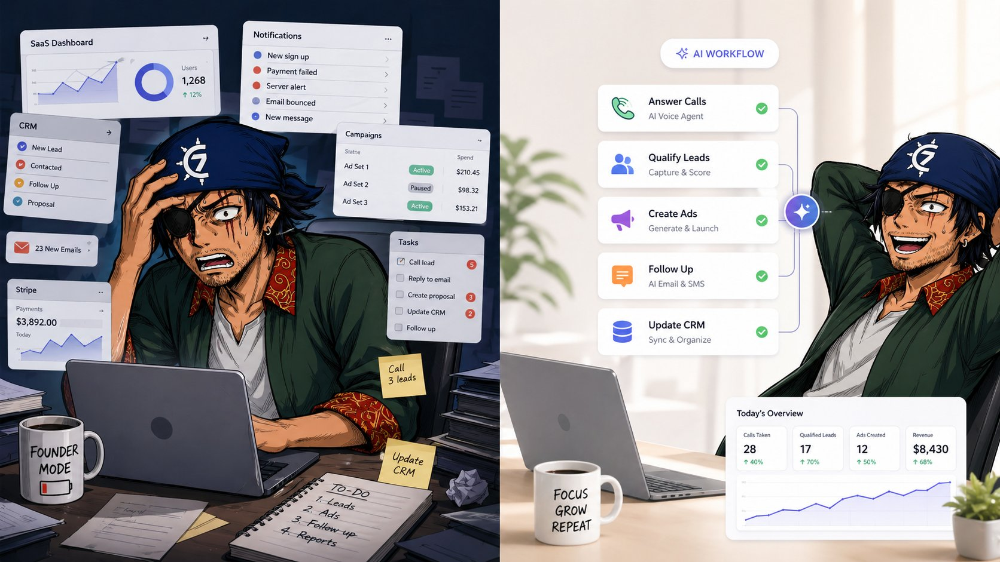
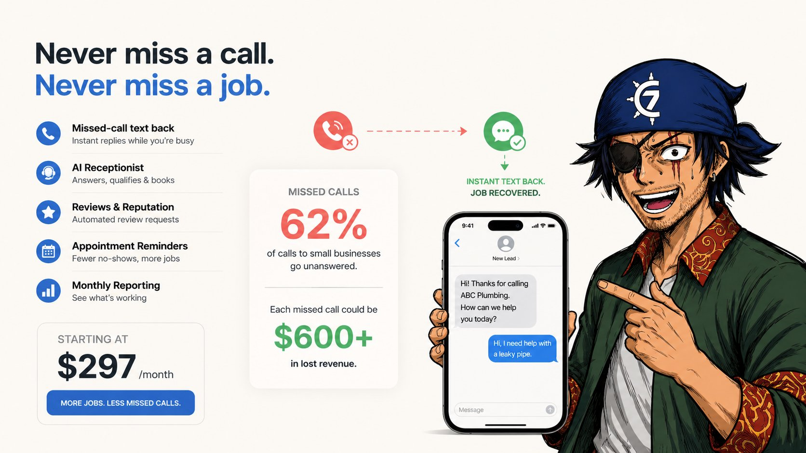
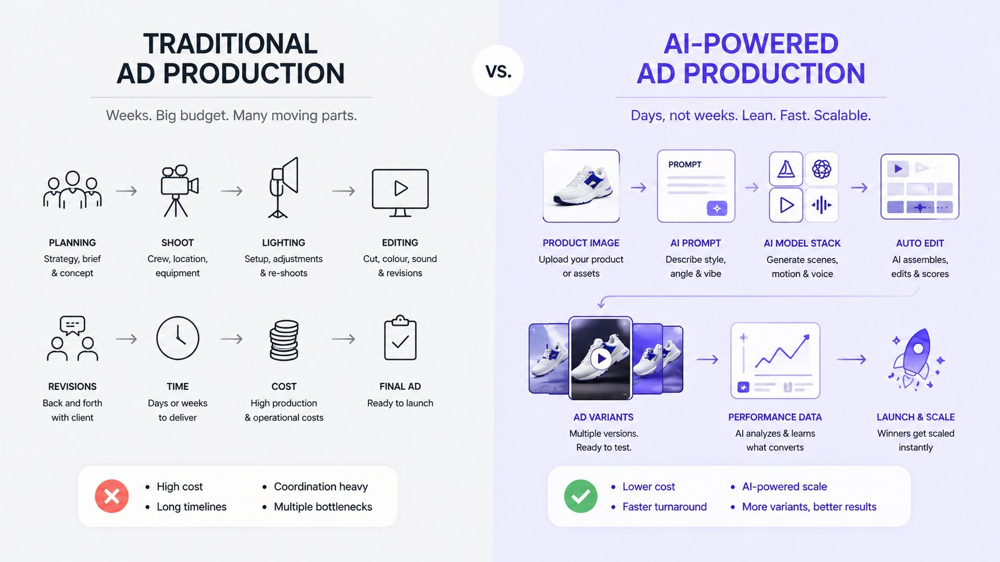
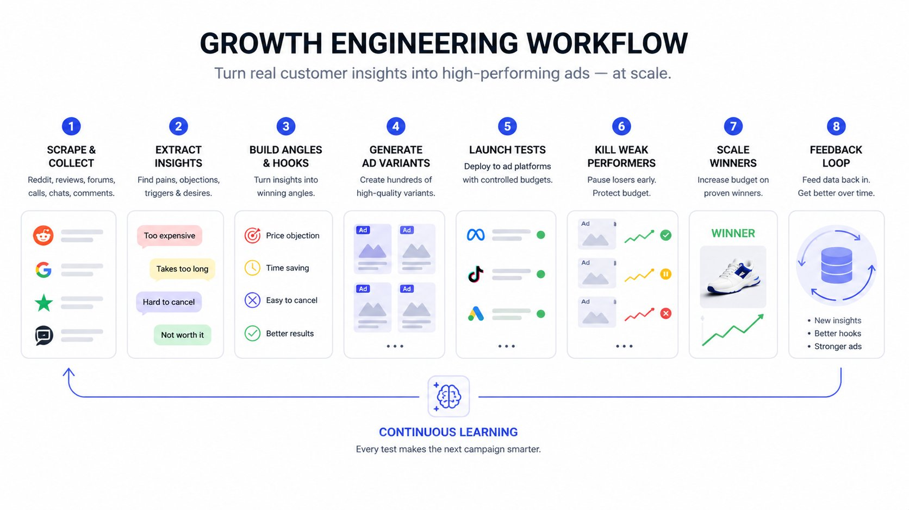
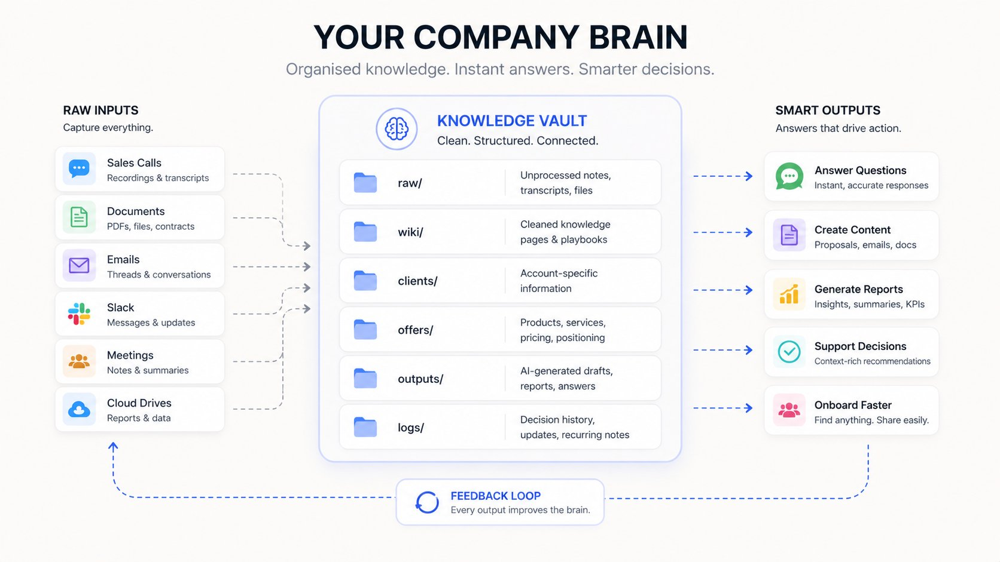
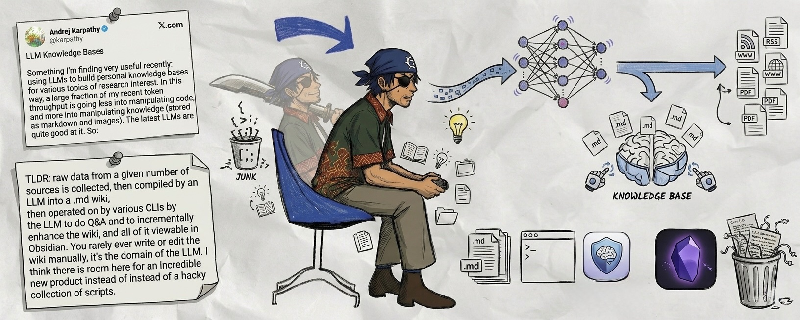
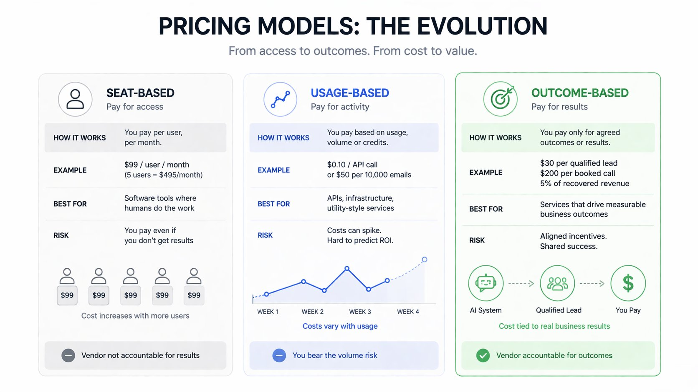
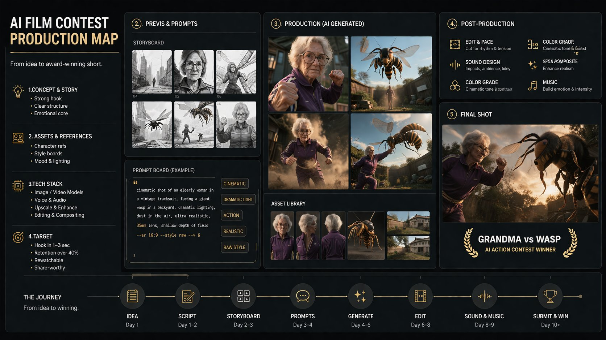

# 如何用 AI 真正赚到钱

**作者：** hoeem ([@hooeem](https://x.com/hooeem))  
**日期：** 2026年4月30日  
**来源：** [how to make money with AI (real):](https://x.com/Zephyr_hg/status/2049585251048145036)

所有人都在告诉你最新的 AI 资讯。

没人告诉你怎么用它赚钱。

这里有 11 种经过验证的方法，今天就能上手。AI 这波浪潮还在头顶，是时候认真了。

> "工具不值钱，成果才值钱"

事情是这样的：2026 年，真正做大的 AI 生意，不是在卖仪表盘、提示词或"AI 使用权"。他们卖的是已预约的工单、已解决的问题、已挽回的收入、已完成的报告——也就是真正把事情做完的服务。

市场正在从"卖软件"转向"用机器干活"。

钱，正在流进那些能卖出成果的人口袋。

下面是 11 种值得认真看的模式。

# 1. AI 审计：最容易切进真实咨询收入的口子

AI 审计至今仍是最清晰的入场方式之一。

不是因为审计本身有什么魔法。

而是因为大多数企业根本不知道 AI 该放在自己运营的哪个环节。

一次好的 AI 审计只做好一件事：找到漏洞。

漏接的电话，积压的行政事务，客户反复问的同一个问题，手动报价，乱掉的跟进，僵尸 CRM 记录，员工还在像 2012 年一样在工具之间复制粘贴。

钱就藏在这些地方。

聪明的做法是用语音智能体跟业主或运营负责人聊 20 到 30 分钟——问日常流程、卡点在哪、客户在抱怨什么、员工的工作量，还有那些没人想认领的小麻烦。

谈完之后，这段录音就会变成一张实操地图：

- 哪里坏了
- 哪里可以自动化
- 哪里该保留人工
- 哪里修起来便宜
- 哪里有最大的财务回报空间

£800 到 £1,500 的审计，可以作为付费诊断来卖。但审计不是主业。真正的钱在后面：实施、长期合同、托管自动化、持续优化。

如果你能销售、会倾听、能把混乱的运营转成简单的建议，这是个很适合新手的模式。

你不需要是房间里最厉害的工程师。

你只需要成为那个能说出这句话的人："这里是你每个月白白损失 £8,000 的地方。这是第一个修复方案。"

这就是价值所在。

# 2. 本地 AI SaaS：无聊的生意，漂亮的留存率

水管工不关心什么智能体工作流程。

他们关心能不能接到活儿。

牙医不关心你的 AI 技术栈。

他们关心漏接的电话、客户评价、预约提醒、排满的日程。

这就是本地 AI SaaS 还能玩的原因。

拿白标基础设施，围绕本地企业的某个痛点打包，按月收费。

最经典的例子是"未接来电自动回短信"。HighLevel 一直在推广一个数据：62% 打给小企业的电话没人接。其他分析也指向同一个难看的真相——漏接的电话很快就变成漏掉的收入。

对屋顶工、牙医、医美机构、房产经纪人或暖通公司来说，一个未接来电不是"小小的行政疏漏"。

它可能是一笔 £600 的活儿。

可能是一个 £4,000 的治疗计划。

可能是一个直接去找 Google 下一条结果的客户。

提供的服务很直接：

- 未接来电自动回短信
- AI 前台接待
- 请求客户评价
- Google 商家主页维护
- 预约提醒
- 基础 CRM 跟进
- 月度报告

这个模式有效，是因为卖的是挽回的收入，不是软件。定价通常在每月 $297 到 $497 之间，具体取决于市场、细分行业和服务深度。

但有一个陷阱，就是懒，然后管这叫"找到了细分市场"。

如果你对每家企业卖一模一样的"AI 自动化套餐"，你就成了商品。如果你专注在某个垂直行业，学会说它的语言，你就更难被替代。

不要做"面向本地企业的 AI"。

要做：

- 面向紧急水管工的漏单挽回
- 面向整形牙医的沉默客户唤醒
- 面向房产经纪的下班后线索收集
- 面向医美机构的评价积累
- 面向屋顶工的报价跟进

够具体，才是被记住和被留下来的区别。

留存率就是这么来的。

# 3. AI 创意机构：单人运营，机构级别的产出

事情在这里开始变得奇怪了。

一个掌握了正确 AI 视频工作流程的单人运营者，现在能做出两年前需要整个制作团队、摄影棚、剪辑师、动画师和一张让人心疼的账单才能完成的东西。

Higgsfield Ads 2.0 就是一个例子——专门从产品图片生成精致的产品广告片，工作流程里内置了产品植入和广告风格的预设。

这件事之所以重要，是因为广告制作一直有成本问题。场地费用、团队费用、重拍、产品拍摄、灯光、剪辑、动效，以及第三周开始让所有人都在心里默默骂娘的那些修改。

AI 不会消灭品位。

它消灭的是摩擦。

一个优秀的 AI 创意运营者，现在可以提供：

- 面向品牌的概念广告
- 短视频产品宣传片
- UGC 风格广告变体
- CGI 产品场景
- 社交广告素材包
- 落地页主视觉视频
- 创始人主导的发布物料

获客思路很直白：做概念广告。

挑知名品牌，做出他们绝对想不到会出自单个创作者的东西，发到 X 和 LinkedIn 上，让结果说话。

不要乞求关注。做出值得被关注的东西。

但这里是大多数人翻车的地方——市场不会奖励"AI 视频"。它奖励的是能把产品卖出去的 AI 视频。那是两种完全不同的能力。

大多数人做出来的是华而不实的东西。赢家理解的是提案逻辑、买家心理、滑动行为、钩子设计、产品角度和测试方法。

# 4. 垂直数字产品：无限的老虎机，但有一个陷阱

数字产品还是个大市场。但旧版玩法已经玩不动了。

"做一门关于生产力的课程"已经死了，除非你本来就有信任积累、分发渠道，或者一批略带恐怖感的死忠粉丝。

更好的方向是极度垂直的实用工具。

不是"如何在网上赚钱"这种（没错，说的就是这篇文章的标题，但没事，它是免费的），而是类似：

- Fortnite 地图变现模板
- 学校管理员用的危机公关追踪表
- 面向房产过户助理的 AI 提示词包
- 精品婚礼策划师用的 Notion 仪表板
- Shopify 应用开发者的样板代码
- 兼职 CFO 用的客户入职套件

奇怪地具体，胜过宽泛地有用。

Whop 关于 Iman Gadzhi 的 Monetise 产品案例展示了这个模式的现代版本：不是一个孤零零的 PDF，而是一整套包含课程、工具、社区和 AI 辅助产品创建的生态。

数字产品不再只是信息。它是一条打包好的捷径。

AI 能帮你搞定研究、结构、销售页面、脚本、引流磁铁、邮件序列和交付。

但不要把"做起来容易"和"有需求"混为一谈。这是新手最常犯的错。

你现在能更快做出东西，不代表有人想要它。难的部分还是品位。

你得发现真实的痛点。你得知道买家已经试过什么。你得把解决方案包装得足够具体，让人觉得这东西就是专门为他们做的。

2026 年最好的数字产品，会让人感觉奇怪地精准。就像有人在深夜 11:47 偷听到你在抱怨，然后连夜做了出来。

这才是标准。

# 5. 增长工程：营销变成一套系统，而不是靠心情

传统营销团队还在把太多时间花在中间层工作上：搭变体、拉报告、抓取研究资料、格式化广告、上传活动、关掉烂的，再做一张周四就过时的表格。

增长工程要干掉的就是这一层。

与其手动做 5 个广告变体，你搭一条能做出 500 个的流水线。不是随机的垃圾，而是基于真实异议、痛点、竞品投诉和客户语言生成的变体。

这就是编程智能体和广告活动 API 落到对的人手里后变得危险的地方。

已经有运营者在用类似 Claude Code 的工作流程、Meta Ads 自动化和批量创意生成来压缩活动执行周期。相关教程描述了利用 AI 批量生成广告变体、通过 API 管理投放的完整系统。

工作流程大概是这样：

- 抓取 Reddit、产品评论、论坛和销售录音
- 提取痛点、异议和购买触发器
- 把这些转化成钩子和广告角度
- 批量生成广告变体
- 跑受控测试
- 关掉弱的
- 放大赢家
- 把学到的东西喂回系统

优势不是"AI 写了我的广告"。优势是一台比竞争对手学得更快的机器。

这个模式适合技术型营销人，不是纯程序员，也不是纯文案。赢家是混合型选手——懂 API、懂数据、懂直接响应、懂付费社交、懂买家心理。

稀缺。好。稀缺的人收费贵。

# 6. RAG-Lite 知识系统：最不性感的护城河

大多数小企业不需要什么复杂的企业级 RAG 系统。

他们需要的是自己公司的大脑。

一个地方，让政策文件、销售录音、SOP、客户笔记、提案、研究资料、会议记录和内部决策都能被搜索、被调用、被重复使用。

RAG（检索增强生成）的经典做法，是把语言模型和外部知识库连在一起，让输出能调用相关数据，而不只依赖模型本身的训练数据。AWS 把它描述为：在生成回答之前，先查阅权威知识库。

有用的思路。但经常被过度工程化。

完整的 RAG 对小团队来说太重了——向量数据库、嵌入、管道、权限、维护、成本、易碎性，全套下来很吓人。

大多数团队不需要大教堂。他们需要干净的管道。

RAG-lite 是实用的平替。想象结构化的 Markdown、Obsidian vault、整洁的文件夹、统一的命名规范，加上一个告诉 AI 怎么导航的说明文件。

一个简单的结构可能长这样：

- raw：未处理的笔记、PDF、录音转写、粗糙的捕获
- wiki：整理过的知识页面
- clients：各客户的专属信息
- offers：产品、服务、定价和定位
- outputs：生成的答案、草稿和报告
- logs：决策记录、更新和周期性笔记

关于怎么搭，这里有一篇文章：

**文章：** [How to create your own LLM knowledge bases today (full course)](https://x.com/hooeem/status/2041196025906418094) — hoeem (@hooeem) · 4月7日

商业机会在于实施。你帮客户搭起来，整理那些乱成一团的东西，教团队怎么往里面放内容，然后每个月维护这套系统。

护城河不是软件本身。护城河是你成了客户记忆的架构师。

这种关系很黏。一旦公司开始依赖这个内部大脑，换掉你就会变得麻烦。

不是不可能。是麻烦。

麻烦，就是护城河。

# 7. AI 虚拟影响者和合成内容频道：可规模化，但不是躺平就能做

AI 虚拟影响者不再只是新鲜玩意儿了。他们正在变成自有媒体资产。

一个合成角色可以每天发内容、出镜、推产品、做联盟营销、构建人设故事——在不让真人创作者精疲力竭的情况下积累受众熟悉度。

但新手总是错过了核心。

角色不是生意。角色是外套。分发才是机器。

你还是需要定位，还是需要钩子，还是需要故事，还是需要一个让人真正在乎的理由。

YouTube 自动化频道同理。AI 现在能帮你搞定脚本、配音、图像、动效和剪辑。但低质量的 AI 垃圾越来越容易被识别和忽略。

更强的运营者用的是人机协作工作流程：

- AI 起草脚本
- 人工打磨角度
- AI 生成画面
- 人工把控节奏
- AI 生成声音和素材
- 人工剪辑做留存
- AI 切割成短视频
- 人工研究评论和数据

品位就藏在人工的那几步里。品位这东西，还是很贵的。

# 8. 基于成果定价的微型 SaaS：整套模式里最干净的商业逻辑

这才是重头戏。

按席位收费的 SaaS，在人类是用户的时代是讲得通的。但当一个智能体替你干活，按席位收费就成了一个奇怪的计费单位。

a16z 认为，AI 正在推动软件走向基于成果的定价，因为 AI 系统能执行过去跟人类席位绑在一起的工作。Nevermined 也写过为成果定价所需的基础设施——包括 AI 智能体的计量、结算和审计能力。

这是我最看重的模式。

不是"每月 $99，解锁仪表板访问权限"，而是类似：

- 每条合格入站线索 £30
- 每个成功预约的屋顶检查 £200
- 挽回弃购收入的 5%
- 每解决一张支持工单 £15
- 每完成一次合规供应商审计 £500
- 每条经验证的丰富联系人 £2

成果定价有效，是因为它说的是买家的语言。

屋顶承包商不想要另一个登录口，他们想要排上号的检查预约。招聘人员不想要"AI 人才采购助手"，他们想要合格的候选人。律师事务所不想要理论上的文件自动化，他们想要已经写好的初稿、经人工审阅、早上九点前准备好。

成果定价让供应商和买家的钱包站在同一边。这是它强大的原因。

但它也制造了一门更难的生意。危险在于归因问题。

谁为这条线索记功？什么算"合格"？客户销售团队把预约搞砸了怎么算？线索预约了、消失了、三周后又回来了怎么算？

这里就需要合同、追踪和审计记录。基于成果的定价不只是一种定价模型，它是一套问责系统。

这也是为什么大多数人会回避它。

好。这给了那些能搞定这些麻烦的运营者留下了空间。

# 9. 设计即服务：Canva 加 AI，把无聊的设计队列全吃了

大多数商业设计不是艺术，它是生产流水线。

改个尺寸，把这个做成轮播图，做张传单，更新宣传材料，做个缩略图，重新排版案例研究，做 20 个广告变体，保持品牌风格，明天前要。

这正是 AI 辅助设计服务的切入口。

Canva 的 AI 连接器，由其 MCP 服务器驱动，允许 Claude、ChatGPT 这类助手直接接入 Canva，通过对话就能创建、编辑、管理和搜索内容。

这是个大事，因为过去 AI 图像的问题在于不可编辑——你生成了一张图，想改一个词，往往要整张重新来过。结构化设计工具解决了这个问题，运营者现在可以在可编辑的品牌资产里工作，而不是对着一张扁平图片束手无策。

一个强大的"设计即服务"套餐可能包括：

- 每月 30 条社交内容
- 10 条广告创意
- 4 张电子邮件配图
- 2 次宣传材料更新
- 品牌规范执行
- 缩略图变体
- 每月创意测试报告

价值不在于"AI 做了张图"。价值在于用令人咋舌的速度输出品牌一致的内容。

这个模式适合懂排版、懂品牌体系、懂客户管理的运营者。烂设计师用 AI 只会更快做出烂东西。好设计师终于可以从重复性生产里解脱出来了。

那才是真正的赢。

# 10. AI 视频大赛和合作伙伴计划：用奖金做启动资本

AI 视频大赛正在成为一条真实的经济赛道。不是人人都适用。

对顶尖创作者来说，这可以是赢钱、刷身价、拿到合作伙伴资源、吸引高质量入站机会的方式。

Higgsfield AI Action 大赛据报道奖池高达 $500,000，第一名——由 Muhannad Nassar 和 Simon Meyer 创作的"GRANDMA vs WASP"——拿走了 $150,000。这可不是什么零花钱。

但最好的参赛作品不是随便拿文字生成个视频，它们需要电影级别的判断力：

- 故事结构
- 镜头设计
- 角色一致性
- 运镜控制
- 合成
- 剪辑
- 音效
- 品位

然后，这些作品就是你的证明。这份证明可以转化为入站工作、合作伙伴机会、咨询、工作坊、制作留用合同，或者一个专业工作室的报价。

坏处呢？这不是稳定的新手模式，它更接近职业体育：上行空间大，竞争残酷，收入不稳定。

把比赛当作杠杆，而不是全部押注在这里。先赢得注意力，然后把注意力变成能复利的东西。

# 11. 移动端和边缘 AI 智能体：强大，但要想清楚再做

这一节需要冷静一点。

这个市场的歪门邪道版本显而易见："让自动化看起来像真人"，"绕过平台限制"，"悄悄在监控下跑"。

这不是什么持久的生意逻辑，这是在等着被封号。

正规的机会要好得多：让智能体更靠近用户、设备和本地工作流程来运行。

比如 Hermes Agent 的文档，描述了通过 Termux 在 Android 上运行智能体，给用户提供手机上的本地命令行环境。这打开了一些实用的场景：

- 本地文件工作流程
- 个人自动化
- 私密的设备端助手
- 现场团队支持
- 基于短信的内部提醒
- 设备端研究收集
- 轻量级移动操作
- 远程工作人员任务支持

对于那些手机才是真正操作系统的行业，这尤其有意思——贸易、现场销售、物流、房产、活动、诊所、本地服务。

商业切入点应该是合规治理，不是规避监管。

赢家不说"我们能骗过平台"，赢家说的是："我们能在不失去控制权、不影响隐私、不违反合规的前提下，自动化移动端工作流程。"

这才是更好的生意。经得起审查，让客户放心，而且让你能收高价工程费，而不是一份烂销售材料就把你送上法庭。

## 那么……我到底应该怎么用 AI 赚钱？

好，我给了你 11 个经过验证的方向。但说实话，这取决于你有什么本事。

烦人的答案，我知道。但是真的。

**如果你会卖，但不太会建**

从这些开始：

- AI 审计
- 本地 AI SaaS
- 设计即服务
- 简单的自动化留用合同

这些更容易入场，因为技术栈都现成的。你的工作是打包、建立信任、做诊断、完成交付。

风险是同质化。如果你城市里的每家机构都能提供一模一样的未接来电机器人，你的利润就会被挤压。所以要专——选一个细分行业，搞懂它的经济逻辑，学会说它的语言。

**如果你会建，而且有商业思维**

看看这些：

- 增长工程
- RAG-lite 系统
- 基于成果的微型 SaaS
- 边缘自动化

这些模式更能抗竞争，因为需要更深的实施能力，从 YouTube 教程里抄不走。它们也会产生更强的操作锁定——你的系统越深地嵌入客户的工作流程，就越难被替换。

**如果你是个有品位的创作者**

关注这些：

- AI 创意机构
- 虚拟角色内容频道
- AI 视频大赛
- 垂直数字产品

但不要变成工具演示账号，那是死路。没有人需要又一个发"超级厉害 AI 视频工作流程"的账号，配着同一套光鲜宇航员画面，没有任何商业逻辑。

围绕品位、结果、故事和证明来建立受众，那才是区别所在。

## 我的最爱

**1. 基于成果定价的微型 SaaS**

因为它跟买家真实的思维方式对齐了。他们不想要软件，他们想要线索、预约的通话、解决掉的工单、挽回的收入、做完的报告、少一点的麻烦。

如果你的 AI 系统能创造出可衡量的业务成果，你就可以针对那个成果来收费。

这很干净。不容易，但干净。

**2. RAG-Lite 知识系统**

因为每家公司都在自己积累的知识里溺水。他们最好的东西散在 Slack、Notion、Google Drive、邮件线程、通话转写里，以及三个精疲力竭的员工的脑子里。

帮他们把这些乱麻变成一个能用的公司大脑，你就不只是个供应商了——你成了基础设施。

麦肯锡警告过，随着 AI 系统越来越自主、越来越嵌入核心流程，治理和监控会变得越来越重要。这正是知识架构如此关键的原因——公司引入的自主性越多，就越需要干净的上下文、清晰的规则和可靠的记忆。

智能体的上限，取决于它能信任的上下文质量。上下文烂，就是昂贵的愚蠢。上下文好，才有真正的杠杆。

## 我想让你记住的事

AI 不是护城河。访问权限不是护城河。提示词工程几乎不算护城河。

真正重要的是这些：

1. **找一个真实的痛点。** 错失的收入，永远比炫酷的技术更能说服人。
2. **把 AI 包装成劳动力，而不是软件。** 当活儿被替他们做好，买家愿意付更多。
3. **定价尽量靠近成果。** 你的定价越贴近收入、节省或风险降低，这门生意就越稳。

你会先选哪个方向来做：审计、本地 SaaS、增长工程、RAG-lite，还是基于成果的微型 SaaS？

留言告诉我，我每条都读。

最后，别忘了订阅我每周日的免费通讯：

拜拜！！！下次见 :)

