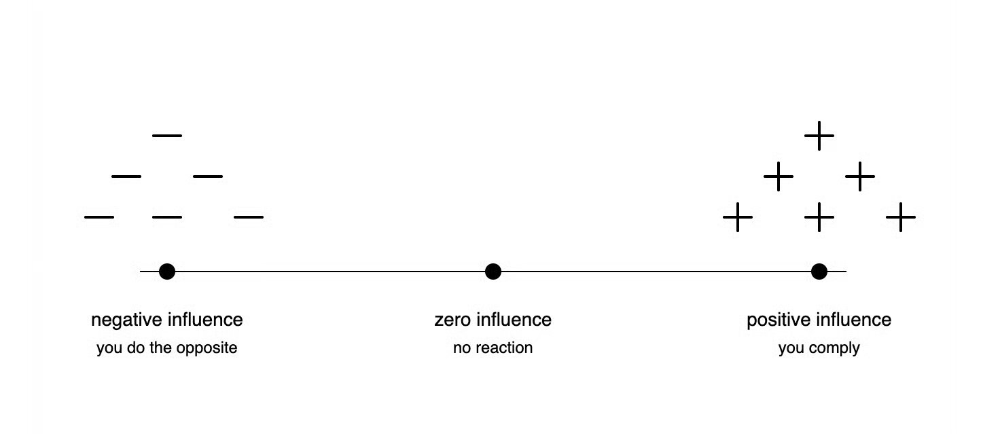
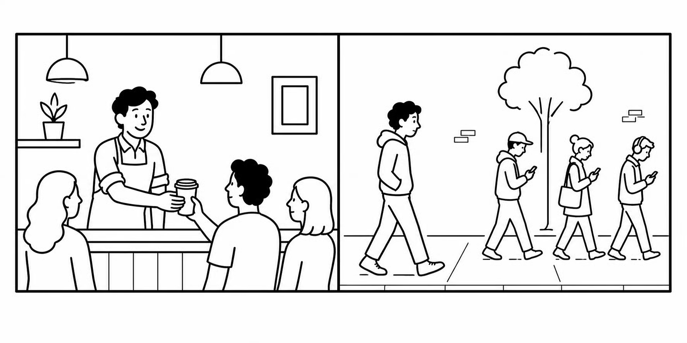
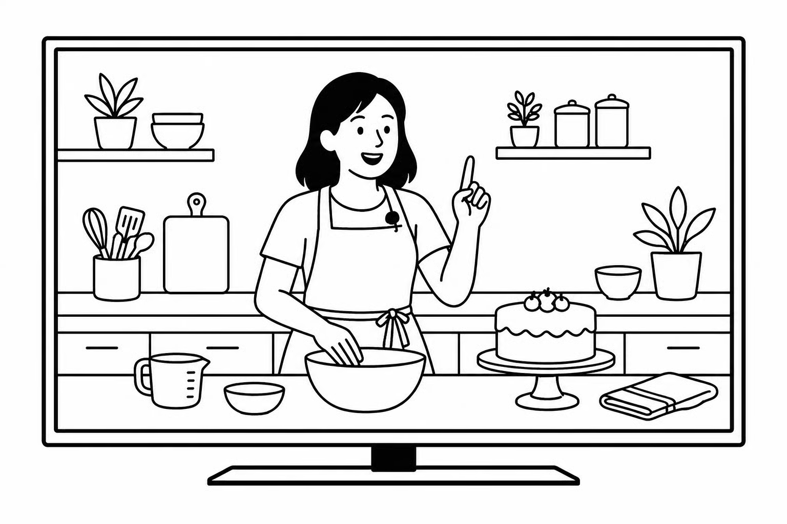

# How to Become Dangerously Influential

**Author:** Jay Yang ([@Jayyanginspires](https://x.com/Jayyanginspires))  
**Published:** April 29, 2026  
**Source:** [How to Become Dangerously Influential](https://x.com/Zephyr_hg/status/2049483780260307355)

This is how I think about influence. I spent an entire 2.5 hour car ride trying to poke holes and prove it wrong (I couldn't).

Have you ever wondered why the same advice from one person makes you act, but from another person makes you roll your eyes?

A coworker recommends a book. You smile, nod, then forget about it a few minutes later. A friend tells you to read the same book a week later. You buy it that night.

Or: Your boss tells you to try a new haircut. You laugh it off. Your girlfriend says the same thing. You schedule the appointment.

The messages are the same in both cases. What's different is the person saying them.

I think about this a lot because my career hinges on my ability to influence people. I'm a writer. Writers can't fire their readers, promote them, or pay them. Influence is the only tool we have. And I've spent a long time trying to understand why some people have it and others don't.

Here's what I've come to believe…

## My Definition of Influence

I define influence as **the ability to change other people's behaviors.**

This means influence is not "do you have it or not." It's "how much do you have." It's not a binary; it's a continuum.

**Positive influence** is when someone tells you to do something and you're compelled to do it. Your mom tells you to wear a jacket and you put one on.

**Zero influence** is when someone tells you to do something and you don't react in either direction. A stranger on the street recommends a movie. You ignore them.

**Negative influence** is when someone tells you to do something and you're compelled to do the opposite. A person you can't stand recommends a restaurant and you decide not to go, even if it's a good restaurant.

Take Kim Kardashian. To one segment of the population, Kim has high positive influence. They follow her, buy what she promotes, listen to what she says about beauty and business. To another segment, Kim has high negative influence. If she recommends a product, they actively avoid it.

So why does someone like Kim move one audience and repel another? It comes down to 3 factors: Power, trust, and likeness.

## The Three Factors of Influence

Each factor exists on its own continuum from low to high. Your total influence on a particular person is the combination of all three.

**1/ Power**

Power is when you have what someone else wants.

It's signaling resources. It's showing you have money, status, access, knowledge, or longevity in your field.

Power is relative. It depends on what the other person wants.

A bartender has power in the bar because they control who gets a drink and how fast. Once they step outside the bar, that power is gone.

A famous investor has power in a meeting with founders because the founders want their money. The same investor has low power compared to the coach at a kid's soccer game.

**2/ Trust**

Trust is the belief that following your direction will produce a good result.

Trust comes from evidence. Belief without evidence is faith. Trust is built when I tell you to do something, you do it, and a good thing happens. Each time that happens, the likelihood you comply with me in the future goes up.

Parents have high trust with their kids because they've spent years giving directions that produced good results. Eat your vegetables and you'll grow. Wear sunscreen and you won't burn. Don't talk to strangers and you'll stay safe.

Martha Stewart has high trust with her audience because for decades she has been giving step-by-step directions (recipes) that produced good results in their kitchens. If you follow her cake recipe and it comes out right… the next time she shares a recipe, you will go grab your flour.

**3/ Likeness**

Likeness is how similar you are to the person you're trying to influence.

In psychology this is called the **in-group effect**. An in-group is a social group an individual identifies with. People show favoritism, trust, and empathy toward members of their in-group, while showing skepticism or bias toward people outside it.

**Likeness** comes from two factors:

1. Physical attributes (how someone looks, how they dress, their age).
2. Values (what they believe, where they're from, what they care about, how they speak).

The further outside someone's in-group you are, the harder your advice has to work to land, even if it's good advice.

## Combinations

The three factors combine differently in every relationship you have.

**Example 1:** High power, high trust, low likeness.

Your doctor went to school for ten years and has been right about your health for as long as you've known them. But you don't have anything in common. You take their advice on medicine and ignore it on everything else.

**Example 2:** Low power, high trust, high likeness.

Your best friend who's broke. They might not have a job you'd trade for, but they've been right about every relationship in your life and they understand you in a way nobody else does. You'd take their dating advice in a heartbeat. You wouldn't ask them about money.

**Example 3:** High power, low trust, high likeness.

A close friend who's built a successful business and shares your values. You'd grab dinner with them anytime. But the last three pieces of advice they gave you didn't pan out. So when they tell you something now, you nod but do your own research.

## Isn't This Manipulative?

Some people who hear this framework will object that it sounds manipulative.

But the truth is, we're all playing the influence game whether we realize it or not.

- Every time you put on nice jewelry or a watch for a job interview, you're working on **power**.
- Every time you remind a colleague of a project that went well, you're working on **trust**.
- Every time you find common ground with someone in a conversation, you're working on **likeness**.

If you're worried about being manipulative, the question is what you're influencing people to do. If it helps them, it's influence. If it hurts them, it's manipulation.

So how can you increase your influence?

Demonstrate these 3 factors in your conversations and content.

1. Signal that you have what others want
2. Give people directions that produce good results
3. Show that you're in their in-group

Are there other ways to increase your influence? Probably.

I encourage you to hold this framework up to the light and battle test it against your reality.

Feel free to reply with your thoughts, would love to hear them!
