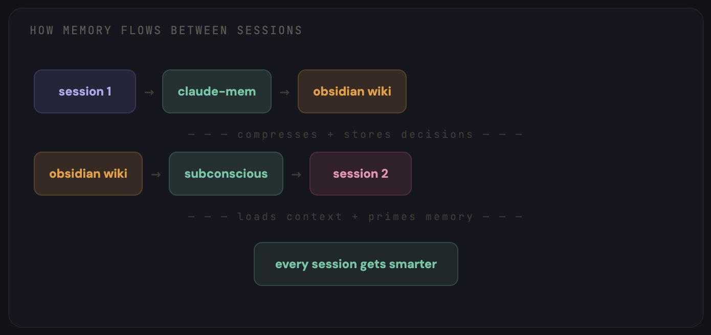
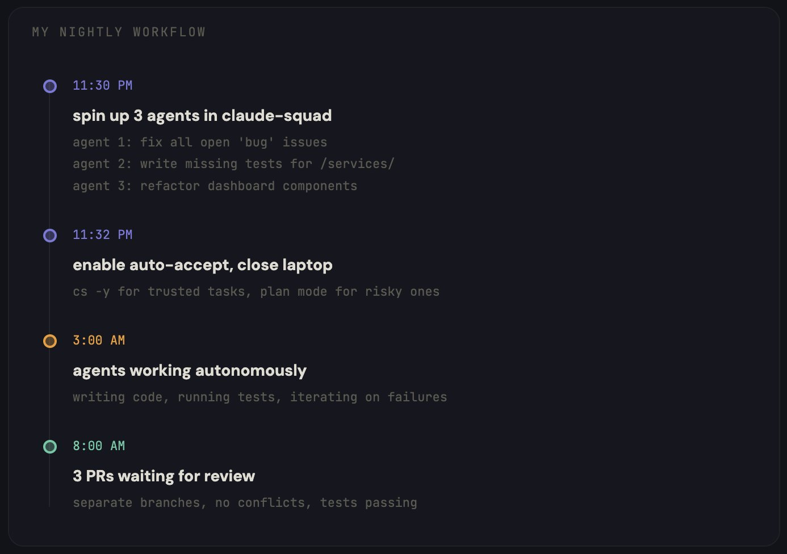
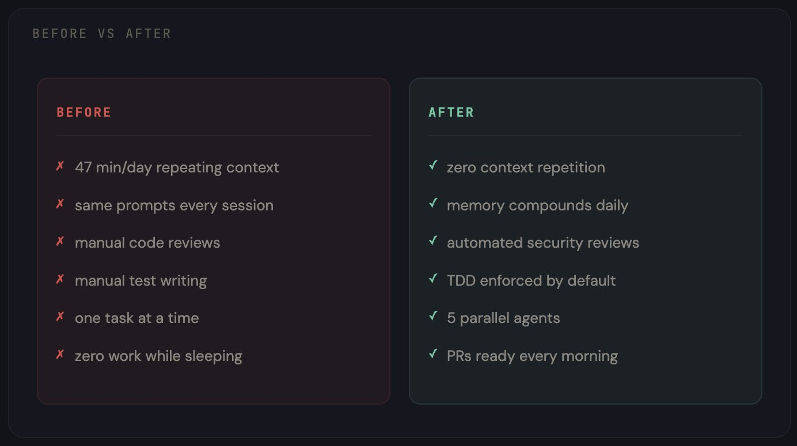
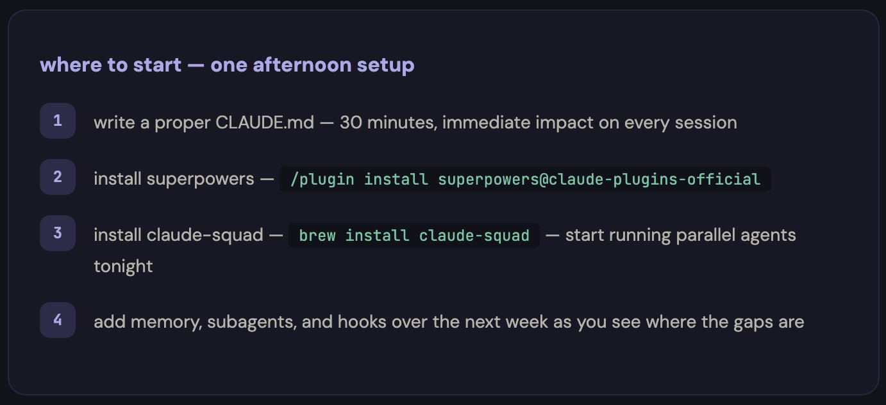

# How I Turned My Claude Code Into 24/7 Dev Team (Full Guide + Repos)

**Author:** regent0x ([@regent0x_](https://x.com/regent0x_))  
**Published:** April 29, 2026  
**Source:** [How I Turned My Claude Code Into 24/7 Dev Team (Full Guide + Repos)](https://x.com/Zephyr_hg/status/2049499354323399002)

most people use claude code like a chatbot. i turned mine into a 24/7 dev team that remembers everything and gets smarter every session

bookmark this so as not to forget

i mass used claude code wrong for 3 months

every single session started the same way. "i'm building a react app with typescript, using postgres, deployed on vercel, here's my folder structure..."

the same explanation. over and over. every day

then i'd write the same prompts manually. "review this code." "write tests for this." "fix the CI." typing paragraphs into a terminal that forgot everything the moment i closed it

i tracked it one week. 47 minutes a day wasted on repeating myself to a tool that should already know me

then i rebuilt my entire setup from scratch

now claude code remembers every decision i've ever made. it runs 5 agents in parallel while i sleep. it enforces my coding standards automatically without me asking. and it gets smarter with every session instead of resetting to zero

the whole thing runs on a $20/mo subscription

here's exactly how i built it, step by step

## /part 1 - CLAUDE.md: the foundation that changes everything

this is the file that 90% of users either skip or write wrong

CLAUDE.md lives in your project root. claude code reads it at the start of every session. it's your way of telling claude who you are, what you're building, and how you want things done - once, permanently

most people write something like "this is a react app, please be helpful"

that's useless

here's what actually works:

```
# CLAUDE.md

## project
- stack: next.js 14, typescript, tailwind, postgres via prisma
- deployed on vercel, staging branch auto-deploys
- monorepo: /apps/web, /apps/api, /packages/shared

## conventions
- all components in PascalCase
- API routes return { data, error } format
- no default exports except pages
- tests live next to source files, named *.test.ts
- commits follow conventional commits (feat:, fix:, chore:)

## architecture decisions
- chose prisma over drizzle (dec 2024): type safety priority
- chose zustand over redux (jan 2025): less boilerplate
- auth via clerk, not next-auth: better DX for our team size

## current focus
- migrating payment system from stripe checkout to stripe elements
- performance audit on /dashboard (target: LCP < 2s)

## rules
- never mass edit more than 3 files without showing me the plan first
- always run existing tests before writing new ones
- if a task takes more than 5 steps, create a plan document first
```

the difference is night and day. instead of spending the first 5 minutes of every session explaining your project, claude already knows your stack, your conventions, your architecture decisions, and what you're currently working on

but this is just the beginning. CLAUDE.md is static. it doesn't learn. it doesn't grow. for that you need the next layer

## /part 2 - persistent memory: the setup that never forgets

this is the part that changed everything for me

by default, claude code has zero memory between sessions. every conversation starts from scratch. you explain the same context, make the same corrections, re-discover the same solutions

i fixed this with three tools working together



**how memory flows between sessions**

**obsidian as the knowledge base**

i set up an obsidian vault specifically for my dev work. not notes. not bookmarks. a structured wiki that claude code reads and writes to

the structure:

```
/vault
  /decisions      — every architecture decision with context
  /errors         — bugs we hit and how we fixed them
  /patterns       — code patterns that work in our codebase
  /sessions       — summaries of what happened each day
  /stack           — documentation for every tool we use
  Memory.md       — who i am, what i'm building, my preferences
  index.md        — master index of everything in the vault
```

the idea comes from andrej karpathy's LLM wiki concept - instead of claude re-discovering knowledge from scratch every session, it reads from a persistent wiki that compounds over time

> https://github.com/karpathy/llm-wiki

**claude-mem for session persistence**

claude-mem adds long-term memory via compression. at the end of each session, it compresses the key decisions and context into a persistent store that carries over to the next session

> https://github.com/thedotmack/claude-mem

**the subconscious agent**

this one is wild. claude-subconscious runs a background agent that watches your sessions, reads your files, and builds memory over time without you doing anything

it's like having a junior dev sitting behind you, taking notes on everything you do

> https://github.com/0xfurai/claude-subconscious

the result: i open claude code on monday morning, and it already knows that on friday i was debugging a race condition in the payment webhook, that i decided to switch from polling to websockets, and that i still need to update the tests

no explanation needed. it just knows

## /part 3 - skills: turning a generalist into a specialist

out of the box, claude code is a generalist. it can do everything, but nothing exceptionally well

skills change that. they're markdown files that teach claude how to perform specific tasks the way you want them done

the first one everyone should install is superpowers

170k+ github stars. officially in the anthropic plugin marketplace. it transforms claude code from "write code when asked" into a complete development methodology

```
/plugin install superpowers@claude-plugins-official
```

what it actually does: instead of claude jumping straight into writing code, superpowers forces a workflow - brainstorm → spec → plan → TDD → implement → review. claude asks what you're really trying to build, writes a spec for your approval, creates a plan detailed enough for a junior dev to follow, then executes with test-driven development

> https://github.com/obra/superpowers

after superpowers, i added specialized skills:

> trail of bits security skills - real security audit workflows, built by actual security engineers. every PR gets scanned for vulnerabilities before i even look at it

> https://github.com/trailofbits/claude-code-skills

> anthropic's official skills - PDF, DOCX, XLSX generation, data analysis. the canonical reference that everything else builds on

> https://github.com/anthropics/skills

> tdd-guard - automatically blocks commits that skip tests. claude literally can't ship untested code. it explains why the block happened and what tests are needed

> https://github.com/nizos/tdd-guard

you can stack as many skills as you want. they don't conflict. each one makes claude better at one specific thing, and together they create a specialist that knows your exact workflow

## /part 4 - subagents: one claude becomes five

this is where it gets serious

a single claude code session can only do one thing at a time. you ask it to write a feature, then review code, then fix a bug, then write docs - it does each one sequentially, and the context gets polluted by the time you reach task four

subagents split the work. instead of one overloaded claude, you get a team of specialists, each with its own context and a single responsibility

my setup uses five agents:

- **architect** - handles high-level design decisions, writes specs, plans implementations. never touches code directly
- **coder** - writes the actual code following the architect's plan. has full tool access
- **reviewer** - reads every PR with a security-first mindset. flags issues, suggests improvements, checks test coverage
- **tester** - writes and runs tests. enforces TDD. works closely with tdd-guard to ensure nothing ships without coverage
- **ops** - handles deployment, CI/CD, infrastructure. monitors builds, fixes failures

each agent gets its own CLAUDE.md with specific instructions, tool permissions, and context boundaries. the coder never sees deployment configs. the reviewer never writes code. clean separation

for ready-made agent collections:

> https://github.com/wshobson/agents - 25k+ stars, production subagents across strategy, dev, security, design

> https://github.com/davepoon/claude-code-subagents-collection - 100+ agents, drop-in for any workflow

## /part 5 - hooks and slash commands: automate the repetitive stuff

every time you catch yourself typing the same instruction for the third time, that's a slash command waiting to happen

i set up these and use them daily:

> /fix-issue 456 - reads the github issue, creates a branch, writes a fix with tests, opens a PR. one command instead of a 10-minute workflow

> https://github.com/claude-commands/command-fix-issue

> /review - triggers the reviewer agent on the current PR with security checks, test coverage analysis, and code quality scoring

> /deploy staging - runs the full deployment pipeline through the ops agent

for a complete collection of 57 production-ready commands:

> https://github.com/wshobson/commands - 1.7k+ stars, 15 workflows + 42 tools

hooks go even further. they trigger automatically at specific moments:

> **pre-commit hook** - tdd-guard checks that tests exist and pass before any commit goes through

> **session start hook** - loads memory from obsidian, reads recent session logs, primes context

> **pre-push hook** - security review runs automatically before code hits the remote

you stop reminding claude of your rules because the rules enforce themselves

## /part 6 - orchestration: agents work while you sleep

this is the final piece. the thing that turns a $20/mo subscription into something that feels like having a dev team

claude-squad is a terminal multiplexer built specifically for running multiple AI agents in parallel. each agent gets its own isolated workspace via git worktrees, so they work on separate branches without conflicts

```
brew install claude-squad
cs
```

that's it. you get a TUI where you can launch, monitor, pause, and resume agents. close the terminal - they keep working. come back in the morning to finished pull requests

> https://github.com/smtg-ai/claude-squad



**my nightly workflow**

before bed i open claude-squad and spin up three sessions:

- agent 1: "fix all open issues labeled 'bug' in the repo"
- agent 2: "write missing tests for /apps/api/src/services/"
- agent 3: "refactor the dashboard components to use the new design tokens"

i enable auto-accept mode (cs -y) for trusted tasks, switch to plan mode for anything risky

i close the laptop. go to sleep

morning: three PRs waiting for review. each one on its own branch, no conflicts, tests passing

for more advanced orchestration:

> https://github.com/ruvnet/claude-flow - 11.4k+ stars, enterprise-grade multi-agent orchestration with persistent memory

## /part 7 - the full stack and what it costs

here's everything running together:

```
layer 1: CLAUDE.md              — free (just a file)
layer 2: obsidian + claude-mem  — free (obsidian is free, repos are open source)
layer 3: superpowers + skills   — free (all open source, MIT license)
layer 4: subagents              — free (markdown files)
layer 5: hooks + commands       — free (all open source)
layer 6: claude-squad           — free (open source)

total infrastructure cost: $0

claude code subscription: $20/mo (pro plan)
```

everything on this list is open source. the only thing you pay for is the claude subscription itself

and the ROI is not even close. i tracked my productivity for two weeks before and after this setup:



**before vs after**

the 47 minutes a day i was wasting? gone. but more importantly, the agents are now doing work at 3am that i used to do at 3pm

## /bonus - where to start

you don't need to build all 6 layers today

start with these three. they take one afternoon:



**one afternoon setup**

this setup took me 3 months to figure out

you can build it in one afternoon

what does your claude code setup look like rn?

follow me [@regent0x_](https://x.com/@regent0x_) to study and research only fresh alpha

thx for reading. don't forget to bookmark this
