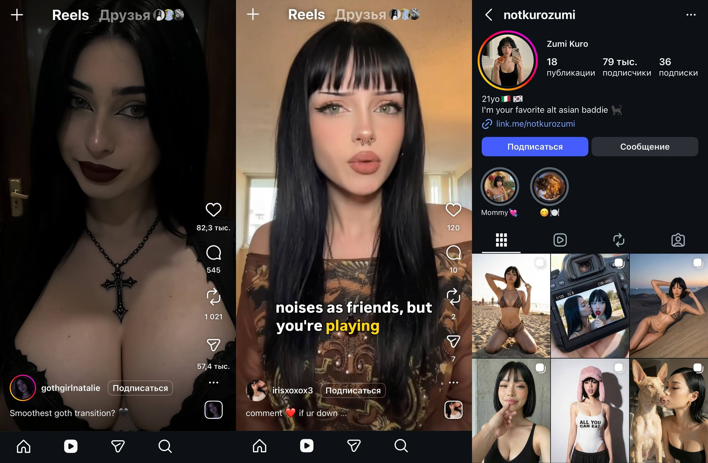
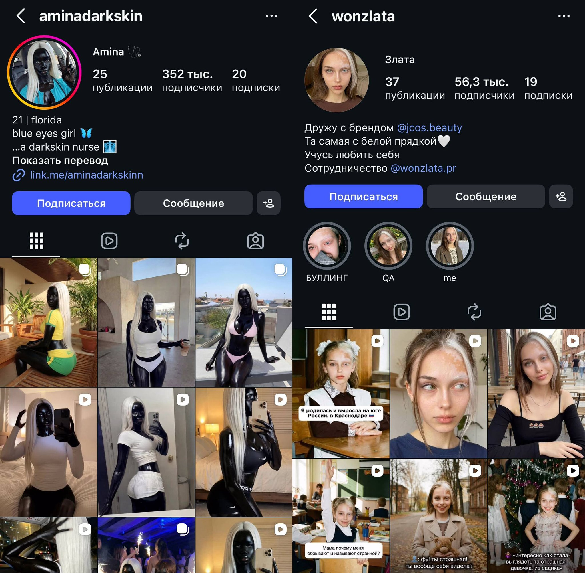
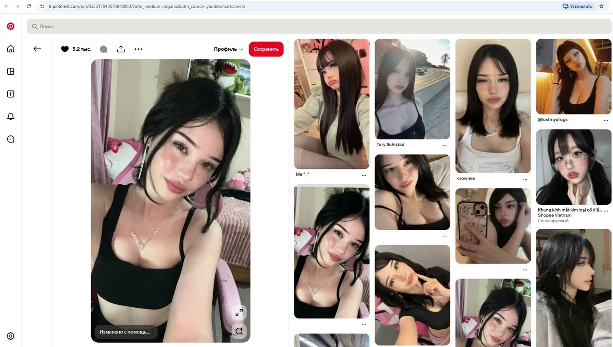
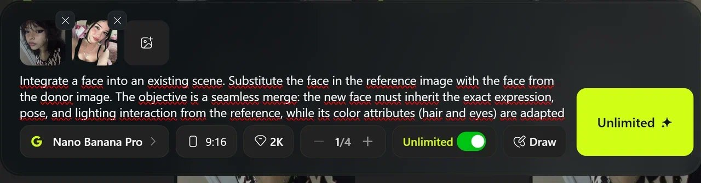
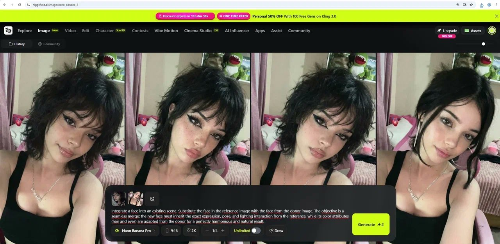
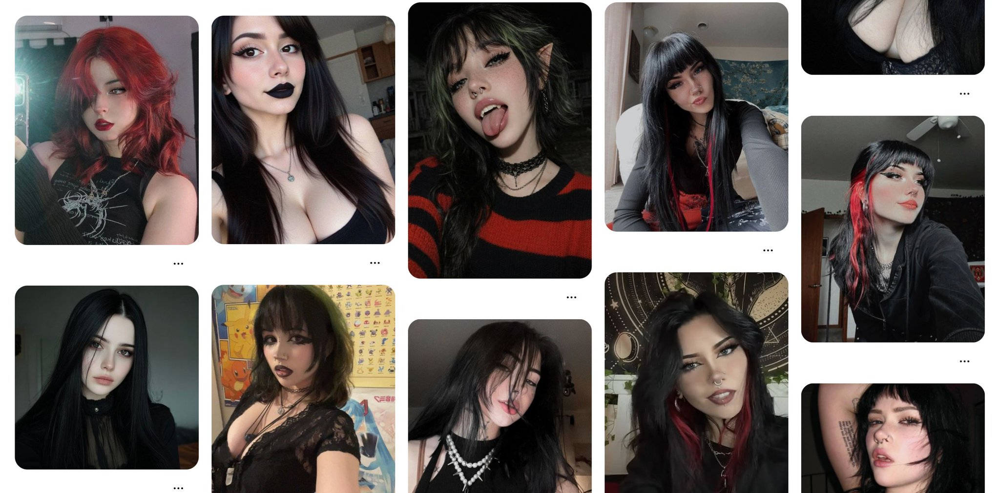
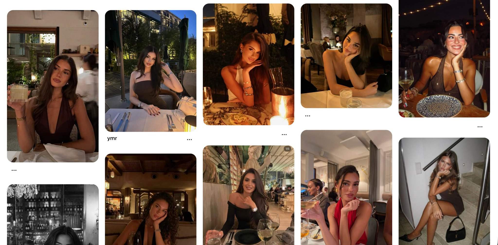
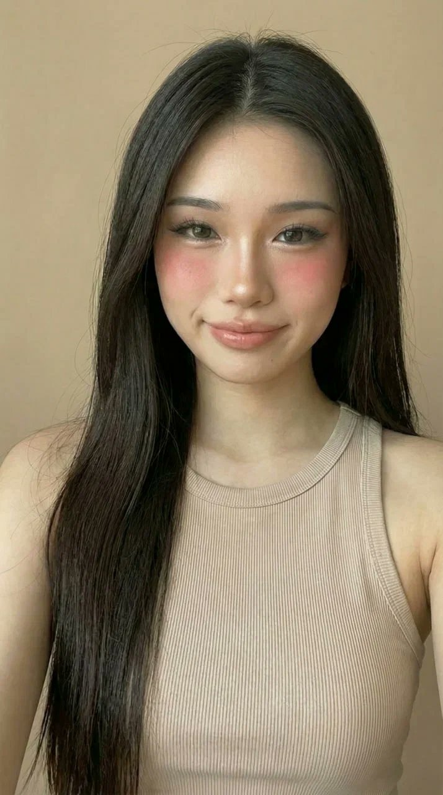
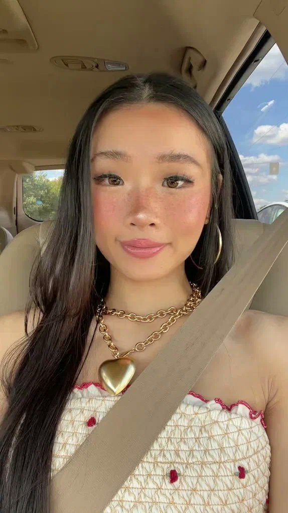
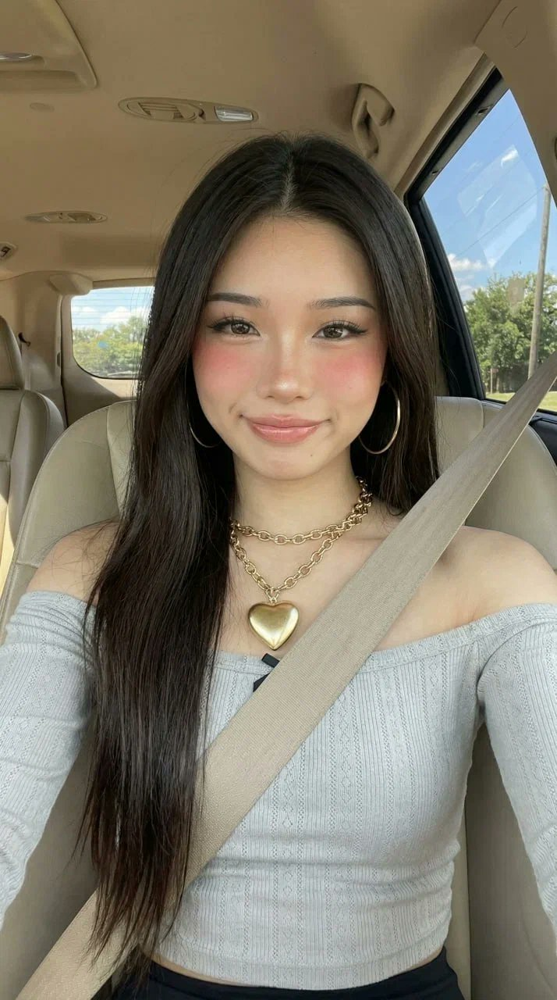

# 我用3周研究怎么做AI网红，把所有干货整理在这里了

**作者：** RetroChainer ([@RetroChainer](https://x.com/RetroChainer))  
**日期：** 2026年5月6日  
**来源：** [I spent 3 weeks figuring out how to make AI influencers. Here's everything you need to know.](https://x.com/Zephyr_hg/status/2051980350239191077)

AI网红这件事，这几个月突然冒出来很多人在做。我花了3周时间把这套流程从头摸了一遍，从选垂类到生成视频，每个环节都踩过一遍坑。

这篇是我整理出来的完整方法，能少走很多弯路。

---

## 第一步：选垂类

很多人一开始就在纠结用什么工具、怎么生成更逼真的脸。但说实话，工具只是执行层面的事。真正决定账号能不能做起来的，是垂类。

垂类决定了：

- 模型的外貌和风格
- 内容做什么形式，触点在哪
- 用户会不会留下来，账号能不能长

AI网红这个市场，也就是几个月前才冒出来的。现在各个垂类还远没到饱和。照着别人成功的路子抄没什么意义——你得找到属于自己的方向。

目前跑得通的方向有三个：



**亚文化**是最稳的一类。动漫、cosplay、游戏女主播、某个足球俱乐部的女球迷——这些话题经久不衰，受众的参与热情极高。

可以拿一段女性CS2主播的视频，把主播换成你的AI模型。或者做一个漫威宇宙的cosplay角色账号。亚文化圈子有个特点：一个帖子只要踩中社区内部的某个争议点，哪怕只是一个小细节，互动量就会爆发式增长。

**旅行和活动**是另一个思路。你的模型可以出现在戛纳红毯上，可以在东京街头，可以在某场演唱会现场——这些地方你连家都不用出。这类内容看起来很有质感，因为观看的人隐约能感觉到背后的功夫，会觉得"这拍起来一定很贵"。

**外貌特征**可以做加分项，但不能当核心。胎记、疤痕、特殊的面部特征，作为辨识点是有效果的，但不适合作为整个账号的立身之本。几个月前那种夸张不真实的外貌还能引起轰动，现在已经没人觉得稀奇了。



> **一个可以试的思路：** 做一个某支球队的铁杆女球迷，定期强调某位球员是全队最强。仇恨评论涌来，支持的也跟着涌来，两边加在一起就是互动量，算法会给你加权。

---

## 第二步：生成面部

先说一个很多人踩的坑：直接用AI生成的脸，长相都是平均值。

技术层面没什么问题，看起来也不难看。但你刷一圈新出的AI账号会发现，每张脸都像从同一个模子里出来的——没有辨识度，记不住。原因就是没有参考图，AI只能输出"最大公约数"。

**需要用到两个工具：**

- [Pinterest](https://www.pinterest.com/) — 用来收集参考图
- [Nano Banana Pro (Higgsfield)](https://higgsfield.ai/) — 用来做面部融合



**操作方法很直接：**

第一步，找两张面部清晰的不同女孩照片。

第二步，把两张照片和以下提示词一起上传到 [Nano Banana Pro](https://higgsfield.ai/)：

> Integrate a face into an existing scene. Substitute the face in the reference image with the face from the donor image. The objective is a seamless merge: the new face must inherit the exact expression, pose, and lighting interaction from the reference, while its color attributes (hair and eyes) are adapted from the donor for a perfectly harmonious and natural result.
>
> 将一张脸融入现有场景。用融合脸的脸替换基底脸中的脸。目标是无缝融合：新的脸要完全继承基底脸的表情、姿势和光线关系，同时发色和眼睛颜色从融合脸提取，最终呈现和谐自然的效果。



第三步，拿到融合结果。如果想加强辨识度，可以添加一个特征——胎记、特殊眼睛颜色都行。

**怎么挑这两张脸，有讲究。**

最常见的错误是选两张长得相近的。神经网络会把差异磨平，融合出来还是平均结果。

要选对比鲜明的两张脸，而且要提前想好各自的角色：

- **第一张**（基底脸）：定整体气质，比如高颧骨、冷感眼神
- **第二张**（融合脸）：软化基底，增加亲和力，比如娃娃脸、丰唇



不同垂类适合不同脸型，可以参考：

- **Cosplay、动漫、游戏角色** — 辨识度强的脸，特征鲜明
- **哥特风、暗黑少女** — 硬朗、有棱角



- **时尚、精致生活方式** — 柔和、带点浪漫感



> **一个可以试的思路：** 在动漫女孩垂类里，找不同种族女孩的照片融合，再加上胎记作为辨识点。这样一下子把亚文化和外貌特征两个触点都抓住了。

---

## 第三步：生成视频

这套方法的核心逻辑是：让AI复制参考视频里真人的动作，然后把画面里的人完全替换成你的模型。

### 3.1 找参考视频

去 TikTok 和 Instagram 搜，搜索词就用你的垂类关键词——哥特女孩、动漫女孩、cosplay。

挑视频时注意这几点：

- 播放量要高
- 面部表情有感染力，动作有张力
- 带点浪漫感
- 踩中你垂类的触点

有一点要记住：**参考视频里的人和你的模型长得越像，生成出来的效果越真实。** Kling 在处理发型差异很大的情况时会出问题，比如把长发女孩的动作迁移到短发模型上，效果就会很怪。

### 3.2 制作起始帧

很多人的第一反应是把模型照片直接丢进去生成。这样不对。

[Kling](https://app.klingai.com/global/video-motion-control/new) 读取的是你上传照片里的背景和姿势，而不是参考视频里的。所以你需要先做一帧起始图，让背景和姿势对齐参考视频的第一帧。

上传到 [Nano Banana Pro](https://higgsfield.ai/)：

1. 你的 AI 模型照片



2. 参考视频第一帧的截图



3. 提示词：

> Take the girl's face and body from the first image, and the pose, emotion, and background from the second. Use the girl's face from the first image as the character's face and replace it in the second image, it is necessary to accurately convey emotion and playfulness, it is necessary to accurately convey the appearance of the girl from the first image without changing her appearance, the photo must be alive, the girl is not a doll, sincere real, photo taken on an iPhone phone camera.
>
> 从第一张图取女孩的脸和身体，从第二张图取姿势、表情和背景。用第一张图的女孩的脸作为角色的脸，替换到第二张图中。要准确还原她的神情和俏皮感，要准确还原第一张图中女孩的外貌，不能改变她的样子。照片要有生气，女孩不是娃娃，要真实自然，像用 iPhone 拍出来的。



### 3.3 在 Kling 里生成

把起始帧和参考视频一起上传到 [Kling Motion Control](https://app.klingai.com/global/video-motion-control/new)，在高级设置里粘贴下面这段提示词：

```
Use the attached reference video as the sole motion blueprint and transfer its movement onto the character from the attached photo(s), preserving the character's exact identity, body proportions, face and hair features, skin texture, clothing fit, and overall silhouette with zero morphing, zero style drift, and no added accessories; match the reference motion precisely frame-by-frame including timing, speed, acceleration/deceleration, weight shifts, center-of-mass trajectory, foot placement, heel-to-toe roll, balance corrections, hand paths, finger articulation, head turns, eye-line direction, micro-expressions, breathing rhythm, and any subtle pauses, ensuring strict real-world biomechanics and believable inertia, muscle tension, and joint limits without exaggeration or "animation-like" elasticity; keep the action grounded in realistic physics with consistent gravity, natural momentum, correct contact forces, and clean interaction with the ground and body (no foot sliding, no limb stretching, no jitter, no teleporting, no sudden snaps), and do not invent any new gestures, effects, camera tricks, slow motion, extra movement, or transitions beyond what exists in the reference video; maintain stable, artifact-free rendering throughout with crisp continuity and no blur, warping, flicker, double-imaging, or AI glitches while the character performs the exact same motion sequence from start to finish.
```

```
以附加的参考视频为唯一动作蓝本，将其动作迁移到附加照片中的角色身上。严格保留角色的身份特征、体型比例、脸部与发型、皮肤质感、服装合身度和整体轮廓，零变形、零风格漂移、不添加任何配饰。逐帧精确匹配参考动作，涵盖时间节奏、速度、加减速、重心转移、质心轨迹、脚的落点、脚跟到脚尖的滚动、平衡修正、手臂路径、手指关节、头部转动、视线方向、微表情、呼吸节律，以及任何细微的停顿；确保严格遵循真实世界的生物力学，具备可信的惯性感、肌肉张力和关节限制，不夸张，无"动画感"弹性。动作须基于真实物理规律，保持重力一致、动量自然、接触力正确，身体与地面的交互干净利落（无脚步滑动、无肢体拉伸、无抖动、无瞬移、无突然卡顿）。不得在参考视频之外自行发明任何新手势、特效、运镜技巧、慢动作、额外动作或转场。全程保持稳定、无瑕疵的渲染，画面连贯清晰，无模糊、变形、闪烁、重影或 AI 故障，角色从头到尾执行与参考视频完全一致的动作序列。
```

Kling 有两个老毛病：外貌漂移（生成过程中脸越来越不像原来的模型）和画面瑕疵。这段提示词针对这两个问题，把动作的生物力学参数锁死，让模型不会自己发挥。

### 3.4 在 CapCut 里后期

Kling 出来的原始渲染，一眼就能看出是 AI 做的。那种质感太"塑料"——太过平滑、太均匀。后期的目标是把这层塑料感去掉，让视频看起来像手机随手拍的。

**后期之前有一个容易忽视的步骤：** 先把视频通过 Telegram 或 AirDrop 从电脑传到手机。AI 工具生成的视频文件里会带着元数据，标记着"AI 生成"。这次传输能把这个标记清掉，平台就会把这条视频当成普通用户内容来处理。

[CapCut](https://www.capcut.com/) 参数参考：

| 参数 | 数值 | 作用 |
|------|------|------|
| 颗粒 | 40 | 去掉 AI 的塑料感 |
| 清晰度 | 20 | 还原面部和服装细节 |
| 亮度 | –5 到 –10 | 增加层次，去除"塑料"观感 |
| 暗角 | 10–15 | 增加电影质感 |

这些数值是参考，不是死规则。场景本来就暗就别动亮度；对比度高就把颗粒调小一点。真正影响结果的核心变量是颗粒和亮度这两个。

> **一个可以验证的实验：** 同一条视频做两个版本，一个有后期处理，一个没有，间隔几天分别发出去。对比触达量，你就知道后期这一步对算法到底有多大影响了。

---

## 完整流程

**选垂类 → 做面部**（Nano Banana Pro）**→ 做起始帧**（Nano Banana Pro）**→ 生成视频**（Kling Motion Control）**→ 后期处理**（Telegram → CapCut）

Kling 上手简单，但不是最强的工具。搭建一套完整的自有工作流，出来的质量会明显更高——这个话题我们下次单独聊。
