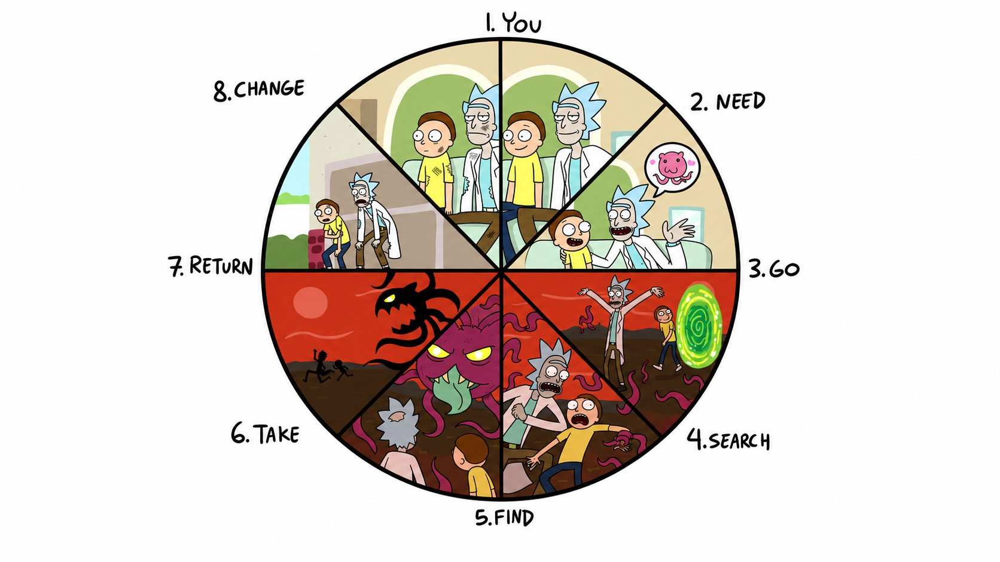
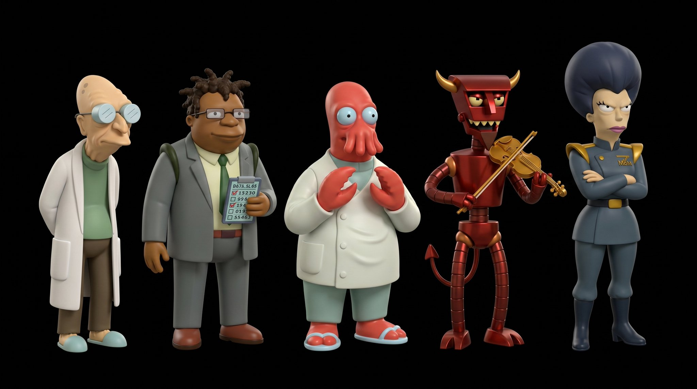
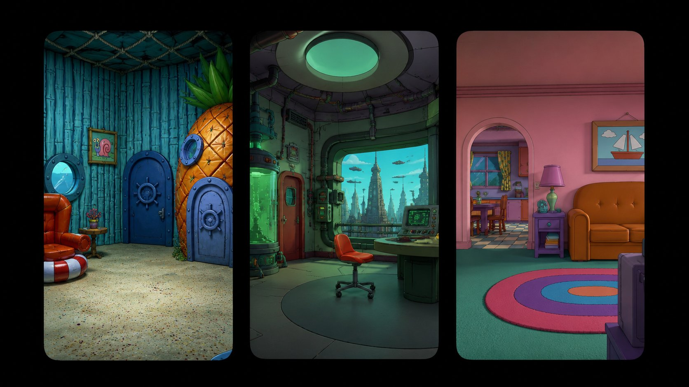
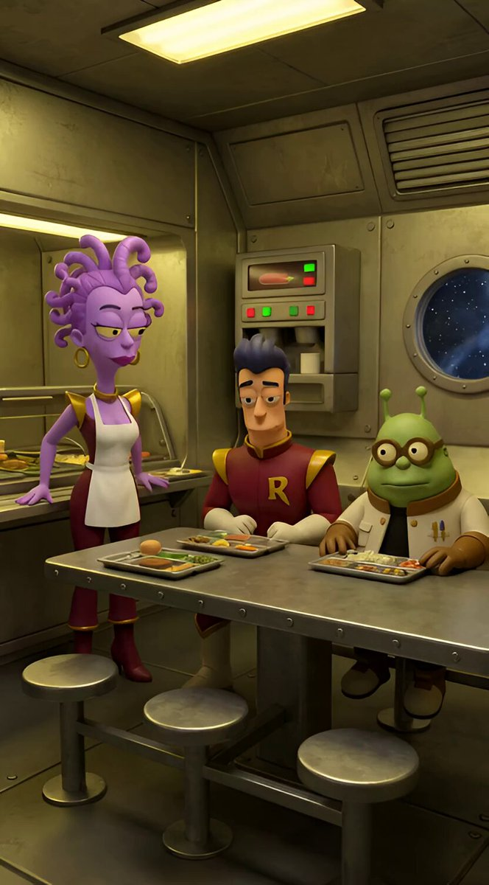
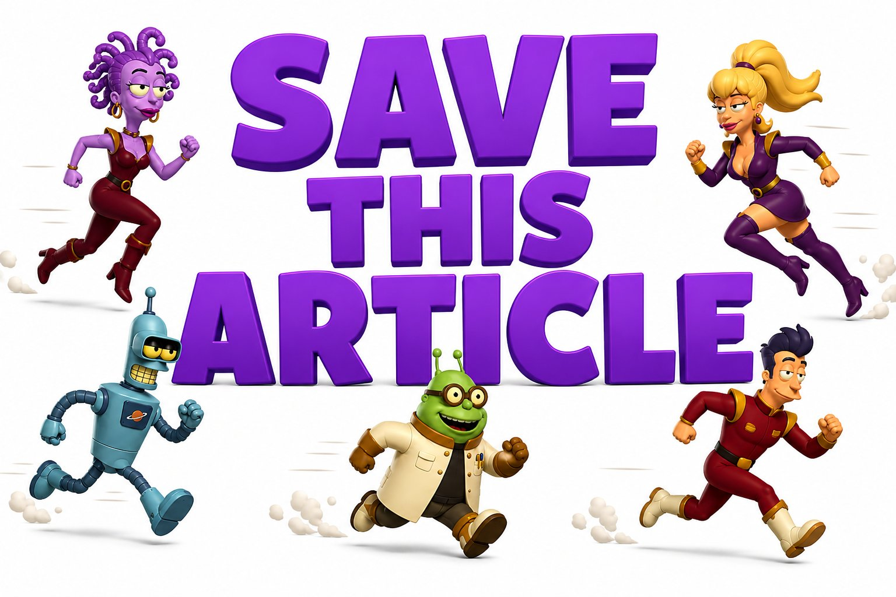

# 用 AI 做卡通视频赚钱，我把整套流程写清楚了

**作者：** Bonsai ([@bonsaixbt](https://x.com/bonsaixbt))  
**日期：** 2026年5月6日  
**来源：** [How to Make Money from Cartoons Created by AI (Grok + Claude) in 10 Minutes](https://x.com/Zephyr_hg/status/2052033321480188216)

本文会聊到这些：

- 去哪找创意
- 怎么写出有吸引力的故事线
- 怎么用 Nano Banana、Grok 和 Claude
- 怎么建社媒账号、怎么养号
- 变现方式
- 卡通内容的细分赛道

这份东西主要写给想入行的新手，但有经验的创作者也可以翻翻——说不定能捞到一两个新思路。

有一点先说清楚：我不会推荐具体的网站或工具（AI 本身除外）。一是规避风险，二是那些服务也没付我广告费 :)

## 第一步：找创意，写故事线

选题别想太多。遇到选题难的时候，直接把这件事交给 Claude。

新建一个对话，把下面这套规则喂给它，让它专门负责生成故事线：

**1. 语言规则**
- 可以带点美式俚语，轻度粗口没问题
- 绝不使用平台禁用词
- 不用英式俚语："bloody"、"mate"、"innit"、"dodgy" 这类词都不要
- 俚语要克制——每行偶尔一两个就够，不要到处撒
- 目标受众是美国人

**2. Grok 提示词结构**
- `[视觉]` — 场景描述 + 这个画面里的所有角色
- `[对话]` — 编号台词，每条附带说话者描述
- `[镜头]` — 摄像机运动方式 + 整体氛围

**3. 说话者描述规则**

每一条台词，都必须包含这些信息：
- 角色长什么样
- 穿着什么
- 站在画面哪个位置
- 说话的语气、口音、情绪
- 说完这句话之后做了什么动作
- 不能用名字指代角色，只能用外貌描述

**4. 对话规则**
- 节奏要自然，长句短句交替着来
- 每个场景最多 2 个开口说话的角色
- 第三个角色可以出现在画面里，但保持沉默
- 每条台词至少 10 个词，不能有一个词打发的台词

**5. 场景规则**
- 在脚本末尾单独列出每个场景的详细描述
- 场景里的每个角色都必须出现在 `[视觉]` 里
- 只写会动的东西，静止的背景元素不描述

**6. 镜头**
- 始终固定机位
- 极慢、几乎察觉不到的缓慢推进
- 不加背景音乐

**7. 角色**
- 只用外貌来描述

找灵感的方式也很简单：在自己的赛道里刷 Instagram 和 TikTok，把那些爆款视频截下来丢给 Claude，让它帮你拆解——这些视频为什么能爆？开头几秒又是怎么钩住人的？

## 第二步：用 Nano Banana 创建角色

到这一步，你需要建立自己的原创世界。

有一个坑要绕开：不要直接复制现有热门动画里的角色形象。一旦这样做，账号很容易被判定为版权高风险，严重的直接封号。

正确的做法是这样的：

挑一部你喜欢的卡通作参考，找到它角色的图片，上传到 Nano Banana，然后让它生成 5 个风格相近、但完全原创的随机角色。之后你可以反复改，想怎么调就怎么调。

最后，把这批角色的图片丢给 Claude，告诉它：这些就是你新节目的主角，记住它们。

这样，之后每次让 Claude 写故事线，它不只会给你台词，还会一并给出场景发生的地点，大概长这个样子：

提示词里还会标明这个场景应该出现哪些角色。

你只需要在 Nano Banana 里附上这些角色图片，把生成的提示词粘贴进去，让它生成场景图。

然后把生成的图片导入 Grok，粘贴完整的场景提示词，连同 Claude 给出的旁白台词一起放进去。记得提前告诉 Claude，每个场景不超过 6 秒——如果你有 SuperGrok，可以放宽到 10 秒。

所有步骤走完，效果大概是这样的：

最后把所有素材拖进 CapCut，拼在一起，加上你需要的效果，就完成了。

## 第三步：建账号、养号

我们会用到三个平台：

- YouTube
- Instagram
- TikTok

YouTube 和 Instagram 的操作大差不差：用 Google 账号注册，先让账号闲置一天，然后花几天时间在推荐流里正常刷视频，遇到跟你领域相似的内容就自然去互动——评论、点赞都行。这样刷几天，推荐页就会慢慢全是类似题材的内容了。

TikTok 要麻烦一些。

除了上面那些，你还需要：

- 买一张美国 SIM 卡
- 买一个美国 IP 的代理
- 用这些条件注册账号
- 发视频时也必须在这套环境下操作

## 第四步：变现

收入的大头来自平台自带的变现功能——播放量换钱，逻辑很直接。

Instagram 是个例外，它没有像 TikTok 或 YouTube 那样的内置变现。在这个平台上，主要靠品牌合作：接广告，把它自然地融进视频里。

所以在 Instagram 上，把目标受众定在成人比较重要。广告主倾向于把预算投给成人向内容，你能谈到的合作质量和报价都会好很多。

但不管哪个平台，这条路都要等你有了稳定的播放量和足够多的粉丝才跑得通。

说到底，这不是什么快速赚钱的办法，尽管很多人把它包装成这样。它是一条需要持续投入、慢慢打磨的长线路——耐心放在前面。

别指望一上来就百万播放。算法需要时间摸清楚你的内容该推给谁，这个过程急不来。

还有一个常见误解要澄清：YouTube 会封 AI 内容——这是假的。真正的问题是那种模板化、流水线式的东西。就算是纯手工做的视频，一旦没有原创性，一样会丢变现资格。
