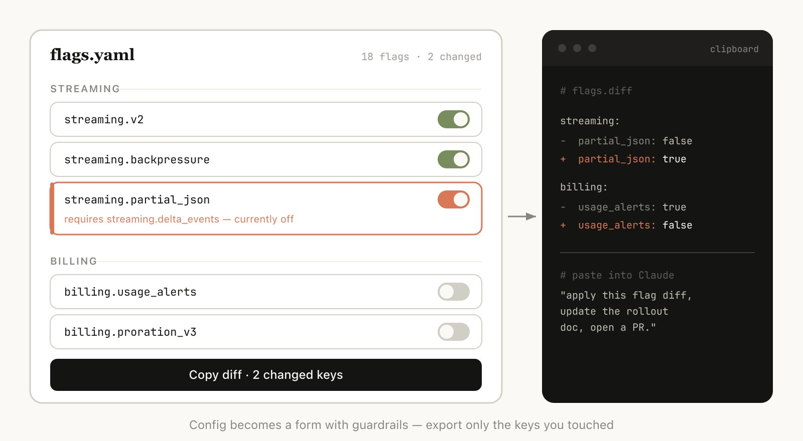

# 使用 Claude Code：HTML 出人意料地好用

**作者：** Thariq ([@trq212](https://x.com/trq212))  
**日期：** 2026年5月9日  
**来源：** [Using Claude Code: The Unreasonable Effectiveness of HTML](https://x.com/Zephyr_hg/status/2052809885763747935)

有一段时间，我和大多数人一样，把 markdown 当成 Claude 输出内容的默认格式。它简单，到处能用，基本的富文本够用，自己改起来也方便。

但慢慢地，我觉得哪里不对劲了。

文件越来越长，超过一百行我就不想读了。想要图表，只能靠 ASCII 凑；想分享给同事，还得当附件发过去。我自己也越来越少直接编辑这些文件，要改就让 Claude 改——这样一来，"方便自己编辑"这个 markdown 最大的好处也没了。

于是我开始改用 HTML。Claude Code 团队里也有越来越多的人这样做。这篇文章说说我为什么这么做，以及怎么做。

（想先看例子的话，这里有很多：https://thariqs.github.io/html-effectiveness，看完记得回来读正文）

# 为什么选 HTML？

## 能装的信息多得多

markdown 能表达的东西，HTML 当然都能做到。但 HTML 能做的，markdown 做不到的还有很多：

- 表格数据
- 带 CSS 的视觉样式
- SVG 插图
- 代码片段（用 script 标签）
- 有交互的元素（HTML + JavaScript + CSS）
- 流程图和工作流（SVG + HTML）
- 空间布局（绝对定位、canvas）
- 图片

说实话，几乎没有什么信息是 Claude 能读懂但没法用 HTML 表达的。这就让它成了一个非常顺手的工具——模型想跟你说什么，直接用 HTML 说清楚，你读起来也轻松。

没有 HTML 的时候，模型就只能在 markdown 里变着花样凑——用 ASCII 画图，或者用 unicode 字符近似表示颜色。就像下面这张截图里 Claude Code 做的那样。

*Claude Code 试图在 markdown 里表示颜色*

## 读起来清楚多了

Claude 能做的事越来越复杂，写出来的计划文档也越来越长。实际用下来，超过 100 行的 markdown，我基本不会认真看，更别提拉着同事一起读了。

HTML 就不一样。Claude 可以用标签页、链接、插图把内容组织得很好导航，手机上看也能自适应排版。结构清楚了，读起来自然顺多了。

## 分享更方便

markdown 文件不好分享，浏览器不能直接渲染，大多数时候只能作为附件发出去。

HTML 只要传到某个地方（比如 S3），发个链接就行了。对方在哪里都能打开，不用额外安装任何东西。

同样一份需求文档或报告，做成 HTML 被真正读到的概率，比 markdown 高得多。

## 可以双向交互

HTML 文档是活的。你可以让 Claude 在里面加上滑块、旋钮，用来调整设计参数或者试试算法的不同选项，看看效果有什么变化。还可以加一个"复制为提示"按钮，把你在文档里调好的内容，一键转成可以粘贴进 Claude Code 的指令。

更多双向交互的例子可以看这篇：https://x.com/trq212/status/2017024445244924382

## 能读取更多上下文

为什么用 Claude Code 来生成 HTML，而不是 ClaudeAI 或 Claude Design 呢？

一个很重要的原因是：Claude Code 能读的东西多。

比如写这篇文章的时候，我让 Claude Code 读遍我的代码文件夹，找出所有我生成过的 HTML 文件，按类型整理，再做成一个带图表的 HTML 文件。文章里的那些图，就是这样来的。

除了文件系统，Claude Code 还可以通过 MCP（比如 Slack、Linear）、Chrome 里的 Claude、git 历史等渠道读取额外的上下文。

## 就是好玩

和 Claude 一起做 HTML 文档，真的更有意思。感觉自己真的参与了创作，而不是在旁边等结果。光这一点，就够了。

## 怎么上手

我有点担心有人看完这篇文章，马上去做一个 /html 技能。这也未必不行，但其实根本不需要那么麻烦。

直接告诉 Claude "做一个 HTML 文件"或者"做一个 HTML 输出"就行了。

关键是想清楚：你要这个文件做什么？你打算怎么用它？想清楚这两点，比做什么技能都管用。也许以后你会做专门的技能，但现在先从头开始试，感受一下不同场景下怎么用。

# 使用场景

下面是我真正用过的几类场景。完整示例可以看：https://thariqs.github.io/html-effectiveness/

## 需求梳理、规划与探索

面对一个新问题，我不再只是让 Claude 写一份 markdown 计划了，而是做一整套 HTML 文件。

比如，先让 Claude Code 做头脑风暴，生成几种不同方向的探索；然后选一个深入下去，做原型图或代码片段；感觉差不多了，再写一份实施计划。对计划满意之后，新建一个会话，把所有文件一起传进去，开始干。

验证阶段，我也会让代理读这些文件，这样它对"最终要达成什么"有更完整的理解。

**示例提示：**

- 我不确定引导页该走哪个方向。生成 6 种截然不同的方案，布局、语气、信息密度都要有差异，排在一个 HTML 文件的网格里，方便我并排对比。每种方案标注它在做的权衡。
- 在一个 HTML 文件里写一份完整的实施计划，要有原型图，要有数据流，还要附上我可能需要看的关键代码片段。做得好读好消化。

**适用场景：**

- 探索代码的不同实现方式
- 对比多种视觉设计方案

## 代码审查与理解

markdown 文件里的代码不好看，也不好理解。用 HTML 就可以渲染 diff、注释、流程图、模块依赖关系，能把代码讲清楚。

现在我每次提 PR，都会附上一个 HTML 代码解释文件。我发现这比 GitHub 默认的 diff 视图好用得多，审阅的人也更容易看懂改了什么。

**示例提示：**

帮我审查这个 PR，做一个描述它的 HTML 文件。我对流式处理和背压逻辑不太熟，重点讲这部分。渲染实际的 diff，在旁边加内联注释，按严重程度用颜色区分，还有其他能帮助说清楚概念的东西都加上。

**适用场景：**

- 提交 PR
- 审查 PR
- 搞懂某个代码主题

## 设计与原型

Claude Design 本身就是基于 HTML 的——HTML 在表达设计上非常灵活，哪怕你最终的界面不是 HTML 也一样。Claude 可以先在 HTML 里画出设计草图，你满意了再告诉它用 React、Swift 或者别的语言实现。

要原型化交互效果也很方便。让 Claude 加上滑块、旋钮，你自己调，直到调出想要的感觉。

**示例提示：**

我想做一个新的结账按钮原型，点击时先播放一个动画，然后快速变成紫色。做一个带多个滑块和选项的 HTML 文件，让我试不同的动画效果，加一个复制按钮，把调好的参数复制出来。

**适用场景：**

- 做设计系统相关的输出物
- 调整组件
- 可视化组件库
- 原型化动画效果

## 报告、研究与学习

Claude Code 很擅长把分散在各处的信息整合起来，生成可读性很强的报告。Slack、代码库、git 历史、互联网，只要能读到，都可以用上。

可以做成长文档，也可以做成交互式说明，甚至是幻灯片。让 Claude 用 SVG 画图表，能帮助读者更直观地理解。

比如我写 prompt caching 相关文章时，就让 Claude 读了 git 历史，给我生成了一份完整的 HTML 研究文件，汇总了所有关于 prompt caching 的改动和背景。

**示例提示：**

我搞不懂我们的限流器到底是怎么工作的。读一下相关代码，做一个单页 HTML 解释器：一张 token bucket 流程图，3-4 个关键代码片段加上注释，底部加一个"注意事项"。针对只读一遍的人来优化。

**适用场景：**

- 解释某个功能是怎么运作的
- 搞清楚某个概念
- 给上司的每周进展报告
- 给管理层的事故复盘报告
- SVG 插图、流程图、技术图表等

# 自定义编辑界面

有时候，光靠文字说不清楚你想要什么。这时候，我会让 Claude 做一个一次性的编辑器，专门为手头这件事服务。不是正式产品，不是可复用的工具，就是一个 HTML 文件，专门针对这一份数据。

有一个细节很重要：最后一定要有个导出按钮。"复制为 JSON"或者"复制为提示"，把你在界面里做的操作转回可以粘贴到 Claude Code 的内容。

**示例提示：**

- 我需要重新整理这 30 个 Linear 任务的优先级。做一个 HTML 文件，每个任务是一张可拖动的卡片，分成"现在""下一步""以后""砍掉"四列。按你的判断先排好。加一个"复制为 markdown"按钮，导出最终排序，每列附一行理由。
- 这是我们的功能开关配置。做一个表单编辑器，按模块分组，显示开关之间的依赖关系，如果我开启了一个前置条件未满足的开关就警告我。加一个"复制变更"按钮，只显示改动的部分。
- 我在调这个系统提示。做一个并排编辑器：左边是可编辑的提示，变量插槽高亮显示；右边是三个示例输入，实时渲染填入变量后的效果。加上字符和 token 计数，以及复制按钮。

**适用场景：**

- 对任何内容重新排序、分类或归桶（任务、测试用例、反馈）
- 编辑结构化配置（功能开关、环境变量、带约束的 JSON/YAML）
- 调整提示词、模板或文案，实时预览效果
- 整理数据集，批准或拒绝条目，打标签，导出结果
- 标注文档、对话记录或 diff，并导出注释
- 选择难以用文字描述的值：颜色、缓动曲线、裁剪区域、cron 表达式、正则表达式

## 常见问题

我把这套做法讲给很多人听，有几个问题被反复问到。

**token 消耗不是更多吗？**  
是的，HTML 通常比 markdown 用的 token 多。但 HTML 表达能力更强，而且我真的会去读，综合起来输出质量反而更好。Opus 4.7 的上下文窗口有 1M，多用一些 token 基本感觉不到差异。

**那你现在还用 markdown 吗？**  
老实说，几乎什么都不用了。不过我可能是比较极端的 HTML 派。

**HTML 文件怎么查看？**  
本地用浏览器打开就行，让 Claude 帮你打开也可以。想分享的话传到 S3，发个链接。

**生成 HTML 不是要慢很多吗？**  
是的，大概要多花 2-4 倍的时间。但我觉得值。

**版本管理怎么办？**  
这确实是 HTML 最大的麻烦之一。HTML 的 diff 比 markdown 噪声大，不好看也不好审查。

**怎么让 Claude 按我的风格来，别做得太丑？**  
前端设计插件可以帮 Claude 做出质量更好的 HTML。如果想贴近公司自己的风格，可以让 Claude 读你的代码库，先做一个设计系统 HTML 文件，以后其他文件都以这个为参考。

## 始终参与其中

说到底，我用 HTML 的根本原因，是它让我对 Claude 的工作真正有掌控感。

我曾经有点担心——因为我已经不认真读那些计划文档了，慢慢地就只能任由 Claude 自己做决定，自己什么都不知道。

结果没想到，用了 HTML 之后，反而比以前更有参与感了。

希望你也能有这种感觉。
