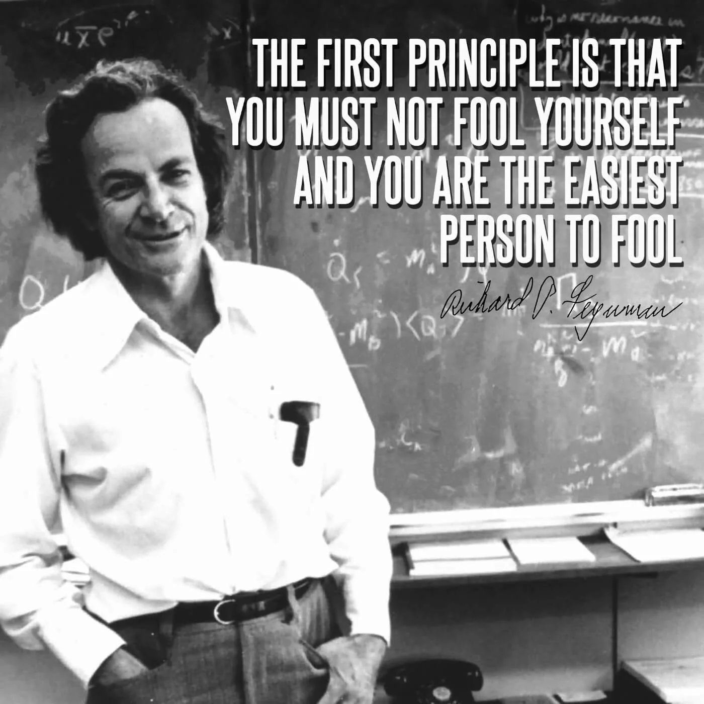
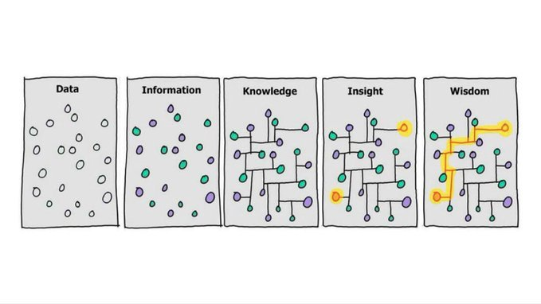
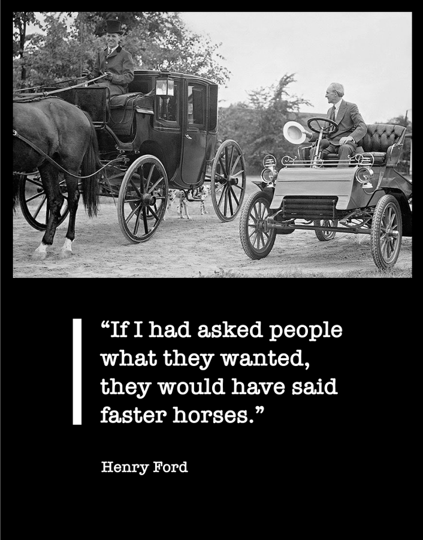

# first principles thinking: how to see what everyone else misses

**Author:** Jaynit ([@jaynitx](https://x.com/jaynitx))  
**Published:** May 8, 2026  
**Source:** [first principles thinking: how to see what everyone else misses](https://x.com/Zephyr_hg/status/2052734499319091384)

I spent six months building something nobody wanted.

Not because I was lazy. I worked insanely hard. Late nights. Weekends. All of it.

The problem was I built what I thought I was supposed to build. I looked at what other people in my space were doing and I did a version of that. Copied the model. Followed the template.

And it didn't work. Because the template was designed for someone else's situation. Someone else's audience. Someone else's strengths.

When I finally stopped and asked myself, "wait, what am I actually trying to achieve here," the answer was completely different from what I'd been building.

I had to throw out six months of work and start over.

That was about a year after I dropped out of college in 2023. And honestly, the whole experience taught me something I should have learned way earlier. Most people, myself included, don't actually think. We pattern match. We copy. We do what seems to work for others without asking whether it makes sense for us.

There's a name for the alternative. It's called first principles thinking. And once I understood it, I started seeing it everywhere.

## The basic idea

So the concept goes back to Aristotle. He defined a first principle as "the first basis from which a thing is known."

That sounds abstract so let me try to make it concrete.

A first principle is a fundamental truth that can't be broken down any further. The foundation. The bedrock. The thing that's true regardless of what anyone else thinks or does.

When you reason from first principles, you start with these foundational truths and build up from there. You don't start with what exists. You don't start with what others are doing. You start with what's fundamentally true and work forward.

The opposite is reasoning by analogy. Which is what most people do most of the time. Including me, if I'm being honest.

Reasoning by analogy means looking at what exists and copying it. "This worked for them, so it'll work for me." "This is how it's always been done." "Everyone does X, so X must be right."

Analogy is faster. Easier. Less mentally taxing.

But it has a ceiling. You can never get beyond what already exists by copying what already exists.

## The rocket example

Elon Musk ([@elonmusk](https://x.com/elonmusk)) talks about this constantly. There's this interview where he explains how SpaceX ([@SpaceX](https://x.com/SpaceX)) approached rocket costs.

> **Elon Musk** ([@elonmusk](https://x.com/elonmusk)) · Dec 1, 2021  
> The overarching problem is that we need better mental firewalls for the information constantly coming at us.
>
> Critical & first principles thinking should be a required course in middle school.
>
> Who wrote the software running in your head? Are you sure you actually want it there?

He said something like: "I tend to approach things from a physics framework. Physics teaches you to reason from first principles rather than by analogy. So I said, okay, let's look at the first principles. What is a rocket made of? Aerospace-grade aluminum alloys, plus some titanium, copper, and carbon fiber. And then I asked, what is the value of those materials on the commodity market? It turned out that the materials cost of a rocket was around 2% of the typical price."

Two percent.

So 98% of the cost was... what? Manufacturing. Labor. Overhead. Margin. Stuff that could potentially be reduced.

That gap between 2% and 100% was the opportunity. Not incrementally improving existing rocket designs. Fundamentally rethinking how rockets are built.

Most people never ask these questions. They just accept "rockets are expensive" as a fixed truth. Like it's a law of physics or something. But it's not. It's just how things have been done.

## Why we default to copying

I want to be clear that reasoning by analogy isn't stupid. It's actually really useful most of the time.

If you're learning to cook, copying recipes makes total sense. If you're new to an industry, copying what works is a fine starting strategy.

The problem is when analogies become invisible. When you forget you're copying and start thinking you're thinking.

Charlie Munger talks about this a lot. He says: "I think it is undeniably true that the human brain works in models. The trick is to have your brain work better than the other person's brain because it understands the most fundamental models."

The key word there is "fundamental." Most people's mental models aren't fundamental. They're copies of copies. Received wisdom that nobody examined.

When I was building that thing nobody wanted, I was stuck in analogy mode. I looked at successful people in my space, saw what they were doing, and assumed that was the playbook. Never questioned whether their playbook made sense for my situation.

I'm 23. I don't have the same audience as someone who's been doing this for a decade. I don't have the same resources. I don't have the same strengths. Why would the same playbook work?

But I never asked that. I just copied.

## Thinking like a physicist

Musk often describes first principles thinking as thinking like a physicist.

In physics, you don't get to say "well that's just how it works." You have to understand why. What are the underlying laws? What are the constraints? What's possible within those constraints?

Richard Feynman, who's probably my favorite physicist to read, had this technique for learning. He'd try to explain complex ideas in simple language. If he couldn't, he knew he didn't really understand it.

He put it this way: "The first principle is that you must not fool yourself, and you are the easiest person to fool."

That's kind of the whole thing right there. Most of us are fooling ourselves. We think we understand something because we can repeat what we've heard. But repeating isn't understanding.

When you only know conclusions, you can't adapt. You can't see when the formula doesn't apply. You can't create new solutions for new situations.

When you understand first principles, you can rebuild from scratch. You can adapt to anything.

## What I actually got wrong

Let me get specific about my own failure because I think it illustrates the point better than theory.

When I started creating content after dropping out, I assumed I needed to be on every platform. Twitter, Instagram, YouTube, LinkedIn. That's what everyone said. Be everywhere. Build omnipresence.

But I never questioned that assumption. Is it actually true? For me specifically?

> Naval Ravikant has this line: "The first step to getting what you want is to know what you want."

I didn't know what I wanted. I just knew what other people were doing. So I copied.

When I finally broke it down from first principles:

- What am I trying to achieve? Build an audience of people interested in what I'm building.
- Where do those people actually spend time? Mostly Twitter. Maybe YouTube. Not really Instagram for my niche.
- What's my constraint? Time. I can't do everything well.
- So what's the first principles answer? Go deep on one or two platforms instead of shallow on five.

That's obvious in retrospect. But I spent months spreading myself thin because I never questioned the "be everywhere" assumption.

## The Socratic thing

First principles thinking is basically the Socratic method applied to problems.

Socrates would take some commonly held belief and just keep asking "why?" and "is that actually true?" until the belief either proved itself or fell apart.

Most beliefs fall apart. They're based on assumptions nobody examined.

Shane Parrish ([@shaneparrish](https://x.com/shaneparrish)) from Farnam Street writes about this. He says: "First principles thinking is one of the best ways to reverse-engineer complicated situations and unleash creative possibility. Sometimes called reasoning from first principles, it's a tool to help clarify complicated problems by separating the underlying ideas or facts from any assumptions based on them."

> **Shane Parrish** ([@shaneparrish](https://x.com/shaneparrish)) · Oct 31, 2020  
> First principles thinking is one of the most effective mental tools you can have in your toolbox. It also explains why some people are far more innovative than others.
>
> Here's what it is, why it matters, and three lessons.

The process is uncomfortable though. It makes you feel stupid. You realize how much of what you "know" you don't actually know. You're just repeating stuff.

But that discomfort is the point. On the other side of it is actual understanding.

The questions that help:

- What do I actually know to be true versus what am I assuming?
- Why do I believe this? Where did that belief come from?
- If I had to rebuild from scratch, what would I do?

Simple questions. But sitting with them is hard. Your brain wants to skip ahead to the comfortable analogies.

## Where this breaks down

I should be honest that first principles thinking isn't always the right approach.

It's slow. Expensive. Takes mental energy you don't always have.

For most daily decisions, analogy is fine. What should I eat for lunch? Copy what worked yesterday. No need to derive nutrition from fundamentals.

Jeff Bezos talks about this at Amazon. He distinguishes between what he calls Type 1 and Type 2 decisions.

He put it this way: "Some decisions are consequential and irreversible or nearly irreversible. These decisions must be made methodically, carefully, slowly, with great deliberation and consultation. If you walk through and don't like what you see on the other side, you can't get back to where you were before."

Those are Type 1 decisions. They deserve first principles thinking.

Type 2 decisions are reversible. You can change your mind. For these, go fast. Use analogies.

The mistake is applying analogy thinking to Type 1 decisions. Or wasting first principles thinking on stuff that doesn't matter.

## How this actually looks

I'm not naturally good at first principles thinking. My default is still to copy. Follow the template.

But I've been trying to build the muscle. Here's what's helped me, though I'm still figuring this out honestly.

- **Writing things out.** When I'm stuck on a problem, I write out all my assumptions about it. Just listing them makes them visible. Then I can question them one by one.
- **Asking "why" repeatedly.** Like a toddler. Why is this true? Why do I believe that? Usually after three or four whys, you hit something fundamental or obviously unexamined.
- **Imagining I'm starting from zero.** If I knew nothing about how this is "supposed" to work, what would I do?

Peter Thiel has this interview question he's famous for: "What important truth do very few people agree with you on?"

That's basically asking: where have you done first principles thinking that led you somewhere different from the crowd?

Most people can't answer it. Because most people don't think from first principles. They think from analogy. So they end up with the same conclusions as everyone else.

## The Henry Ford thing

There's a story about Henry Ford that might be apocryphal but I think it makes the point.

Supposedly someone asked him about customer research. What do customers want?

And he said: "If I had asked people what they wanted, they would have said faster horses."

That's the difference.

Analogy says: people use horses for transportation. Give them better horses.

First principles says: what problem is actually being solved? Getting from A to B. What's the best way to solve that? Maybe not horses at all.

The person asking for a faster horse isn't wrong exactly. They're just reasoning from what exists. They can't imagine what doesn't exist yet.

This is why breakthrough ideas rarely come from copying. Copying keeps you inside the box of what already exists.

## The uncomfortable part

First principles thinking is uncomfortable because it makes you responsible.

When you reason by analogy, you have an excuse. "I did what everyone said to do. I followed best practices. Not my fault."

When you reason from first principles, you own the outcome. You questioned the assumptions. You made the call.

Most people don't want that responsibility. Easier to follow the template and blame the template when things go wrong.

But the people who build genuinely new things accept that responsibility. They reason from fundamentals, make original bets, and own the results.

I still default to analogy more than I'd like. It's easier. But I'm trying to catch myself. Trying to ask: is this actually true? Or am I just copying?

Those six months I wasted still bug me sometimes.

Not with regret exactly. I learned from it. But I think about how much time I could have saved if I'd stopped to question my assumptions earlier.

Everyone's doing it this way. Is that because it's the best way? Or just because everyone's copying each other?

This is how it's always been done. Is that because it's right? Or because nobody questioned it?

Most of the time, the assumptions hold up. But sometimes they don't.

And that's where all the opportunity is.
