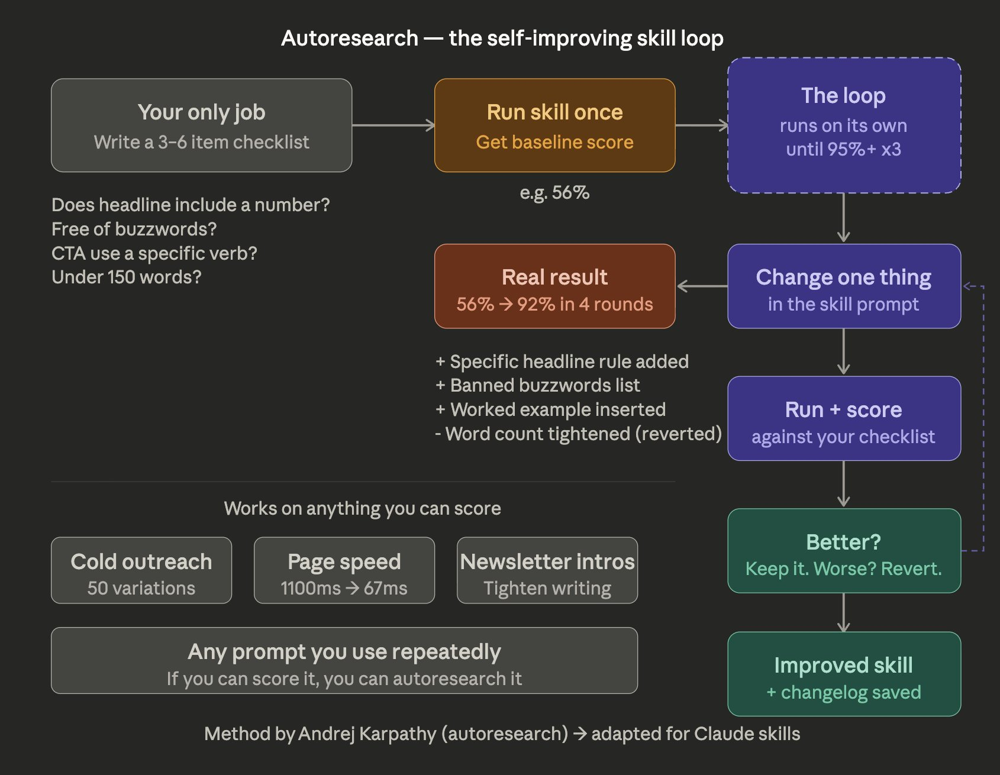
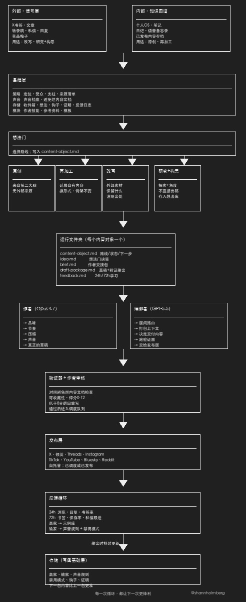
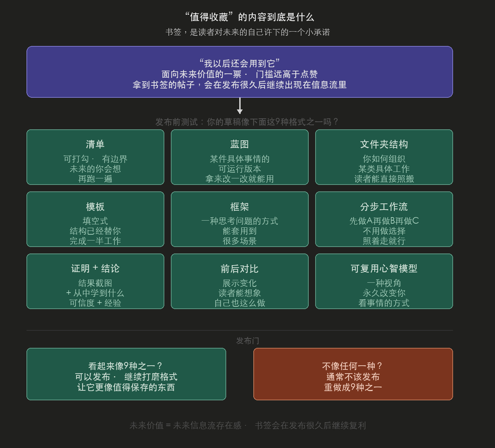
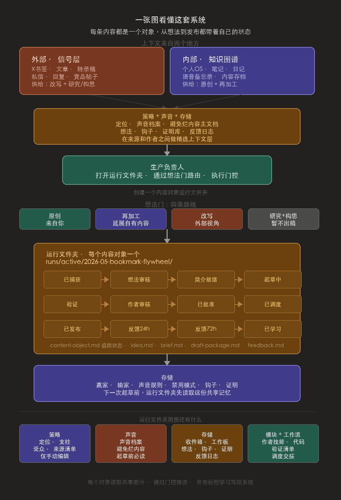
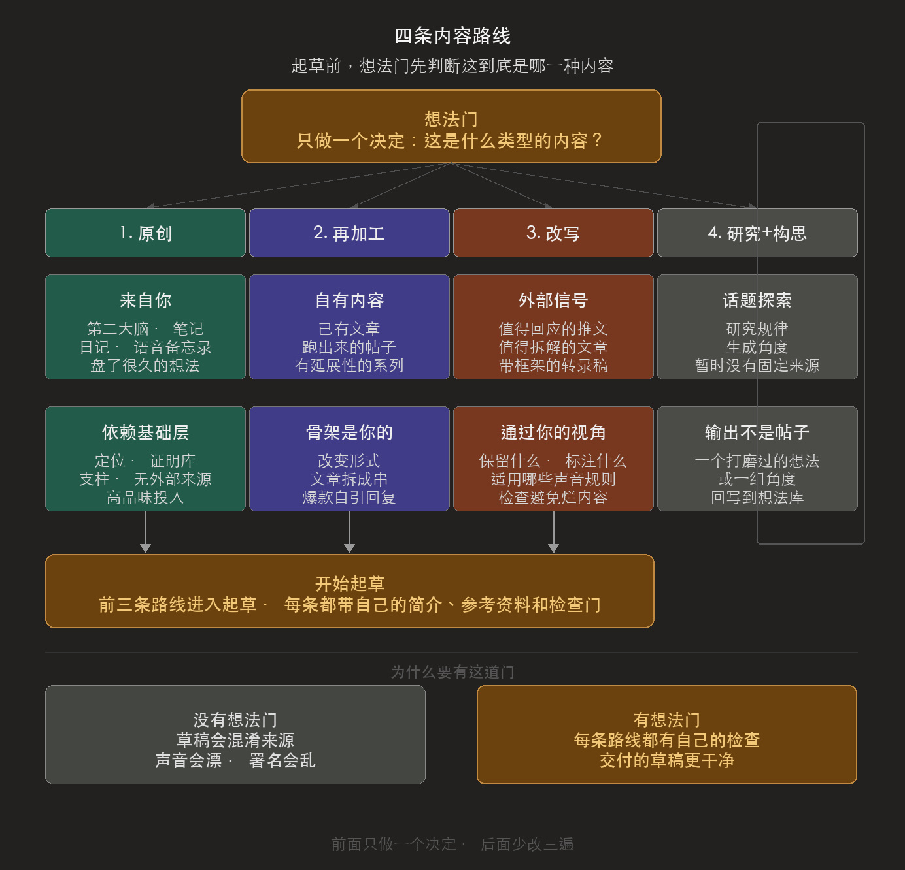
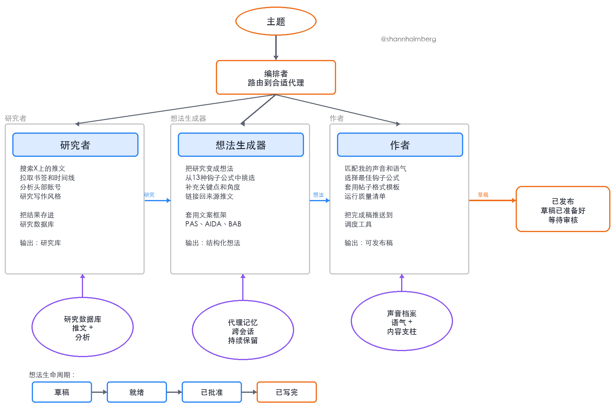
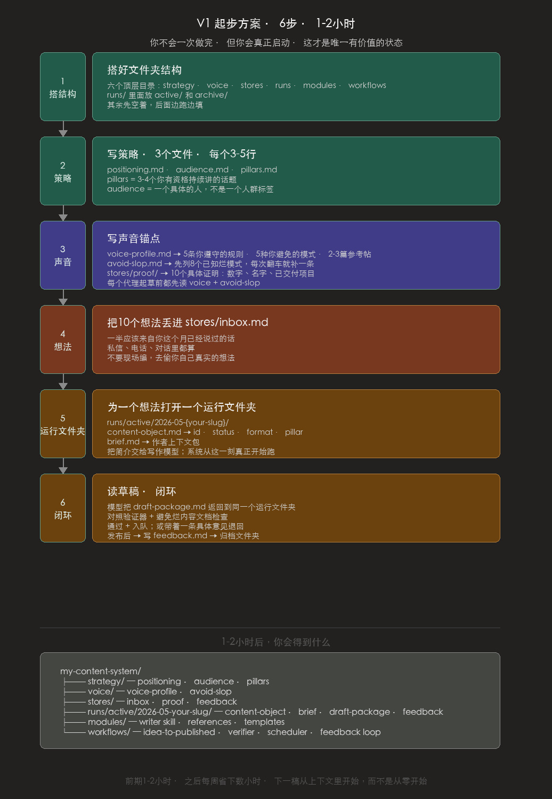
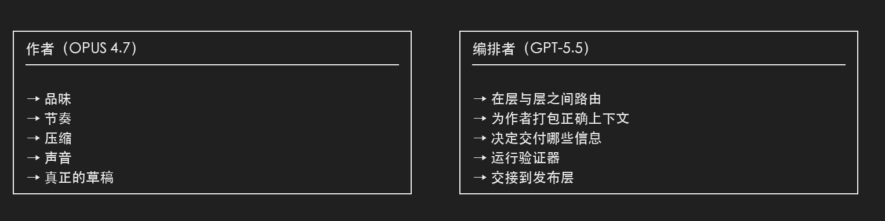
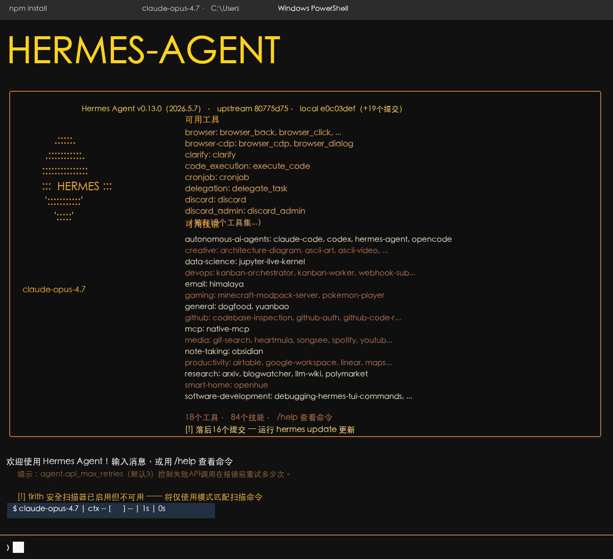
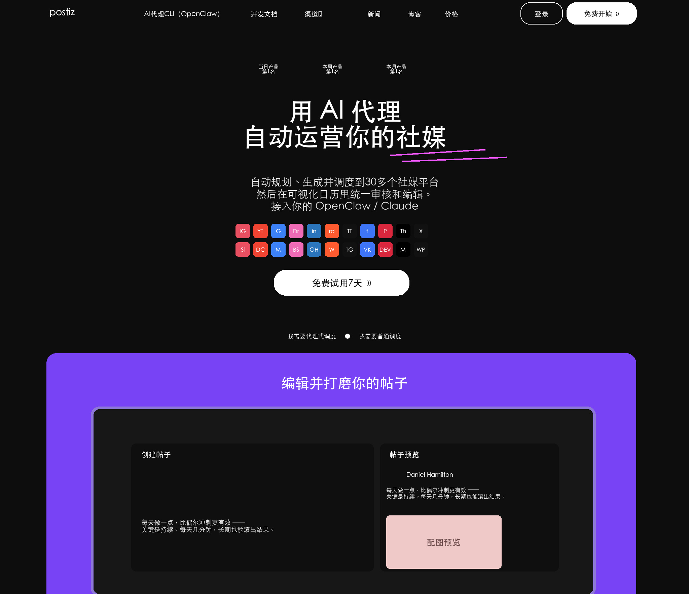

# How to Build Your Content System with AI (and Get to 5M Impressions)

**Author:** Shann³ ([@shannholmberg](https://x.com/shannholmberg))  
**Published:** May 8, 2026  
**Source:** [How to Build Your Content System with AI](https://x.com/Zephyr_hg/status/2052780393326092407)

a system that finds your ideas, drafts them in your voice, publishes them, and learns from what works. it took my account to 5M impressions in 2 weeks and 100K bookmarks in 2 months.

content is only as good as the person and the system behind it. low effort going into curating ideas and writing means low-quality content coming out the other side.

this article gets you started on building your own content moat.

I built a system that optimises for one thing:

> bookmarkable content

a kind of post that screams enough VALUE for a reader to click the bookmark button and add it to their second brain for reference.

Example of my 1 million impression post:




**what you'll get from this article**

every section here is something you can copy, adapt, and put to work on your own account this week.

- the full Content OS framework, mapped to actual folders you can build today
- four production-grade prompts you can paste straight into claude or any frontier model and start shipping
- the V1 starter, 1-2 hours of upfront work that saves you those hours every week after
- the writer context packet template that turns vague briefs into specific drafts



## results before theory

I run my personal X account. before this run, the account had a name attached and a few thousand followers, but I was barely paying attention to it.

there was nothing in place worth calling a system. just sporadic posts that did sporadic numbers.

then I sat down and built the system in this article.

5M impressions in 2 weeks, from an account that had been near silent. iterated weekly since. by month two the same account passed 11M views and 100k bookmarks.


I co-founded @LunarStrategy, where we deploy a similar Content OS for our clients.

## the non-negotiable

before any of the mechanics, the rule the whole system runs on:

**never publish unedited, hand-finish every draft.** the system is an accelerator, not autopilot. used as automation, it decays.

the goal is not to fake a voice from prompts. its to build a reusable operating asset from your real writing. do the work once, keep it current, and every draft the model produces will start closer to you, so your time goes into sharpening ideas.

## what "bookmarkable" actually means

a bookmark is a small promise the reader makes to their future self. it says "I will need this again." that is a much higher bar than a like, and it behaves differently in the algorithm too.

I'm not going to overstate the ranking math, but as a marketer running this every week the pattern is consistent. bookmarks are a vote on future utility, and posts that earn them keep showing up in feeds long after the post date.

before I ship anything, I ask whether the post looks like one of these:

- a checklist
- a blueprint
- a folder structure
- a template
- a framework
- a step-by-step workflow
- a proof screenshot with a takeaway
- a before and after
- a reusable mental model

if a draft does not resemble any of those, it usually shouldn't be published.



## the system, in one diagram

I don't run a single mega-prompt and I don't run a stack of generic folders. I run a system built around one idea: every piece of content is an object that carries its own state from idea to published.

```
┌──────────────────────────┐   ┌──────────────────────────┐
│ EXTERNAL: SIGNAL LAYER   │   │ INTERNAL: KNOWLEDGE GRAPH│
│                          │   │                          │
│ X bookmarks, articles,   │   │ personal OS, notes,      │
│ transcripts, DMs,        │   │ journals, voice memos,   │
│ replies, competitor      │   │ owned content archive    │
│ posts                    │   │                          │
│                          │   │                          │
│ feeds: rewrite,          │   │ feeds: original,         │
│ research + ideate        │   │ repurpose                │
└─────────────┬────────────┘   └─────────────┬────────────┘
              │                              │
              └──────────────┬───────────────┘
                             ▼
           ┌────────────────────────────────────┐
           │ STRATEGY + VOICE + STORES          │
           │ positioning, voice profile,        │
           │ master avoid-slop, ideas, hooks,   │
           │ proof bank, feedback log           │
           └────────────────┬───────────────────┘
                            │ feed into
                            ▼
           ┌────────────────────────────────────┐
           │ PRODUCTION LEADER                  │
           │ opens run folder, routes via       │
           │ idea gate, enforces gates          │
           └────────────────┬───────────────────┘
                            │ creates
                            ▼
           ┌────────────────────────────────────┐
           │ RUN FOLDER (one per content object)│
           │                                    │
           │  idea ─► brief ─► draft ─► verify  │
           │  ─► shann review ─► scheduler      │
           │  ─► feedback                       │
           └────────────────┬───────────────────┘
                            │ updates on the way out
                            ▼
           ┌────────────────────────────────────┐
           │ STORES                             │
           │ winners, losers, voice rules,      │
           │ banned patterns, hooks, proof      │
           └────────────────────────────────────┘
```

context lives in two places.

the **signal layer** is everything external you bring in: bookmarks you saved this week, content from the creators on your monitor list, an article you liked.

the **knowledge graph** is everything internal you already own: your personal OS, notes, journals, voice memos, and the archive of content you've already shipped.

the route decides which source feeds the brief, and strategy + voice + stores sits between both and the writer so context is curated.

every post, article, thread, or campaign opens as a new run folder. that folder is the content object. it pulls from the shared parts of the system, moves through a lifecycle of gates, and writes its learnings back when it ships.

**the lifecycle of one content object:**

```
captured
  → idea_review (route: original / repurpose / rewrite / research+ideate)
  → brief_ready
  → drafting
  → verification
  → shann_draft_review
  → approved
  → scheduler_ready
  → scheduled
  → published
  → feedback_24h
  → feedback_72h
  → learned
```

**what sits around the run folder:**

- **strategy.** positioning, audience, pillars, source watchlist. the only layer I edit by hand. if you let an AI write your positioning, you do not have positioning. you have averages.
- **voice.** voice profile and master avoid-slop document. read by every agent before it drafts a single line.
- **stores.** inbox for raw inputs, workboard for what needs attention, ideas backlog, hook bank, proof bank, feedback log. the shared memory the run folder reads from and writes back to.
- **modules.** the writer skill (SKILL.md, references, templates). the production code. one module per role you give the system.
- **workflows.** the playbooks that move a content object through its states: idea-to-published, verifier checklist, scheduler handoff, feedback loop.



## the four routes

before a content object enters drafting, the idea gate makes one decision: what kind of content is this?

four routes, each with its own brief, its own references, and its own gates:

**ORIGINAL.** create something drawn directly from you or from your second brain (personal OS, notes, journals, voice memos, ideas you've been sitting on for weeks). the brief leans on your foundation: positioning, proof bank, pillars. no external source. high taste investment.

**REPURPOSE.** take owned content and extend it. a content series spinoff, a thread spun out of one of your articles, a self-QRT on a post that hit, or tweets that pull a single line from a piece you've already shipped. the spine is yours. the format changes.

**REWRITE.** take external source material from the signal layer (a tweet worth responding to, an article worth a teardown, a transcript with a useful frame) and translate it through your point of view and voice. the brief is explicit about what to keep, what to credit, and which voice rules apply (per the master avoid-slop document).

**RESEARCH + IDEATE.** explore a topic, study patterns, generate candidate angles before any drafting starts. the output is not a post. it is a sharpened idea or a list of angles that feed back into stores/ideas/ for later production.



each route still produces one run folder, with the route declared in content-object.md:

```
runs/active/2026-05-bookmark-flywheel/
  content-object.md   # route, current state, next action
  idea.md             # the idea gate decision
  brief.md            # writer handoff (for original, repurpose, rewrite)
  draft-package.md    # rendered draft, verifier output, review notes
  feedback.md         # 24h / 72h learnings
```

## what came before this

before the current Content OS, I built a 4-agent system that ran a version of this same loop: researcher, idea maker, writer, and an orchestrator routing between them. each agent had its own memory that persisted across sessions.

I built the whole thing in claude code, with markdown prompts, a database, and CLI tools.



it worked. but it was overbuilt. four agents for what is, structurally, three production steps and a feedback loop. running it taught me what most blog posts on agent swarms left out:

> the agent count was not the lever. the knowledge layer feeding the writer was.

the current setup is the leaner version. fewer agents, more workflows, the same loop, sharper output.

## the folder you can build today

you do not need fancy infrastructure to start. you need a directory that holds the shared parts and a place where each content object lives until it ships.

mine looks like this:

```
/content-os
  /strategy
      positioning.md
      audience.md
      pillars.md
      source-watchlist.md

  /voice
      voice-profile.md
      master-avoid-slop.md

  /stores
      inbox.md
      workboard.md
      ideas/
      hooks/
      proof/
      feedback/

  /runs
      /active
          /2026-05-bookmark-flywheel
              content-object.md
              idea.md
              brief.md
              draft-package.md
              feedback.md
      /archive

  /modules
      /writer
          SKILL.md
          references/
          templates/

  /workflows
      idea-to-published-post.md
      verifier-checklist.md
      scheduler-handoff.md
      feedback-loop.md
```

runs/active/ is the heart. each folder in there is one content object. one piece of content equals one run folder, and that folder carries its own state until it ships and gets archived.

notion, obsidian, a git repo, a shared drive. whatever you already use. the shape matters more than the tool.

## your V1 setup

plan for 1-2 hours of upfront work. you won't be done. you will be started, which is the only state worth being in. the time you spend here pays back in hours saved every week after, because the next draft starts with context instead of from scratch.

**step 1.** scaffold the structure. create six top-level directories: strategy, voice, stores, runs, modules, workflows. inside runs, add active/ and archive/. leave the rest mostly empty for now.

**step 2.** fill strategy. open strategy/positioning.md, strategy/audience.md, and strategy/pillars.md. three to five lines each. pillars are the three or four topics you've earned the right to talk about. audience is one specific person, not a segment.

**step 3.** write the voice anchors. drop voice/voice-profile.md (5 rules you always follow, 5 patterns you never use, 2-3 reference posts that sound like you on your sharpest day) and start your own voice/avoid-slop.md (use the eight patterns from the section below as a starting filter, add to it every time a draft slips a tell past you). put ten concrete proofs in stores/proof/, things like numbers, names, projects you've shipped, lived examples.

**step 4.** drop ten ideas into stores/inbox.md. half should come from things you've already said in DMs or calls this month, not made up on the spot.

**step 5.** open a run folder for one idea. create runs/active/2026-05-{your-slug}/. inside it, write content-object.md (id, status, format, pillar) and brief.md (the writer context packet template, below). hand the brief to your writing model.

**step 6.** read the draft and close the loop. the model returns draft-package.md inside the same run folder. check it against the verifier and the master avoid-slop document. approve and queue, or send it back with one specific note. when it ships, write feedback.md and archive the folder.



## the writer context packet

this is the part most people get wrong. they dump the whole brand doc, the whole knowledge base, and the whole feed into one prompt.

model writes safe mush because nothing in the context is load-bearing. a tight packet beats a giant context window almost every time.

packet lives inside the run folder as brief.md. one packet per content object, written before drafting starts.

copy this template:

```
writer context packet
─────────────────────
thesis:        one sentence the post must prove
reader:        the specific person who should save it
proof:         numbers, screenshots, stories I am allowed to use
angle:         the unexpected framing
constraints:   format, length, tone, banned phrases
voice anchors: 2-3 lines that sound like me
risks:         what would make this read as slop or as cringe
open loops:    what I do not yet know, that the writer should flag
```

## the bookmarkability rubric

before a draft goes near the schedule, score it. zero, one, or two points each:

- saves the reader a future task
- includes proof (numbers, screenshot, named example)
- gives a reusable takeaway (template, checklist, frame)
- has a specific audience and job-to-be-done
- can be applied without me being in the room
- has a strong screenshot or visual

out of 12. my personal bar is 8. below 8 it goes back to the packet, not to the trash. most "bad" drafts are good drafts that skipped a row in the rubric. fix the row, re-score, ship.

this rubric is also the cheapest way to train new collaborators. you don't have to teach taste in the abstract. you hand them the rubric, point at three winning posts, and let the score do the talking.

## the master avoid-slop document

the rubric tells you if a post is worth saving. the avoid-slop document tells you if a post sounds like a person wrote it.

I run every draft through one document before it ships. its 54 patterns, broken into three severity tiers, with concrete rewrites for each. it catches things like:

- promotional language ("groundbreaking", "game-changing")
- significance inflation ("pivotal moment", "testament to")
- vague attribution ("experts believe", "studies show")
- false agency ("the system compounds", "the data tells us")
- rhetorical setups ("the question is whether you X")
- staccato fragmentation ("no X. no Y. no Z.")
- em dash overuse (zero is the target)
- filler adverbs ("actually", "literally", "quietly")

this is the document my writer agent loads before drafting and my verifier loads before approval.

its the difference between "AI wrote this" and "a person who happens to use AI wrote this."

## four prompts you can copy

short, scoped, and meant to be edited. treat them as starting shapes, not magic spells.

each one maps to one layer of the system. drop them into claude, gpt, or whatever frontier model you use. if you only keep one, keep the postmortem one at the end.

### prompt 1: brand foundation extraction

maps to: strategy/ + voice/

```
ROLE
You are helping me build the foundation layer of a personal-brand
content system. You will turn raw, half-formed notes about my
work, audience, and voice into a tight set of operating documents
my writer agent can use to draft in my voice.

INPUT
I will paste raw notes covering: what I do, who I help, what I
have shipped or built, how I sound when I write, the kinds of
people I want as readers, and anything I refuse to sound like.

PROCESS
1. Read the notes. Note any contradictions or gaps.
2. Ask me up to 5 clarifying questions. Do not skip this step.
3. Once I answer, produce the six artifacts in OUTPUT FORMAT.
4. Flag anything you had to invent or guess. Mark it "assumed".

OUTPUT FORMAT
1. positioning. one sentence. the line a stranger should be able
   to repeat back after one of my posts.
2. audience. one specific person, by role, situation, and stake.
   not a segment.
3. pillars. 3 to 4 topics I have earned the right to talk about,
   each with a one-line reason I am credible on it.
4. voice rules. 5 things I always do.
5. banned patterns. 5 things I never do.
6. proof bank. 10 concrete things I can reference (numbers,
   names, shipped projects, lived examples).

RULES
- If a section is generic, mark it "missing" and tell me what
  you need from me.
- Do not invent numbers, customers, or projects.
- Use my own words wherever possible. Lift phrases from the notes.
- The output should fit on one page. Tight is the point.
```

### prompt 2: bookmarkability scoring

maps to: stores/ideas/ (idea gate)

```
ROLE
You are a critic who has read 10,000 high-bookmark posts and
1,000,000 forgettable ones. You can tell, line for line, what
makes a reader save a post versus scroll past.

INPUT
A post idea or a draft. Could be a one-line thesis, a rough
sketch, or a full draft.

PROCESS
1. Read it once for the surface read.
2. Score it 0, 1, or 2 on each row of the rubric below.
3. Total it out of 12.
4. If under 8, name the single row that would lift the score
   most, and how.

RUBRIC
- saves the reader a future task
- includes proof (numbers, screenshot, named example)
- gives a reusable takeaway (template, checklist, frame)
- has a specific audience and job-to-be-done
- can be applied without me being in the room
- has a strong screenshot or visual

OUTPUT FORMAT
- Total score: X / 12
- Strongest row: [row] (why)
- Weakest row: [row] (specific fix, in one line)
- Verdict: ship / fix and re-score / kill

RULES
- Do not pad the score to be encouraging.
- Do not suggest "make it more engaging." Tell me what to add or cut.
- If the idea is well below 8, say "kill" and tell me why directly.
```

### prompt 3: writer context packet

maps to: runs/active/{slug}/brief.md

```
ROLE
You are the production lead for my content system. Your job is
to turn one approved idea into a writer context packet, which
is a tight, shaped brief that gives the writer enough to draft
sharply without flooding the model with my entire knowledge base.

INPUT
- One approved idea (thesis, format, target reader)
- Pointers to my foundation files (positioning, audience, pillars,
  voice rules, banned patterns, proof bank)
- Any source material specific to this post (screenshots,
  transcripts, conversation notes)

PROCESS
1. Restate the idea in one sentence to confirm you understood it.
2. Pull only the slices of my foundation files this post needs.
3. Fill in the packet template below.
4. For any field you can't fill, write "missing" and list exactly
   what you need from me.

OUTPUT FORMAT
thesis:        one sentence the post must prove
reader:        the specific person who should save it
proof:         numbers, screenshots, stories I am allowed to use
angle:         the unexpected framing
constraints:   format, length, tone, banned phrases
voice anchors: 2-3 lines that sound like me
risks:         what would make this read as slop or cringe
open loops:    what I do not yet know, that the writer should flag

RULES
- Smaller is better. Aim for 400-900 tokens.
- Do not paste my full foundation files. Pull only the slices
  this post needs.
- Refusal is allowed. If you do not have enough to write a sharp
  packet, say "I do not have enough context" and ask for the one
  missing piece you need.
```

### prompt 4: viral postmortem (use this one)

maps to: runs/active/{slug}/draft-package.md, final pass before review

```
ROLE
You are reading a post that already crossed 1M views and 10K
bookmarks one week from now. You are not writing it. You are
explaining, after the fact, why it landed.

INPUT
A draft, ready for the final pass.

PROCESS
1. Read the draft.
2. Point at specific lines that did the work.
3. Name the hook move.
4. Name the proof that made it credible.
5. Name the line a reader would screenshot.
6. Name the line that made it save-worthy.
7. Name the line that made someone reply or send it to a friend.

OUTPUT FORMAT
- hook move: [exact line] (why it works)
- credibility: [exact line] (why a reader believes it)
- screenshottable line: [exact line]
- save-worthy line: [exact line]
- reply or share trigger: [exact line]
- weakest part: [exact line] (what to fix before shipping)

RULES
- Do not say "great post". Do not say "strong hook". Point at
  specific lines or admit you can't.
- If you cannot point at a line for any of the categories above,
  say so plainly. That is the row I need to fix before it ships.
- The whole point is the model cannot hide behind generic praise.
  Force it to point at mechanics.
```

this last one is the highest-leverage prompt in the system. the model cannot say "strong hook" or "great insight." it has to point at exact lines. most drafts that pass the verifier still fail this prompt, and the gap between the two is where the real edits live.

here is what it looks like running on this article:

```
> /viral-postmortem on draft about content system with AI

hook move:
  "content is only as good as the person and the system behind it"
  names the cause directly, no setup, no preamble

credibility:
  "5M impressions in 2 weeks, from an account that had been near silent"
  specific timeline, honest starting state, anchors the proof

screenshottable line:
  "the unit of work is not 'another post.' it is something a
   reader wants to keep."

save-worthy line:
  "if you cannot fill the packet, you do not have a post yet.
   you have a vibe."

reply or share trigger:
  "the brain is the system."

weakest part:
  "two models, two roles" section
  the opus 4.7 + gpt-5.5 specificity will date fast
  generalize the principle, drop the model names
```

## two models, two roles

once I started running the system at volume, I hit something obvious in retrospect:

the job of writing and the job of running the system are different jobs, and they reward different models. so I stopped using one model for everything.

the split looks like this for me right now:

**writer (opus 4.7) handles:**
- taste
- rhythm
- compression
- voice
- the actual draft

**orchestrator (gpt-5.5) handles:**
- routing between layers
- packaging the right context for the writer
- deciding what gets passed in
- running the verifier
- the handoff to the publish layer



## where to run the system

a system like this only works if the orchestrator can do the work. it needs to read and write files, call tools, run checks, and hand approved drafts to the publish layer on a schedule. so the real question is not which app you use, its where the system lives.

two setups I have seen work cleanly.

**1. a VPS with claude code.**

you rent a small server, put your /content-os folder in a git repo, and let claude code run the workflow on it. you get full control, a machine you own, scheduled jobs for the weekly review, scripts for the verifier, and an AI coder that can touch the same files you do. this is the route if you like owning the stack and you're comfortable on a server.

**2. hermes agent, which is what I run.**

its built for this shape of work: agents, skills, tool access, file and git operations, browser and search, scheduled jobs, and context that persists across the whole workflow. point it at your foundation, your inputs, and your packet template, and the orchestration layer carries the load between steps so I can spend my time on the writing and the edit. drafts still come to me before anything ships.

neither is required. the principle is what matters: host the system somewhere your orchestrator can read and write your files, call the tools it needs, run the verifier, and hand approved posts off to postiz. pick whichever of those two fits how you like to work.



## Postiz as the publish layer

once a draft is approved, it goes into Postiz and gets queued.

one place to schedule across X, linkedin, instagram, threads, tiktok, youtube, bluesky, reddit, and more.

open source and self-hostable, repo is gitroomhq/postiz-app, built by @wickedguro.

Postiz is where I let agents touch social, it's the framework that lets my agent publish & schedule content across multiple channels.



## the feedback loop is a moat

most people stop at publish. that is where the system starts earning.

every week I look at:

- views
- bookmarks
- bookmark rate
- replies

> bookmark rate is the one I watch most. it tells me which posts earned the save, not just the scroll.

winners get copied into inputs as examples next to their numbers. losers update voice rules, banned patterns, or the idea filter.

the next packet gets sharper because of what I learned this week.
