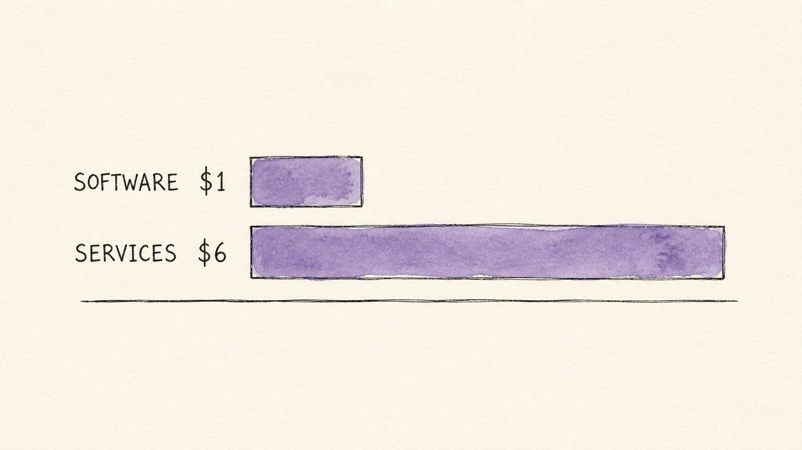

# Service as a Software

**Author:** rico ([@_heyrico](https://x.com/_heyrico))  
**Published:** May 3, 2026  
**Source:** [Service as a Software](https://x.com/Zephyr_hg/status/2050902054827360279)

Service as a Software is the biggest market shift since SaaS. Most service businesses will be on the wrong side of it.

Y Combinator just told its founders to build companies that replace services, not just assist them. The exact line in their latest Request for Startups: "AI-native companies that don't sell software, they sell the service. Instead of giving you a tool, they just do the work."

Insurance brokers. Tax accountants. Compliance officers. Healthcare admins. All called out by name in YC's Summer 2026 RFS.

This is not another AI hype cycle. It is a real economic thesis with serious capital behind it. It is also further from inevitable than the boldest founders on the timeline are claiming. Both things are true.

## What Service as a Software Actually Means

Sequoia frames the opportunity in one ratio. In "Services: The New Software", they argue that for every dollar a business spends on software, it spends roughly six on the people who deliver the service that software supports. That ratio has been the core constraint on SaaS valuations for two decades. SaaS captured the dollar. Operators captured the six.

Every dollar of software supports six dollars of services. Service as a Software goes after the full seven.

The new thesis is that AI is now good enough, in a narrow but expanding set of workflows, to be the operator itself.

So the model swaps the customer relationship. Instead of selling an accounting plugin to a bookkeeper, the company sells the finished tax return to the small business owner directly, generated by an agent the team built and tuned. The output approaches what a human accountant would have shipped. The price, in the verticals where it works, drops by close to an order of magnitude.

Garry Tan has called vertical agents the largest software opportunity of the next decade. His framing: 16 verticals each with single-digit AI penetration today, waiting for a domain expert to wrap intelligence around the workflow. Healthcare. Legal. Finance. Customer service. Logistics. Insurance. Compliance.

Sequoia takes the framing further. In this model, the total addressable market for "autopilots" is the entire labor spend in a category, not a slice of it. That is the upper bound of the bull case. The capturable share will be a fraction of it, and the path to it runs through distribution, domain expertise, regulatory clearance, and trust, not just model quality.

## Why This Is Happening Now

Three forces are converging.

**Models are good enough to be operators in a narrow set of workflows.** The leap from "AI helps a person do the job" to "AI does the job" has happened in repeatable, well-bounded tasks. Anthropic's own agent autonomy data shows the strongest current adoption sits in software engineering, with significant but more uneven traction in customer support and operations work. The frontier is moving outward quickly. It is not yet uniform across categories.

**The infrastructure to build vertical agents got dramatically cheaper.** Claude Code, Cursor, MCPs, vector stores, Vercel. Production-grade vertical agents that would have required a Series A in 2023 can now be prototyped by small teams. How long the move from prototype to live revenue takes still depends heavily on domain complexity, integration surface, and regulatory clearance. The infrastructure is cheap. The path to production is not always short.

**The buyer changed.** End customers increasingly do not want another tool to learn. They want the work done. Tools were the constraint of a world where AI was a feature. Outcomes are the demand of a world where AI is, at least sometimes, the operator.

All three are real. None of them are uniform across categories.

## The Three Layers of Any Service

Every service business has three layers. Two of them are getting absorbed into Service as a Software companies right now, with very different speed. One is not.

**Layer 1: Production work.** The repeatable execution. Filing the tax return. Drafting the contract. Generating the report. Posting the invoice. Sending the follow-up. This is hours-for-dollars work. It is being eaten first, fastest, and most visibly.

**Layer 2: Pattern application.** Translating a known problem into a working answer using a playbook the industry has refined for decades. Onboarding a new client. Handling a routine claim. Reconciling a month-end close. Service as a Software companies are coming for this layer next, but the pace is highly domain-specific. Verticals with clean ground truth (tax, payroll, certain compliance filings) move faster. Verticals with binding regulatory or trust constraints (healthcare diagnoses, legal advice, insurance underwriting) move slower, sometimes much slower.

**Layer 3: Strategic direction.** Picking the right problem to solve. Naming what the customer actually needs. Framing the engagement. Deciding what to refuse. This layer is not getting absorbed in any meaningful way yet. It is getting more valuable, because the cost of execution is collapsing toward the marginal cost of inference.

A business that sells Layers 1 and 2 by the hour is increasingly competing against agents that ship the same work for an order of magnitude less. A business that sells Layer 3 plus packaged Layer 1+2 outcomes is positioned to be the agent.

## How to Spot a Service Ripe for This Shift

Not every service moves at the same speed. Some are being eaten this year. Some will be eaten in 2028. Some categories may resist replacement for the foreseeable future, particularly where regulation, liability, or human-in-the-loop requirements are binding. Five diagnostic signals separate the categories:

1. The work is repeatable. Same shape, different inputs. Same checklist, different details.
2. The work is already outsourced. If a customer is paying a third party to do it, they have already accepted that someone else owns the execution.
3. There is a clear right answer or a tight band of acceptable answers. Tax returns either pass an audit or do not.
4. The customer measures success by the outcome, not the effort. Nobody cares how many hours their accountant worked.
5. Margins are high enough to attract a vertical agent company. A $500/hr service has enough margin for a software-priced alternative to look magical.

A service that hits four of these five with no severe regulatory blocker is being prototyped right now in a YC batch. Probably more than once.

## The Economic Math Behind the Shift

Three numbers tell the story.

**$1 to $6 (Sequoia's framing).** For every dollar a business spends on software, it spends roughly six on the people who deliver the service that software supports. SaaS captured the dollar. Operators captured the six. Service as a Software is the first model that lets a single company credibly target the full seven, in the categories where the workflow can be fully owned by an agent.

**16 verticals, single digits each (Garry Tan's framing).** Healthcare, legal, finance, insurance, compliance, logistics, customer service, and ten more. Each is a hundred-billion-dollar-plus market by labor spend. Each currently has under five percent AI penetration. The company that wins a vertical will not be the equivalent of a SaaS unicorn. It will be the equivalent of a meaningful share of the human service layer for that domain, repriced.

**An order-of-magnitude price reset, where it happens.** In the early Service as a Software wins, the price of the outcome has compressed from human-services pricing toward software pricing. A tax return that used to cost hundreds of dollars in accountant time becomes a fraction of that in agent run-time. The compression has been rapid in narrow, well-bounded workflows. It has not happened uniformly across services.

SaaS was a margin trade. Service as a Software is a market trade. The market trade is much larger if it works, and much further from settled than the loudest VCs on the timeline are pricing.

## The Bigger Frame

Service as a Software is not a trend. It is a thesis. It has serious capital, serious framing from YC and Sequoia, and serious early traction in narrow workflows. It also has serious counter-evidence from the same enterprise survey data that the loudest founders have been quietly underweighting: human oversight remains dominant in regulated services, hallucinations are still the top-cited risk in production deployments, and trust takes longer to build than valuations imply.

Few categories will remain entirely untouched. Far fewer will be cleanly and quickly replaced. The pace will be uneven, the winners will not be generic AI wrappers, and the businesses that survive will own distribution, domain expertise, workflow integration, risk controls, and trust, not just the model.

The services pool dwarfs the software pool by roughly six to one. That entire pool is being repriced right now, in slow motion, with very different timelines per vertical.

The two failure modes are equally expensive. Treat the shift as inevitable and you overpay for an early position. Treat it as overblown and you miss the only structural reset business software has had in twenty years.

Pick a side. Pick it with eyes open.
