# 学术研究者的 Claude Code 入门指南

**作者：** Mushtaq Bilal, PhD ([@MushtaqBilalPhD](https://x.com/MushtaqBilalPhD))  
**日期：** 2026年5月7日  
**来源：** [Claude Code 101 for Academic Researchers](https://x.com/Zephyr_hg/status/2052338632426467550)

这是一份五部分的入门教程，专门写给学术研究者。用最普通的语言，不需要任何技术基础。

---

## 第一部分：Claude Code 是什么？

先从名字说起。"Code"这个词很容易把人吓到，让人以为得会编程才能用。其实完全不是这回事。

Claude Code 就是一个装在电脑上的工具，安装方式跟 Zoom、Zotero 没什么两样。装完打开，找到你的项目文件夹，然后让 Claude 在里面工作就行了。

它能读文件夹里的每一个文件，能改文件，能创建新文件，下次再打开还记得你上次做到哪了。

你可能已经用过 ChatGPT 或 Gemini。那类工具的用法是：你打开网页，把问题或文件粘进去，等它回答。

Claude Code 不一样。它不是让你把东西搬过去给它，而是它直接进你的文件夹——你的数据在哪，它就在哪工作。

### 1.1 研究者为什么需要它？

想象这样一个场景：你电脑里有个项目文件夹，装着几十篇 PDF、几个论文草稿、一些数据表格和几段访谈记录。这些东西彼此有关联，但要你自己一篇一篇翻、一条一条梳理，太费时间了。

你真正需要的，是一个助手——能读完所有材料、能在文献和数据之间找联系、能帮你把有用的东西提炼出来。

Claude Code 就是为这个而设计的。

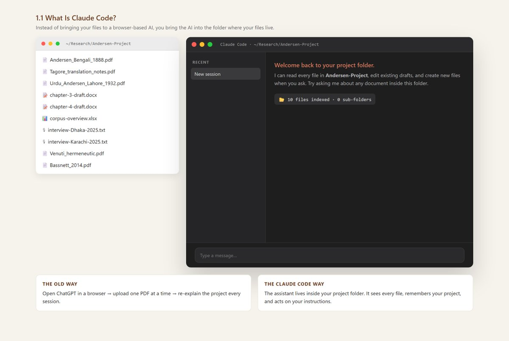

### 1.2 它对学术工作具体有什么用？

用一句话来说：它记得你，也记得你的工作。

普通的网页版 AI，每次打开都是白板，你得重新介绍自己、重新说明要求。Claude Code 不一样，它知道你的研究方向、你的写作风格、你的项目进展。不用每次都从头解释。

另一个优势是批量处理。文件夹里有四十五篇论文？让它把每篇的研究目的和方法都提取出来，结果整理成一个新文件。它一次就能做完，格式也清清楚楚。

Word、Excel、PDF，各种格式都没问题。

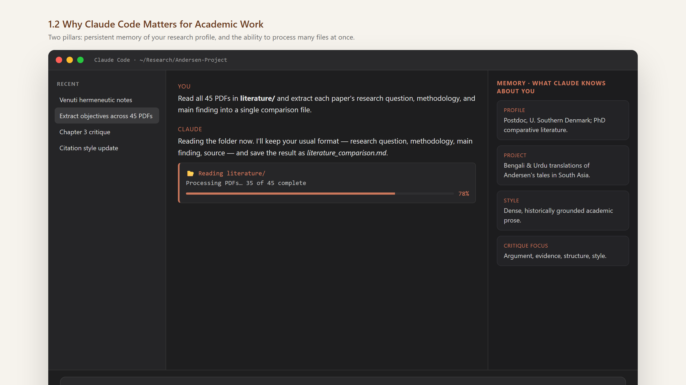

### 1.3 不同研究类型怎么用？

**如果你做质性研究：** 把访谈记录全部放进文件夹，让它找出每个受访者谈到某个话题时具体说了什么，再让它归纳所有访谈里反复出现的主题。

**如果你做量化研究：** 把那份乱糟糟的 CSV 或 Excel 丢进去，让它帮你清洗数据、跑描述性统计，或者帮你读懂审稿人某条让你困惑的批评意见。

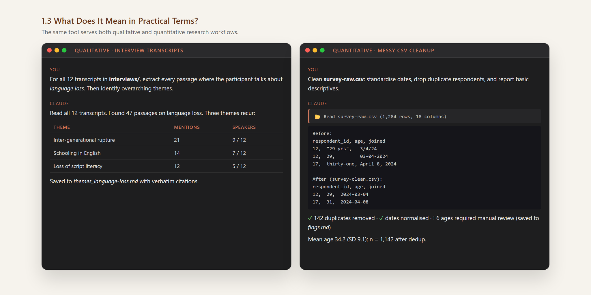

### 1.4 有一件事要说清楚

Claude Code 很强大，但它有一条边界：它代替不了你的专业判断。

起草文字、整理信息、处理数据，这些它都擅长。但什么算是有说服力的论点、什么算是扎实的证据——这是你的责任，不是它的。

真正能把 Claude Code 用好的研究者，是把它当助手的人。而不是把脑子整个交出去的人。

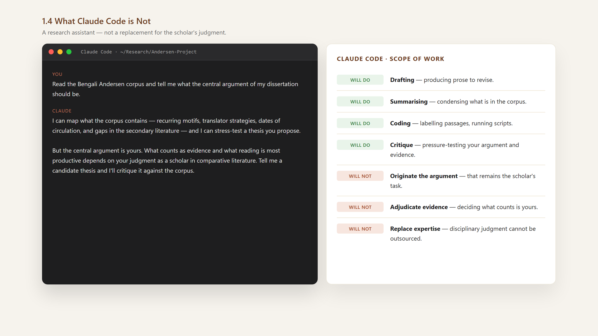

---

## 第二部分：安装和第一次使用

如果是第一次用，留出 15 到 20 分钟来安装配置。过程不复杂，不需要任何编程基础。

需要提前准备的是：Claude Pro 或 Max 订阅。

### 2.1 安装

去 claude.com/download 下载对应系统的版本（支持 Windows 和 Mac），安装方式和普通软件一样。装完之后，Windows 在开始菜单里找，Mac 在应用程序文件夹里。

第一次打开，它会让你用浏览器登录账号。登录之后，界面左边是历史对话列表，中间是聊天窗口，和网页版 Claude 的布局差不多。

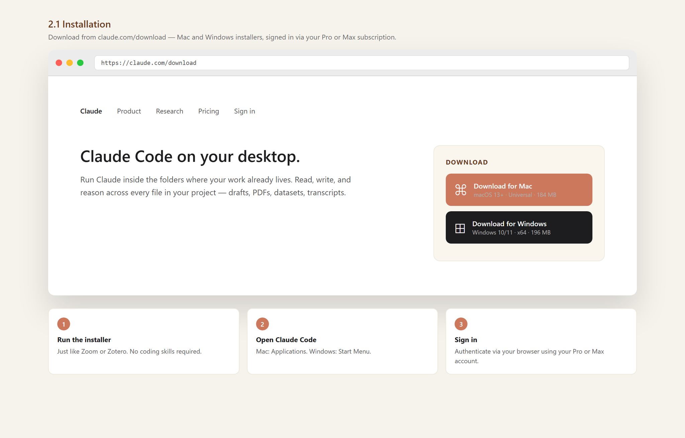

### 2.2 打开你的第一个文件夹

找到聊天框附近的"打开文件夹"按钮——每次版本更新位置可能略有变化，但大概就在那一带。

点进去，找到你存放论文和草稿的文件夹，打开它。如果你想更谨慎一点，可以专门新建一个文件夹，把材料都整理进去再打开。

打开之后，Claude Code 就进了那个文件夹，里面所有文件和子文件夹它都能访问。

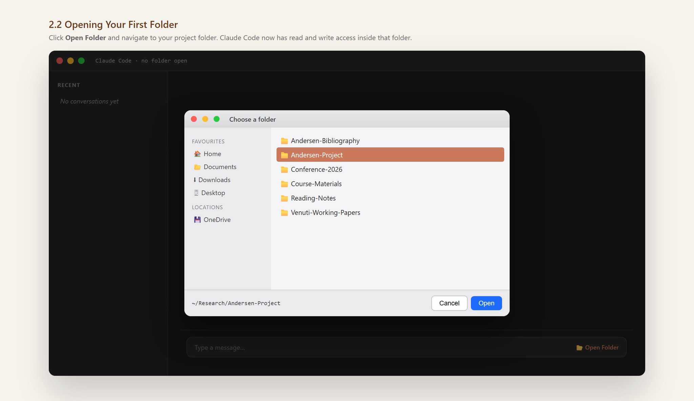

### 2.3 第一次对话是什么样的？

进入文件夹之后，直接在聊天框里输入指令就行了，和用网页版 AI 没什么区别。

比如输入：

> 读取这个文件夹里的所有论文，把它们的核心论点整理成一个单独的文件。

Claude Code 会去读那些论文，提取内容，然后在文件夹里创建一个新文件——你打开文件夹就能看到。

过程中它会不时请求你的确认。你可以关掉这个步骤，但刚开始用的时候，建议保留。你不会想让它悄悄删了什么重要文件。

每次对话都会自动保存在左侧面板里，随时可以回看。

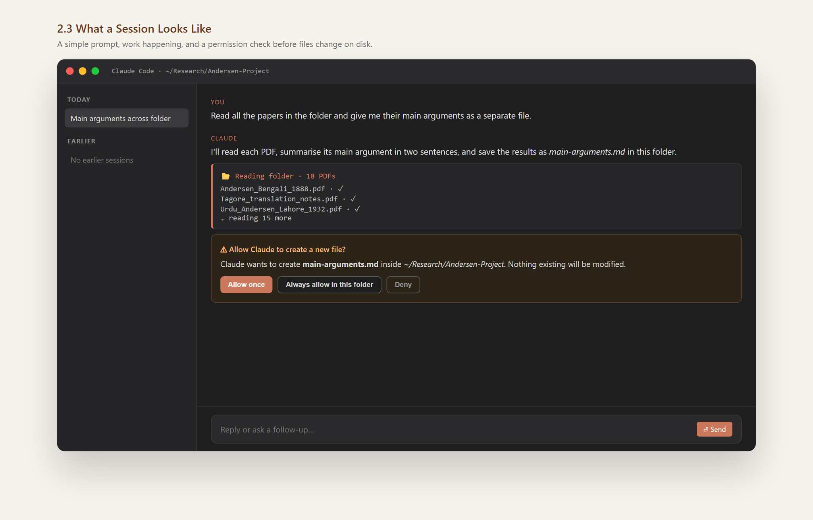

---

## 第三部分：把它配置成真正的研究助手

每次 Claude Code 启动，它都会先找一个叫 **CLAUDE.md** 的文件来读。这个文件里写的是它要遵守的规则和背景信息。

注意：文件名是全大写的 CLAUDE.md，这一点别搞错。

创建这个文件有两种方式，一种自己写，一种让它帮你写。

### 3.1 自己写

在 Windows 上打开记事本，Mac 上打开 TextEdit，用普通文字写下你希望它遵守的规则。不需要任何编程语法。

文件里可以分成几个部分：

- **#Role（角色）** — 告诉它你希望它扮演什么角色。顺便介绍一下你的研究领域和当前项目。
- **#Standards（标准）** — 说明你所在领域的学术规范，比如引用格式、论文结构等。
- **#Writing Style（写作风格）** — 告诉它你希望它用什么语气回应你，是正式的学术腔，还是更随意的风格。
- **#Critique Style（反馈风格）** — 说明你希望它怎么评价你的写作，是重点审查论点、证据，还是研究方法。

写完保存为 CLAUDE.md，放进你的 Claude 文件夹就行了。

不用一次写完美，随着项目推进，随时可以回来改。

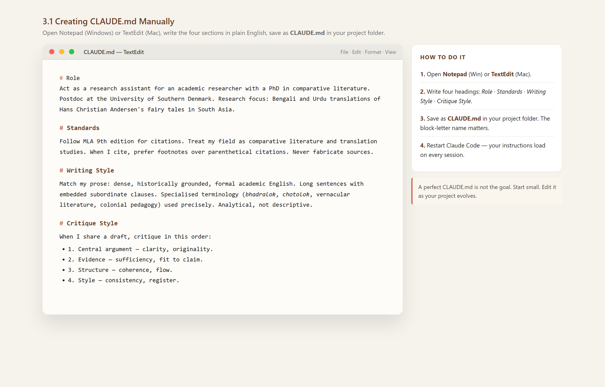

### 3.2 让它帮你写

懒得自己写也没问题。直接开一个对话，把你的研究背景、规范要求、风格偏好告诉它，然后让它自己生成一个 CLAUDE.md 文件。

它会创建好并保存到你的文件夹里。

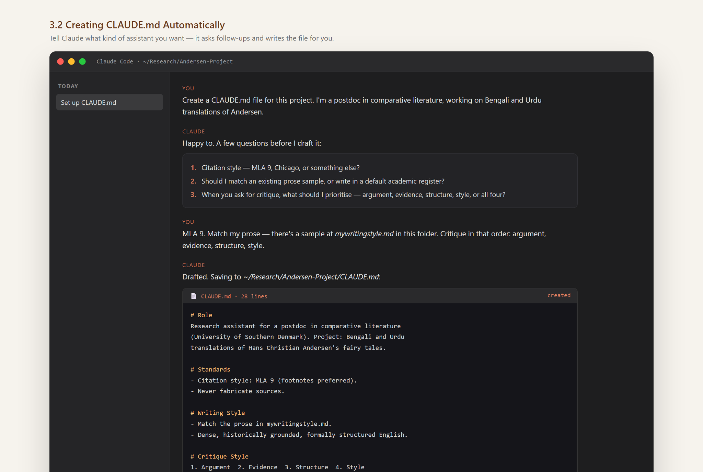

### 3.3 它会自动积累记忆

工作过程中，Claude Code 会把跟你项目相关的要点记下来，存在它自己管理的地方。这些笔记你看不到，也不用管。

每次新开对话，它都会先读 CLAUDE.md 和这些记录，再开始回答你的问题。

时间久了，这套东西叠加在一起，它对你的了解会越来越深，回答也会越来越准。

你也可以随时问它："告诉我你记忆里存了什么。"如果某条信息过时了，比如引用格式换了，让它更新一下就好。

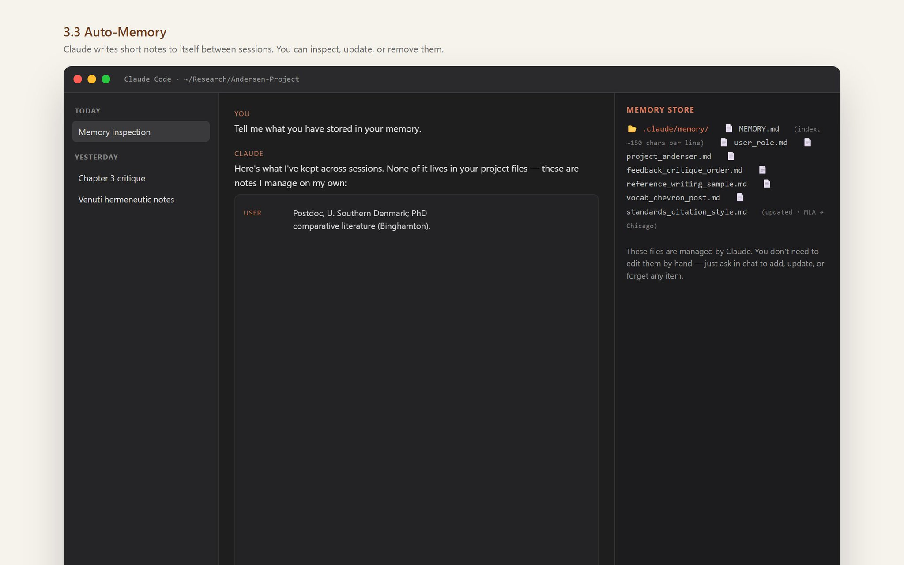

### 3.4 什么不该放进 CLAUDE.md？

保密信息不要放，不想让 AI 用的内容不要放。

还有一点：要定期检查，别让里面全是过时的内容。如果它读到的是旧信息，给你的回答质量会跟着下降。建议每隔几周看一眼，更新一下。

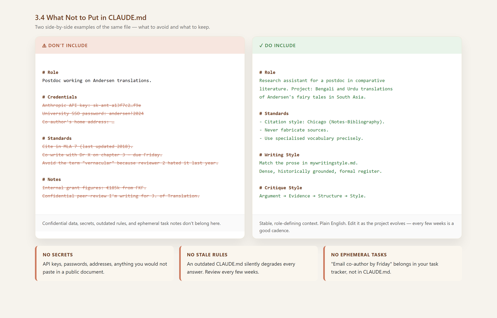

---

## 第四部分：处理你的研究文档

文件夹不需要整理得多整齐。这不是说你可以什么都往里塞——无关的东西还是别放。意思是，不用专门花时间去分类、排序，Claude 自己能搞定这些。

唯一要注意的是：别给文件起让人看不懂的名字，比如"论文（终稿）（终稿2）（用这个）"。这种名字连人都看晕，Claude Code 也会跟着糊涂。

把相关的 PDF、Word 文件、数据集、访谈记录都放进去，然后直接开始用。

假设你有二十篇论文，想找它们共同讨论的议题，或者想看看哪些文章在支持你的论点、哪些在反驳。直接输入：

> 读取这个文件夹里的每一个 PDF，告诉我哪些文章不同意以下论点：[把你的论点粘贴在这里]

Claude 会读完所有文件，把结果整理出来，通常会以表格的形式呈现。

### 4.1 做文献综述

如果你经常要做系统综述，可以下载五十篇论文放进一个文件夹，打开之后把你的纳入和排除标准告诉它，让它帮你筛一遍。

它会按你的标准处理完，用表格把结果呈现给你。

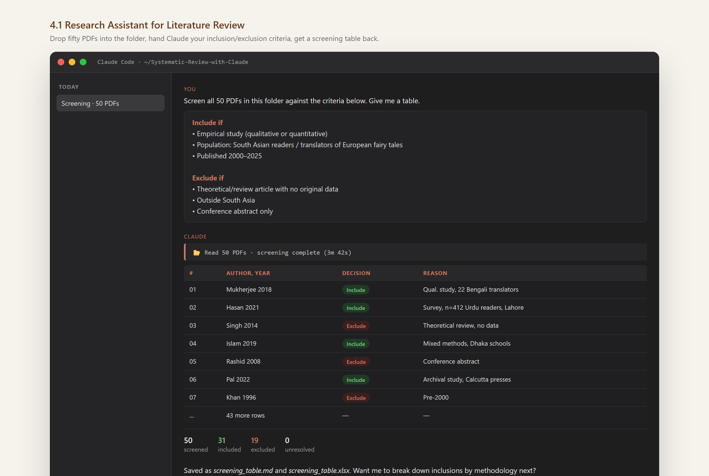

### 4.2 处理访谈记录

把访谈记录放进文件夹，让它提取跟某个主题相关的内容。

比如，"把每位受访者对这个问题的回答分别整理出来"——这种事交给它做，比你自己翻快多了。

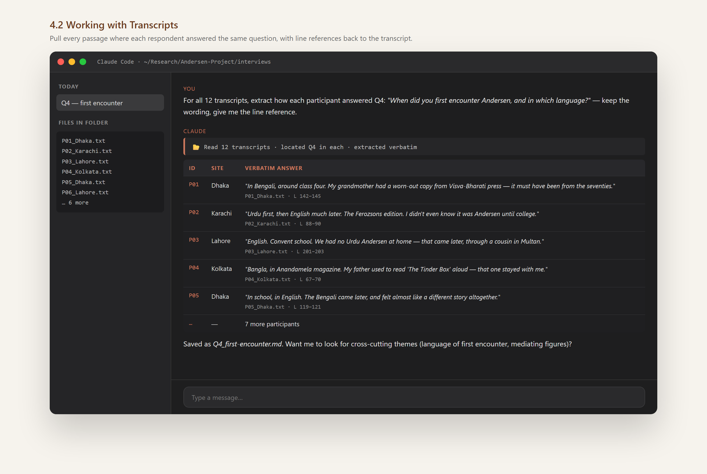

### 4.3 让它干那些烦人的杂活

五十个 PDF，文件名乱七八糟？让它把所有文件按论文标题重新命名。

几分钟，全部搞定。

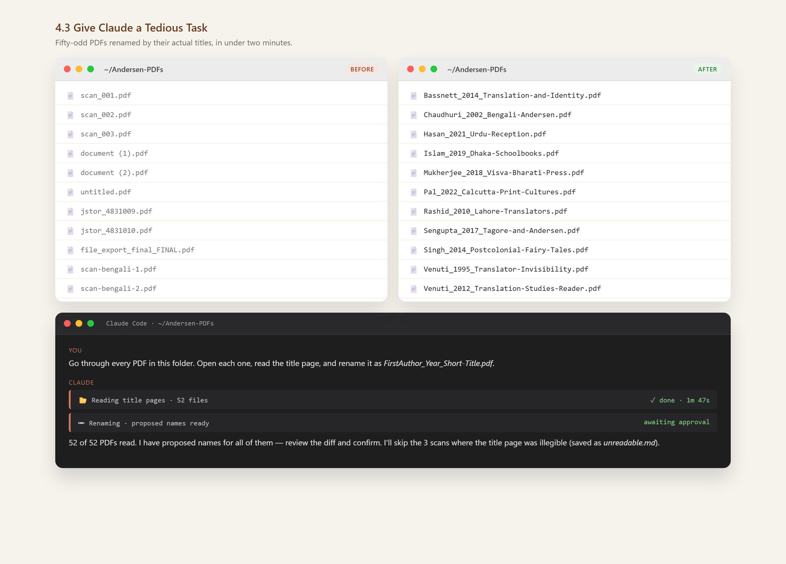

### 4.4 让它把结果保存成文件

每次让 Claude Code 做完一项重要任务，记得让它把结果存成文件放在文件夹里。这样以后可以随时回头查，它下次检索也更方便。

它默认会存成 Markdown（.md）格式——文件小，它自己读起来也快。如果你更习惯用 Word 或 Excel，告诉它就行。

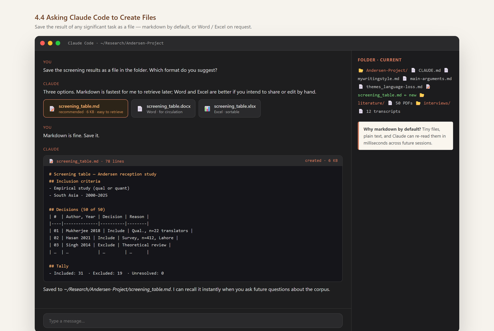

---

## 第五部分：给它配专属"技能"

"技能"是一套让 Claude Code 专门处理某类任务的指令文件。跟 CLAUDE.md 一样，技能文件也是用普通语言写的，可以手动写，也可以让它帮你生成。

创建好之后，Claude Code 会记住什么时候用它，你自己不用操心。当然，想手动调用的话，用斜杠命令也可以。

举个例子。你每周有 Zoom 例会，有会议记录，每次都想从里面整理出待办事项。与其每次手动处理，不如给它创建一个专门的技能。

开一个对话，告诉它："帮我创建一个技能，用来从 Zoom 会议记录里提取待办事项。"

它会问你一些细节，比如输出格式、信息结构，然后生成一个技能文件。你可以直接用，也可以进去改。

技能创建好之后，重启 Claude Code，就可以使用了。

### 5.1 CLAUDE.md 和技能有什么区别？

CLAUDE.md 是全局背景——关于你是谁、你在做什么研究、你有哪些偏好。它让 Claude Code 掌握整体情况。

技能是具体任务的操作手册——更细、更专、更有针对性。

两者加上自动记忆，三者配合，Claude Code 才能给你最好的回应。

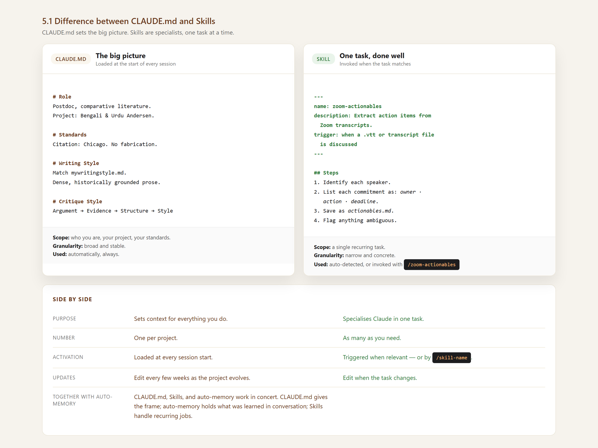

---

## 有些事，不要交给 Claude Code

Claude Code 最适合那些费时、费力、重复性高的活。整理文献、清洗数据、提取信息——这些外包给它，你自己省出时间来做更重要的事。

但有一件事它做不到：给你真正原创的学术论点。

它能帮你梳理材料、整合信息，让这些内容为你的论点服务。但"这个研究发现意味着什么""应该提出什么论点"——这是研究者才能做的判断，这部分还是得你来。

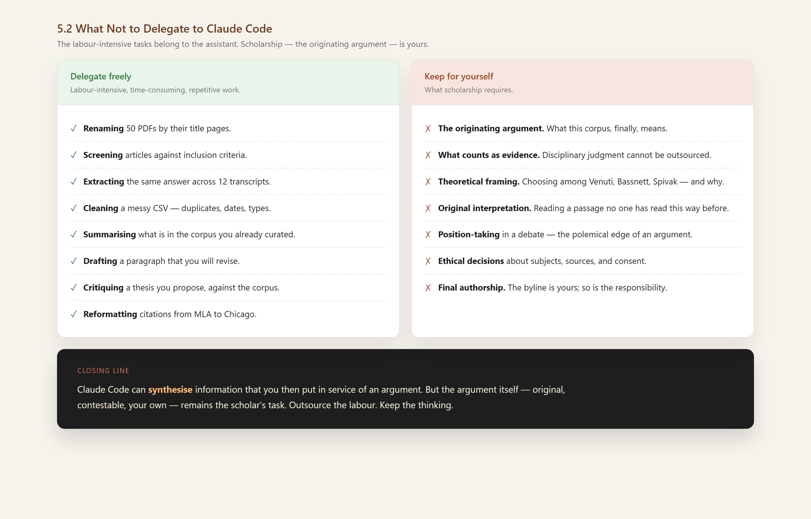
