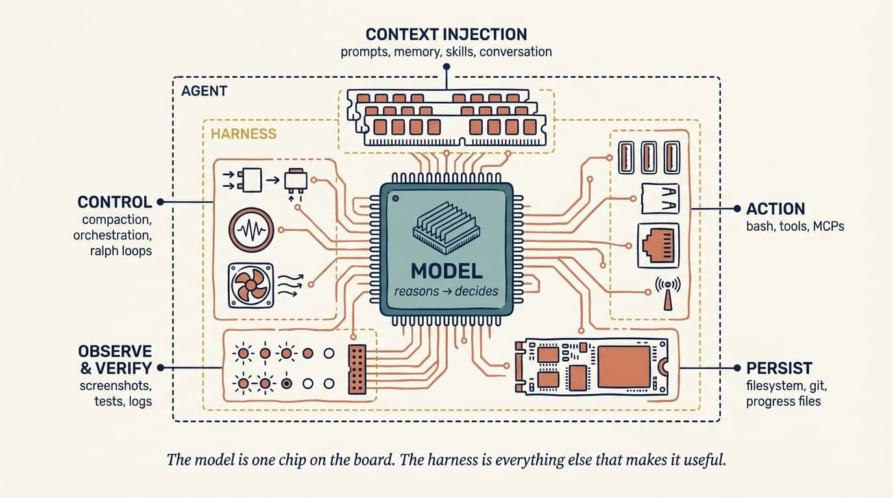
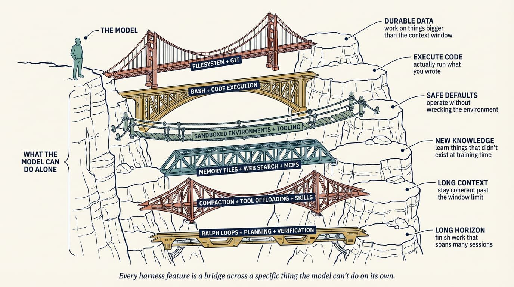
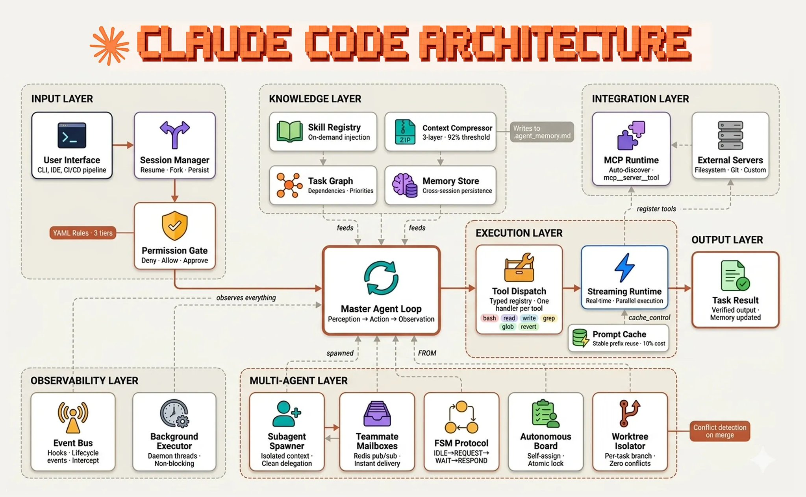

# 比选模型更重要的事：Harness 工程

**作者：** Addy Osmani ([@addyosmani](https://x.com/addyosmani))  
**日期：** 2026年5月10日  
**来源：** [Agent Harness Engineering](https://x.com/Zephyr_hg/status/2053231239721885918)

过去两年，大家争来争去的都是模型：哪个最聪明，哪个写代码最流畅，哪个最少一本正经地胡说。

这些讨论不是没价值，但它们只盯着了系统的一半。

另一半，几乎没人认真聊。

---

一个 agent 出了问题，最常见的反应是什么？

"这个模型太蠢了。等下一个版本吧。"

然后把问题搁在一边，继续。

这个反应非常正常，也几乎总是错的。

模型只是 agent 的一个输入，甚至不是最重要的那个。把它跑起来的那套东西——提示词、工具、上下文策略、钩子、沙箱、子 agent、反馈循环——才是决定你最终看到什么行为的地方。这套东西，有个名字，叫 harness。

@Vtrivedy10 的定义最干净：

> **Agent = 模型 + Harness。如果你不是模型，你就是 harness。**

一个普通模型加上出色的 harness，大概率打得过一个出色模型加上糟糕的 harness。越来越多的工程师开始意识到，最值得花精力的地方，不是选模型，而是设计模型外面那套东西。

这件事，现在有了一个专属的名字：harness 工程。

---

## Harness 到底包括什么？

裸模型不是 agent。它需要有人给它提供状态、工具调用能力、反馈循环，还有一套可以被强制执行的约束——这些加在一起，它才真正能干活。

具体来说，harness 包括：

- 系统提示词、CLAUDE.md、AGENTS.md、技能文件和子 agent 指令
- 工具、技能、MCP 服务器及其技术描述
- 捆绑的基础设施：文件系统、沙箱、无头浏览器
- 编排逻辑：生成子 agent、处理交接、路由模型
- 钩子和中间件：lint 检查、上下文压缩这类确定性执行
- 可观测性工具：日志、链路追踪、成本和延迟监控

Agent 的本质，是一个在循环里持续调用工具来达成目标的系统。真正的技术含量，在于设计那些工具，和那个循环。

这是一个很大的设计面，但它是你的设计面，不是模型供应商的。Claude Code、Cursor、Codex、Aider、Cline——这些都是 harness。底层跑的可能是同一个模型，但你感受到的体验差异，主要来自 harness。

---

## 出了问题，先别怪模型

Agent 做了什么奇怪的事，工程师的第一反应往往是怪模型。HumanLayer 管这叫"技能问题"——但他们紧接着就说，这不是模型的技能问题，是配置的技能问题。

失败通常是可以读懂的。

Agent 忽略了某个约定？把它写进 AGENTS.md。它运行了一个危险命令？写个钩子拦下来。它在一个四十步的任务里绕晕了？把架构拆成规划器加执行器两部分。它总是交出有 bug 的代码？把类型检查的错误信号接回循环。

这不是绕过模型，而是补上它在特定场景下的盲区。

看看性能基准就明白了。同一个顶级模型，跑在现成框架里，和跑在专门调过的 harness 里，分数可以差很多。换一个有更好工具、更精准提示词、更清晰反馈信号的环境，能把原来被浪费掉的能力全都翻出来。

今天的模型理论上能做的，和你实际看到它们在做的，之间那道缝，大部分是 harness 的缝。

---

## 棘轮：每一次失败都变成一条规则

Harness 工程里最重要的习惯，是把 agent 的错误当成永久信号来处理，不是偶发的倒霉，重试一下就算了。

想象一个具体场景：agent 提了一个 PR，里面有注释掉的测试，然后被意外合并了进去。

这个时候，正确的反应不是"下次注意"，而是：
- AGENTS.md 下一版加一条："绝对不要注释测试，要么删掉，要么修好。"
- 预提交钩子更新，自动标记 diff 里的 `.skip(`。
- 审查子 agent 更新，遇到注释掉的测试就阻断。

这就是棘轮机制的意思：只进不退。约束只在你真的观察到失败之后才加进去，只有当模型能力提升到不再需要它的时候才删掉。一个好的系统提示词里，每一行都应该能追溯到某个真实发生过的历史错误。

也因为这样，harness 工程没有标准答案。一个代码库的正确 harness，完全由它自己的失败历史塑造。

---

## 从结果往回推

设计 harness 的最好方式，是先想清楚你要什么行为，再造能实现那个行为的组件。

> 想要的行为 → 实现它的 harness 设计。

Harness 里的每个部分都要有明确的职责。如果你说不清楚一个组件是为了什么存在的，那就把它去掉。

**文件系统和 Git：持久状态**

模型只能处理放进上下文窗口里的东西。文件系统给了它一个工作区：可以读数据，可以把中间结果存下来，可以让多个 agent 协作。加上 Git，就等于免费得到了版本控制——追踪进度、开实验分支、出错回滚，都有了。

**Bash 和代码执行：通用工具**

大多数 agent 跑的是 ReAct 循环：推理，调工具，观察结果，再来一遍。与其预先为每一种操作都写一个专用工具，不如直接给 agent bash 权限，让它按需自己造。

**沙箱：安全运行的前提**

Bash 有用的前提是跑得安全。沙箱给 agent 一个隔离的环境，让它跑代码、检查文件、验证结果，同时不会伤到宿主机。好的沙箱自带强默认值：预装语言运行时、测试 CLI、无头浏览器，让 agent 能观察自己的工作，自我验证形成闭环。

**记忆和搜索：持续学习**

模型的知识边界是训练数据和当前上下文。Harness 用记忆文件（比如 AGENTS.md）来填这个缺口，每次会话都把知识注进去。对于实时信息——新的库版本、线上数据——网络搜索和 MCP 工具直接内建到 harness 里。

**对抗上下文退化**

上下文窗口越填越满，模型的推理质量就开始下滑。这不是玄学，是实际发生的事。Harness 用三种主要手段来对付这个问题：

- **压缩：** 智能把旧上下文总结后移走，不让它撑爆 API 上限。
- **工具输出卸载：** 把大型工具输出（比如两千行的日志）存进文件系统，上下文里只保留关键的头尾。
- **渐进式展开：** 指令和工具按需加载，任务需要什么才给什么，不是启动时全塞进去。

**长时程执行**

自主长时间运行的任务有两个老问题：提前放弃，以及问题分解做得一塌糊涂。Harness 从结构上对抗这两件事：

- **循环：** 拦截模型想退出的动作，强制它在新鲜的上下文窗口里继续推进，直到真正完成。
- **规划：** 强制模型先把目标拆成逐步的计划文件，每步执行后通过钩子自我验证。
- **分离：** 把生成和评估交给不同的 agent——模型给自己打分总会偏高，分开就能避免这个问题。

**钩子：强制执行层**

钩子填上了"请求一个动作"和"真正执行"之间的缝隙。它们在特定时机触发：工具调用前、文件编辑后、提交前。钩子能拦危险命令，强制格式化来省 token，还能跑测试套件。

理想状态很简单：成功悄无声息，失败吵得让人注意。类型检查过了，agent 什么都听不到；检查失败了，错误直接注回循环，让它自己修。

**规则手册与工具选择**

仓库根目录的一个 markdown 文件，仍然是影响力最大的配置点。但要像飞行员检查清单一样对待它，不是风格指南。保持简短，每条规则都要用真实的失败换来。

工具也一样。十个高度聚焦的工具，永远胜过五十个互相重叠的工具。

还有一点值得注意：工具描述会进入提示词。如果接入了来历不明的外部 MCP 服务器，对方可以在 agent 还没开始干活之前，就往提示词里注入坏内容。

---

## 在生产环境里是什么样子

目前最清晰的成熟 harness 公开案例，是对 Claude Code 架构的一份拆解估算：

前面聊的几乎每个概念，都在这张图里以具体组件的形式出现。上下文注入是知识层，循环状态住在记忆存储和工作树隔离器里，破坏性操作的钩子挡在权限门后面，子 agent 上下文防火墙是整个多 agent 层，工具分发注册表是 MCP 服务器和 bash 的接入点。

Claude Code 的进化路径，至少一半是在做 harness，不只是在换底层模型。

---

## Harness 不会消失，只会迁移

模型越来越好，harness 会不会就没用了？

不会。需求不消失，只是转移。

最近的模型升级，确实减少了"上下文焦虑"相关缓解措施的需要。但同时，它打开了以前根本做不到的任务类型，带来了全新的失败模式。底线在升高，上限也在升高。

Harness 里的每个组件，编码的是"模型现在还做不到的事情"这个假设。模型进步了，过时的组件就该拆掉，新的组件要跟着造出来，去够下一个地平线。

---

## 训练循环呢？

Harness 设计和模型训练之间，有一个实实在在的反馈循环。

今天的模型很多是带着特定 harness 做后训练的，这形成了一定程度的过拟合。模型会在 harness 设计者重点关注的那些操作上变得特别厉害，比如文件系统操作、bash、子 agent 调度。

这让 harness 变成了一个活的系统，不是一个静态配置文件，也说明了一件事："最好的 harness"，是专门为你自己的任务和工作流调出来的那一个。

---

## Harness 即服务（HaaS）

行业正在发生一个转变：从"构建在 LLM API 上"（你拿到的是文本补全），到"构建在 Harness API 上"（你拿到的是完整运行时）。SDK 现在开箱就带了循环、工具、上下文管理、钩子和沙箱。

现代的默认做法，不再是从零开始写编排，而是选一个 harness 框架，配好核心支柱，然后把精力全放在特定领域的提示词和工具设计上。

这就是为什么排查问题能规模化：你在调优一个分解良好的配置界面，而不是每次都重新发明整套 agent 架构。

---

## 接下来往哪走

如果你现在把顶尖的编码 agent 摆在一起看，你会发现它们彼此之间的相似度，比它们底层的模型更高。模型各不相同，但 harness 的模式正在趋同。行业正在快速找到那些真正承重的东西——把生成式文本变成可交付软件所必需的那套结构。

最令人兴奋的开放问题，都在单 agent 之外：并行编排多个 agent；让 agent 能分析自己的执行轨迹，找到 harness 层面的问题并自己修掉；构建能按需动态组装工具的环境。

最终，harness 会停止作为静态配置文件存在，开始更像编译器一样运作。

到那个阶段，harness 工程就不只是配置艺术了。
