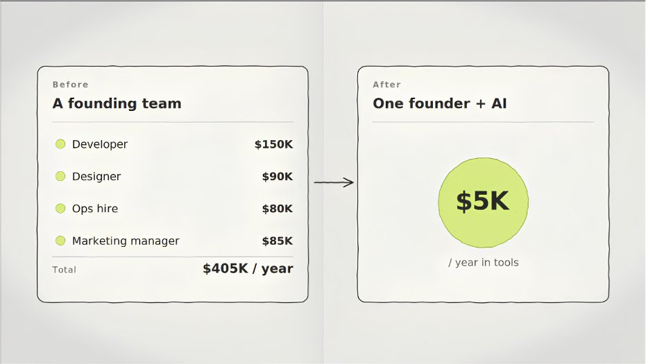
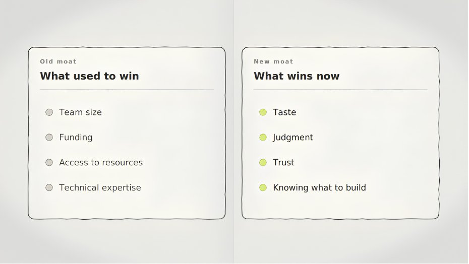

# Why Doomsday Posts About AI Are Missing The Point

**Author:** MATT GRAY ([@matt_gray_](https://x.com/matt_gray_))  
**Published:** May 11, 2026  
**Source:** [Why Doomsday Posts About AI Are Missing The Point](https://x.com/Zephyr_hg/status/2053671482216063475)

Recently a developer named Matt Shumer published an essay called "Something Big Is Happening."

He'd spent six years building an AI startup, but he didn't write the article for his peers in tech.

He wrote it for his friends, family, and everyone just starting to notice the whole Ai revolution.

He wrote it because he said the gap between what he'd been telling them and what was actually happening had gotten too wide.

It reached 80 million readers.

Shumer described his Monday morning: telling AI what he wanted to build in plain English, then walking away from his computer for four hours.

When he came back, and everything was done.

Not a rough draft. The finished thing.

Built, tested, iterated, approved. All created by the AI itself, without him.

His words: "I am no longer needed for the actual technical work of my job."

But his article wasn't a doomsday post.

He's one of the most plugged-in people in the space.

And his honest read is that we are no longer in the "this seems overblown" phase.

The water has been rising and it's now at our chests.

I've been thinking about what that means for the founders I work with.

And my honest answer is: this should excite you.

Not because AI is replacing everything, but because of what it's replacing it with.

For the last 20 years, scaling a business required a specific set of inputs.

A technical co-founder and a design team.

An ops hire to run things. A marketing department.

Certainly access to capital to pay for all of it.

The barrier was resources, not ideas.

That barrier has now collapsed.

The thing that used to take a whole team and millions of dollars can now be built by one person with a laptop and a clear head.

A kid in a garage can replicate your business in one day.

And that should excite you.

Because you too are the kid in the garage.

The doomsday posts you've been seeing aren't really about AI.

They're grief.

The people writing them built their businesses around a specific moat.

That moat was access to talent, capital, people, and technical infrastructure that most people couldn't afford.

AI democratized it all.

And the people who had the old moat are watching it dissolve.

Masters of the old game always mistake the new one for a threat.

So what's the new moat?

The new moat is your judgement. Your taste.

Your ability to look at something and differentiate between mediocre, good, and exceptional.

AI can build almost anything now.

What it cannot do is replicate your taste. Or your audience's trust in who you are as a person.

The leverage now belongs to whoever knows what to build, who to build it for, and who moves fastest.

And it belongs to those who earn trust and own their distribution.

That is the founder's unfair advantage right now. It has never been bigger.

I'm blown away whenever I talk to founders who are smart, capable, and already successful by almost any measure…

But their personal brand is still an afterthought.

Still something they'll "get to."

Because distribution is the only thing AI cannot replicate.

It cannot manufacture the trust that comes from 50,000 people who have followed your thinking for two years.

It cannot clone the audience that already knows your name and takes your calls.

The founders building that distribution right now are using AI to do it faster and at a fraction of the old cost.

They are compounding an advantage that will be nearly impossible to close in 18 months.

The gap between founders who build their content machine now and those who wait is going to be one of the starkest wealth gaps in the next decade of business.

I don't want that to happen to you.

Which is why on May 19th, I'm running a live workshop called How to Build a Cash-Flowing Social Media Machine.

I'm going to show exactly how we use AI to build personal brand infrastructure at Founder OS and build a moat round my business.

I'll show you how we're automating and leveraging the content systems, distribution, and revenue – all at a fraction of the time and cost it used to take.

This is the actual system I use to run multiple 8-figure brands.

If you're a founder doing $30K+/month and you've been watching this AI shift happen without a clear plan for how to use it – this is the workshop for you.

Register here: founderos.com/workshop

Spots are limited. Workshop is May 19th.

See you there.

Matt
