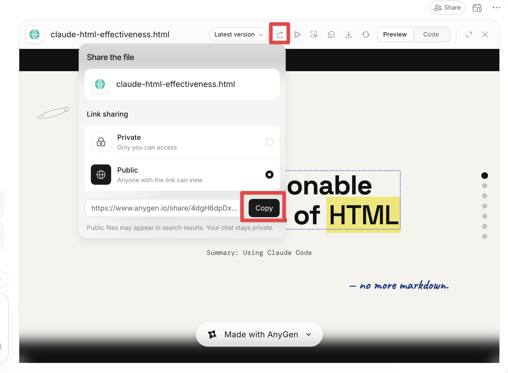
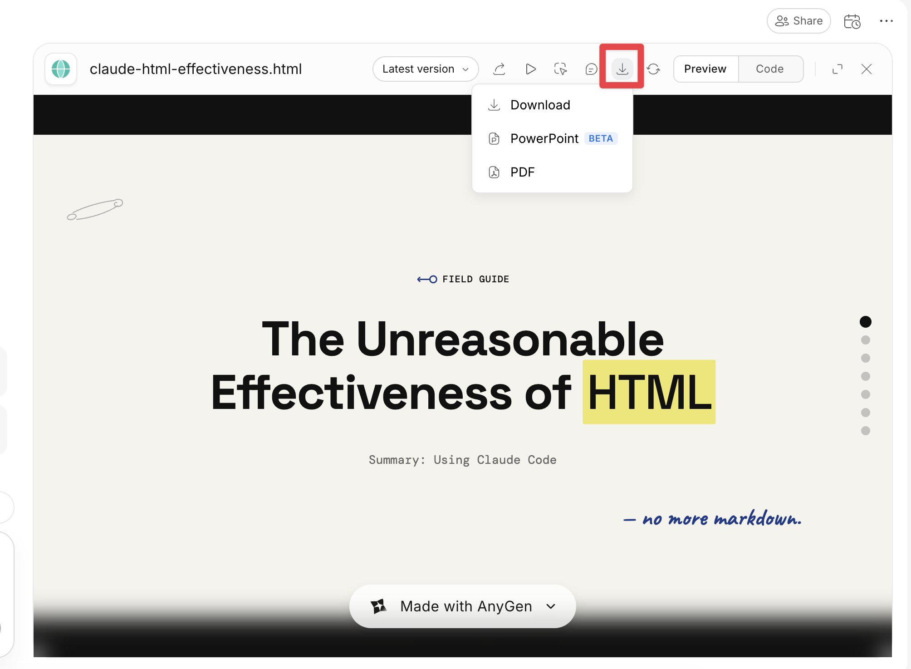

# 如何制作令人惊叹的 HTML 幻灯片（完全初学者指南）

**作者：** Zara Zhang ([@zarazhangrui](https://x.com/zarazhangrui))  
**日期：** 2026年5月12日  
**来源：** [How to make stunning HTML slides (for complete beginners)](https://x.com/Zephyr_hg/status/2053953371762286954)

不要做 PowerPoint。做 HTML 幻灯片。

如果你想找一个更 AI 原生的工作方式，又不知道从哪里开始，那能做的最简单、回报最高的一件事，可能就是用 HTML 幻灯片替代所有 PPT。

HTML 幻灯片现在很火，原因很实在：

- AI 天生擅长生成漂亮的 HTML，尤其是把文字和图片排成网格式布局——因为训练数据里有大量的网站内容
- 人是视觉动物，喜欢美的东西。幻灯片最重要的任务，是先把人的注意力抓住
- 做起来极快。半小时后就要演示？你根本没时间在 PowerPoint 里反复折腾。把内容扔给 AI，几分钟就能出一个漂亮的排版
- 用户反馈，观众的反应非常热烈——他们通常从没见过这种形式，也很欣赏演讲者对 AI 的熟练运用

下面是一份给完全初学者的实操指南，不预设任何编码、使用 agent 或了解 GitHub 的基础：

1. 前往 AnyGen（可以免费开始，有免费积分）
2. 选择"Build slides" -> "Frontend"，然后选你喜欢的模板
3. 在提示框里输入你想做什么
4. 迭代和编辑。AnyGen 里所有 HTML 演示都可以直接编辑——点击任何文字就能改，或者点"Boss mode"做批量定向编辑：对元素加注释，告诉 AI 要改什么

如果你想插入自己的图片，直接发给 AI，告诉它放在哪里就好。

5. 所有 HTML 演示都可以以链接形式分享，直接发给别人，不需要学怎么部署网站
6. 所有 HTML 演示都可以导出为 PDF 或 PPT 文件

你的下一份演示文稿，不需要是 PowerPoint。HTML 是未来，而开始做 HTML 最简单的方式，就是从幻灯片入手。
