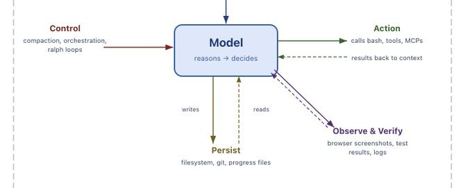
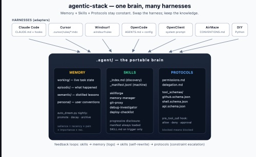

# 2026 年每个 AI 构建者都必须使用的 Agent 技术栈（构建者指南）

**作者：** Avid ([@Av1dlive](https://x.com/Av1dlive))  
**日期：** 2026年4月16日  
**来源：** [AI Agent Stack Everyone Must Use in 2026 (Builder's Guide)](https://x.com/Zephyr_hg/status/2044453102703841645)

有件事没人告诉 AI 开发者。

你不需要构建自己的模型。你需要的，是围绕模型的基础设施：跨 session 持续存在的记忆，规定任务如何完成的技能文件，还有约束 agent 能做什么、不能做什么的协议。

> TLDR：如果不想读，把这个链接给你的 agent，让它回答你的问题 → github.com/codejunkie99/agentic-stack

Garry Tan 在 4 月 13 日发了一条帖，把问题说得很准：

> **Garry Tan (@garrytan)**
>
> 如果你的 harness 死了，你的记忆也跟着死了，说明你把 harness 做得太厚了。
>
> 记忆是 markdown。技能是 markdown。大脑是一个 git 仓库。Harness 是一个薄薄的指挥器——它读取文件，它不拥有它们。



我花了过去三个月，构建的正是这个东西。

四层记忆。内容充实、带有自我改写钩子的技能文件。协议强制执行。一个每晚运行的"梦境循环"（dream loop），把 agent 当天的经验压缩整合。

这篇文章大概 4000 字，讲我怎么把它搭起来的，以及每个部分为什么要这样设计。

如果只想安装：github.com/codejunkie99/agentic-stack

适用于 Claude Code、Cursor、OpenClaw，或任何能读取 markdown 的 agent。

如果想理解每一部分是什么、为什么这样设计，继续读。



## 完整技术栈的形状

先看文件夹结构。我会逐一解释每个部分，但我希望你先看到整体——因为这个形状，比任何单独的部分都重要。

```bash
.agent/
├── AGENTS.md                          # root config, harness reads this first
├── harness/
│   ├── conductor.py                   # thin loop (~200 LOC)
│   ├── context_budget.py              # manages token allocation across modules
│   └── hooks/                         # lifecycle event handlers
│       ├── pre_tool_call.py           # permission enforcement
│       ├── post_execution.py          # auto-logging to memory
│       └── on_failure.py             # escalation + reflection trigger
├── memory/
│   ├── working/                       # live task state, volatile
│   │   ├── WORKSPACE.md
│   │   └── ACTIVE_PLAN.md
│   ├── episodic/                      # what happened in prior runs
│   │   ├── AGENT_LEARNINGS.jsonl
│   │   └── snapshots/
│   ├── semantic/                      # abstractions that outlive episodes
│   │   ├── LESSONS.md
│   │   ├── DECISIONS.md
│   │   └── DOMAIN_KNOWLEDGE.md
│   ├── personal/                      # user-specific preferences
│   │   └── PREFERENCES.md
│   └── auto_dream.py                  # nightly compression + consolidation
├── skills/
│   ├── _index.md                      # discovery registry, summaries only
│   ├── _manifest.jsonl                # machine-readable skill metadata
│   ├── skillforge/
│   │   └── SKILL.md
│   ├── memory-manager/
│   │   └── SKILL.md
│   ├── git-proxy/
│   │   ├── SKILL.md
│   │   └── KNOWLEDGE.md
│   ├── api-scaffold/
│   │   ├── SKILL.md
│   │   └── scripts/scaffold.sh
│   └── ...
├── protocols/
│   ├── tool_schemas/                  # typed interfaces for every tool
│   │   ├── github.schema.json
│   │   ├── shell.schema.json
│   │   └── api.schema.json
│   ├── permissions.md                 # what the agent can and cannot do
│   └── delegation.md                  # rules for handing off to sub-agents
└── tools/
    ├── memory_reflect.py
    ├── skill_loader.py                # progressive disclosure engine
    └── budget_tracker.py
```

这个结构来自 Gstack 和 Claude Code 自身记忆钩子的模式。不是我从零设计的，而是通过尝试其他不起作用的布局，一点点收敛过来的。

最关键的洞察——也是 Garry 那条帖子让我豁然开朗的地方——就是分离。

Harness 不思考。它读取文件、调用工具、写日志、运行钩子。所有智能都在技能文件和记忆文件里。协议强制执行边界。

这意味着：
- 明天把 harness 换成另一个，什么都不会丢
- 换模型，什么都不会丢
- 唯一积累价值的东西是技能、记忆和协议
- 这些都是 git 仓库里普通的 markdown 和 JSON 文件

## 没有人展示给你看的文件（以及生成它们的提示词）

每个指南都会给你看文件夹结构。没人给你看那四个决定系统成败的文件里面实际有什么。

以下是它们。

### AGENTS.md

这是 harness 读取的第一个文件，是 agent 大脑的目录。没有它，agent 不知道任何东西在哪里。

```markdown
# Agent Infrastructure

## Memory
- `memory/working/WORKSPACE.md` — current task state (read first)
- `memory/semantic/LESSONS.md` — distilled patterns (read before decisions)
- `memory/semantic/DECISIONS.md` — past major choices and rationale
- `memory/personal/PREFERENCES.md` — your conventions and style
- `memory/episodic/AGENT_LEARNINGS.jsonl` — raw experience log

## Skills
- `skills/_index.md` — read this for skill discovery
- Only load full SKILL.md files when triggers match
- Every skill has a self-rewrite hook. Use it after failures.

## Protocols
- `protocols/permissions.md` — read before any tool call
- `protocols/tool_schemas/` — typed interfaces for external tools

## Rules
1. Check memory before making decisions you have been corrected on before
2. Log every significant action to episodic memory
3. Update WORKSPACE.md as you work
4. Follow permissions strictly. Blocked means blocked.
5. When a self-rewrite hook fires, propose conservative edits only
```

**生成你自己的提示词：**

> 读取 .agent/ 处的文件夹结构，写一个 AGENTS.md 作为根配置文件。告诉 agent 记忆、技能和协议在哪里，先读什么，以及始终要遵循哪些规则。控制在 30 行以内。它是一张地图，不是百科全书。

### DECISIONS.md

这是让你三个月后不需要重新争同一个架构问题的文件。没有它，agent（和你）会无休止地重新审视已经解决的事。

```markdown
# Major Decisions

## 2026-04-13: Session store for auth tokens
**Decision:** Use Redis, not in-memory store
**Rationale:** Concurrent refresh requests cause race conditions with in-memory. Redis handles atomic operations natively.
**Alternatives considered:** PostgreSQL (too slow for token lookups), cookie-based (security concerns with PKCE)
**Status:** Active

## 2026-04-11: API framework
**Decision:** FastAPI over Express
**Rationale:** Typed request validation out of the box. Async support without callback hell. Team already knows Python.
**Alternatives considered:** Express (more ecosystem, but weaker typing), Hono (too early)
**Status:** Active

## 2026-04-08: Test strategy
**Decision:** Integration tests with mock fallbacks, no e2e for MVP
**Rationale:** E2e tests against live APIs are flaky and slow. Mock fallbacks let us run the full suite in CI under 2 minutes.
**Alternatives considered:** Full e2e with retries (too flaky), unit only (misses integration bugs)
**Status:** Active, revisit after launch
```

**生成你自己的提示词：**

> 读取 memory/semantic/LESSONS.md 和 memory/episodic/AGENT_LEARNINGS.jsonl。识别最重要的 3-5 个架构或工作流决策。对每一个，在 DECISIONS.md 里写一条，包含：决策、理由、考虑过的替代方案，以及它是否仍然有效。只包含重新讨论代价高昂的决策。

### on_failure.py

这个钩子让失败成为学习的契机，而不只是一条错误记录。没有它，失败只是带着通用痛苦评分被记下来，没有任何反思。

```python
# harness/hooks/on_failure.py
import json, datetime

EPISODIC_PATH = ".agent/memory/episodic/AGENT_LEARNINGS.jsonl"
FAILURE_THRESHOLD = 3  # trigger skill rewrite after this many

def on_failure(skill_name, action, error, context=""):
    """called when any action fails"""
    entry = {
        "timestamp": datetime.datetime.now().isoformat(),
        "skill": skill_name,
        "action": action,
        "result": "failure",
        "detail": str(error)[:500],
        "pain_score": 8,
        "importance": 7,
        "reflection": f"FAILURE in {skill_name}: {type(error).__name__}: {str(error)[:200]}",
        "context": context[:300]
    }

    with open(EPISODIC_PATH, "a") as f:
        f.write(json.dumps(entry) + "\n")

    # check if this skill keeps failing
    recent_failures = count_recent_failures(skill_name)
    if recent_failures >= FAILURE_THRESHOLD:
        entry["reflection"] += (
            f" | THIS SKILL HAS FAILED {recent_failures} TIMES RECENTLY."
            f" Flag for rewrite."
        )
        entry["pain_score"] = 10

    return entry

def count_recent_failures(skill_name, days=14):
    """count failures for this skill in the last N days"""
    cutoff = datetime.datetime.now() - datetime.timedelta(days=days)
    count = 0
    try:
        with open(EPISODIC_PATH) as f:
            for line in f:
                if not line.strip():
                    continue
                e = json.loads(line)
                if (e.get("skill") == skill_name
                    and e.get("result") == "failure"
                    and datetime.datetime.fromisoformat(
                        e["timestamp"]) > cutoff):
                    count += 1
    except FileNotFoundError:
        pass
    return count
```

它比 `post_execution.py` 多做了几件事：
- 自动分配高痛苦评分（8），让失败在检索时浮出水面
- 统计每个技能最近的失败次数
- 14 天内失败 3 次以上，就把技能标记为需要改写
- 包含错误类型和上下文，让反思有据可查

### Cron 定时任务

```bash
# run this once
crontab -e

# add this line
0 3 * * * cd /path/to/your/project && python .agent/memory/auto_dream.py >> .agent/memory/dream.log 2>&1
```

就这样。梦境循环在凌晨 3 点运行，压缩记忆、推广教训、归档过时条目，提交 git。

检查日志：

```bash
tail -5 .agent/memory/dream.log
# dream cycle: promoted 2, decayed 7, kept 31
```

检查历史：

```bash
git log --oneline .agent/memory/
# a1b2c3d dream cycle: promoted 2, decayed 7, kept 31
# d4e5f6g dream cycle: promoted 0, decayed 3, kept 35
# g7h8i9j dream cycle: promoted 1, decayed 0, kept 38
```

这是 agent 的自传。每一行，是一个夜晚的学习。

## Harness：薄薄的指挥器

第一个版本我大约花了 30 分钟做出来。如果你用 Claude Code 或 Cursor 作为你的 harness，可以完全跳过这一步，因为它们已经内置了循环、工具调用和文件监视。把它们指向你的 `.agent/` 文件夹，你就完成了。

我想要完全的掌控权，所以自己写了指挥器。整个东西不到 200 行。

```python
# harness/conductor.py
import time, json, os, datetime, subprocess
from anthropic import Anthropic  # swap for openai, gemini, etc.
from tools.skill_loader import progressive_load
from harness.hooks.pre_tool_call import check_tool_call
from harness.hooks.post_execution import log_execution

client = Anthropic(api_key=os.getenv("ANTHROPIC_API_KEY"))
MAX_CONTEXT_TOKENS = 128000
RESERVED_FOR_REASONING = 40000

def build_context(user_input):
    """
    assemble context from all three modules: memory, skills, protocols.
    respect the token budget. not everything can fit.
    """
    budget = MAX_CONTEXT_TOKENS - RESERVED_FOR_REASONING
    context_parts = []
    used = 0

    # 1. always load: personal preferences + active workspace
    for f in ["memory/personal/PREFERENCES.md", "memory/working/WORKSPACE.md"]:
        path = os.path.join(".agent", f)
        if os.path.exists(path):
            content = open(path).read()
            context_parts.append(content)
            used += len(content) // 4

    # 2. load semantic lessons (truncate if needed)
    lessons_path = ".agent/memory/semantic/LESSONS.md"
    if os.path.exists(lessons_path):
        lessons = open(lessons_path).read()[:8000]
        context_parts.append(lessons)
        used += len(lessons) // 4

    # 3. load top 5 episodic entries by salience
    episodic_path = ".agent/memory/episodic/AGENT_LEARNINGS.jsonl"
    if os.path.exists(episodic_path):
        entries = [json.loads(l) for l in open(episodic_path) if l.strip()]
        top = sorted(entries, key=salience_score, reverse=True)[:5]
        episodic_text = "\n".join(
            f"- [{e['timestamp'][:10]}] {e.get('action','')}: {e.get('reflection','')}"
            for e in top
        )
        context_parts.append(episodic_text)
        used += len(episodic_text) // 4

    # 4. progressive skill loading, only matched skills
    for skill in progressive_load(user_input):
        skill_text = f"## Skill: {skill['name']}\n{skill['content']}"
        tokens = len(skill_text) // 4
        if used + tokens < budget:
            context_parts.append(skill_text)
            used += tokens

    # 5. always load permissions (short, safety-critical)
    perms_path = ".agent/protocols/permissions.md"
    if os.path.exists(perms_path):
        context_parts.append(open(perms_path).read())

    return "\n\n---\n\n".join(context_parts), used

def salience_score(entry):
    age_days = (datetime.datetime.now()
                - datetime.datetime.fromisoformat(entry["timestamp"])).days
    pain = entry.get("pain_score", 5)
    importance = entry.get("importance", 5)
    recurrence = entry.get("recurrence_count", 1)
    return (10 - age_days * 0.3) * (pain / 10) * (importance / 10) * min(recurrence, 3)

def run(user_input):
    context, tokens_used = build_context(user_input)

    response = client.messages.create(
        model="claude-sonnet-4-20250514",
        max_tokens=4096,
        temperature=0.3,
        system=(
            "You are an agent with externalized memory, skills, and protocols.\n"
            "Your memory, skills, and constraints are in the context below.\n"
            "Read them before acting. Follow constraints strictly.\n"
            "Log every action. Update memory/working/WORKSPACE.md as you go.\n\n"
            f"{context}"
        ),
        messages=[{"role": "user", "content": user_input}],
    )

    result = response.content[0].text
    log_execution("conductor", user_input[:100], result[:500], True)
    return result
```

关键函数是 `build_context`。在看优先级列表之前，先建立一个心智模型会有帮助。

上下文窗口是一个计算盒子。模型只对其中的内容推理。它外面的一切——记忆文件、技能库、工具 schema、整个 git 历史——对模型来说都不存在，除非 harness 把它检索出来、塑造好、注入进去。

进入上下文窗口的每一块都是一个上下文片段，是关于"模型现在需要什么才能完成工作"的明确决策。

有针对性的片段是信号，能引导模型更好地推理。冲突或过时的片段是噪音，让模型困惑，而不是更聪明。

这就是为什么 `build_context` 是系统里最重要的函数，而不是模型调用本身。

指挥器按优先级分配：
1. 个人偏好和工作区，总是最先加载
2. 语义教训第二
3. 最近的情节条目第三
4. 匹配的技能第四
5. 权限最后

预算用完了，没有触发的技能不会加载。每个进入的片段都必须赢得它的位置。如果它没有让当前决策更清晰，它就在让决策变差。

我给自己定的一条规则：harness 保持在 200 行以内。当它开始做推理或决定加载哪些技能时，说明我把智能放在了错误的地方。那个逻辑属于技能文件，不属于指挥器。

### 显著性评分函数

这个函数值得仔细看一下，它做的工作比表面上多。每条日志条目有三个字段：
- 痛苦评分（错误伤害有多深，1-10）
- 重要性评分（这种情况出现的频率）
- 重复次数（这个模式出现了多少次）

公式把这些和时间衰减相乘。最近的、痛苦的、重要的、反复出现的事情浮到顶部。旧的、次要的、一次性的事情下沉。

我在此之前试过向量搜索——更慢，设置更复杂，对单用户系统来说没产生明显更好的结果。简单的加权公式赢了。

## 记忆：四层，而非一层

我最初设置里最大的错误，是把记忆当成一个无差别的堆。`DECISIONS.md`、`LESSONS.md` 和 `AGENT_LEARNINGS.jsonl` 全放在同一个平面文件夹，agent 以同样的方式读它们。

这大约撑了六周，然后就崩了。因为不同类型的记忆需要不同的保留策略、检索策略和更新频率。

事情是这样的，四层各有各的功能。

**第一层：工作上下文**，是当前任务的实时状态。打开的文件、部分计划、活跃假设、执行检查点。这是最易变的层，每隔几分钟就在变，任务完成后立刻没用了。

```markdown
# memory/working/WORKSPACE.md
## Current task
Refactoring auth middleware to support OAuth2 PKCE flow

## Open files
- src/auth/middleware.ts (line 45-80 needs changes)
- src/auth/pkce.ts (new file, drafted)
- tests/auth/pkce.test.ts (3/7 tests passing)

## Active hypotheses
- The token refresh logic can reuse the existing session store
- PKCE code verifier should be stored server-side, not in cookie

## Checkpoints
- [x] Scaffolded PKCE module
- [x] Basic token exchange working
- [ ] Refresh flow
- [ ] Error handling for expired codes
- [ ] Integration tests
```

外化这个的意义在于恢复。上下文窗口重置了，或者你明天回来了，agent 读 `WORKSPACE.md`，从它离开的地方继续，不需要从头重建。

不断更新这个文件。它是可以丢掉的。任务完成后，把它归档到情节记忆，然后重新开始。

**第二层：情节记忆**，记录之前运行里发生了什么。决策点、工具调用、失败、结果和反思。不只是日志——检索到的情节作为具体先例，帮助 agent 不重蹈覆辙。

```json
{"timestamp":"2026-04-13T14:22:00","skill":"api-scaffold","action":"scaffolded /auth/pkce endpoint","result":"success","pain_score":2,"importance":6,"reflection":"PKCE flow requires server-side code verifier storage, not cookie-based as initially attempted"}
{"timestamp":"2026-04-13T15:01:00","skill":"git-proxy","action":"attempted force push to main","result":"blocked by pre_tool_call hook","pain_score":8,"importance":9,"reflection":"force push to protected branches should be permanently blocked, not just warned"}
```

最重要的两个字段：`pain_score`（错误造成了多少损害）和 `importance`（这个教训再次相关的可能性有多高）。显著性评分用这两个来决定检索时什么会浮出水面。

**第三层：语义记忆**，存储超越单一情节的抽象。这些是跨任务往往成立的模式和启发式方法，不和特定时间或地点绑定。

```markdown
# memory/semantic/LESSONS.md
# Agent lessons (auto-distilled)

## API design
- always validate request bodies before any database operation, not after
- prefer explicit error types over generic 500 responses
- rate limiting should be middleware, not per-route logic

## Git workflow
- never force push to main or protected branches under any circumstances
- commit messages should reference the task ID from ACTIVE_PLAN.md

## Testing
- write the failing test before writing the fix, every time
- integration tests that depend on external services need mock fallbacks
- if a test is flaky three times, delete it and rewrite from scratch
```

情节记忆说"这件具体的事在这个日期发生了"，语义记忆说"这在各种情况下往往成立"。梦境循环是当情节条目重复出现或得分够高时，把它提升为语义教训的机制。

**第四层：个人记忆**，跟踪你个人的稳定信息。你的偏好、惯例、反复出现的约束。

```markdown
# memory/personal/PREFERENCES.md
## Code style
- typescript strict mode always
- prefer functional patterns over classes
- 2-space indentation, no semicolons

## Workflow
- always run tests before committing
- draft PR early, mark as ready when tests pass
- prefer small PRs over large ones

## Constraints
- primary stack: TypeScript, Python, PostgreSQL
- deployment: Railway for staging, AWS for production
```

这一层让 agent 随时间适应你，同时不会把你的个人习惯和一般最佳实践混在一起。它永远不应该合并进 `LESSONS.md`，因为对你有效的东西，放在一般情况下可能是糟糕的建议。

## 升级版梦境循环

最初的梦境循环是一个简单的压缩脚本。这个版本针对四个记忆层分别用不同策略处理。

```python
# memory/auto_dream.py
import json, os, datetime, subprocess
from collections import defaultdict

EPISODIC_PATH = "memory/episodic/AGENT_LEARNINGS.jsonl"
SEMANTIC_PATH = "memory/semantic/LESSONS.md"
ARCHIVE_DIR = "memory/episodic/snapshots"
DECAY_DAYS = 90
PROMOTION_THRESHOLD = 7.0

def salience_score(entry):
    age_days = (datetime.datetime.now()
                - datetime.datetime.fromisoformat(entry["timestamp"])).days
    pain = entry.get("pain_score", 5)
    importance = entry.get("importance", 5)
    recurrence = entry.get("recurrence_count", 1)
    return (10 - age_days * 0.3) * (pain / 10) * (importance / 10) * min(recurrence, 3)

def find_recurring_patterns(entries):
    """cluster entries by skill + action pattern to detect recurrence"""
    patterns = defaultdict(list)
    for e in entries:
        key = f"{e.get('skill', 'general')}::{e.get('action', '')[:50]}"
        patterns[key].append(e)

    recurring = {}
    for key, group in patterns.items():
        if len(group) >= 2:
            best = max(group, key=lambda x: salience_score(x))
            best["recurrence_count"] = len(group)
            recurring[key] = best
    return recurring

def promote_to_semantic(high_salience_entries):
    """append high-scoring patterns to LESSONS.md"""
    if not high_salience_entries:
        return

    existing = ""
    if os.path.exists(SEMANTIC_PATH):
        existing = open(SEMANTIC_PATH).read()

    new_lessons = []
    for entry in high_salience_entries:
        lesson_line = f"- {entry.get('reflection', entry.get('action', 'unknown'))}"
        if lesson_line not in existing:
            new_lessons.append(lesson_line)

    if new_lessons:
        with open(SEMANTIC_PATH, "a") as f:
            f.write(f"\n## Auto-promoted {datetime.date.today().isoformat()}\n")
            for lesson in new_lessons:
                f.write(lesson + "\n")

def run_dream_cycle():
    entries = [json.loads(l) for l in open(EPISODIC_PATH) if l.strip()]
    if not entries:
        return

    # find recurring patterns + boost salience
    recurring = find_recurring_patterns(entries)

    # promote high-salience patterns to semantic memory
    promotable = [e for e in recurring.values()
                  if salience_score(e) >= PROMOTION_THRESHOLD]
    promote_to_semantic(promotable)

    # decay old low-value entries, archive instead of delete
    cutoff = datetime.datetime.now() - datetime.timedelta(days=DECAY_DAYS)
    kept, archived = [], []
    for e in entries:
        ts = datetime.datetime.fromisoformat(e["timestamp"])
        if ts < cutoff and salience_score(e) < 2.0:
            archived.append(e)
        else:
            kept.append(e)

    if archived:
        os.makedirs(ARCHIVE_DIR, exist_ok=True)
        archive_file = f"{ARCHIVE_DIR}/archive_{datetime.date.today()}.jsonl"
        with open(archive_file, "a") as f:
            for e in archived:
                f.write(json.dumps(e) + "\n")

    with open(EPISODIC_PATH, "w") as f:
        for e in kept:
            f.write(json.dumps(e) + "\n")

    # archive stale working context
    workspace = "memory/working/WORKSPACE.md"
    if os.path.exists(workspace):
        age = datetime.datetime.now() - datetime.datetime.fromtimestamp(
            os.path.getmtime(workspace))
        if age.days >= 2:
            stale_name = f"{ARCHIVE_DIR}/workspace_{datetime.date.today()}.md"
            os.rename(workspace, stale_name)

    subprocess.run(["git", "add", "memory/"])
    subprocess.run(["git", "commit", "-m",
                     f"dream cycle: promoted {len(promotable)}, "
                     f"decayed {len(archived)}, kept {len(kept)}"])

if __name__ == "__main__":
    run_dream_cycle()
```

升级版比旧版多做了三件事：
1. 检测情节之间的重复模式，提升它们的显著性
2. 自动把高显著性模式从情节记忆提升到语义记忆。一直重要的教训，在你不需要手动整理的情况下，被固化为永久知识
3. 归档衰减的条目而不是删除，所以你总是可以 `git log memory/` 来找回被过于激进压缩掉的东西

我叫它梦境循环，因为它在夜间运行，把一天的原始日志压缩成干净的教训——就像睡眠巩固记忆的方式。

## 技能

这是我花时间最多的地方，也是我认为大部分价值所在的地方。

每个技能是一个带有 YAML 前置元数据和底部自我改写部分的 markdown 文件。但跑了三个月、超过 30 个技能之后，我发现技能文件本身只是问题的一半。另一半是：怎么在不淹没上下文窗口的情况下，找到并加载对的技能。

### 技能注册表和渐进式加载

```markdown
# skills/_index.md
# Skill Registry
# The agent reads this file first. Full skill files are loaded only when needed.

## skillforge
Creates new skills from observed patterns and recurring tasks.
Triggers: "create skill", "new skill", "I keep doing this manually"

## memory-manager
Actively reads, scores, and consolidates memory entries. Triggers reflection cycles.
Triggers: "reflect", "what did I learn", "compress memory", after 10+ episodic entries

## git-proxy
Handles all git operations with safety constraints.
Triggers: "commit", "push", "branch", "merge", "rebase"
Constraints: never force push to main, always run tests before push

## api-scaffold
Scaffolds new API endpoints following project conventions.
Triggers: "new endpoint", "scaffold api", "build route"

## test-writer
Generates tests from implementation code or specifications.
Triggers: "write tests", "add coverage", "test this"

## debug-investigator
Systematic debugging: reproduce, isolate, hypothesize, verify.
Triggers: "debug", "why is this failing", "investigate"

## code-reviewer
Reviews code changes against project conventions and past lessons.
Triggers: "review", "check this", "before I merge"

## deploy-checklist
Pre-deployment verification against a structured checklist.
Triggers: "deploy", "ship", "release", "go live"
Constraints: requires all tests passing, no unresolved TODOs in diff
```

这是渐进式加载层。agent 在每次 session 开始时读 `_index.md`——很短，只有名称、一行描述和触发词。

触发词匹配时，加载该技能的完整 `SKILL.md`。没有匹配，完整技能文件留在磁盘上，不进上下文。

这很重要，因为上下文预算是有限的。记忆检索、技能加载、工具 schema 和模型推理，都在竞争同一份预算。如果每次跑都把所有技能文件倒进来，你在无关指令上浪费 token，模型反而会变差。模型对长输入的关注是不均匀的，大上下文中间的信息会被遗漏。

为了机器可读的发现，在人类可读索引旁边加一个结构化清单：

```json
{"name":"skillforge","version":"2026-04-13","triggers":["create skill","new skill"],"tools":["bash","memory_reflect"],"preconditions":[],"constraints":[],"category":"meta"}
{"name":"git-proxy","version":"2026-04-13","triggers":["commit","push","branch","merge"],"tools":["bash"],"preconditions":["git repo initialized"],"constraints":["never force push to main","run tests before push"],"category":"operations"}
{"name":"deploy-checklist","version":"2026-04-13","triggers":["deploy","ship","release"],"tools":["bash"],"preconditions":["all tests passing"],"constraints":["no unresolved TODOs in diff","requires human approval for production"],"category":"operations"}
```

除了名称和触发词，重要的字段还有：`preconditions`（技能运行之前必须为真的条件）、`constraints`（技能允许做什么的硬边界，是规范性的而非程序性的）、`category`（多个技能需要协调时用于组合）。

技能到了大约 50 个，关键词触发词匹配会开始失效。到 500 个时，你会想用嵌入做语义匹配。但关键词触发词在个人使用的第一年完全够用。

### 技能加载器

```python
# tools/skill_loader.py
import json, os

SKILLS_DIR = ".agent/skills"
MANIFEST_PATH = os.path.join(SKILLS_DIR, "_manifest.jsonl")

def load_manifest():
    if not os.path.exists(MANIFEST_PATH):
        return []
    with open(MANIFEST_PATH) as f:
        return [json.loads(line) for line in f if line.strip()]

def match_triggers(user_input, manifest):
    matches = []
    input_lower = user_input.lower()
    for skill in manifest:
        for trigger in skill.get("triggers", []):
            if trigger.lower() in input_lower:
                matches.append(skill)
                break
    return matches

def check_preconditions(skill):
    for pre in skill.get("preconditions", []):
        if pre.endswith("exists"):
            path = pre.replace(" exists", "").strip()
            if not os.path.exists(path):
                return False
    return True

def load_skill_full(skill_name):
    skill_path = os.path.join(SKILLS_DIR, skill_name, "SKILL.md")
    if not os.path.exists(skill_path):
        return None
    content = open(skill_path).read()

    # also load KNOWLEDGE.md if it exists
    knowledge_path = os.path.join(SKILLS_DIR, skill_name, "KNOWLEDGE.md")
    if os.path.exists(knowledge_path):
        content += "\n\n---\n## Accumulated knowledge\n"
        content += open(knowledge_path).read()
    return content

def progressive_load(user_input):
    """three-stage: manifest (always) → trigger match → full load"""
    manifest = load_manifest()
    matches = match_triggers(user_input, manifest)
    loaded = []
    for skill in matches:
        if check_preconditions(skill):
            content = load_skill_full(skill["name"])
            if content:
                loaded.append({
                    "name": skill["name"],
                    "constraints": skill.get("constraints", []),
                    "content": content
                })
    return loaded
```

### 核心技能

**skillforge** 是我最先构建的，也是改变了一切轨迹的那个。它教 agent 如何创建新技能。没有它，每一个 `SKILL.md` 都得我自己手写。有了它，agent 遇到一个新领域，发现自己没有对应技能，就自己起草一个。

```markdown
# skills/skillforge/SKILL.md
---
name: skillforge
version: 2026-04-13
triggers: ["create skill", "new capability", "build skill"]
tools: [bash, memory_reflect, git]
---

When the user or agent needs a new capability:
1. Check existing skills in _index.md to avoid duplicates
2. Check memory/semantic/LESSONS.md for related past patterns
3. Create a new folder under skills/ with a SKILL.md following this format:
   - YAML frontmatter (name, version, triggers, tools, preconditions, constraints)
   - Core instructions (what to do, in plain language, including WHY not just WHAT)
   - Self-rewrite hook
4. Add an entry to _index.md and _manifest.jsonl
5. Add supporting scripts/ or references/ if the skill needs them
6. Commit via git and log the decision in memory/semantic/DECISIONS.md

**Self-rewrite hook (after every new skill creation)**
Read the last 3 skill creation entries in memory. If better trigger
patterns, constraint structures, or hook designs have emerged, update
this SKILL.md and the template it uses.
```

**memory-manager** 是我希望自己最先写的技能。前三周里，我有所有的记忆文件，但 agent 没有在稳定地读它们。它失败后会写下一个教训，然后三天后犯完全相同的错误——因为没有任何东西告诉它要去检查。

```markdown
# skills/memory-manager/SKILL.md
---
name: memory-manager
version: 2026-04-13
triggers: ["remember", "reflect", "distill", "what did I learn", "update memory"]
tools: [memory_reflect, bash, git]
preconditions: ["memory/episodic/AGENT_LEARNINGS.jsonl exists"]
constraints: ["do not delete high-salience entries", "do not merge personal into semantic"]
---

After every major task or failure, call memory_reflect to log what happened.
Before important decisions, read top entries from memory/semantic/LESSONS.md
and memory/semantic/DECISIONS.md.

When context is getting full or on explicit "reflect" trigger:
1. Pull the 5 highest-salience entries from AGENT_LEARNINGS.jsonl
2. Check if any patterns recur. If so, promote to semantic/LESSONS.md
3. Check if any SKILL.md files should be updated based on new patterns
4. Archive resolved working context to episodic/snapshots/
5. Snapshot via git

When memory/semantic/LESSONS.md exceeds 200 lines, trigger auto_dream.py.

**Self-rewrite hook (every 10 reflections or on repeated mistakes)**
If the same type of mistake appears 3+ times in recent memory, this
skill's approach to distillation or salience scoring needs adjustment.
Propose edits and log the diff in DECISIONS.md.
```

加了这个技能之后，前后差别是立竿见影的。以前，记忆是一个没人打开的档案柜。之后，agent 开始在做以前被纠正过的决策之前，先翻自己的过去错误，并在发现模式时更新自己的技能。

### 自我改写钩子模板

每个技能，无论多小，都以自我改写钩子结束。这是让系统持续复利而不是停在原地的部分。

```markdown
---
## Self-rewrite protocol

After every 5 uses OR on any failure:
1. Read memory/episodic/AGENT_LEARNINGS.jsonl for recent entries tagged with this skill
2. Read this skill's KNOWLEDGE.md for existing accumulated lessons
3. Check if any new patterns, recurring failures, or changed assumptions exist
4. If yes:
   a. Append new lessons to KNOWLEDGE.md
   b. Update trigger phrases in _manifest.jsonl if needed
   c. Update constraints if a safety-relevant pattern was found
   d. Update procedures if a step is now obsolete or needed
5. If a constraint was violated during execution, escalate to memory/semantic/LESSONS.md
6. Commit: "skill-update: {skill_name}, {one-line reason}"

Do NOT rewrite on every run. Most runs produce nothing worth changing.
Only rewrite when the evidence is clear.
```

与我原版相比，重要的新增是第 5 步。约束违反从技能的本地 `KNOWLEDGE.md` 升级到全局 `LESSONS.md`——单个技能的失败，就这样变成了系统范围的知识。

## 协议：大多数构建者跳过的层

这是几乎没人构建的部分，也是决定你的 agent 到底是玩具还是能真正信任它处理真实工作的那个分水岭。

协议是规范 agent 如何与外部系统通信的契约。没有它们，模型会对每次工具调用的消息格式、参数结构和权限即兴发挥。这种即兴发挥，就是大多数生产失败的来源。

### 工具 Schema

对 agent 可以调用的每个工具，写一个类型化的 schema。这把模型的任务从"猜怎么调用这个工具"变成"填这些字段"。

```json
{
  "name": "github",
  "operations": {
    "create_pr": {
      "required_args": {
        "title": {"type": "string", "max_length": 72},
        "body": {"type": "string"},
        "base": {"type": "string", "default": "main"},
        "head": {"type": "string"}
      },
      "preconditions": ["all tests must pass", "branch must have commits ahead of base"],
      "side_effects": ["notifies reviewers", "triggers CI"],
      "requires_approval": false
    },
    "merge_pr": {
      "required_args": {
        "pr_number": {"type": "integer"},
        "merge_method": {"type": "string", "enum": ["squash", "merge", "rebase"]}
      },
      "preconditions": ["CI must be passing", "at least one approval"],
      "side_effects": ["deploys to staging if auto-deploy enabled"],
      "requires_approval": true
    },
    "force_push": {
      "blocked_targets": ["main", "production", "staging"],
      "requires_approval": true,
      "warning": "destructive operation, history will be rewritten"
    }
  }
}
```

注意基本参数之外的字段：`preconditions`（调用之前必须为真的条件）、`side_effects`（下游会发生什么）、`requires_approval`（需要人工签署的操作）、`blocked_targets`（harness 强制执行的硬约束，不管模型怎么决定）。

### 权限

```markdown
# protocols/permissions.md

## Always allowed (no approval needed)
- read any file in the project directory
- run tests
- create branches
- write to memory/ and skills/ directories
- create draft pull requests

## Requires approval
- merge pull requests
- deploy to any environment
- delete files outside of memory/working/
- install new dependencies
- modify CI/CD configuration

## Never allowed
- force push to main, production, or staging
- access secrets or credentials directly
- send HTTP requests not in the approved domains list
- modify permissions.md (only humans edit this file)
- disable or bypass pre_tool_call hooks

## Approved external domains
- api.github.com
- registry.npmjs.org
- pypi.org
```

权限文件是协议层里最重要的单一文件。它划定了 agent 可以自行运行和需要你监督的界限。

规则很简单：如果你不会让一个新员工无监督地去做，agent 也需要审批。

### 生命周期钩子

```python
# harness/hooks/pre_tool_call.py
import json, os

def check_tool_call(tool_name, operation, args):
    """called BEFORE every tool invocation by the conductor"""
    # load tool schema
    schema_path = f".agent/protocols/tool_schemas/{tool_name}.schema.json"
    if os.path.exists(schema_path):
        schema = json.load(open(schema_path))
        op_schema = schema.get("operations", {}).get(operation, {})

        # check blocked targets
        blocked = op_schema.get("blocked_targets", [])
        target = args.get("branch") or args.get("target") or ""
        if target in blocked:
            return False, f"BLOCKED: {operation} to {target} is permanently forbidden"

        # check if approval required
        if op_schema.get("requires_approval", False):
            return "approval_needed", f"{operation} requires human approval"

    # check general permissions
    perms = open(".agent/protocols/permissions.md").read()
    if "## Never allowed" in perms:
        never_section = perms.split("## Never allowed")[1].split("##")[0]
        action_desc = f"{tool_name} {operation} {json.dumps(args)}".lower()
        for line in never_section.strip().split("\n"):
            if line.startswith("- "):
                rule = line[2:].lower()
                keywords = [w for w in rule.split() if len(w) > 3]
                if sum(1 for k in keywords if k in action_desc) >= 2:
                    return False, f"BLOCKED by permission rule: {line[2:]}"

    return True, "allowed"
```

```python
# harness/hooks/post_execution.py
import json, datetime

def log_execution(skill_name, action, result, success, reflection=""):
    """called AFTER every action by the conductor"""
    entry = {
        "timestamp": datetime.datetime.now().isoformat(),
        "skill": skill_name,
        "action": action,
        "result": "success" if success else "failure",
        "detail": str(result)[:500],
        "pain_score": 2 if success else 7,
        "importance": 5,
        "reflection": reflection
    }
    with open(".agent/memory/episodic/AGENT_LEARNINGS.jsonl", "a") as f:
        f.write(json.dumps(entry) + "\n")
```

`post_execution` 钩子是让记忆系统自动复利的东西。每个操作，成功或失败，都被记录到情节记忆，带着痛苦评分。失败的评分更高，检索时更频繁浮出水面，agent 更有可能记住并避开它们。

你不需要手动教 agent 任何东西。钩子来做这件事。

## 使系统复利的六个流

系统随时间改进而不是原地踏步，是因为三个模块之间有六个反馈循环。

1. **记忆驱动技能创建。** memory-manager 在情节记忆里检测到重复模式时，触发 skillforge 从该模式创建新技能。
2. **技能驱动记忆。** 每次技能执行都通过 `post_execution` 钩子记录到情节记忆。记忆系统随时有关于哪些技能有效、哪些不行的最新数据。
3. **技能通过协议运行。** 技能调用外部工具时，经过 `pre_tool_call` 钩子。
4. **协议生成技能。** 有了类型化的工具 schema，写一个正确使用它的技能就很容易。
5. **记忆影响使用哪些协议。** 如果过去的情节条目显示某个 API 端点频繁失败，agent 可以学会偏好替代路径。
6. **协议结果变成记忆。** 工具输出、审批事件、错误负载都通过 `post_execution` 钩子记录到情节记忆。

这个循环是自我强化的：更好的记忆带来更好的技能，带来更丰富的执行追踪，带来更好的记忆。

但它也会放大错误。梦境循环的衰减机制和自我改写钩子的保守更新策略，是防止这种情况的断路器。

## 90 天里发生了什么

**第 1-2 周：** 令人沮丧。Agent 还是在忘事。记忆文件在那里，但 agent 没有稳定地读它们。我还没写 memory-manager，所以没有任何东西把文件拉入循环。

**第 2-4 周：** 开始有感觉了。memory-manager 到位之后，agent 开始在做以前被纠正过的调用之前，先检查 `LESSONS.md`。

**第 4-5 周：** 它开始自我编辑。某天早上我打开 `git-proxy` 的 `KNOWLEDGE.md`，发现里面多了一行，不是我写的。Agent 碰到了速率限制，记录了下来，然后在一次反思循环里 memory-manager 修补了技能。

**第 8 周：** 事情开始复利。我不断遇到我已经忘了自己拥有的技能——是 skillforge 针对我只记得一半的问题自己写的。Agent 不只是在记住纠正，它在从中泛化。一个关于 API 超时的教训，最后影响了它在完全不同的项目里怎么搭错误处理的脚手架。

**第 10 周：** 撞墙了。三十个技能，臃肿的 `LESSONS.md`，所有东西都有工具 schema。Agent 开始思考之前就有超过 90K token 的上下文。模型开始变差而不是更好。渐进式加载和技能注册表把它拉回来了，性能几乎一夜之间就恢复了。

我不想夸大这个。Agent 不是有感情的，也不是特别聪明。它有的是一致性：检查自己的笔记，更新自己的指令，不会有坏日子，不会忘记上周学到的东西。那种一致性，几个月复利下来，产生了一种感觉上和无状态 agent 本质上不同的东西——尽管底层模型是一样的。

## 构建技能时的苦涩教训


我在读了 Daniel Miessler 的一条推文后写下了这些。如果你自己构建技能，有一件事值得早点记住：不要写行车路线。写目的地和围栏。

我的第一个 `api-scaffold` 是十二个编号步骤：先检查这个，然后运行那个，然后验证这个字段。重写版是一段话："我在 FastAPI 里构建 API，REST 惯例，显式错误类型，类型化的请求体，速率限制在中间件层。这是三个我觉得做得好的端点，这是一个失败的和原因。构建看起来像好的那些。"

现在重写版产生更好的输出，随着模型迭代，它会继续变好。

**构建技能时的三个重要事项：**
- **程序**，让 agent 有骨架，不会跳过某个阶段
- **启发式方法**，让它在分叉处有默认值，不会卡住
- **约束**，在院子周围围一道栅栏

这和微观管理之间的界线，在实践中很容易分辨：
- 结构："在提交前验证测试通过"
- 微观管理："运行 npm test，grep 'passed'，然后 git add -A，然后 git commit -m..."

同样的规则适用于记忆层。偏好是上下文，不是指令。"我偏好函数式模式而非类"，是在告诉 agent 你是谁，而不是怎么写代码。把这些保留在个人记忆里作为上下文，不要把它们提升为程序性的技能步骤，否则你的记忆层会僵化成一个停止适应的风格指南。

我对每个技能运行的审计问题：这行是在告诉 agent 怎么做，还是在告诉它好的样子是什么？如果是怎么做，它通常不该在那里。

## 需要注意的事项

**上下文预算膨胀。** 问题：模型思考之前已经有 90K token 的上下文，性能下降。解法：渐进式加载，只加载匹配的技能，截断 `LESSONS.md`，对情节条目做 top-k。

**过时的技能。** 问题：API 或依赖项变了，技能还在自信地跑旧指令。解法：为每个清单条目标记版本日期，60 天以上未修改的全部标记待审查。

**不安全的组合。** 问题：两个各自安全的技能组合成了破坏性的东西（比如 merge-to-main + auto-push = 意外部署）。解法：把约束放在 `pre_tool_call` 里，不要放在技能内部。技能之间不互相了解，钩子了解。

**字面执行。** 问题：Agent 按步骤跟随程序性技能，即使那些步骤没有意义。解法：写目的地和围栏，不要写行车路线。

**过时的工作区。** 问题：`WORKSPACE.md` 任务完成后没清理，agent 醒来时以为自己还在半途中。解法：梦境循环归档超过 2 天的工作区。

**错误放大循环。** 问题：坏教训 → 有缺陷的技能 → 更多失败 → 教训被强化。解法：梦境循环的衰减处理大部分情况。另外每隔几周手动读一次 `LESSONS.md`，git revert 任何错误的东西。这部分不要自动化。

## 我会做不同的事情

- 第一天就写 memory-manager，不是第三周。
- 从一开始就建立四层记忆分离。
- 把大脑仓库和代码仓库分开。
- 从更少的技能开始。
- 创建富含上下文的技能，而不是基于程序的技能。
- 第一天就建立协议层，不是第六周。

我的建议是先跑精简版几周。它会精确地告诉你护栏应该在哪里——因为 agent 会尝试做一些它不该做的事，然后你就知道了。

## 结论

这个系统现在积累了一个人使用一个 agent 的记忆。但 agent 可以以人类做不到的方式被分叉和复制。一个 agent 学到的教训，可以在整个团队的所有 agent 之间共享。

模型可以随时换，等更好的出来。技能和记忆你没法替换。它们编码了你特定的错误、你特定的决策、你特定的工作方式。

拥有你的记忆。拥有你的技能。把它们保存在普通文件和 git 里，没有人能从你那里拿走。

我在一个下午构建了第一个版本。完整的技术栈花了一个周末。从那以后，它每天都在变好，而我没有碰它。

---

*参考资料：*
- *Harrison Chase — "Your Harness, Your Memory" https://blog.langchain.com/your-harness-your-memory/*
- *Vivek Trivedi — "The Anatomy of an Agent Harness" https://blog.langchain.com/the-anatomy-of-an-agent-harness/*
- *Zhou et al. — "Externalization in LLM Agents: A Unified Review of Memory, Skills, Protocols and Harness Engineering" https://arxiv.org/abs/2604.08224*
