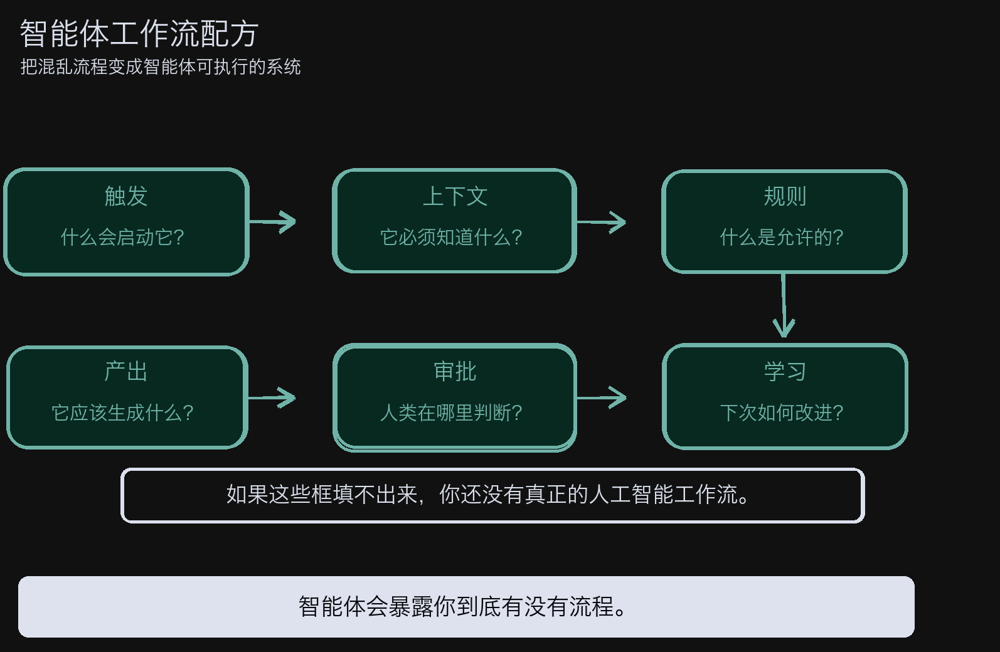
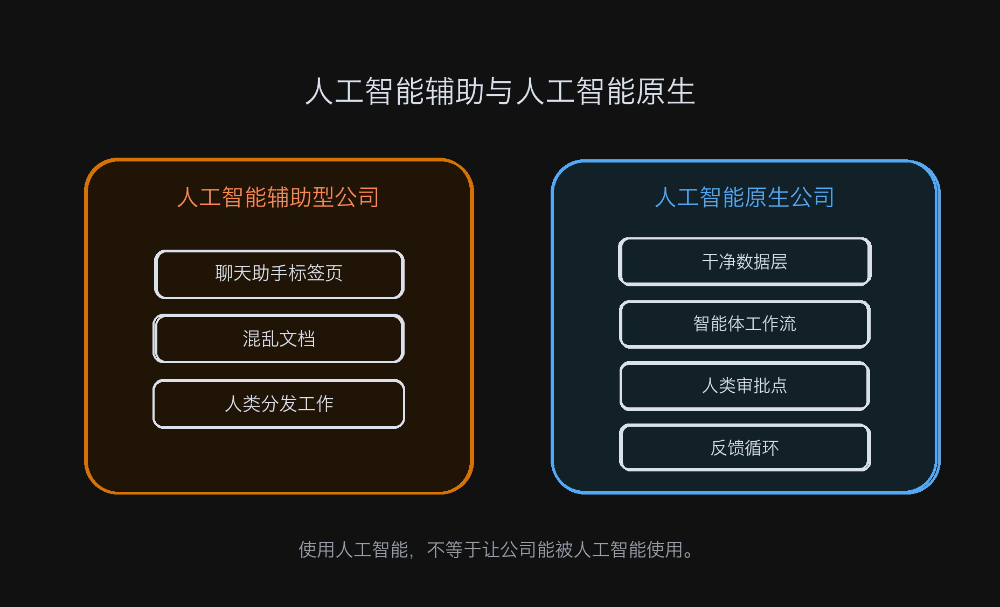
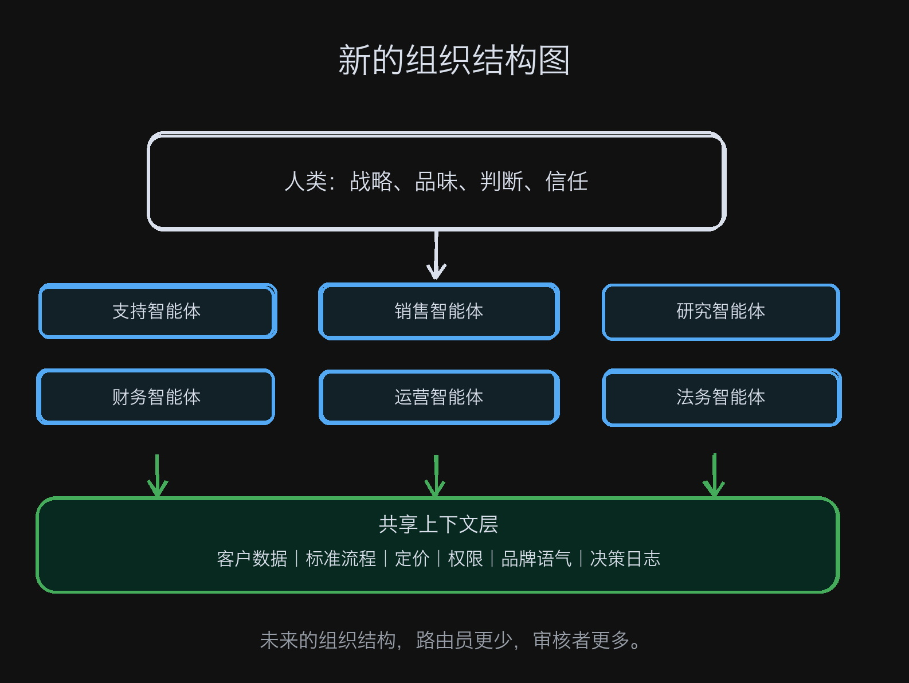
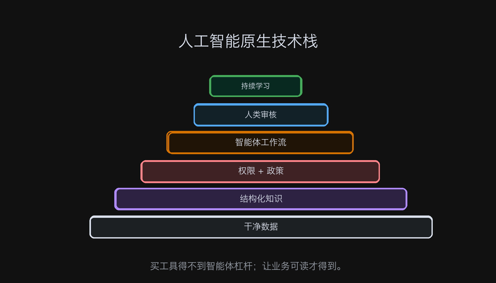
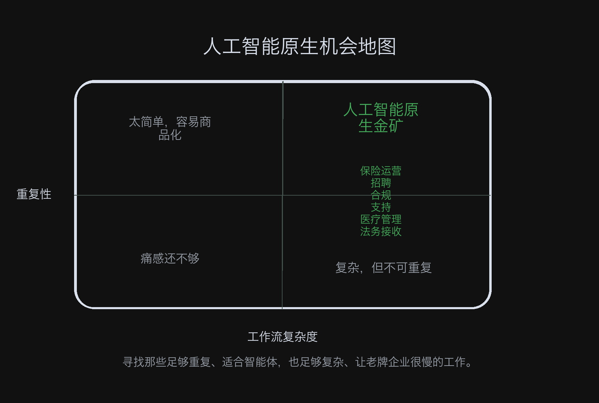
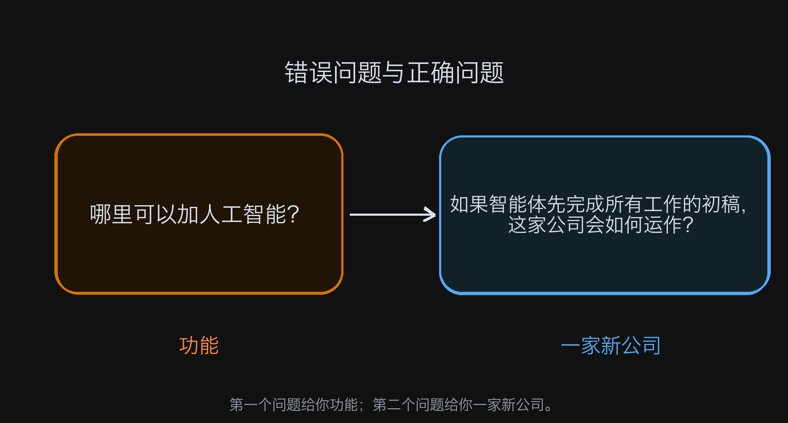
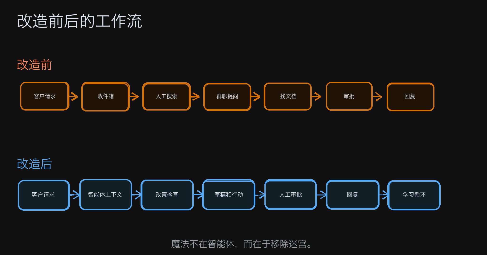

# 如何成为"AI 原生"

**作者：** GREG ISENBERG ([@gregisenberg](https://x.com/gregisenberg))  
**日期：** 2026年5月11日  
**来源：** [How to become "AI-Native"](https://x.com/Zephyr_hg/status/2053843542020063489)

关于 AI 原生，我想把真实情况说清楚。

现在满大街都在说自己是"AI 原生"。仔细看看大多数情况是什么样的：团队里有人打开了 ChatGPT 的标签页，营销总监捣鼓了一个叫"品牌声音助手"的定制 GPT。

挺好的。甚至有点用。

但这不是 AI 原生。

---

真正的区别在这里：AI 原生公司，不是一家在用 AI 的公司，而是一家被重建过的公司——重建的方式，是让 AI 能够真正在里面运作。

业务以 agent 能理解的方式来构建、记录、授权、检测。公司让自己变得对机器可读。

听起来很无聊。

但等你意识到这可能是未来十年最大的商业优势，它就不无聊了。

因为大多数公司，对机器来说根本不透明。说实话，很多公司对自己的员工来说也只是勉强可读。

CRM 里说的是一件事。Slack 线程里说的是另一件事。真实的客户历史住在某人的收件箱里。定价逻辑在一张叫"Final\_v7\_NEW"的电子表格里。退款政策在一个没人信任的 Notion 文档里。销售流程是"去找 Sarah，她知道我们怎么搞定大客户"。入职流程是五个工具、三个人、两个审批步骤，加上一位创始人——因为没有人把判断逻辑固化成系统，所以他还是不得不被拉入各种随机的边缘情况。

然后这些公司问：为什么 AI 帮不了我们更多？

因为 AI 不能靠感觉运行。

它没办法运营一家真相散落在人员、工具、习惯、例外和集体记忆里的公司。Agent 需要上下文。需要干净的输入。需要规则。需要权限边界。需要知道什么叫好，什么叫不行，什么时候行动，什么时候去问人。

大多数公司花了二十年买软件，却没有花二十年设计操作系统。它们有一堆工具，但没有一台机器。

---

所以真正 AI 原生的公司，数量可能少得惊人。我的估计是：全球年收入超过 500 万美元的公司里，真正意义上的 AI 原生，大概只有 1000 家左右。

不是"我们用了 copilot"。不是"我们把几封邮件自动化了"。我说的是：核心工作流程是为 agent 执行、人类监督而设计的公司。

也许是 500 家，也许是 2000 家。具体数字不重要，重要的是结论：几乎没有人在做这件事。

尽管有那么多噪音，那么多融资公告，那么多 SaaS 主页用"agentic"这个词重写了一遍——这个领域，基本上是空的。

有一个区分，一说就明白：AI 辅助型公司在边缘用 AI，AI 原生公司重新设计中心。

AI 辅助型公司问的是："哪些地方可以加个 AI 来省点时间？"

AI 原生公司问的是："如果 agent 来做前 80% 的工作，这个流程应该长什么样子？"

第二个问题，改变了一切。

---

拿客户支持举个例子。

普通公司是这样的：工单进来，人类读它，搜上下文，查账户，回忆政策，写回复，也许去问工程，也许升级，也许忘了打标签。这是以人为主导的流程，软件散落在周围打辅助。

AI 原生公司是这样的：工单进入一个 agent 能理解的系统。Agent 读客户历史、查计划限制、翻之前的工单、查阅政策、起草回复、推荐行动，要么直接解决，要么把它发给人类，附上"我需要你来判断的确切原因"。人类不是搜索引擎、路由器和文案撰写人——人类是处理模糊情况的那个角色。

这是两家截然不同的公司。

同样的逻辑放在销售上：旧方式是 SDR 谷歌搜索潜在客户，猜个性化，写封平庸的邮件，因为经理催促而更新 Salesforce，然后把半吊子的上下文传给 AE。AI 原生方式是 agent 监控购买信号、丰富账户、绘制利益相关者地图、起草外联、学习哪些钩子能转化、自动更新 CRM，给人类销售员一个准备好的对话，而不是一张白纸。

法律、招聘、财务、理赔、客户管理、研究——同一个模式在任何地方都在重复：agent 做结构化工作，人类处理品味、信任、判断、关系和例外。

这不是生产力小幅提升。这是一种新的运营模式。

---

过去一百年，扩大公司规模的默认方式是：雇人、建部门、加管理层、买软件、发明流程来协调一切混乱。每一层解决一个问题，顺便制造三个新问题。公司变大了，也变慢了。更多会议，更多交接，更多"这谁负责"，更多内部阻力。

AI 原生公司会以不同的方式扩展。

它们不会是传统公司加上一个嵌入式聊天机器人。它们看起来像小团队运营着一支专业 agent 舰队。一家 12 人公司做以前需要 80 人才能做到的事。一家 40 人公司和 400 人的老牌企业正面竞争。每位员工的收入，会成为这家公司是否真正为新时代而建的最清晰信号之一。

说到这里，很多人开始防御，觉得"agent 做工作"就意味着人要消失了。

不是这么回事。

换个角度想：现代公司一直在把人类的智慧浪费在机器形状的任务上。用人在工具之间搬信息，用人记流程，用人搜文件夹，用人反复改同一封邮件，用人追审批，用人汇总通话、填字段、复制数据、分类请求、问其他人"那个东西在哪"。

很多工作，不是真正的工作。这不过是披着工作外衣的组织摩擦。

AI 原生公司把这些剥离掉，留下真正重要的人类部分。这样，人类角色会变得更有杠杆，而不是更不重要。

一个好的运营者，成为十个工作流的督导。一个好的销售员，成为 agent 准备好的对话的成交者。一个好的支持主管，成为升级逻辑和体验质量的设计师。一个好的创始人，成为公司思维方式的架构师。

---

这里有一点很关键。

AI 原生创始人不只是在构建一个产品，他们在设计一家 agent 能够理解的公司。

这意味着创始人必须把隐性的东西变成显性的：我们的退款政策是什么？什么时候破例？什么使一条线索具有资格？对愤怒的客户用什么语气？什么不该被自动化？哪些操作需要审批？什么是好答案，什么是危险答案？哪个数据源是真相的来源？两个系统不一致时怎么办？agent 如何从纠正里学习？

这是把真正 AI 原生的公司和 LinkedIn 表演区分开来的、不那么好看的工作。

每个人都想要魔法。没有人想打扫厨房。

但厨房就是公司。

赢的公司会以不寻常的认真态度做那些无聊的、基础性的事：清理数据，记录工作流程，创建 agent 可读的 SOP，构建权限和审计追踪，把客户记录结构化，建立评估循环，把每一个重复的决策变成决策系统。

然后，一旦运营层变得干净，它们就会以荒谬的速度行动。

所以说到底，"AI 原生"不是一个技术标签，而是一个组织标签。

一家公司可以用世界上最好的模型，但在结构上仍然无法从中受益。如果 agent 必须猜测真相在哪里，如果访问不到正确的系统，如果没有人定义决策规则，如果每个工作流都依赖某人脑子里的例外情况——AI 就只是个玩具。它能起草东西，能汇总东西，让你感觉快了一点。但它不会转变这家公司。

真正的转变，发生在 agent 成为运营组织一部分的时候。

---

想象一家 AI 原生的家庭服务公司。每个入站请求自动分类，每份报价由结构化定价规则生成，每位技术员到达前收到工作摘要，每位客户收到主动更新，每个评论请求个性化，每次错过的预约触发自动恢复工作流，每个运营模式反馈到路由、定价和排班里。

再想象一家保险经纪公司。Agent 收文件、预审提交、比较政策、标缺失细节、起草客户解释、准备续约选项、监控账户变化。人类建立信任，处理复杂情况，底层机制全天在做重复性的智力工作。

再想象一家招聘公司。Agent 找候选人、丰富档案、和职位要求对比、起草外联、汇总面试、查参考资料、更新管道，候选人特别优秀时提醒人类。招聘人员不再是数据管理员，而是关系成交者。

这些不是科幻公司。这些是从内部重建的普通业务。

---

这就是人们低估的机会所在。

明显的 AI 公司已经很拥挤——水平 copilot、写作工具、会议机器人、代码助手、图像生成器、客户支持包装器。不错的生意，但一眼看穿。

不那么明显的机会是：拿下那些无聊的、有利可图的、碎片化的行业，围绕 agent 重建运营模式。

AI 原生代理机构。AI 原生经纪公司。AI 原生法律相邻服务。AI 原生会计公司。AI 原生合规商店。AI 原生医疗管理。AI 原生房地产运营。AI 原生教育服务。AI 原生物流协调。不像 BPO 的 AI 原生 BPO。

世界上充满了"客户为结果付费、提供商的成本结构主要是重复性知识工作"的行业。这正是 AI 原生公司可以切入的地方。

最好的机会，起初并不总是看起来像软件公司。有些会看起来像服务公司，里面藏着软件的利润率。这让投资者和竞争对手感到困惑，这很有用。

当别人都在找下一个 SaaS 仪表板时，真正的赢家可能正在悄悄构建 AI 原生服务公司，以大幅降低的人力成本，提供更好的结果。

我觉得下一波互联网业务，看起来不会像"初创公司"，更像是奇特的小型印钞机。

小团队。窄市场。专有工作流程。高度自动化。高度信任。明确的客户痛点。无聊的行业。漂亮的利润率。

从外面看毫不起眼。但利润表上极其好看。

而且因为这些公司从第一天就以不同方式构建，老牌企业很难复制。一家老公司没法宣布一个 AI 计划就变成 AI 原生——这就像给游轮换个新方向盘，指望把它变成快艇。

难的不是获得模型的途径，每个人都有。

难的是老牌企业充满了旧流程债务：数据混乱，政策相互冲突，团队保护地盘，工作流围绕员工人数建立，软件栈用胶带和季度计划仪式拼凑在一起，整个操作系统默认人类是信息的处理器。

新公司的优势是没有家具要搬。

从零开始，用"agent 能率先完成这件事吗"来设计每个流程，从第一天就记录，让每个数据对象可用，在错误变成灾难之前设计审查点，在公司僵化之前建立反馈循环。

---

这就是"只有 1000 家公司"这个想法的意义。它创造了紧迫感，也创造了许可。

这个领域是空的，因为大多数人还在把 AI 采用误认为是 AI 架构。

他们觉得游戏是提示词工程——不是。觉得游戏是选对模型——不是。觉得游戏是在网站上加个聊天机器人——更不是。

游戏是重新设计这家公司，让智慧能够在里面流动。

这里有一个实用的行动手册。

**第一步，选一个有明显经济价值的窄工作流程。** 不要从"让公司成为 AI 原生"开始，太抽象了。从支持解决、出站潜在客户开发、入职、理赔接收、文件审查、续约管理或报告开始。选一个量大、规则存在、人类目前做了太多协调工作的流程。

**第二步，像机器一样把工作流程画出来。** 什么触发它？需要什么数据？发生什么决策？哪些决策是可逆的？哪些需要审批？成功是什么样子的？错误在哪里发生？人类知道哪些是系统不知道的？

**第三步，把知识结构化。** 如果 agent 需要一个政策，写那个政策。需要定价规则，把它们说清楚。需要客户历史，清理客户对象。需要示例，创建示例。需要语气，定义语气。大多数团队在这一步放弃了，因为感觉像在写文档。但这不是文档——这是基础设施。

**第四步，在有边界的情况下把 agent 放入工作流程。** 让它们起草、分类、推荐、丰富、汇总、准备。只在风险可理解的地方给它们行动权限。在需要判断的地方要求审批。记录一切，审查输出，追踪质量，改进系统。

**第五步，衡量业务影响。** 不是某个假电子表格里的"节省工时"。衡量解决时间、转化率、毛利率、每位员工收入、错误率、客户满意度、销售速度、入职时间、续约率。AI 原生公司应该体现在数字里。

---

这是我最感兴趣的部分。几年后，"AI 原生"将不再只是一种感觉——它会在指标里清晰可见。

每位员工收入会不一样。毛利率会不一样。执行速度会不一样。客户体验会不一样。

最好的公司会感觉奇怪地响应迅速，就像整个业务都是醒着的。客户更快得到答案，销售团队在更好的时机跟进，运营问题更早浮现，创始人更清楚地看到自己的公司，管理者花更少时间要更新、花更多时间改进系统。

公司会减少阻力。

这才是真正的优势。

不是 AI 作为派对把戏——而是 AI 作为组织的新陈代谢。

所以是的，今天地球上大概只有 1000 家真正 AI 原生的公司在做有意义的收入。

这应该让你立刻想去建一家。

因为当市场嘈杂时，人们会觉得它已经饱和了。但噪音不是饱和。噪音通常是真正的构建者还没想清楚什么重要之前发生的事情。

现在，每个人都在喊 AI。很少有公司在结构上做好了准备。

那是差距。那是机会。

下一批伟大公司，将是那些数据、工作流程、政策和团队从内到外围绕 agent 重建的公司。它们看起来会比应该的更小，移动速度会比合理的更快，员工更少，但每个人的工作更有价值。它们会把混乱的服务变成可扩展的系统。它们会让老牌企业看起来像是在用一个登录界面更漂亮的 Windows 95。

大多数人还在问："我怎么在工作里用 AI？"

更好的问题是："我怎么建一家 AI 可以在里面工作的公司？"

那个问题是门。

而现在，几乎没有人走进去过。

这个领域是空的。也许考虑分享给朋友。

我在为你加油。

— Greg Isenberg
