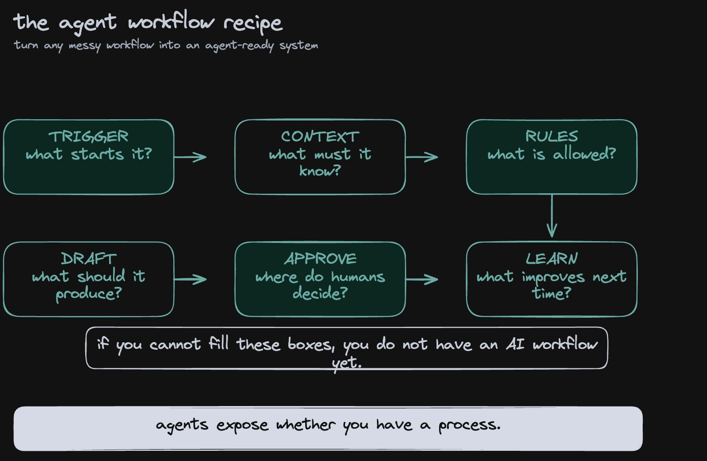
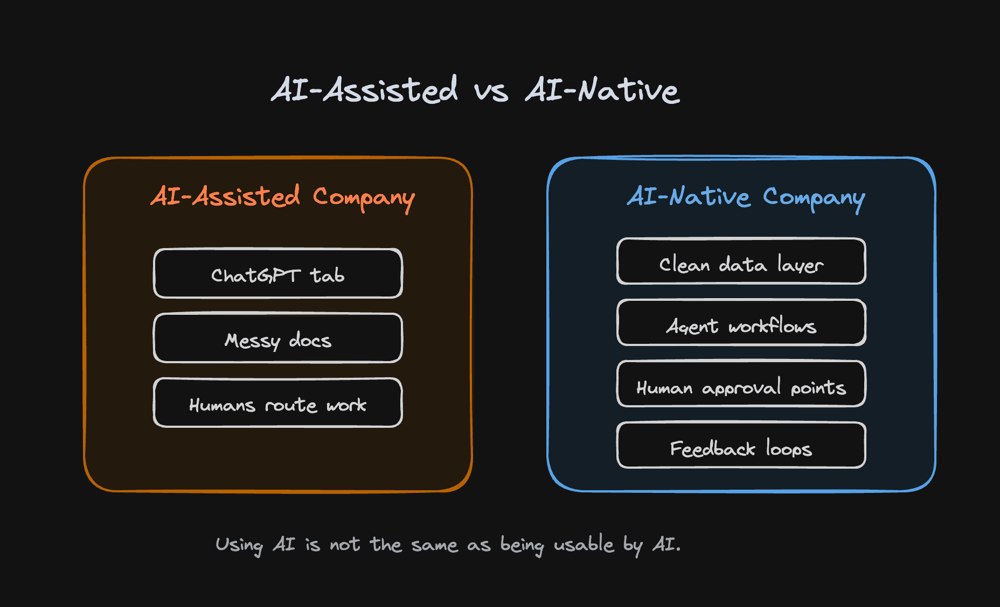
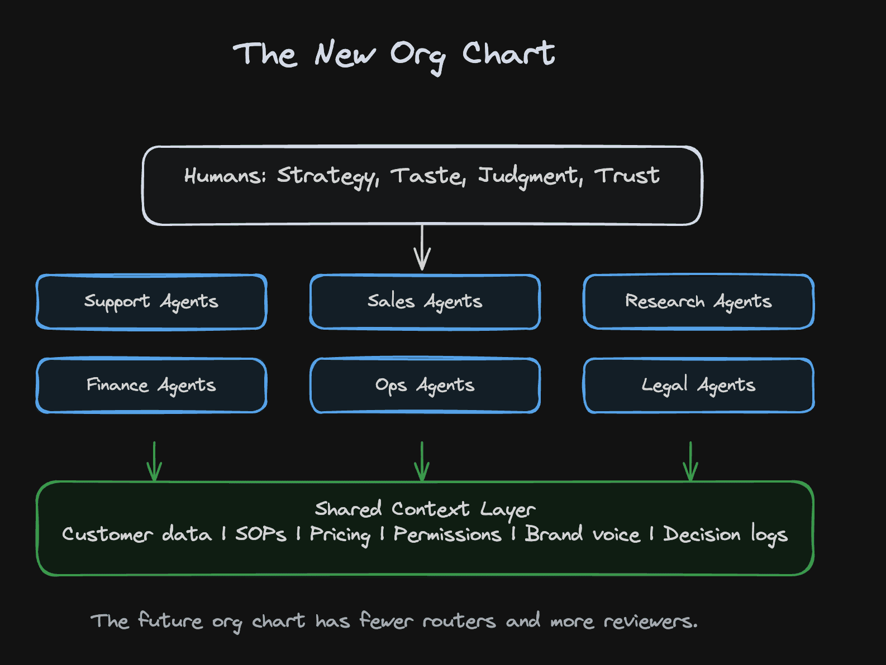
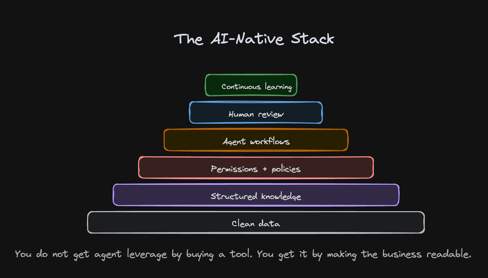
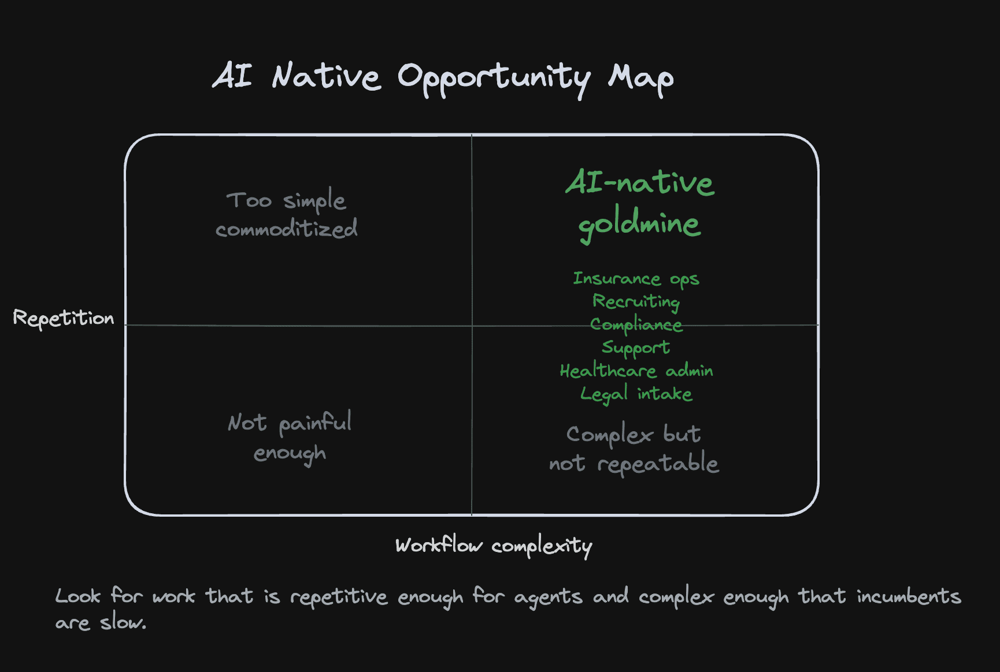
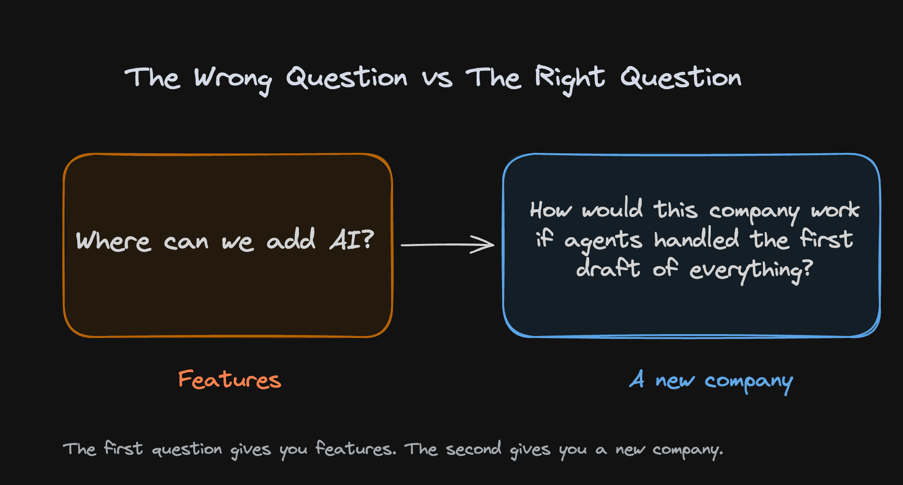
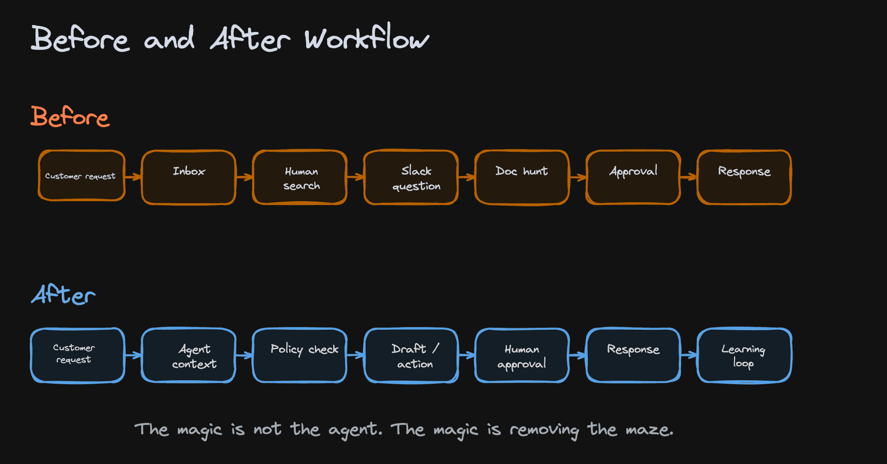

# How to become "AI-Native"

**Author:** GREG ISENBERG ([@gregisenberg](https://x.com/gregisenberg))  
**Published:** May 11, 2026  
**Source:** [How to become "AI-Native"](https://x.com/Zephyr_hg/status/2053843542020063489)

The truth about being AI native. I'll break it down.

Everyone is walking around saying they're "AI-native" now, which mostly means someone on the team has a ChatGPT tab open and the head of marketing made a custom GPT called "Brand Voice Assistant."

Cute. Useful, even. But not AI-native.

That's the difference people keep missing. An AI-native company is not a company that uses AI. It is a company that has been rebuilt so AI can actually operate inside it. The business is structured, documented, permissioned, and instrumented in a way that agents can understand. The company has made itself legible to machines.

That sounds boring until you realize it might be the single biggest business advantage of the next decade.

Because most companies are not legible to machines. Most companies are barely legible to their own employees.

The CRM says one thing. The Slack thread says another. The real customer history lives in someone's inbox. The pricing logic is in a spreadsheet called "Final\_v7\_NEW." The refund policy is in a Notion doc nobody trusts. The sales process is "talk to Sarah, she knows how we do enterprise." The onboarding flow is five tools, three humans, two approval steps, and one founder who still gets pulled into random edge cases because nobody ever turned judgment into a system.

Then these companies ask, "Why can't AI do more for us?"

Because AI cannot run on vibes.

It can't operate a business where the truth is scattered across people, tools, habits, exceptions, and institutional memory. Agents need context. They need clean inputs. They need rules. They need access. They need boundaries. They need to know what good looks like. They need to know when to act and when to ask.

Most companies have spent twenty years buying software, but they have not spent twenty years designing an operating system. They have a pile of tools, not a machine.

That is why the number of truly AI-native companies is probably shockingly small. My guess is there are maybe 1,000 companies on earth doing \$5M+ ARR that are actually AI-native in the real sense. Not "we use copilots." Not "we automated some emails." I mean companies where the core workflows are designed for agents to execute and humans to supervise.

Maybe the number is 500. Maybe it's 2,000. The exact number matters less than the conclusion.

Almost nobody is doing this yet.

Despite all the noise, despite all the funding announcements, despite every SaaS homepage being rewritten with the word "agentic," the field is basically empty.

The first useful distinction is this: AI-assisted companies use AI at the edges. AI-native companies redesign the center.

An AI-assisted company asks, "Where can we add AI to save time?"

An AI-native company asks, "How should this workflow exist if agents are doing the first 80%?"

That second question changes everything.

Take customer support. In a normal company, a support ticket arrives, a human reads it, searches for context, checks the account, remembers policy, writes a response, maybe asks engineering, maybe escalates, maybe forgets to tag the reason properly. It's a human-driven process with software sprinkled around it.

In an AI-native company, the ticket enters a system an agent can understand. The agent reads the customer history, checks plan limits, reviews prior tickets, consults policy, drafts a response, recommends an action, and either resolves the issue or sends it to a human with the exact reason it needs judgment. The human is not the search engine, router, and copywriter. The human is the reviewer of ambiguity.

That is a very different company.

Now apply the same logic to sales. The old way is an SDR Googling a prospect, guessing at personalization, writing a mediocre email, updating Salesforce because their manager nags them, then passing half-context to an AE. The AI-native way is an agent that monitors buying signals, enriches accounts, maps stakeholders, drafts outreach, learns which hooks convert, updates the CRM automatically, and gives the human seller a prepared conversation instead of a blank page.

Legal is the same. Recruiting is the same. Finance is the same. Claims processing is the same. Account management is the same. Research is the same.

The pattern repeats everywhere: agents do the structured work, humans handle taste, trust, judgment, relationships, and exceptions.

That is not a small productivity improvement. That is a new management model.

For the last hundred years, the default way to scale a company was to hire more people, create departments, add managers, buy software, and invent processes to coordinate the mess. Every new layer solved one problem and created three more. The company got bigger, but it also got slower. More meetings. More handoffs. More "who owns this?" More internal gravity.

AI-native companies will scale differently.

They will not look like traditional companies with a chatbot bolted on. They will look like small teams operating large fleets of specialized agents. A 12-person company will do what used to require 80 people. A 40-person company will compete with a 400-person incumbent. Revenue per employee will become one of the clearest signals that a company is actually built for the new era.

This is where a lot of people get defensive. They hear "agents do the work" and assume it means humans disappear.

That's not the point.

The better way to think about it is that modern companies have been wasting human intelligence on machine-shaped tasks. We use humans to move information between tools. We use humans to remember process. We use humans to search folders. We use humans to rewrite the same email. We use humans to chase approvals. We use humans to summarize calls, fill in fields, copy data, classify requests, and ask other humans where something lives.

A lot of work is not really "work." It is organizational friction wearing a fake mustache.

AI-native companies strip that out.

They preserve the human parts that matter and automate the parts that only existed because software was too dumb to understand context. That means the human role becomes more leveraged, not less important. A great operator becomes the supervisor of ten workflows. A great salesperson becomes the closer of conversations agents helped create. A great support lead becomes the designer of escalation logic and customer experience quality. A great founder becomes the architect of how the company thinks.

That founder point is important.

The AI-native founder is not just building a product. They are designing a company that can be understood by agents.

That means the founder has to make the implicit explicit. What is our refund policy? When do we break it? What makes a lead qualified? What tone do we use with angry customers? What should never be automated? Which actions require approval? What is a good answer? What is a dangerous answer? Which data source is the source of truth? What do we do when two systems disagree? How does the agent learn from corrections?

This is the unsexy work that will separate real AI-native companies from LinkedIn theater.

Everyone wants the magic. Nobody wants to clean the kitchen.

But the kitchen is the company.

The companies that win will do boring, foundational things with unusual seriousness. They will clean their data. They will document their workflows. They will create agent-readable SOPs. They will build permissions and audit trails. They will structure customer records so context is not trapped in human memory. They will create evaluation loops so agents get better over time. They will turn every repeated decision into a decision system.

Then, once the operating layer is clean, they will move absurdly fast.

This is why "AI-native" is not really a tech label. It is an organizational label.

A company can use the best models in the world and still be structurally incapable of benefiting from them. If the agent has to guess where the truth lives, if it cannot access the right systems, if nobody has defined the decision rules, if every workflow depends on exceptions buried in someone's head, then the AI will remain a toy. It will draft things. It will summarize things. It will make people feel faster. But it will not transform the business.

The transformation happens when agents become part of the operating fabric.

Imagine a home services company that is truly AI-native. Every inbound request is classified automatically. Every quote is generated from structured pricing rules. Every technician gets a job summary before arrival. Every customer receives proactive updates. Every review request is personalized. Every missed appointment creates an automatic recovery workflow. Every operational pattern feeds back into routing, pricing, and staffing.

Now imagine an insurance brokerage. Agents gather documents, pre-check submissions, compare policies, flag missing details, draft client explanations, prepare renewal options, and monitor accounts for changes. Humans build trust and handle complexity, but the machinery underneath is doing the repetitive intelligence work all day.

Now imagine a recruiting firm. Agents source candidates, enrich profiles, compare against role requirements, draft outreach, summarize interviews, check references, update pipelines, and alert humans when a candidate is unusually strong. The recruiter stops being a data janitor and becomes a relationship closer.

These are not sci-fi companies. These are normal businesses with the guts rebuilt.

That's the opportunity people are underestimating. The obvious AI companies are crowded. Horizontal copilots, writing tools, meeting bots, code assistants, image generators, customer support wrappers. Fine businesses, but obvious. The less obvious opportunity is taking boring, profitable, fragmented industries and rebuilding the operating model around agents.

AI-native agencies. AI-native brokerages. AI-native law-adjacent services. AI-native accounting firms. AI-native compliance shops. AI-native healthcare admin companies. AI-native real estate operations. AI-native education services. AI-native logistics coordinators. AI-native BPOs that don't look like BPOs.

The world is full of industries where customers pay for outcomes, but the provider's cost structure is mostly repetitive knowledge work. That is exactly where AI-native companies can wedge in.

The best opportunities will not always look like software companies at first. Some will look like services businesses with software margins hiding inside. That will confuse investors and competitors, which is useful. While everyone else is looking for the next SaaS dashboard, the real winners may be quietly building AI-native service companies that produce better outcomes with dramatically lower labor intensity.

I think the next wave of internet businesses may look less like "startups" and more like weird little money machines.

Small teams. Narrow markets. Proprietary workflows. High automation. High trust. Clear customer pain. Boring category. Beautiful margins.

Not sexy from the outside. Extremely sexy in the bank account.

And because these companies are built differently from day one, incumbents will struggle to copy them. An old company cannot become AI-native by announcing an AI initiative. That is like trying to turn a cruise ship into a speedboat by buying a new steering wheel.

The hard part is not access to models. Everyone has that.

The hard part is that incumbents are full of old process debt. Their data is messy. Their policies conflict. Their teams protect turf. Their workflows were built around headcount. Their software stack is stitched together with duct tape and quarterly planning rituals. Their operating system assumes humans are the default processors of information.

A new company has the advantage of having no furniture to move.

It can start clean. It can build every process with the question: "Could an agent do the first pass on this?" It can document from day one. It can make every data object usable. It can design human review points before errors become disasters. It can build feedback loops before the company calcifies.

This is why the "only 1,000 companies" idea matters. It creates urgency, but it also creates permission.

The field is empty because most people are still mistaking AI adoption for AI architecture.

They think the game is prompt engineering. It's not. They think the game is picking the right model. It's not. They think the game is adding a chatbot to the website. It's definitely not.

The game is redesigning the company so intelligence can flow through it.

There is a practical playbook here.

**First, pick a narrow workflow with obvious economic value.** Don't start with "make the company AI-native." That's too abstract. Start with support resolution, outbound prospecting, onboarding, claims intake, document review, renewal management, or reporting. Choose a workflow where volume is high, rules exist, and humans are currently doing too much coordination.

**Second, map the workflow like a machine.** What triggers it? What data is needed? What decisions happen? Which decisions are reversible? Which require approval? What does success look like? Where do errors happen? What does a human know that the system does not?

**Third, structure the knowledge.** If the agent needs a policy, write the policy. If it needs pricing rules, make them explicit. If it needs customer history, clean the customer object. If it needs examples, create examples. If it needs tone, define tone. This is where most teams quit, because it feels like documentation. It is not documentation. It is infrastructure.

**Fourth, put agents in the workflow with boundaries.** Let them draft, classify, recommend, enrich, summarize, and prepare. Give them actions only where the risk is understood. Require approval where judgment matters. Log everything. Review outputs. Track quality. Improve the system.

**Fifth, measure the business impact.** Not "hours saved" in some fake spreadsheet. Measure resolution time, conversion rate, gross margin, revenue per employee, error rate, customer satisfaction, sales velocity, onboarding time, renewal rate. AI-native companies should show up in the numbers.

That is the part I'm most interested in. In a few years, "AI-native" will not be a vibe. It will be visible in the metrics.

Revenue per employee will look different. Gross margins will look different. Speed of execution will look different. Customer experience will look different.

The best companies will feel strangely responsive, like the whole business is awake. Customers will get answers faster. Sales teams will follow up with better timing. Ops problems will surface earlier. Founders will see the business more clearly. Managers will spend less time asking for updates and more time improving the system.

The company will have less drag.

That is the real advantage.

Not AI as a party trick. AI as organizational metabolism.

So yes, there are probably only around 1,000 truly AI-native companies on earth doing meaningful revenue today.

And that should make you want to build one immediately.

Because when a market is loud, people assume it is mature. But noise is not maturity. Noise is usually what happens right before the real builders figure out what matters.

Right now, everyone is loud about AI. Very few companies are structurally ready for it.

That is the gap. That is the opportunity.

The next great companies will be the ones whose data, workflows, policies, and teams are rebuilt around agents from the inside out. They will look smaller than they should. They will move faster than makes sense. They will have fewer employees doing more valuable work. They will turn messy services into scalable systems. They will make incumbents look like they are running Windows 95 with a nicer login screen.

Most people are still asking, "How do I use AI at work?"

The better question is, "How do I build a company AI can work inside?"

That question is the doorway.

And right now, almost nobody has walked through it.

Despite what you read, the field is empty. Maybe consider sharing this with a friend.

I'm rooting for you.

— Greg Isenberg
