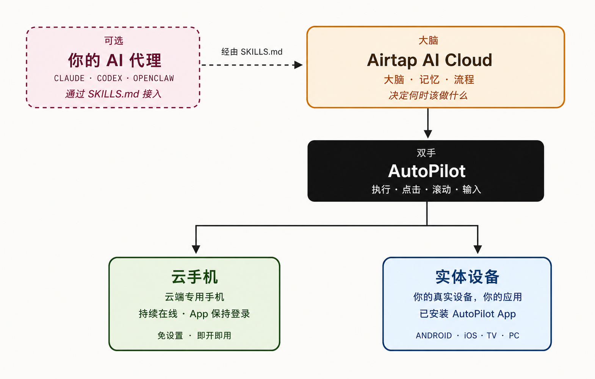

# Airtap：大脑在云端，手在每台手机上

**来源：** https://airtap.ai/technology.html

> Airtap 采用三层架构：云端 AI 大脑、AutoPilot 执行层，以及云手机或你自己的实体设备。通过一个 SKILLS.md 文件，即可接入 Claude、Codex 或 OpenClaw。

## 三层，各管各的事

Airtap 的整个系统，说起来其实不复杂。

一共三层。第一层在云端想事情，第二层把想好的事情变成手机上的真实操作，第三层是承载这些操作的设备——可以是一台专门给你的云手机，也可以是你自己揣在兜里的那台。

分开之后，每一层只干一件事，干得很彻底。

---

## 每一层在做什么

**大脑：Airtap AI 云**

记忆、任务、决策，都在这里。

关掉再开，它还记得上次的状态。任何时候调用，它都在线。你也可以把这一层换成自己的 agent——Claude、Codex、OpenClaw，或者别的什么。

**执行：AutoPilot**

大脑想好了，AutoPilot 来做。

点击、滚动、输入、导航，跟真人用手机没有区别。不是模拟操作，是真的在驱动应用。

**设备：云手机或你的手机**

AutoPilot 需要一台设备来落地。

可以是 Airtap 给你分配的专属云手机，始终开着，始终登录；也可以是你自己的 Android、iOS、TV 或 PC，你的应用，你的账户。两种都选也行。

---

## 云手机和自己的手机，怎么选

事情是这样的：很多自动化任务，你并不想让它占着你的手机跑。夜里监控价格、定时发消息、凌晨抢票——这些事你睡着了，但任务得继续。

云手机就是为这种场景准备的。每个 Airtap 用户都有一台，应用保持登录，任务 24 小时运行，跟你的设备、电量、网络完全没关系。

自己的手机则适合另一类场景：跟特定账户绑定的操作，或者需要用到你手机上特有的应用和权限。装上 AutoPilot，Airtap 就能直接接管。

两种路径背后是同一个大脑，跑的是同一套任务。选哪个，甚至两个都选，都没关系。

---

## 让你已经在用的 agent 也能操作手机

这里有个很实际的问题：Claude、Codex 这些 agent 现在能回答问题，但它们没有手。

Airtap 的做法是给它们一个 SKILLS.md 文件。这个文件定义了 agent 操作手机的完整方式。把它丢进任何支持 SKILLS.md 的运行时，agent 就知道怎么点击、怎么输入、怎么在应用里导航了。

三步就能完成：

1. **拿到技能文件**——下载 Airtap 的 SKILLS.md
2. **放进你的 agent**——Claude、Codex、OpenClaw，或别的什么都行
3. **分配一台手机**——启动云手机，或连接你的实体设备

做完这三步，agent 就不只是回答问题了，它可以真的去做事。

---

## agent 有了手机，能干什么

范围比你想的宽。

**消息收发**——WhatsApp、Telegram、iMessage、Slack，agent 来读，agent 来回。

**社交运营**——TikTok、Instagram、X，发帖、盯互动、回评论。

**预订抢购**——OpenTable、ClassPass、Amazon，位子一开放就抢，优惠一出来就拿。

**监控触发**——盯着价格、申请进度、资格状态，条件一到立刻行动，不需要你盯着屏幕等。

**多步骤工作流**——把多个应用串起来，收集、决策、执行、确认，上下文一路带着走，不会断。

**多 agent 协作**——每个 agent 有自己的手机、自己的身份、自己的应用会话，多个 agent 可以各司其职，互相配合。