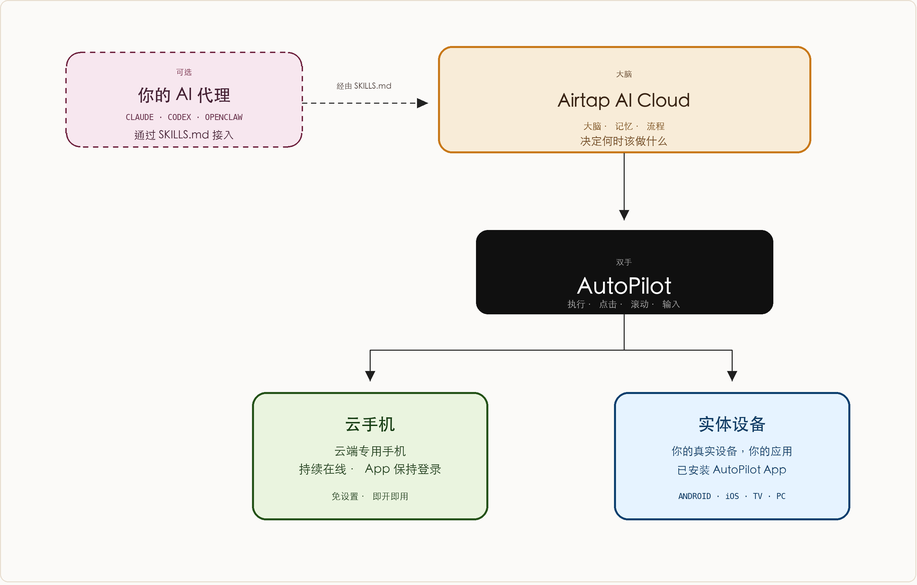

# Airtap 工作原理

**来源：** https://airtap.ai/technology.html

> Airtap 采用三层架构：云端 AI 大脑、AutoPilot 执行层，以及云手机或你自己的实体设备。通过一个 SKILLS.md 文件，即可接入 Claude、Codex 或 OpenClaw。

 # Airtap 是怎么工作的。

 三层结构。AI 在云端，操作落到每台设备，任何能读取 SKILLS.md 的 agent 都可以接入。

 ## 架构：大脑 · 执行 · 设备

 大脑负责决策，AutoPilot 负责执行，动作最终落在真实或云端的手机上。

 

 ## 三层结构：每一层在做什么

 1 · 大脑 Airtap AI 云
 记忆、任务与决策。关掉重开它还记得，任何时候都在线。或者，接入你自己的 agent。

 2 · 执行 AutoPilot
 把意图变成真实的操作。点击、滚动、输入、导航——跟真人用手机一模一样。

 3 · 设备 云手机或你的手机
 AutoPilot 运行在专属云手机（始终在线）上，也可以运行在你的实体设备上——你的应用，你的账户。两者都用也行。

 ## 两条设备路径：云手机，还是自己的手机

 云端：云手机
 每位 Airtap 用户都有一台专属云端手机。应用始终保持登录，任务全天候运行——不占你的设备，不耗你的电量，不靠你的网络。适合需要持续监控、定时执行和夜间自动化的场景。

 实体：你的手机 + AutoPilot
 在 Android、iOS、TV 或 PC 上安装 AutoPilot，Airtap 就能直接驱动你已经在用的应用，在你随身带的设备上运行。适合绑定特定账户、位置或硬件的操作。

 两种都行，也可以同时用。背后是同一个大脑，跑的是同一套任务。

 ## Agent 集成：接入 Claude、Codex 或 OpenClaw

 一个 SKILLS.md 文件，教会你的 agent 怎么操作手机。从此它不只是回答问题，而是真的去做事。

 1 拿到技能文件
 下载 Airtap 的 SKILLS.md——一个文件，定义了 agent 操作手机的完整方式。

 2 放进你的 agent
 把文件丢进 Claude、Codex、OpenClaw，或任何支持 SKILLS.md 的运行时。

 3 分配一台手机
 启动云手机，或者连接你的实体设备。agent 就绪，可以开始行动了。

 ## 可以做到什么：agent 有了手机之后

 消息：收发消息
 WhatsApp、Telegram、iMessage、Slack——agent 来读，agent 来回。

 社交：发布与监控
 TikTok、Instagram、X——发帖、追踪互动、回复评论。

 预订：抢位与购买
 OpenTable、ClassPass、Amazon——位子一开放就抢，课程一上线就占，优惠一出来就拿。

 监控：盯着动态
 追踪价格变化、申请进度、资格开放——触发条件一到，立刻行动。

 工作流：多步骤任务
 把多个应用串起来——收集、决策、执行、确认——上下文不断。

 多 agent：手机网络
 每个 agent 有自己的手机、身份和持久会话，多个 agent 各司其职，互相协作。

 ## 大脑在云端，手在每台手机上。

试用 Airtap](https://airtap.ai/app)