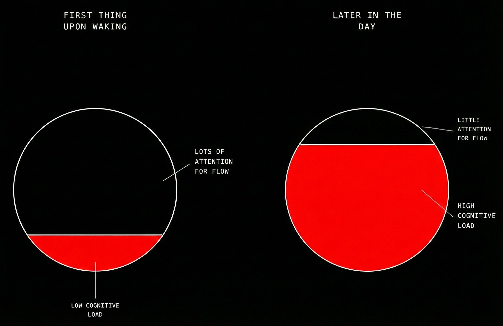
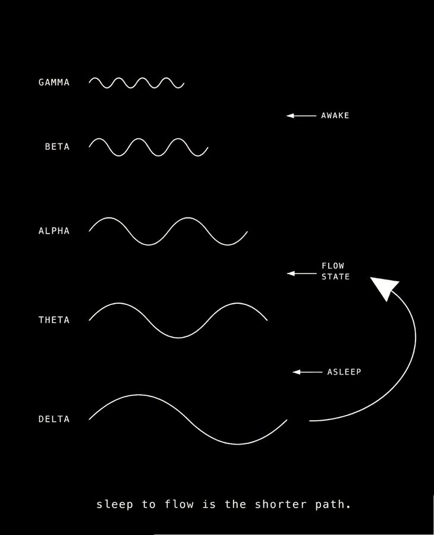
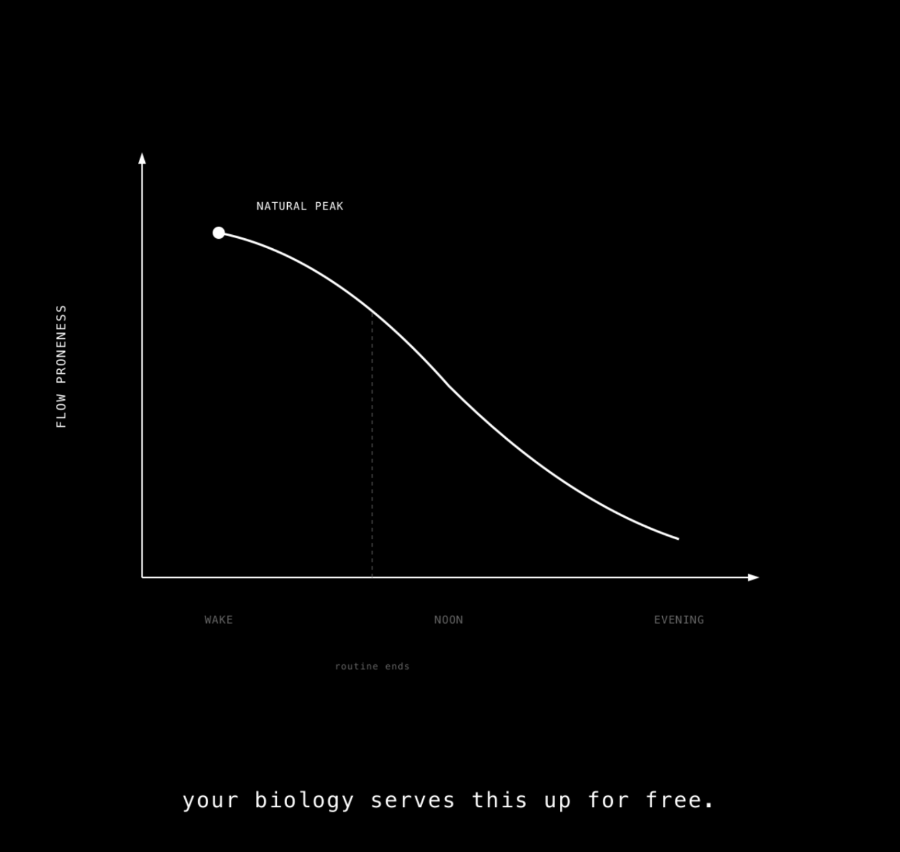
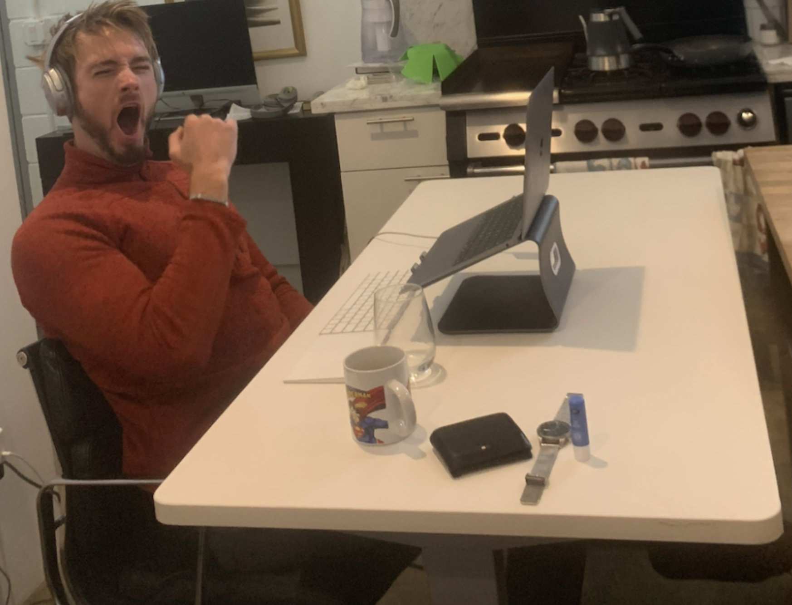
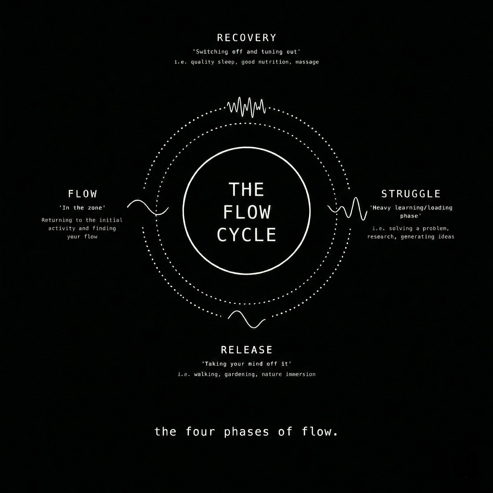
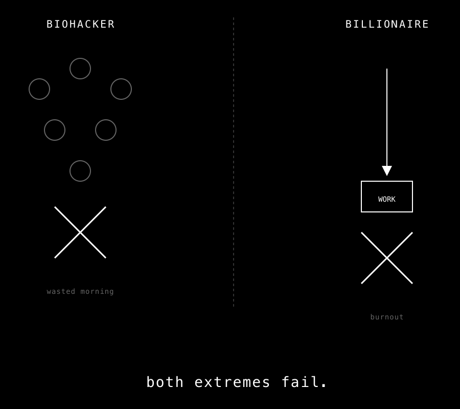
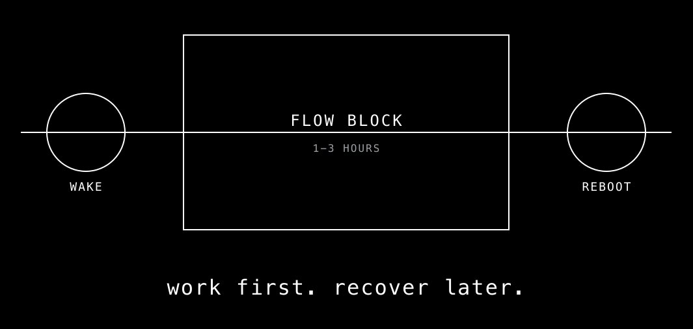
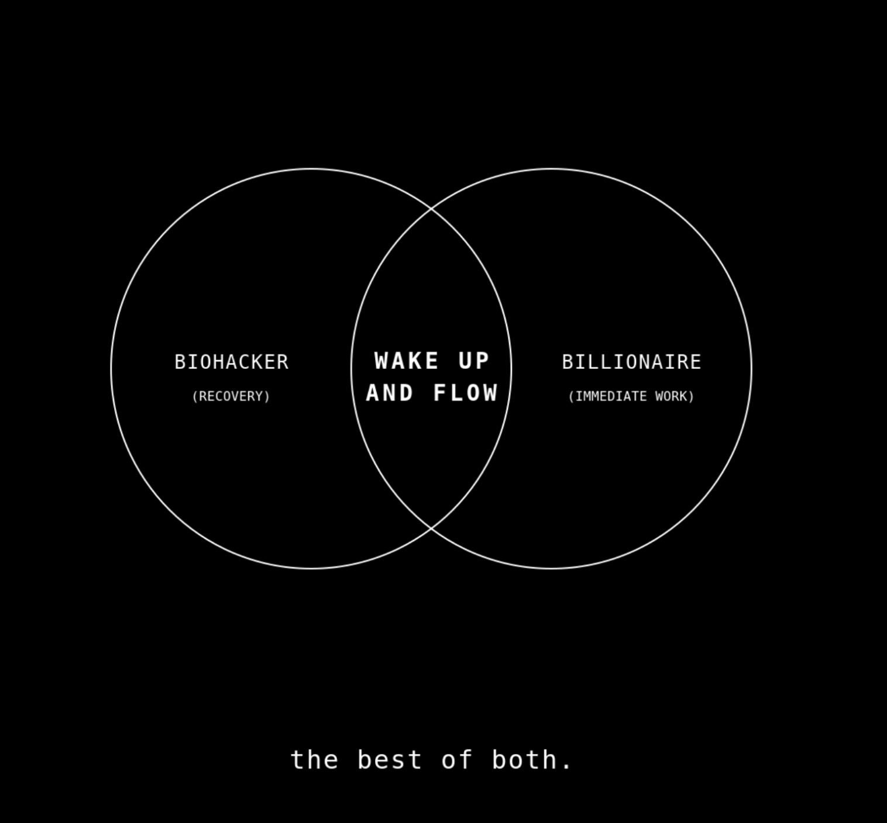

# Work 1 Minute After Waking Up. It'll Change Your Life.

**Author:** Rian Doris ([@RianSweetDoris](https://x.com/RianSweetDoris))  
**Published:** January 22, 2026  
**Source:** [Work 1 Minute After Waking Up. It'll Change Your Life.](https://x.com/Zephyr_hg/status/2014076788951961864)

Your morning routine probably sucks.

Not to be harsh, but you've likely fallen into one of two traps that quietly kill a morning work block capable of producing more than the rest of the day combined…

**Trap One:** You have a sprawling morning routine loaded with biohacks. Lemon water. Journaling. Cold plunge. Meditation. Red light therapy. Grounding. By the time you're "ready" to work, you're hours into the day.

**Trap Two:** You have no routine at all. You wake up, and begin navigating logistics. After waking, the morning looks like getting dressed, coordinating breakfast, taking the kids to school, handling bits and pieces via phone and email and navigating to wherever you work from.

Your morning is a "coordination block", not a work block.

## I – The Biohacker Morning Routine Days

Growing up in Ireland, I was stuck deep in Trap One. I had a comically excessive morning routine.

I did everything the productivity gurus told me to do:

- Lemon water
- Yoga
- Journaling
- Exercise
- Affirmations
- Mushroom coffee
- Sunlight exposure
- Standing barefoot on grass for "grounding"

This elaborate routine took so long that I didn't start work for hours after waking.

But I felt good about it. I was optimizing. I was doing everything right.

Surely this was setting me up for peak performance...

## II – The Billionaire Revelation

Then I moved to LA.

I interned with a world-famous author and was suddenly dropped into a network of elite entrepreneurs.

These folks were billionaires and titans of industry and their productivity was so extreme it broke my understanding of what was possible.

And guess what I discovered about their morning routines?

They didn't have any!

Think about it…

Elon doesn't complain about having a bad day running SpaceX, Tesla, and X because he didn't have time to foam roll his glutes or do his red light therapy that morning.

These billionaire titans of industry just wake up and get to work.

At the time, this blew my mind.

The importance of a morning routine had been hammered into me for years.

I'd spent so much time building upon it, adding new biohacks, optimizing every detail.

No wonder I wasn't working until hours after waking.

So I tested this "wake up and immediately work" approach myself.

It felt wrong at first. My morning routine was supposed to give me an edge. Without it, I worried I'd stumble into work like a groggy zombie.

But right away, I realized the billionaires were onto something.

It worked shockingly well.

I could wake up, get to work within minutes, and slip straight into a flow state— that peak state of consciousness where work feels effortless, time disappears and productivity surges.

I was getting more done before breakfast than I used to accomplish in an entire afternoon.

## III – Why This Works: The Science of Flow Proneness

I wanted to understand why this "wake up and work" approach worked so well.

So I dug into the research.

It turns out, there's a concept called **flow proneness** — first discovered by psychologist Mihaly Csikszentmihalyi in the 1970s.

Flow proneness is your likelihood of experiencing flow state at any given time.

The higher your flow proneness, the more likely you'll drop into a flow state while working.

That's when the dots connected:

The point of a morning routine is to boost your productivity.

But the way a morning routine boosts your productivity is by increasing your flow proneness (your likelihood of accessing flow state while working through the rest of the day).

Think about the kinds of things people do in their morning routine:

- **Cold exposure** boosts dopamine levels by up to 250% for two hours. Dopamine drives focus. Focus is essential for flow.
- **Meditation** drives attention into the present moment and improves attention regulation. Both are critical for flow.
- **Journaling** clarifies goals. Clear goals are a prerequisite (or trigger) for flow.

All of these routines, and the other go-to's, share a common mechanism: they increase flow proneness.

So really, the unspoken purpose of a morning routine is to boost flow proneness.

But here's the wild thing…

Even without any morning routine, your flow proneness is already at its peak the moment you wake up.

This happens for two reasons:

### Reason 1: Your cognitive load is at zero.

Cognitive load refers to the amount of information you're holding in working memory — like RAM in a computer.

When you wake up, your cognitive load is at its lowest. You haven't yet loaded anything into your conscious mind. You haven't checked email, seen the news, or processed any information.

Low cognitive load means you have more attention you can allocate to a given task, and this makes flow easier to access.

### Reason 2: Your brain waves are already close to flow.

When you wake up, you pass through a brief but powerful neurophysiological state.

It's not quite sleep inertia.

It's not hypnagogia (the transition from wake → sleep).

It's more like the reverse:

Sleep → wake, before full cognitive activation occurs.

This window lasts roughly **10 minutes**, and it has a distinct neural signature:

- Residual **theta activity** persists in frontal and temporal regions
- **Alpha waves increase** before full beta wave dominance sets in
- The **Default Mode Network** (self-referential thinking) is not yet fully online
- **Executive self-monitoring** is reduced

Translation?

Your brain is quiet, uncongested, and more primed for absorption than it will be at any other time of the day.

Research indicates that the neuro-electrical signature of flow likely hovers around the borderline between alpha and theta waves.

When you sleep, your brain cycles through theta and delta waves. This means the transition from sleep to flow is far easier than the transition from normal waking consciousness to flow.

At a brain wave level, you're closer to flow when you're half-asleep than when you're fully awake.

You don't want your brainwaves to have to take a detour from sleep and then to fully awake back to down to flow. It's inefficient and makes it less likely you'll ever return to flow.

Instead, let your brainwaves take the short-cut straight from sleep to flow.

This is why "wake up and flow" is so powerful.

And this is where the biohackers go wrong and the billionaires are onto something.

The biohacker wakes up with peak flow proneness — then squanders it running a two-hour routine designed to create the very state they already have.

Your biology is already primed for flow upon waking so don't spend that primetime trying to prime it for later!

Whereas the billionaire wakes up and dives into high-priority work immediately, and they're rewarded with flow.

The productivity from doing this both moves you toward your goals immediately and gives you flow while doing it.

Win-win.

...Or is it?

## V – The Billionaire's Hidden Problem

There's more to the story:

After trying the "wake up and flow" approach for a full year, something started to break.

I began burning out.

And when I looked closer at the billionaires I'd met, the picture wasn't so pretty either.

Yes, they were ferociously productive. But burnout, divorce, health issues, and emotional instability were the norm.

I too felt tired, frazzled, and started missing the calm clarity that came from practices like meditation, ice baths, and yoga.

Waking up and working all morning wasn't quite right either.

The research reveals why.

## VI – The Flow Cycle: Why Recovery Isn't Optional

Flow isn't binary. It's not a light switch you can turn on and off.

There's a **cycle** to flow, with four distinct phases:

1. **Struggle** – Starting to focus on the task, high conscious effort, high desire to fragment focus.
2. **Release** – Letting go, absorption beginning and transitioning to effortless exertion.
3. **Flow** – The peak experience itself, the flow state.
4. **Recovery** – Restoration where the neurochemistry deployed in flow is restored.

This fourth phase — **recovery** — is where most people fail.

Flow is expensive for the brain to produce. There's significant neurochemical activity involved. Dopamine, norepinephrine, endorphins, anandamide, serotonin — all flood the brain during flow.

Because you can expend enormous energy effortlessly while in flow, your brain requires recovery to access flow again.

This is why the billionaires were burning out.

They never take time to recover. They just keep pushing.

The biohackers, ironically, are great at recovery. Their elaborate morning routines are essentially deep recovery protocols.

But they're running them at the wrong time — before work instead of after.

So we need to avoid the mistakes on both sides:

- Biohackers waste their morning flow by trying to generate flow later!
- Billionaires burn out by failing to complete the final phase of the flow cycle.

There's a third way...

## VII – Wake Up and Flow: The Complete Protocol

Turns out there's a sweet spot that combines the biohacker's recovery with the billionaire's productivity.

And if you're currently in trap two, where your morning is a coordination block rather than a work block, this is the way to solve it.

So here's how to run the wake up and flow protocol to harness the window of flow proneness your biology naturally serves you up, and then recover after to boost your flow proneness for the rest of the day:

### Step 1: Prepare the Night Before

Set up your first task in extreme detail so you don't waste time figuring out what to do.

Untangle the first step of the first step so you can mindlessly enter the task.

If your task is to write a report:

1. Create the document
2. Load the research materials
3. Write the first sentence
4. Determine a specific goal (e.g., "complete the first section")

Open this on your desktop the night before so it's ready for the moment you wake up.

This ensures a smooth transition into the task without needing to spend time on divergent thinking.

### Step 2: Allocate Enough Time

Aim for a **1-3 hour flow block** of dedicated high-priority work in the morning.

This is enough time to move through the struggle phase and into actual flow. If you only have 30 minutes before your first meeting, you'll spend the whole time in struggle and never reach flow.

Block out your calendar. Protect this time.

### Step 3: Eliminate Distractions

Keep all phones, emails, texts, and other communication **off** during your flow block.

Your phone stays in another room. Notifications are disabled. Email is closed.

Don't waste prime attention on distractions or reactivity.

This morning flow block needs to stay sacrosanct. Even a single check of a messaging app will boost cognitive load and burst open the fragile tunnel of attention you're attempting to cultivate.

### Step 4: Wake Up and Flow

This is the key move.

Instead of an elaborate routine, wake up and dive into your highest-priority work.

Not in an hour. Not in 15 minutes. Not even in 10 minutes.

Within 90 seconds of opening your eyes.

In fact, the ideal is to wake up and start working within seconds, while you're still half-asleep, your brain waves hovering in theta.

Yes, it will feel like a struggle at first. But within 10-15 minutes, you'll be deep in flow.

You're capitalizing on the flow proneness your biology serves up for free every morning.

### Step 5: Run Your "Reboot Routine" After

After your 1-3 hour morning flow session, then run your recovery protocol.

Do everything that makes you feel great:

- Stretching or yoga
- Meditation
- Cold shower or ice bath
- Journaling
- Exercise
- Sunlight exposure
- A real breakfast

Think of this as the **inverted morning routine.** Work first, recover later.

This resets you and boosts your flow proneness for the rest of the day.

**But never skip recovery.** That's how the billionaires became unhappy and burnt out.

## VIII – The Biohacker Billionaire Sweet Spot

This "Wake Up and Flow" protocol solves the morning routine dilemma:

**From the biohackers,** we take the recovery practices that boost flow proneness and protect against burnout. We just move them to after the morning flow block instead of before.

**From the billionaires,** we take the immediate engagement with high-priority work. We capitalize on the natural period of peak flow proneness that biology serves up every morning.

The result:

1. **Massive progress** on your most important work before most people even sat down at their desk
2. **A psychological win** that makes the rest of the day feel like a bonus
3. **Sustainable energy** because you're actually recovering instead of just pushing
4. **Higher flow proneness** for the entire day thanks to the Reboot Routine

In short: **Wake up and flow. Recover and flow, again.**

## X – The Challenge

I challenge you to try this tomorrow.

Tonight, prep your task. Identify the first step to the first step. Set everything up.

Tomorrow, as soon as you wake up — within 90 seconds — start working. No phone. No routine. Just work.

Feel the struggle for the first 10-15 minutes. Then notice when flow starts to arrive.

After your flow block, run your Reboot Routine. Notice how different the rest of your day feels.

You'll accomplish more before breakfast than most people do all day.

And you'll feel better doing it.

Wake up and flow.
