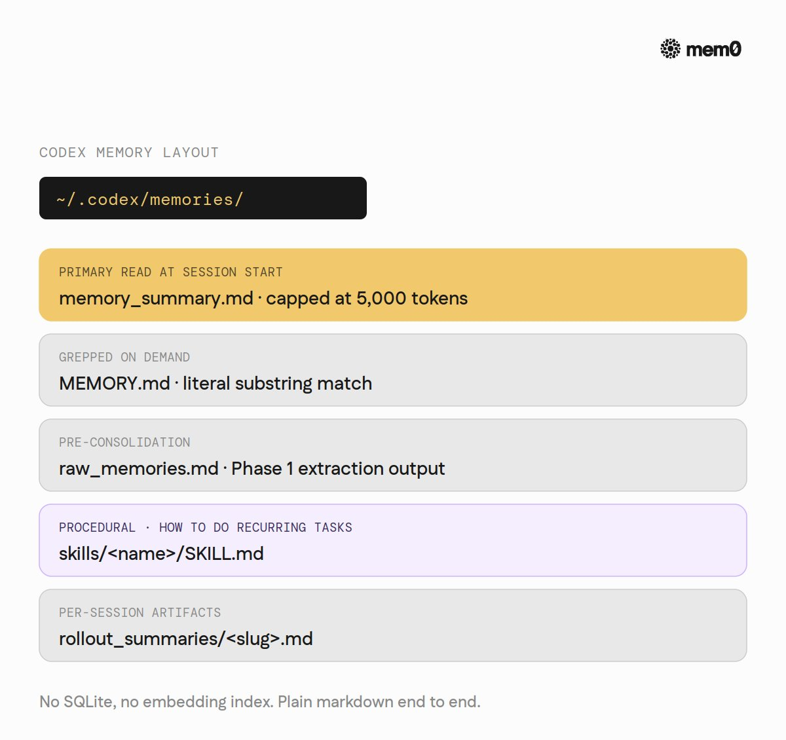
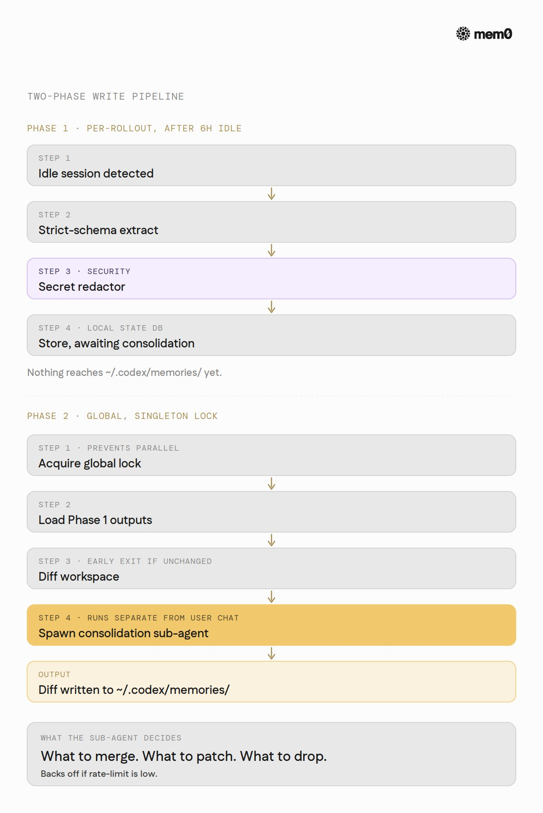
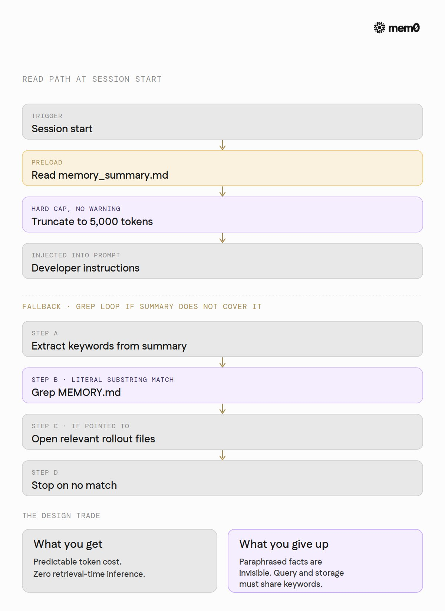
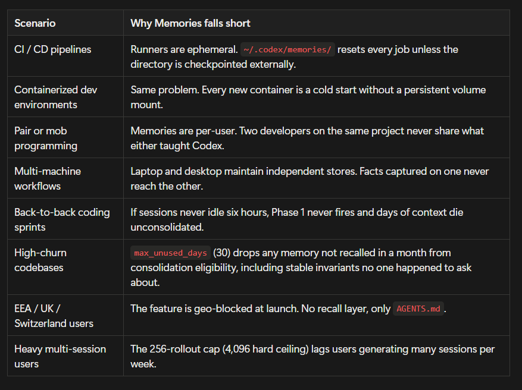
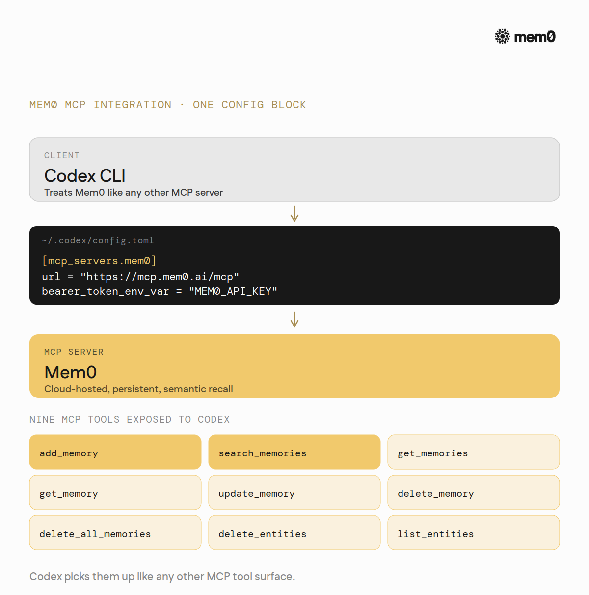

# Codex CLI 的记忆系统是如何工作的

**作者：** mem0 ([@mem0ai](https://x.com/mem0ai))  
**日期：** 2026年5月13日  
**来源：** [How Memory Works in Codex CLI](https://x.com/Zephyr_hg/status/2054580022049198513)

你有没有想过，Codex CLI 是怎么记住你的事情的？

它不是靠数据库，也不是靠什么向量检索。打开 `~/.codex/memories/`，里面就是几个 Markdown 文件。这套系统是 OpenAI 官方内置的，文档在 [developers.openai.com/codex](https://developers.openai.com/codex)，代码在 [github.com/openai/codex](https://github.com/openai/codex)，完全开源。

这篇文章是 *In Context* 系列的第九篇，我们来把这套记忆机制拆开看看。

Codex 有三种形态：CLI、IDE 插件，还有 ChatGPT 内部的云端工作空间。CLI 的文档最详细，记忆的内部实现也是开源的，所以我们就看这个。IDE 插件和它共用同一套 `~/.codex/` 配置，大部分逻辑是一样的。

## 记忆存在哪里

事情是这样的：Codex 的记忆只存在于一个目录——`~/.codex/memories/`。里面是几个固定的 Markdown 文件。没有 SQLite，没有向量索引，没有任何神秘的二进制格式。

几个关键文件：

- `memory_summary.md`：每次会话启动时第一个被读取的合并视图
- `MEMORY.md`：完整的长格式记忆文件，按需 grep 检索
- `raw_memories.md`：合并前的原始提取输出
- `skills/<name>/SKILL.md`：特定技能的记忆
- `rollout_summaries/<slug>.md`：每次会话结束后的摘要，用来驱动后续合并



就这些。其他所有东西，要么是把内容写进来的管道，要么是从里面读取数据的路径。

## 记忆是怎么写进去的

写入分两个阶段，缺一不可。

**第一阶段，发生在每次会话结束后。** 当你六个小时没动（这是默认值），Codex 会在后台悄悄启动一个任务：把这次对话历史喂给一个提取提示词，按固定格式解析出值得记住的内容，同时做一遍密钥脱敏，最后存进本地状态数据库。注意，这时候什么都还没写进记忆目录。

**第二阶段，全局合并。** 系统拿到一把全局锁，保证同时只有一次合并在跑。加载最近几次第一阶段的输出，同步到磁盘，比对一下和现有内容有没有实质差异——有的话，才启动一个独立的合并子智能体。这个子智能体读取候选记忆，判断哪些保留、哪些合并、哪些丢弃，最后把结果写回 `~/.codex/memories/`。



两个阶段都可以配置各自使用的模型（第一阶段是 `extract_model`，第二阶段是 `consolidation_model`）。合并工作在独立子智能体里完成，不会打断你当前正在进行的对话。

## 记忆是怎么被读出来的

每次会话开始，Codex 会完整读取 `memory_summary.md`，截取前 **5000 个 token**——这个数字是写在代码里的常量，公开文档没提。截取后的内容注入到开发者指令里，就是智能体一开始知道的全部背景。

如果摘要里没有你要的内容，智能体会被要求去 grep `MEMORY.md`。读取路径的逻辑是：从摘要里提取关键词，搜索 `MEMORY.md`，如果有线索指向某个会话摘要文件就打开它，找不到就停下来。整个过程被控制在很少的步骤里，不会一直搜下去。



没有嵌入向量，没有相似度搜索，没有重排序。就是纯文本加子字符串匹配，这是有意为之的设计。换来的是可预测性和几乎为零的检索成本。但代价也很明显：如果你问的方式和当初存进去的措辞不一样，就找不到。

## 几个控制开关

几个配置项管着上面的所有行为，用这套系统之前值得先了解一遍。

- **默认是关着的。** 要先开启主开关 `features.memories`。开启后，两个子开关分别管写入（`generate_memories`）和读取（`use_memories`），启用后两者默认都是 `true`。
- **空闲时间门槛。** `min_rollout_idle_hours`（默认 6）决定一次会话至少闲置多久才能触发第一阶段。活跃的会话永远不会触发。
- **合并数量上限。** `max_raw_memories_for_consolidation`（默认 256，最大 4096）限制每次合并最多考虑多少条最近的会话记录。
- **过期清理。** `max_rollout_age_days`（默认 30）让超过天数的历史不再参与记忆生成；`max_unused_days`（默认 30）让长期没被召回的记忆在下次合并时被排除出去。
- **配额感知。** `min_rate_limit_remaining_percent`（默认 25）会在 API 配额快用完时主动降低合并频率，后台任务不会把前台请求的额度吃光。
- **密钥脱敏。** 记忆写盘之前，内置凭证清理。
- **地区限制。** 发布时，EEA、英国和瑞士的用户无法使用 Memories 功能。

## 它撑不住的地方

说清楚了它是什么，再说说它不是什么。

这套记忆系统并不健壮。本质上就是一个用户在固定 token 预算里的几个 Markdown 文件，大多数问题都从这里来。

- **5000 token 的硬顶。** 每次会话启动，`memory_summary.md` 被截断到 5000 token，多余的内容静默丢弃。没有警告，没有日志，智能体就是看不到那部分。
- **只认关键词。** 没进摘要的内容，只能靠在 `MEMORY.md` 里字面匹配找到。换了个说法描述的同一件事，找不到。你问"我们的部署命令是什么"，不会找到"生产部署走 `make ship-prod`"——除非这几个词正好被存进去了。
- **文件越大，grep 越慢。** `MEMORY.md` 是线性搜索的。用了好几个月、积累了大量记忆的用户，每次未命中再 grep 都要付出更高的代价。
- **不支持手动编辑。** `~/.codex/memories/` 是 Codex 自己维护的，手动改不是受支持的路径。你真正想让智能体始终记住的事情，应该写在 `AGENTS.md` 里。
- **空闲门控有点脆。** 必须闲置六小时才能触发合并。连续高强度编程的开发者，可能永远等不到这个条件。
- **只在本地。** `~/.codex/memories/` 绑定在这台机器、这个用户上。换台电脑就是空的，没有同步，没有团队共享，没有远程备份。
- **地区封锁。** EEA、英国和瑞士用不了。

这些限制在真实团队里会以很具体的方式踢进来。



## Mem0 能做什么

Mem0 是一个坐在智能体和持久化存储之间的记忆层。

Codex 有对应的 MCP 集成，文档在 [docs.mem0.ai/integrations/codex](https://docs.mem0.ai/integrations/codex)。

Codex CLI 原生支持 MCP 服务器，在 `~/.codex/config.toml` 的 `[mcp_servers.<name>]` 下配置（[配置参考](https://developers.openai.com/codex/config-reference)）。接入 Mem0 就一个代码块：

```toml
[mcp_servers.mem0]
url = "https://mcp.mem0.ai/mcp"
bearer_token_env_var = "MEM0_API_KEY"
```

这一个配置块，向 Codex 暴露了九个 MCP 工具：`add_memory`、`search_memories`、`get_memories`、`get_memory`、`update_memory`、`delete_memory`、`delete_all_memories`、`delete_entities`、`list_entities`。智能体调用它们的方式和调用其他 MCP 工具一样。



接入之后，有几件事会本质上不一样：

- **记忆跟着人走，不绑机器。** `~/.codex/memories/` 的本地限制消失了。同一份 Mem0 存储跟随用户跨越笔记本、服务器和 CI 环境，换台机器不需要从头重建。
- **跨工具共享记忆。** 在终端用 Codex CLI、在编辑器用 Cursor 的用户，可以把两者指向同一个 Mem0 后端。在 Codex CLI 里学到的东西——比如"暂存部署脚本会静默吞掉错误，同一诊断请用生产风格的输出"——下次用 Cursor Agent 打开同一个项目时就能看到。不需要手动在两个工具之间复制任何东西。
- **按语义找，不只按关键词。** Mem0 用嵌入向量做语义搜索。你问"我们的部署命令是什么"，它能找到"生产部署走 `make ship-prod`"——即使这两组词根本不重叠。
- **用户之间互不干扰。** 每个用户的 `userId` 划定自己的记忆范围。三个使用同一 Mem0 后端的团队成员，各自有独立的存储。
- **没有 5000 token 的顶。** 检索走语义排名，不是加载整个摘要文件。记忆积累再多也不会因截断而失效。
- **实时写入，不等六小时。** Mem0 在对话过程中就写记忆，下次会话立刻能看到上次学到的东西。
- **在 Memories 不可用的地区也能用。** EEA、英国和瑞士的用户，不再需要等 Codex 的地区发布。

---

说到底，Codex CLI 的记忆层在今天的编程智能体里算是做得用心的：两阶段后台合并、密钥脱敏、基于 grep 的可预测读取路径，整套管道完全开源。

如果你已经在用 Codex CLI，上面那些短板你也遇到过，接入 Mem0 大约只需要一分钟——[docs.mem0.ai/integrations/codex](https://docs.mem0.ai/integrations/codex)

---

*In Context #9*

这篇博客是 *In Context* 系列的一部分——[@mem0ai](https://x.com/mem0ai) 关于 AI 智能体记忆和上下文工程的博客系列。

@mem0ai 是一个智能的开源记忆层，专为 LLM 和 AI 智能体设计，提供跨会话的长期、个性化、上下文感知交互。

- 免费 API 密钥：[app.mem0.ai](https://app.mem0.ai)
- 或从[开源 GitHub 仓库](https://github.com/mem0ai/mem0)自托管 mem0。
