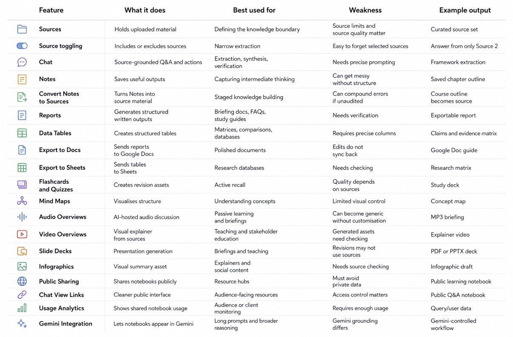
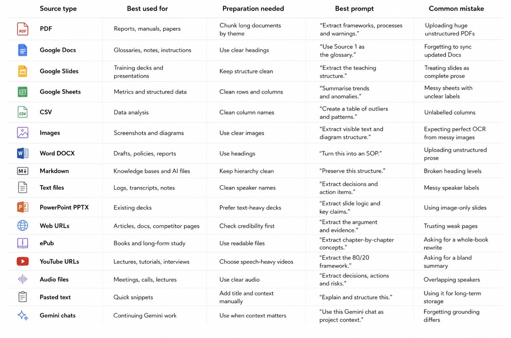

# NotebookLM，你该认真玩起来了

**作者：** hoeem ([@hooeem](https://x.com/hooeem))  
**日期：** 2026年5月14日  
**来源：** [you should be NotebookLM maxxing.](https://x.com/Zephyr_hg/status/2054652562867896520)

用 NotebookLM 的人，只占 Claude 和 ChatGPT 用户的 2.1%。

就是这 2.1% 的人，在知识处理上把其他人甩开了。

他们的秘密不是更聪明，是用对了工具。这篇文章，就是那把钥匙。

内容很长，非常非常长——不管你是刚听说 NotebookLM，还是已经用了一段时间，读完你都会有新收获：

- 深度分析
- 27 个我正在用的真实用例
- 我的提示词库
- 我的主工作流
- 文末附进阶引导课程（可选）

内容确实很多。

你可能不会一次读完，但你会回来的。

好，开始。

---

## 1：NotebookLM 到底是什么？

最准确的说法是：它是一个以你上传的资料为锚点的工作空间。

你上传可信的材料，它帮你提取、整理、比较、综合，最后转化成结构化的输出。具体能用来做什么？

- 从资料里提取知识
- 构建研究矩阵和数据表
- 把一批资料变成课程、指南或 SOP
- 把密集材料转化成学习系统
- 生成各类资产：音频概述、视频概述、报告、数据表、抽认卡、测验、幻灯片、信息图、思维导图
- 给外部 AI 助手制作知识文件
- 把客户或研究材料变成可交付的报告
- 把杂乱信息整理成可复用、可分享的结构化内容

它的核心优势在于：以来源为锚点，输出内容可以追溯引用，大大降低 AI 乱编的风险。

把它想象成这样一个系统：

- **输入层：** 上传可信资料
- **推理层：** 用聊天功能提取、比较、综合
- **捕获层：** 把有用的输出存为笔记
- **复利层：** 把有价值的笔记转成新的来源
- **资产层：** 生成报告、表格、卡片、音视频、幻灯片、信息图
- **部署层：** 导出到 Docs、Sheets、PDF、PPTX、Markdown、Notion、Obsidian 等
- **扩展层：** 需要时接入 Gemini、Claude、自定义 GPT、Zotero 等工具

这篇文章写给三类人：

- 想真正用好 NotebookLM 的初学者
- 想为学习、研究、写作和运营建立可重复工作流的中级用户
- 想搭建知识管道、输出客户报告、构建 AI 助手文件的专家

读完之后，你应该能把上传的资料，做成下面任意一种东西：知识库、课程、深度研究、指南、研究矩阵、学习系统、SOP、咨询报告、幻灯片、音频简报、内容引擎、AI 助手知识文件，或者书籍大纲。

---

## 2：它是怎么工作的？

在进入实战之前，先花几分钟搞懂它的底层结构。你对工具的理解越深，能从它身上得到的就越多。

NotebookLM 有六个层次。

**第 1 层：来源，是知识边界的起点**

来源就是你上传的一切——PDF、网页、视频、音频、电子表格、图片或粘贴的文本。

它们划定了这个笔记本"知道什么"的边界。

资料烂，输出就烂。资料好，输出才有用。
精心挑选的资料，永远强过乱塞一堆。

**第 2 层：聊天，是推理和综合发生的地方**

在聊天框里提问、提取信息、比较资料、测试想法。

聊天能做什么：来源清单、信息提取、内容综合、矛盾映射、主张核查、起草大纲和报告。

有一个容易犯的错误：上来就说"帮我总结一切"。

不要这样。从清单开始，再提取，再组织结构。

**第 3 层：笔记，是你的项目记忆**

好的输出如果不保存，会消失在漫长的聊天记录里。

笔记就是把它留住的方式。保存大纲、框架、摘要、核查过的主张，还有最终草稿。

一条好笔记，是可以反复调用的项目记忆，不只是一个保存的答案。

**第 4 层：笔记转来源，是最强的工作流之一**

这一步很关键，很多人不知道。

你可以把一个有价值的答案存为笔记，再把这条笔记转换成新的来源。这样就能分阶段搭建知识资产。

举个例子：提取出所有框架 → 保存为笔记 → 把笔记变成来源 → 让 NotebookLM 用这个框架来源做一门课程。

这一步之后，NotebookLM 就不再只是问答工具了，而是一个分阶段的知识构建系统。

**第 5 层：Studio，是从阅读助手变成生产工具的地方**

Studio 负责生成各类资产：报告、数据表、学习指南、抽认卡、测验、思维导图、音频和视频概述、幻灯片、信息图。

但记住一个顺序：先提取，再综合，最后才生成资产。别让 Studio 主导你的策略。

**第 6 层：导出与部署，是把资产送到该去地方的步骤**

- 报告和指南 → Google Docs
- 表格和矩阵 → Google Sheets
- 幻灯片 → PPTX 或 PDF
- 知识文件 → Markdown，用于 Obsidian、Notion、Claude Projects、自定义 GPT
- 音频 → MP3
- 分享给客户 → 公开笔记本链接

有一点值得说：NotebookLM 很擅长综合，但不是存储信息的最佳场所。做完之后，把知识迁移到个人维基或外部系统里。

---

## 3：功能一览

用这张表判断每项工作该用哪个功能。



---

## 4：来源策略

输出质量，高度依赖来源质量。

不同的工作，要用对应的来源类型。



来源弱，输出就弱——没有例外。

---

## 5：用例库

下面是这篇指南的实战核心。

每个用例都包含：用途、最佳来源类型、前期设置、工作流步骤、直接可用的提示词、预期输出、质量把关、常见错误、进阶版本和最终产出。

---

### 用例 1：从上传的资料构建完整知识库

你有一堆 PDF、文档、网页，想把它们变成一个可以反复使用的知识库——可以是指南、课程、操作手册、AI 助手文件，或者系列内容。

**最适合**

研究人员、创作者、顾问、企业、教育者，以及任何需要长期积累知识资产的人。

**来源类型**

PDF、Google Docs、网页、YouTube 字幕、音频字幕、ePub、Markdown、Google Slides、Sheets、CSV 和粘贴文本。

**前期设置**

删掉弱的、过时的或不相关的资料。文件名取清晰。很长的文档按主题拆块。如果有专业术语，先做一份词汇表，作为第 1 号来源上传。把笔记本角色设为"专家知识架构师"。分阶段处理，不要一次要求一个巨大的输出。

**工作流**

1. 跑一遍来源清单
2. 逐来源提取知识
3. 创建主题映射
4. 创建概念映射
5. 创建框架映射
6. 创建流程映射
7. 识别矛盾和空白
8. 构建模块化知识库
9. 把每个模块保存为笔记
10. 把有价值的笔记转换为来源
11. 用笔记来源构建最终的指南、课程或剧本
12. 审核来源覆盖情况，检查是否有无来源支撑的主张

**直接可用的提示词：**

```
Act as an Expert Knowledge Architect.

Create a complete knowledge base from the selected sources.

Work in this order:

1. Create a source inventory.
2. Extract key ideas, definitions, frameworks, processes, examples, warnings, tools and gaps.
3. Create a master theme map.
4. Create a concept map.
5. Create a framework map.
6. Create a process map.
7. Identify contradictions and missing information.
8. Build a modular knowledge base.
9. Add checklists, templates, prompts and practical exercises.
10. Finish with a source coverage and claim audit.

Write in British English.
Be comprehensive.
Do not invent unsupported examples.
Mark gaps clearly.
```

**预期输出**

包含模块、定义、框架、流程、示例、清单、模板、提示词和审核结果的结构化知识库。

**质量把关**

每个来源都出现在清单里了吗？有没有过度依赖某一个来源？完全相同的内容合并了吗？没有来源支撑的推断标注了吗？空白说明清楚了吗？

**常见错误**

上来就说"帮我总结一切"；跳过清单阶段；有用的输出没保存为笔记；把第一个答案当最终答案。

**进阶版本**

用分阶段的笔记转来源工作流：把来源清单、框架映射、模块大纲分别保存为笔记，再把最有价值的笔记转成来源，最后让 NotebookLM 以笔记来源为结构、以原始来源为证据，构建最终知识库。

**最终产出**

一个可复用的知识库。

---

### 用例 2：把资料转化为一门课程

你有一批材料，想做成一门真正结构完整的课程——有模块、有课程、有练习、有评估、有最终项目。

**最适合**

教育者、创作者、顾问、培训师、教练、企业和专家。

**来源类型**

培训手册、YouTube 教程、讲义、PDF、ePub、Google Docs、Slides 和流程文档。

**前期设置**

上传覆盖完整主题或技能的资料。做一份重要术语词汇表。把角色设为"专家课程设计师"。决定课程面向初学者、中级还是专家，或者三者都有。

**工作流**

1. 提取核心技能或主题
2. 定义课程承诺
3. 确定目标学习者
4. 制定初学者、中级、进阶三条学习轨道
5. 按顺序构建模块
6. 在每个模块里添加课程
7. 添加练习、评估和最终项目
8. 生成学习指南、抽认卡或测验
9. 把课程结构导出到 Docs

**直接可用的提示词：**

```
Act as an Expert Curriculum Designer.

Turn the selected sources into a complete course.

Include:

1. Course title
2. Course promise
3. Target learner
4. Beginner, intermediate and advanced tracks
5. Module structure
6. Lesson titles
7. Learning outcomes
8. Exercises
9. Assessments
10. Final project
11. Common mistakes
12. Required templates or worksheets
13. Suggested study schedule

Use only the selected sources.
Mark gaps where the sources do not provide enough material.
```

**预期输出**

包含模块、课程、练习和评估的完整课程蓝图。

**质量把关**

练习是否基于来源材料？课程顺序是否合理？是否对初学者友好又保留了专家深度？

**常见错误**

让 AI 在资料范围之外发明课程内容；课程范围太宽；跳过评估；没有练习的被动课程。

**进阶版本**

单独生成：学生工作册、讲师指南、幻灯片大纲、题库、最终项目评分标准、每模块音频概述、公开配套笔记本。

**最终产出**

一门完整课程。

---

### 用例 3：创建深度研究或长篇指南

你有一批散乱的研究资料，想整合成一篇有分量的长文、指南、电子书章节或技术解说。

**最适合**

作家、研究人员、创作者、创始人、分析师、学生和顾问。

**来源类型**

PDF、ePub、文章、字幕、报告、Google Docs 和网页。

**前期设置**

上传相关资料，确定最终读者，把 AI 设为"高级技术写手"或"专家解说者"，逐节构建。

**工作流**

1. 生成核心论点
2. 生成大纲
3. 把每节映射到对应的支撑来源
4. 逐节起草
5. 核查主张
6. 添加示例和注意事项
7. 构建结论
8. 导出到 Docs

**直接可用的提示词：**

```
Act as a Senior Technical Writer.

Create a long-form guide from the selected sources.

First produce:

1. Working title
2. Thesis
3. Target reader
4. Section-by-section outline
5. Main argument of each section
6. Supporting sources for each section
7. Contradictions or tensions to address
8. Gaps that need a second pass

Do not write the full guide yet.
First create the architecture.
```

**预期输出**

有来源支撑和论点流程的完整指南大纲。

**质量把关**

论点有来源支撑吗？各节逻辑顺序对吗？主张有根据吗？矛盾处理了吗？有示例吗？

**常见错误**

用一个提示词要求输出完整指南；接受通用大纲；没有把有来源支撑的主张和综合内容分开；忽视矛盾。

**进阶版本**

逐节构建，每次只写一节，包含：清晰解说、有来源支撑的主张、示例、注意事项、实操步骤、空白说明和节段摘要。

**最终产出**

一篇长篇指南或深度研究。

---

### 用例 4：构建研究矩阵或数据表

你有一堆资料，想变成可以分析的结构化数据库。

适用于：主张/证据矩阵、文献综述矩阵、竞品比较表、词汇表数据库、工具库、矛盾映射、来源质量审核、示例库、框架库、行动项目表。

**最适合**

研究人员、分析师、顾问、学生、合规团队和战略家。

**来源类型**

PDF、学术论文、报告、电子表格、CSV、网页和技术文档。

**前期设置**

上传资料，给文件取清晰的名字，生成表格前先确定列名，尽可能用数据表功能，完成后导出到 Sheets 分析。

**工作流**

1. 选择表格类型
2. 定义精确的列
3. 生成表格
4. 审核空单元格
5. 检查引用
6. 导出到 Sheets
7. 把表格当作研究数据库使用

**直接可用的提示词：**

```
Create a Data Table from all selected sources.

Use these columns:

1. Item
2. Category
3. Definition or description
4. Source-backed evidence
5. Practical implication
6. Example
7. Limitation or warning
8. Related concept
9. Confidence level
10. Gap or missing information

Rules:
- Only include information supported by the selected sources.
- Merge exact duplicates.
- Preserve different framings where they add nuance.
- Mark inferred points clearly.
- Leave a cell blank if the source does not provide the information.
```

**预期输出**

一张干净的结构化表格，可以直接导出到 Sheets。

**质量把关**

列有实际意义吗？单元格是否塞得太满？没有来源支撑的主张标注了吗？引用可以追溯吗？

**常见错误**

只说"帮我做张表"不定义列；列太多表格太宽；信任推断出来的单元格内容；不检查来源覆盖情况。

**进阶版本**

分别为框架、主张、矛盾、定义、示例、工具、来源质量、实施步骤做独立的表格。

**最终产出**

研究矩阵或结构化知识数据库。

---

### 用例 5：文献综述和学术研究

你有一批学术论文，想提取主题、比较研究方法、找出空白，构建文献综述。

**最适合**

学生、研究人员、学者和分析师。

**来源类型**

学术 PDF、期刊文章、研究数据集、方法论论文和综述文章。

**前期设置**

按子主题给论文分组；不要一次上传太多大体量 PDF；在 NotebookLM 外部用引用管理工具；把角色设为"博士后研究员"。

**工作流**

1. 上传一批有针对性的论文
2. 创建来源审核表
3. 提取研究问题和研究方法
4. 按主题对论文分组
5. 识别共识和分歧
6. 比较各论文的研究方法
7. 提取研究空白
8. 生成文献综述大纲
9. 导出到 Docs，用引用工具正确引用

**直接可用的提示词：**

```
Act as a post-doctoral researcher.

Conduct a literature review of the selected papers.

Include:

1. Major thematic clusters
2. Consensus view in each cluster
3. Dissenting papers or opposing findings
4. Methodologies used
5. Methodological weaknesses
6. Key evidence
7. Research gaps
8. Suggested research questions
9. Literature review outline

Use source-backed claims only.
Mark inferred synthesis clearly.
```

**预期输出**

包含方法比较和空白分析的主题文献综述大纲。

**质量把关**

AI 有没有混淆相关性和因果关系？有没有夸大共识？有没有编造研究空白？引用手动核查了吗？

**常见错误**

把 NotebookLM 当引用管理工具；一次上传太多论文；直接要求完整论文章节；忽视方法论差异。

**进阶版本**

创建：方法论矩阵、证据质量表、矛盾映射、研究空白表、论文章节大纲、口头答辩问题库。

**最终产出**

文献综述大纲和研究矩阵。

---

### 用例 6：考试复习和主动学习

你有一堆学习材料，想把被动阅读变成主动回忆、测验、抽认卡和有结构的复习计划。

**最适合**

学生、备考者、职业学习者，以及任何需要啃密集材料的人。

**来源类型**

讲义、教科书 PDF、历年考题、笔记、YouTube 讲座和学习指南。

**前期设置**

一次只上传一个模块的材料；把 NotebookLM 设为"严格的苏格拉底式导师"；生成学习指南、抽认卡和测验；用聊天功能做主动回忆训练。

**工作流**

1. 上传学习材料
2. 请它生成概念映射
3. 生成学习指南
4. 生成抽认卡或测验
5. 进入苏格拉底式测试模式
6. 追踪薄弱领域
7. 生成复习计划
8. 每周重复一次

**直接可用的提示词：**

```
Act as a strict Socratic tutor.

Test me on the selected sources one question at a time.

Rules:
- Ask one question.
- Wait for my answer.
- Grade my answer against the sources.
- Explain what I got right.
- Explain what I missed.
- Give a hint before giving the full answer.
- Track my weak areas.
- At the end, create a revision plan based on my mistakes.
```

**预期输出**

包含测试、抽认卡、薄弱领域追踪和复习指导的完整学习系统。

**质量把关**

测验答案有来源支撑吗？薄弱领域追踪准确吗？问题难度合适吗？解释对初学者友好吗？

**常见错误**

被动读摘要；只要求笔记；不测试回忆；不复习错题。

**进阶版本**

```
Create three levels of questions from the selected sources:

1. Beginner recall questions
2. Intermediate application questions
3. Expert-level exam questions that expose shallow understanding

Include answers, explanation and source support.
```

**最终产出**

一个主动学习系统。

---

### 用例 7：YouTube、播客和字幕的内容再利用

你有一段长视频或播客，想从里面提取所有有价值的东西，变成文章、帖子、新闻通讯或短视频脚本。

**最适合**

创作者、新闻通讯作者、营销人员、研究人员和教育者。

**来源类型**

YouTube 链接、播客字幕、音频文件和粘贴的字幕。

**前期设置**

上传字幕或链接；只选相关来源；确定输出格式；把角色设为"内容策略师"。

**工作流**

1. 提取关键想法
2. 提取框架
3. 提取故事和示例
4. 提取钩子和令人难忘的句子
5. 构建内容角度
6. 创建新闻通讯、主题帖、文章或轮播图
7. 对照字幕核查主张

**直接可用的提示词：**

```
Analyse this transcript.

Extract:

1. Core thesis
2. Key ideas
3. Frameworks
4. Examples
5. Stories
6. Warnings
7. Strong quotes
8. Content hooks
9. Contrarian angles
10. Practical takeaways

Then turn the strongest ideas into:
- one newsletter outline
- one X thread
- one LinkedIn post
- one short-form video script
- one infographic prompt
```

**预期输出**

来自单一来源的内容再利用包。

**质量把关**

它有没有发明演讲者没说过的内容？钩子准确吗？主张可以核查吗？

**常见错误**

只要求通用摘要；丢失最精彩的示例；过度润色到输出毫无特色；没有单独提取钩子。

**进阶版本**

把你表现最好的内容数据一起上传，让 NotebookLM 识别钩子、主题和结构上的规律。

**最终产出**

内容再利用包。

---

### 用例 8：业务 SOP 和运营手册

你有一堆散乱的运营知识——通话录音、会议记录、语音笔记，想把它们整理成标准操作程序或培训材料。

**最适合**

创始人、机构、运营经理、顾问和团队。

**来源类型**

会议字幕、通话录音、语音笔记、政策文件、内部手册、Google Docs 和截图。

**前期设置**

上传原始材料；上传你的 SOP 模板；把角色设为"运营架构师"；让它指出缺失的步骤和潜在风险。

**工作流**

1. 提取原始流程
2. 识别所需工具
3. 确定负责人和输入项
4. 把流程转化为 SOP
5. 添加质量保证检查点
6. 添加故障排除指南
7. 添加操作清单
8. 导出到 Docs 或 Notion

**直接可用的提示词：**

```
Turn the selected source material into a formal Standard Operating Procedure.

Use this structure:

1. SOP title
2. Purpose
3. When to use this SOP
4. Owner
5. Required tools
6. Required inputs
7. Step-by-step process
8. Quality standard
9. Common failure points
10. Troubleshooting
11. Escalation rules
12. Final checklist

Do not invent missing steps.
If a step is unclear, mark it as a gap.
```

**预期输出**

基于原始材料整理出来的干净 SOP。

**质量把关**

步骤顺序对吗？缺失的工具标注了吗？交接环节清晰吗？质量标准可衡量吗？

**常见错误**

没上传 SOP 模板；让 AI 自己发明缺失的运营细节；跳过质量保证和升级规则；没有和实际执行这个流程的人一起复核。

**进阶版本**

把多个 SOP 合并成一份完整的运营手册。

**最终产出**

SOP 或运营手册。

---

### 用例 9：会议记录、通话和语音笔记处理

一场会议结束后，你想快速提取出所有决策、行动项目、风险和跟进事项。

**最适合**

项目经理、高管、顾问、团队和自由职业者。

**来源类型**

音频文件、Zoom 字幕、通话字幕、语音笔记和会议记录。

**前期设置**

上传音频或字幕；带上之前的项目简报（如有）；把角色设为"项目经理"；让说话人标签尽量干净。

**工作流**

1. 上传字幕
2. 提取摘要
3. 提取决策
4. 提取行动项目
5. 提取风险和未决问题
6. 起草跟进邮件
7. 保存为笔记
8. 把定期会议笔记转成项目来源，积累成持续更新的项目记录

**直接可用的提示词：**

```
Analyse this meeting transcript.

Provide:

1. 3-sentence executive summary
2. Key decisions made
3. Action item table with owner and deadline
4. Risks raised
5. Open questions
6. Dependencies
7. Follow-up email draft
8. Project brief update

If the transcript does not clearly assign an owner or deadline, mark it as unclear.
```

**预期输出**

会议简报、行动项目表和跟进邮件。

**质量把关**

有没有搞混说话人？截止日期是真实的还是推断的？行动负责人正确吗？敏感内容安全吗？

**常见错误**

信任杂乱的说话人标签；不核查行动项目；未经授权上传敏感材料；没有保存输出。

**进阶版本**

每次会议摘要都变成一个来源，让笔记本逐渐积累成整个项目的记录库。

**最终产出**

会议简报和项目行动日志。

---

### 用例 10：客户交付物和咨询工作流

你有一批客户材料，想把它们变成审核报告、战略建议、提案或实施计划。

**最适合**

顾问、机构、教练、自由职业者和顾问。

**来源类型**

发现访谈记录、问卷、销售页面、数据导出、竞品链接、报告和内部文档。

**前期设置**

每个客户单独建一个笔记本；绝不混用客户数据；上传客户材料和你的报告模板；把角色设为"战略顾问"。

**工作流**

1. 提取客户的核心问题
2. 提取客户目标
3. 识别材料中的矛盾
4. 审核现有材料
5. 对照上传资料中的最佳实践进行比较
6. 构建建议
7. 撰写战略备忘录
8. 制作幻灯片大纲
9. 核查所有客户引用

**直接可用的提示词：**

```
Act as a Strategy Consultant.

Review the selected client materials.

Create an audit report with:

1. Client context
2. Stated goals
3. Current strategy
4. Main problems
5. Blind spots
6. Contradictions in the client's own material
7. Opportunities
8. Recommended implementation roadmap
9. Risks
10. Next steps

Use specific source-backed evidence.
Do not invent client facts.
```

**预期输出**

咨询备忘录或审核报告。

**质量把关**

客户引用准确吗？AI 有没有夸大发现？建议有证据支撑吗？机密材料安全吗？

**常见错误**

在一个笔记本里混用多个客户数据；输出千篇一律的通用建议；不核查引用；让 AI 发明客户背景。

**进阶版本**

做一个面向客户的笔记本，包含安全材料、常见问题解答、幻灯片、音频简报和使用分析。

**最终产出**

客户审核报告或提案幻灯片。

---

### 用例 11：内容创作者研究引擎

你想搭建一个研究库，能把素材快速转化为文章、新闻通讯、脚本、帖子和钩子。

**最适合**

新闻通讯作者、X 创作者、YouTuber、LinkedIn 创作者、分析师和教育者。

**来源类型**

文章、YouTube 字幕、书籍、语音备忘录、竞品内容、数据 CSV 和研究 PDF。

**前期设置**

每个内容支柱单独建一个笔记本；上传高质量的长青资料和你自己的笔记草稿；把角色设为"内容策略师"。

**工作流**

1. 提取核心想法
2. 提取钩子
3. 提取叙事结构
4. 提取示例
5. 生成内容角度
6. 生成文章大纲
7. 生成帖子
8. 生成视觉概念
9. 核查主张
10. 保存可复用的框架

**直接可用的提示词：**

```
Act as a Content Strategist.

Review the selected sources and create a content engine.

Extract:

1. Strongest ideas
2. Best hooks
3. Contrarian angles
4. Examples and stories
5. Useful frameworks
6. Common mistakes
7. Audience pain points
8. Content angles
9. Newsletter ideas
10. X/Twitter thread ideas
11. LinkedIn post ideas
12. Visual infographic concepts

Preserve source accuracy.
Avoid generic content.
```

**预期输出**

一份内容策略包。

**质量把关**

听起来太通用了吗？钩子有资料支撑吗？示例真实吗？主张可以核查吗？

**常见错误**

要求"写出病毒式内容"；忘记先提取结构；丢失自己的声音；发布未经核查的内容。

**进阶版本**

上传表现最好的内容数据，让 NotebookLM 逆向分析规律。

**最终产出**

内容引擎。

---

### 用例 12：幻灯片和演示文稿

你需要做一个演示，想用资料生成有结构、有来源支撑的幻灯片。

**最适合**

高管、教育者、顾问、销售团队、研究人员和培训师。

**来源类型**

报告、项目简报、幻灯片、PDF、数据表和战略文档。

**前期设置**

先在聊天里构建有来源支撑的幻灯片大纲，核查主张之后再生成幻灯片，把幻灯片生成当作草稿工具，仔细修改。

**重要规则**

修改幻灯片时，NotebookLM 不会自动用来源核查新内容。先建大纲，核查完，再生成，修改完，再次手动核查事实。

**工作流**

1. 在聊天里创建幻灯片大纲
2. 核查主张
3. 把大纲保存为笔记
4. 生成幻灯片
5. 修改清晰度和设计感
6. 导出为 PPTX 或 PDF
7. 手动检查数字和主张

**构建大纲用提示词：**

```
Create a source-backed slide deck outline.

For each slide include:

1. Slide title
2. Core message
3. Source-backed bullet points
4. Supporting source name
5. Any numbers or claims requiring manual verification
6. Suggested visual
7. Speaker note

Do not create the slide deck yet.
First produce the verified outline.
```

**修改用提示词：**

```
Revise the slide deck for clarity and presentation quality.

Only revise:
- wording
- layout
- visual hierarchy
- slide flow
- audience clarity

Do not introduce new factual claims.
Do not add new statistics.
Do not change numerical claims unless I provide the corrected numbers manually.
```

**预期输出**

经过核查的幻灯片大纲和可导出的演示文稿。

**质量把关**

数字正确吗？幻灯片文字是否过多？先核查了大纲吗？修改时有没有引入新主张？

**常见错误**

没核查大纲就生成幻灯片；同时修事实和改设计；把生成的幻灯片当最终版本；不检查数字。

**进阶版本**

上传品牌规范，让 NotebookLM 调整语气和演讲者注释，仍然手动核查所有事实。

**最终产出**

演示幻灯片。

---

### 用例 13：音频概述和播客

你想把资料变成一段可以听的音频——简报、辩论、解说，或者通勤路上学习用的材料。

**最适合**

学生、高管、创作者、通勤族、听觉型学习者和教育者。

**来源类型**

报告、论文、字幕、YouTube 视频、笔记和课程材料。

**前期设置**

只选相关来源；用定制选项（有铅笔图标的地方）；指定格式、受众、语气和目标；认真工作时不要用默认生成。

**工作流**

1. 选择来源范围
2. 选择音频概述
3. 进行定制
4. 选择格式：简报、深度研究、辩论、批评、初学者解说或专家简报
5. 生成音频
6. 听一遍并核查
7. 觉得有用就下载

**直接可用的提示词：**

```
Format this Audio Overview as a Debate.

Focus only on the failure modes of the methodology in the selected sources.

Host A should defend the methodology.
Host B should act as a sceptic and ask practical questions.

Do not summarise the whole notebook.
Focus on:
- risks
- limitations
- trade-offs
- implementation mistakes
- how to avoid failure
```

**预期输出**

一段基于所选来源的有实质内容的音频讨论。

**质量把关**

讨论是否变得太通用？主持人有没有编造观点？来源范围太宽了吗？语气符合目标吗？

**常见错误**

选了所有来源；直接点默认生成；没定制主持人角色；把音频内容当作经过核查的事实。

**进阶版本**

把音频概述变成内容管道：生成 MP3 → 外部转录 → 提取片段和帖子 → 用作学习或培训素材。

**最终产出**

音频简报或播客。

---

### 用例 14：视觉思维

你有密集的资料，想把它变成可以看得见的结构——思维导图、信息图、流程图。

**最适合**

视觉型学习者、教育者、战略家、创作者、培训师和研究人员。

**来源类型**

报告、教科书、字幕、图表、幻灯片和长篇指南。

**前期设置**

选范围明确的来源；确定要输出的视觉内容；使用思维导图、信息图、幻灯片大纲或图表提示词。

**工作流**

1. 提取层次结构
2. 生成思维导图
3. 生成信息图概念
4. 用文字输出流程图结构
5. 把输出当作视觉简报使用

**直接可用的提示词：**

```
Review the selected sources.

Create a visual thinking map with:

1. Central concept
2. Main branches
3. Sub-branches
4. Dependencies
5. Sequence of ideas
6. Contradictions or tensions
7. Suggested diagram formats
8. Suggested infographic structure

Output as Markdown.
```

**预期输出**

概念图、流程图或信息图简报。

**质量把关**

层次结构准确吗？关系是不是编造的？映射是否过于混乱？依赖关系正确吗？

**常见错误**

一次视觉化太多来源；没提取结构就要求好看的图；不核查来源逻辑就信任图表。

**进阶版本**

把视觉映射变成：信息图提示词、幻灯片结构、教学图表、流程图、比较图。

**最终产出**

视觉映射或信息图计划。

---

### 用例 15：来源审核和核查

你上传了很多资料，但不确定它们是否可信、是否最新、是否有矛盾。在开始综合之前，先跑一遍审核。

**最适合**

研究人员、记者、分析师、顾问、学生和合规团队。

**来源类型**

所有类型的来源。

**前期设置**

在开始综合之前先跑这个流程。

**工作流**

1. 清点来源
2. 检查日期和作者
3. 评估有用程度
4. 识别薄弱来源
5. 识别矛盾
6. 删掉低质量来源
7. 每次生成重要输出后都跑一遍主张核查

**直接可用的提示词：**

```
Conduct a rigorous Source Audit.

Create a table with:

1. Source name
2. Source type
3. Publication date if available
4. Author or organisation if available
5. Core thesis
6. Usefulness rating
7. Potential bias or weakness
8. What this source is best used for
9. Whether it should be kept, removed or used cautiously

Then identify any contradictions between sources.
```

**预期输出**

一份来源质量报告。

**质量把关**

日期是实际存在的还是被推断的？AI 是否推断了缺失的元数据？薄弱来源删了吗？识别出的矛盾真实吗？

**常见错误**

跳过来源审核；信任每一个上传的链接；保留旧的或质量差的资料；不检查矛盾。

**进阶版本**

每次生成重要输出后都进行完整的主张核查。

**最终产出**

来源审核报告。

---

### 用例 16：大型项目和多笔记本管理

你的项目很大，一个笔记本装不下。这是管理跨笔记本项目的系统化方法。

**最适合**

博士项目、书籍写作、企业知识库、研究团队和大型内容系统。

**来源类型**

大体量来源库、PDF、书籍、字幕、报告和项目文档。

**前期设置**

接受一个笔记本装不下所有东西。按主题、项目、受众或输出类型拆分来源。用外部存储做永久记忆。

**工作流**

1. 创建主题笔记本
2. 分别处理每个笔记本
3. 生成 Bridge Summary（跨笔记本摘要）
4. 导出 Bridge Summary
5. 存到 Obsidian、Notion、Docs 或 Zotero
6. 需要跨笔记本工作时用 Gemini 辅助
7. 把最终草稿带回 NotebookLM 核查

**直接可用的提示词：**

```
Create a Bridge Summary for this notebook.

The summary must represent the most important knowledge from all selected sources.

Include:

1. Core topic
2. Main themes
3. Key frameworks
4. Important evidence
5. Contradictions
6. Gaps
7. Useful examples
8. Recommended next-step questions
9. Source list

This Bridge Summary will be exported into an external knowledge base.
Make it dense and portable.
```

**预期输出**

一份可以在笔记本外部独立使用的高密度摘要。

**质量把关**

涵盖了所有主要来源吗？来源名称保留了吗？重要空白包含在内了吗？在 NotebookLM 外部还能用吗？

**常见错误**

把大 PDF 拼合来绕过来源上限；做一个装所有东西的超级笔记本；没有导出摘要；离开 NotebookLM 后丢失引用上下文。

**进阶版本**

搭建协作网络：NotebookLM 做以来源为锚点的综合 → Zotero 管理论文 → Obsidian 或 Notion 做永久存储 → Gemini 负责跨笔记本协调。

**最终产出**

跨笔记本知识系统。

---

### 用例 17：NotebookLM 和 Gemini 联用

NotebookLM 擅长提取和核查，Gemini 擅长长篇生成和广泛推理。把两个工具的优势结合起来。

**最适合**

重度用户、创作者、开发者、战略家、教育者和研究人员。

**来源类型**

NotebookLM 输出、报告、Gemini 对话记录、Google Docs 和导出的笔记。

**前期设置**

NotebookLM 负责提取，导出给 Gemini 做生成，最终输出带回 NotebookLM 核查。

**工作流**

1. 在 NotebookLM 里完成提取
2. 保存或导出提取内容
3. 用 Gemini 把提取内容做成指南、课程、代码简报、电子书或剧本
4. 用 NotebookLM 来源核查 Gemini 的输出
5. 回到 NotebookLM 生成 Studio 资产

**Gemini 提示词：**

```
You are working from a NotebookLM extraction.

Your job is to turn the extracted source-grounded material into a final knowledge asset.

Rules:
- Do not restart extraction.
- Do not invent unsupported claims.
- Separate source-backed material, synthesis and inference.
- Preserve all high-signal frameworks, examples, tactics and warnings.
- Write in British English.
- Structure the output as a practical playbook.

Build:
1. Executive overview
2. Core mental model
3. Feature-to-outcome map
4. Use-case library
5. Prompt library
6. Source-type strategy
7. Verification system
8. Recommended notebook architectures
9. Final knowledge asset pipeline
10. Final audit
```

**预期输出**

长篇指南、课程、剧本或扩展的知识产出物。

**质量把关**

Gemini 有没有加入来源中没有的网络知识？主张还能追溯吗？它有没有改变来源的含义？

**常见错误**

用 Gemini 做提取而不用 NotebookLM；忘记 Gemini 的来源锚定方式不同；让 Gemini 发明示例；没有把最终输出带回来核查。

**进阶版本**

让 Gemini 负责：编码、长提示词编辑、电子书重构、文章生成、网站搭建、广范围创意扩展。让 NotebookLM 负责：来源提取、核查、Studio 输出、引用检查。

**最终产出**

Gemini 加持的知识资产。

---

### 用例 18：定制 AI 助手知识文件

你想把一个领域的专家知识，整理成可以上传进 Claude Projects 或自定义 GPT 的结构化知识文件。

**最适合**

AI 搭建者、运营团队、创作者、顾问和教育者。

**来源类型**

SOP、字幕、手册、专家笔记、框架、示例和风格指南。

**前期设置**

上传专家级的原始材料；提取决策规则、术语和工作流；导出为 Markdown 或 JSON。

**工作流**

1. 提取领域概述
2. 提取关键术语
3. 提取框架
4. 提取工作流
5. 提取示例
6. 提取硬性规则
7. 提取回答风格
8. 创建 AI 助手知识文件
9. 用示例提示词测试

**直接可用的提示词：**

```
Create an AI Assistant Knowledge File from the selected sources.

Include:

1. Assistant role
2. Domain overview
3. Target user
4. Key terminology
5. Core principles
6. Frameworks
7. Workflows
8. Decision rules
9. Examples
10. Mistakes to avoid
11. Answer style guidance
12. Boundaries
13. Uncertainty rules
14. Required output formats

Write in clean Markdown.
Make it suitable for uploading into a Custom GPT or Claude Project.
```

**预期输出**

一份结构清晰的 AI 助手知识文件。

**质量把关**

规则是否明确无歧义？示例有来源支撑吗？边界清晰吗？助手知道什么时候说"信息不足"吗？

**常见错误**

上传原始笔记而不是结构化知识；指令太模糊；没给示例；没定义输出格式。

**进阶版本**

创建：Markdown 知识文件、JSON 配置文件、提示词指令、测试用例、评估清单。

**最终产出**

AI 助手知识文件。

---

### 用例 19：书籍、电子书或长篇内容

你要写一本书或一个大型系列，想用 NotebookLM 帮你整理研究、搭建结构、分配证据。

**最适合**

作者、创作者、学者、教育者和新闻通讯作者。

**来源类型**

ePub、书籍笔记、访谈录音、字幕、草稿、研究论文和大纲。

**前期设置**

上传研究资料和草稿材料；把角色设为"高级编辑"；逐章推进，不要一次要求整本书。

**工作流**

1. 提取核心论点
2. 提取书籍的主要论据
3. 构建章节映射
4. 把证据分配到各章
5. 识别空白
6. 起草章节大纲
7. 生成练习或工作册材料
8. 构建配套资产

**直接可用的提示词：**

```
Act as a Senior Editor.

Use the selected sources to create a book architecture.

Include:

1. Book title options
2. Core thesis
3. Target reader
4. Chapter-by-chapter outline
5. Main argument of each chapter
6. Supporting source material
7. Examples to include
8. Gaps in the source material
9. Exercises or workbook ideas
10. Promotional content angles
```

**预期输出**

包含证据支撑和章节逻辑的书籍架构。

**质量把关**

论点连贯吗？章节有没有重复过多？示例真实吗？整本书有没有递进感？

**常见错误**

让 NotebookLM 为整本书代笔；用太多不相关的资料；跳过确立论点的步骤；不检查叙事是否流畅。

**进阶版本**

生成：配套工作册、章节练习、课程版本、系列文章、发售推广内容、AI 助手版本。

**最终产出**

书籍大纲和研究库。

---

*X 出问题了，不让我继续保存。这篇要分成两部分，链接我标在下面了。*

*更新，来了：*


