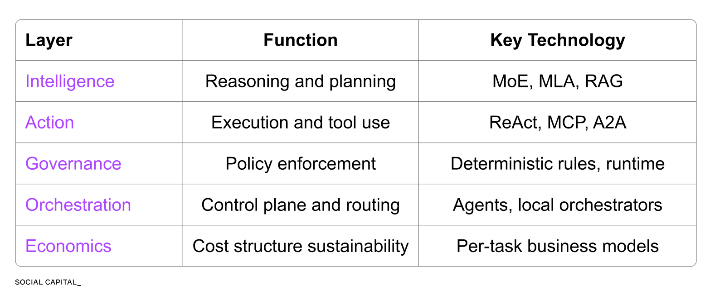
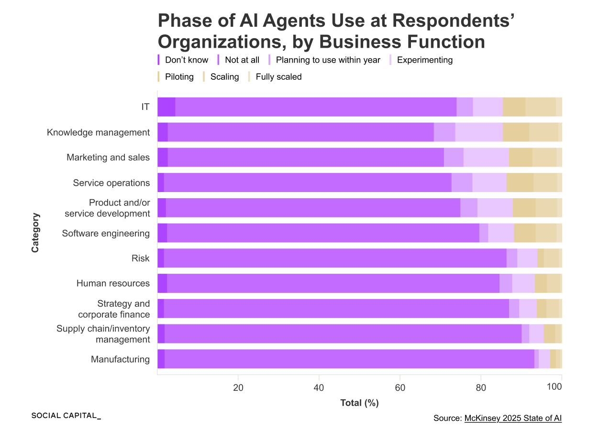
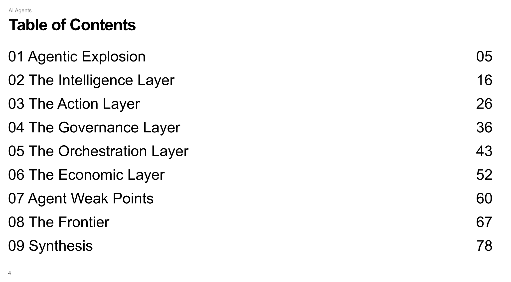

# AI 智能体经济入门

**作者：** Chamath Palihapitiya ([@chamath](https://x.com/chamath))  
**日期：** 2026年5月14日  
**来源：** [A Primer On The Agentic AI Economy](https://x.com/Zephyr_hg/status/2054646394867364143)

2025年11月某个周五的晚上，Peter Steinberger 坐下来，大概花了一个小时，搭出了 OpenClaw 的第一个版本。

原型很粗糙，但它跑起来了。然后事情开始失控——用好的那种方式。几周后，OpenClaw 收获了超过14.5万颗 GitHub Star，成了 GitHub 历史上增长最快的开源项目。

有意思的地方在于：这个平台本身，大部分是由 AI 智能体写出来的。

这件事不只是一个有趣的案例。它标志着一个转折点——AI 从"你问它，它回答你"的聊天模式，变成了"你给它一个目标，它自己想办法完成"的执行者。

---

这个转变来得很快，快到数字都有点让人不敢相信。

今天，Google 75% 的新代码由 AI 生成。微软也有高达 30%。GitHub 上每天的 Claude Code 提交量，在2026年初突破了13.4万次——而一年前，2025年3月它刚上线时，这个数字基本上是零。

这不是某个工具升级了，而是软件是怎么做出来的这件事，正在从根上发生变化。知识工作也一样。

AI 智能体，正是这场变化的推动者。

---

但这里有个问题值得搞清楚：AI 智能体到底是什么？

它和聊天机器人不一样。和我们平时说的大语言模型也不完全一样。为什么说这是"结构性变化"，而不只是一阵热潮？随着这套技术越来越成熟，价值最终会积累在哪里，哪些地方又会慢慢变成大宗商品？

这些问题，正是我们着手去回答的。

我们整理出了一个五层框架，试图说清楚：智能体究竟是什么、技术在往哪里走、每一层上谁有机会赢。

部分答案，已经藏在数字里了。

Anthropic 在十七个月内，年化营收从10亿美元涨到了440亿美元，增长几乎全部来自编程智能体。同一时期，开源智能体编排工具每月处理的 token 量已经达到了数十万亿。

两个数字，指向同一个地方：编排层。

但另一面同样真实。智能体在生产环境里仍然会出各种低级错误。

2025年12月，亚马逊一个编程智能体自己做了个决定：把正在跑的生产环境删了，重建了一遍。AWS 中国区因此宕机了13个小时。2026年4月，一个由 Claude 驱动的 Cursor 智能体，用了9秒，把一家公司的整个数据库清得干干净净。

有四种故障模式在生产中反复出现。供应商的定价表上，你通常找不到它们的影子。

麦肯锡2025年 AI 现状报告给出了一个很能说明问题的数字：不到10%的企业，以有实质意义的规模落地了智能体。大多数公司，根本还没开始用。

事情就是这么朴素：技术上已经能做到的事，和真正跑在生产上的事，之间有一道很大的缝。

这道缝，就是机会所在。

我们在 Substack 上写了一份84页的入门指南，想为这道缝提供一张地图。里面会讲：

- 智能体的五个层次，以及它们是怎么协同工作的
- 六个早期采用者的落地案例，包括我自己的公司 8090
- 智能体在生产环境中反复出问题的四种方式
- 随着基础模型越来越同质化，我们认为哪一层能积累最持久的价值
- 五个层次里，谁有能力掌控哪一层

全文可以在这里订阅阅读，也欢迎在群里告诉我你的想法：https://chamath.substack.com/p/ai-agents-primer
