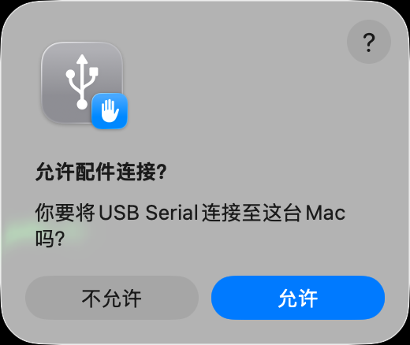
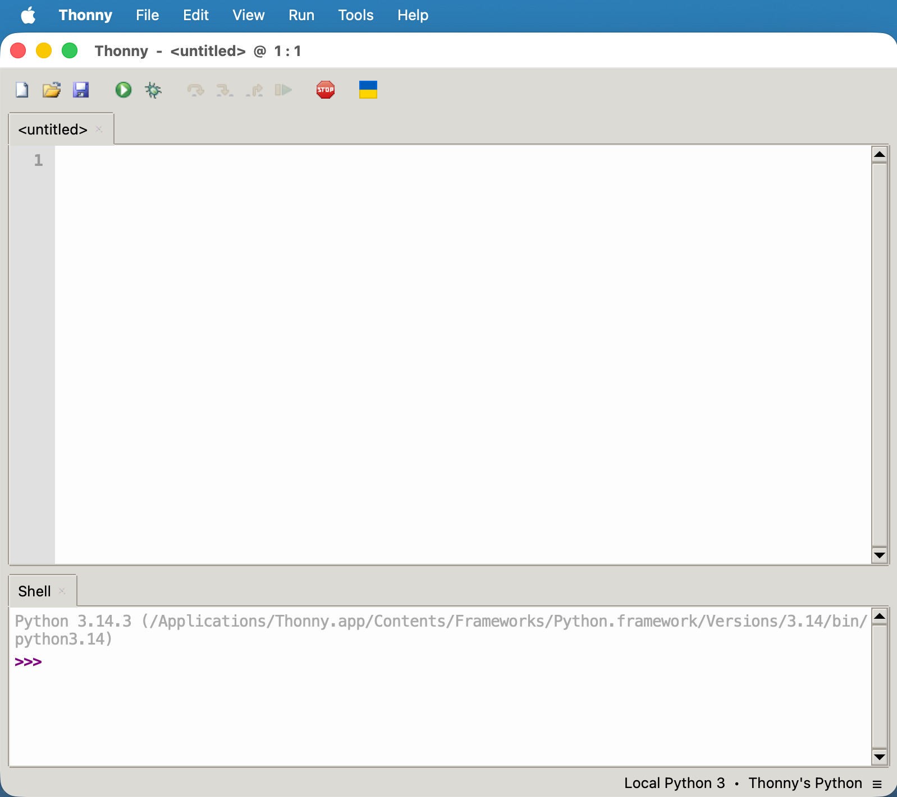
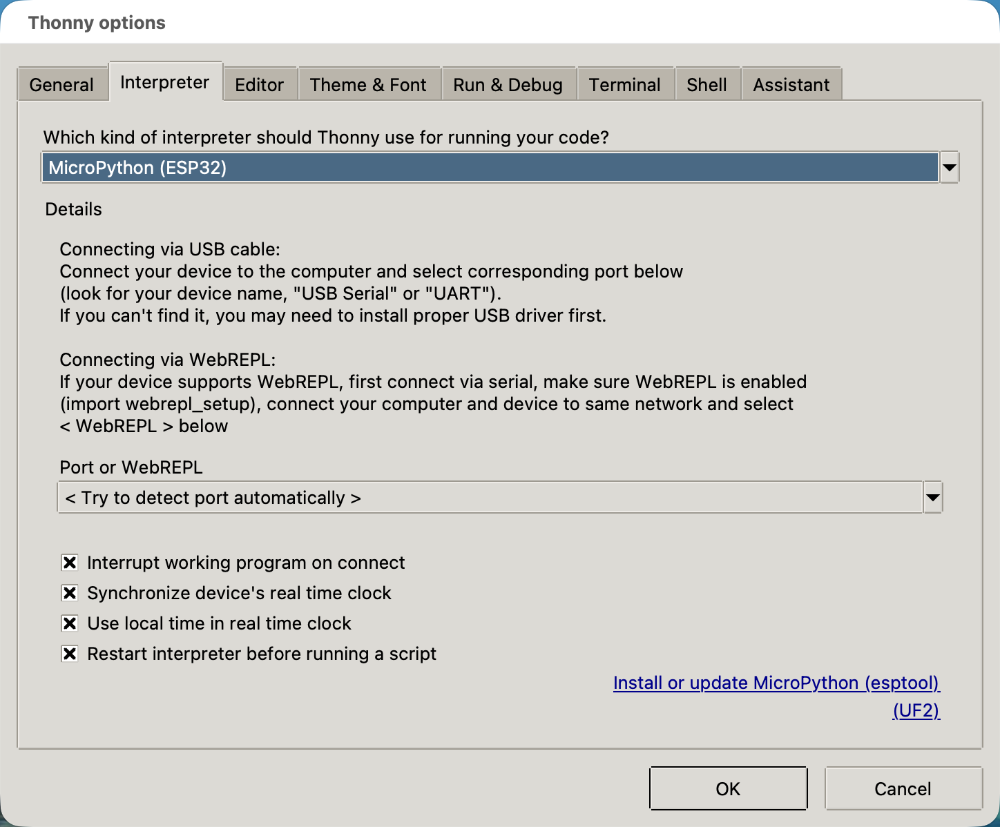
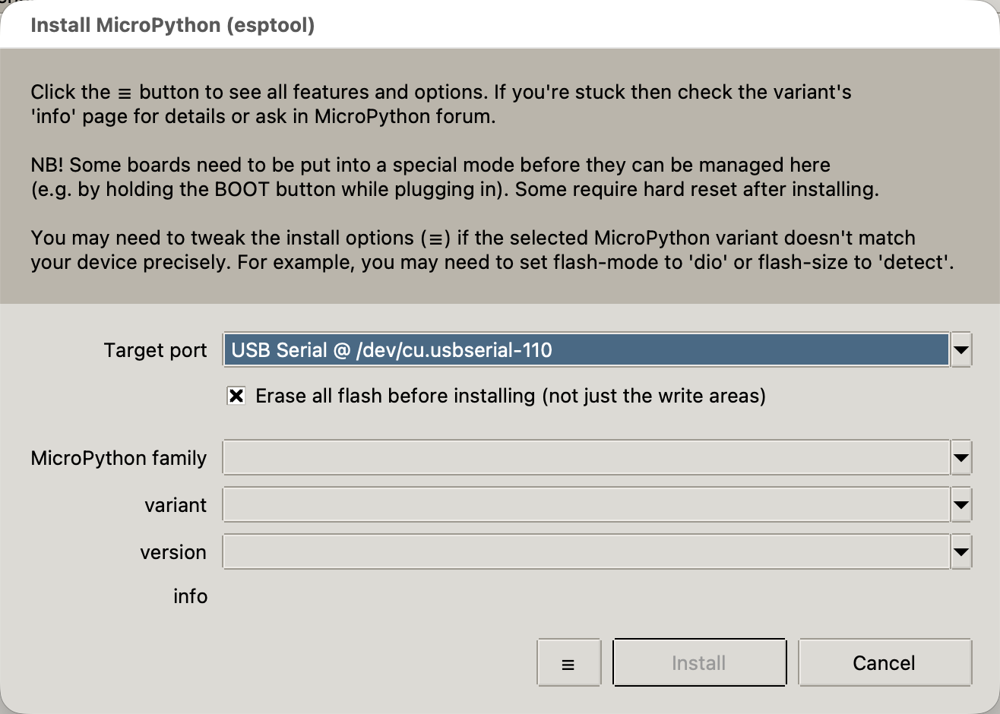
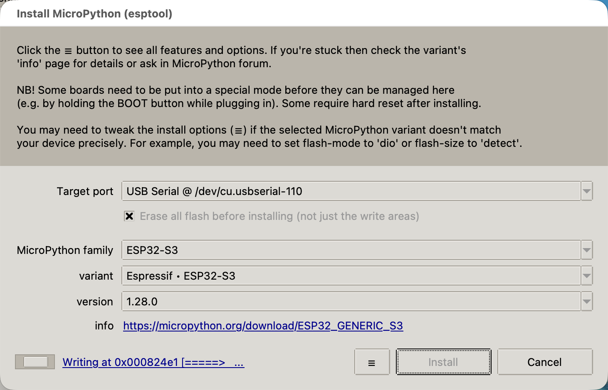
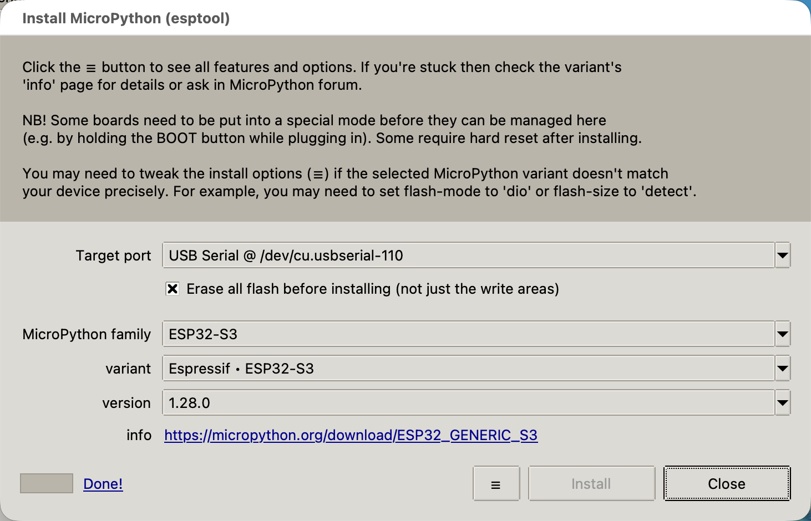
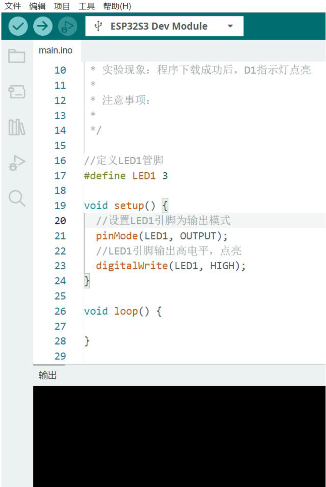
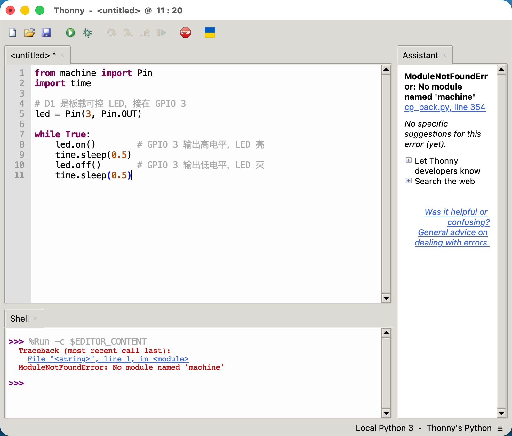

# ESP32-S3 第一次点亮 LED 开发日志

> 这篇文档记录的开发过程，绝大部分工作由 Claude Code 完成，我自己主要做的是傻瓜式截图，以及在关键时刻翻出了卖家提供的教程，提供了一些辅助信息。
>
> 其实一开始，我打算老老实实按照卖家教程一步一步操作。但当 Type-C 线连上电脑和板子的那一刻，我突然想：链路已经通了，为什么还要自己动手？于是把控制权交给了 Claude Code。

**板子型号：** 普中-ESP32S3 AI机器视觉开发板  
**开发语言：** MicroPython  
**开发工具：** Thonny  
**系统环境：** macOS  

---

## 第一步：连接硬件

使用 Type-C 数据线将 ESP32-S3 连接到 Mac。连接后，macOS 弹出提示框询问是否允许 USB Serial 设备接入，点击"允许"。



通过终端确认设备已被识别：

```
/dev/cu.usbserial-110
```

---

## 第二步：选择开发方式

ESP32 开发有两种主流方式：

| 方式 | 语言 | 难度 |
|------|------|------|
| ESP-IDF | C/C++ | 较复杂 |
| MicroPython + Thonny | Python | 简单 |

由于有 Python 基础，选择 **MicroPython + Thonny**。

---

## 第三步：安装 Thonny

从 [thonny.org](https://thonny.org) 下载 Mac 版并安装。

Thonny 是专为 MicroPython 设计的 IDE，自带固件烧录功能，新手友好。



---

## 第四步：烧录 MicroPython 固件

ESP32 出厂不带 MicroPython 环境，需要先烧录固件。

**操作路径：** Tools → Options → Interpreter → MicroPython (ESP32)



点击 **"Install or update MicroPython (esptool)"**，进入烧录界面：

- **Target port：** USB Serial @ /dev/cu.usbserial-110（自动识别）
- **MicroPython family：** ESP32-S3
- **variant：** Espressif · ESP32-S3
- **version：** 1.28.0



点击 **Install**，等待烧录完成（约 1-2 分钟）。



显示 **Done!** 即烧录成功。



**Shell 输出确认 MicroPython 已启动：**

```
MicroPython v1.28.0 on 2026-04-06; Generic ESP32S3 module with ESP32S3
```

> 注：启动时出现的 PSRAM 相关错误可以忽略，是通用固件与该板子没有外部 PSRAM 的正常不匹配，不影响使用。

---

## 第五步：尝试点亮 LED（踩坑过程）

### 尝试 1：GPIO 48（失败）

大多数通用 ESP32-S3 开发板的板载 LED 在 GPIO 48，于是先试了这个：

```python
from machine import Pin
import time

led = Pin(48, Pin.OUT)  # GPIO 48，大多数 ESP32-S3 通用板的板载 LED

while True:
    led.on()
    time.sleep(0.5)
    led.off()
    time.sleep(0.5)
```

**结果：** 无反应。

### 尝试 2：NeoPixel RGB LED，GPIO 48（失败）

ESP32-S3 的板载灯很多是 RGB 彩灯（NeoPixel/WS2812），不能用普通 `Pin.on()` 控制，需要用 `neopixel` 模块：

```python
import neopixel
from machine import Pin
import time

# NeoPixel 是 RGB 彩灯，通过数据协议控制，不是简单高低电平
np = neopixel.NeoPixel(Pin(48), 1)  # GPIO 48，1 颗灯

while True:
    np[0] = (255, 0, 0)  # 红色 (R, G, B)
    np.write()            # 发送颜色数据
    time.sleep(0.5)
    np[0] = (0, 0, 0)    # 关灯
    np.write()
    time.sleep(0.5)
```

**结果：** 无反应。

### 尝试 3：查厂商 MicroPython 教程，GPIO 15（失败）

找到厂商提供的 MicroPython 教程，显示接线说明为 `D1 --> 15`，于是改用 GPIO 15：

```python
from machine import Pin
import time

led = Pin(15, Pin.OUT)  # 厂商教程指定 GPIO 15

while True:
    led.on()
    time.sleep(0.5)
    led.off()
    time.sleep(0.5)
```

**结果：** 无反应。也试了低电平点亮（`led.off()` 亮，`led.on()` 灭），仍然无反应。

### 关键发现：查厂商 Arduino 教程，GPIO 3（成功！）

找到厂商提供的 Arduino（C++）版教程，其中写道：

```c
#define LED1 3  // D1 LED 接在 GPIO 3
pinMode(LED1, OUTPUT);
digitalWrite(LED1, HIGH);
```

虽然这是 C++ 代码，无法直接在 Thonny 里运行，但它明确告诉了我们引脚号是 **GPIO 3**。



---

## 第六步：成功点亮 LED

### 最终代码

```python
from machine import Pin
import time

# D1 是板载可控 LED，接在 GPIO 3
# Pin(3, Pin.OUT) 表示使用 GPIO 3 号引脚，模式为输出
led = Pin(3, Pin.OUT)

while True:
    led.on()        # 给 GPIO 3 输出高电平（3.3V），LED 亮
    time.sleep(0.5)
    led.off()       # 给 GPIO 3 输出低电平（0V），LED 灭
    time.sleep(0.5)
```

### 注意：Thonny 解释器设置

运行前需确认 Thonny 右下角显示的是 **MicroPython (ESP32)**，而不是 **Local Python 3**。

- **Local Python 3**：运行在你的 Mac 上，没有 `machine` 模块，会报错 `ModuleNotFoundError: No module named 'machine'`
- **MicroPython (ESP32)**：运行在 ESP32 上，才能控制硬件



**运行成功，D1 LED 开始每 0.5 秒闪烁一次。**

---

## 经验总结

1. **引脚号没有统一标准**：不同厂商的开发板，LED 接在哪个 GPIO 各不相同。换新板子时，第一步要查厂商提供的原理图或教程，不能靠猜。

2. **LED 类型有两种**：
   - 普通 LED：用 `Pin.on()` / `Pin.off()` 控制
   - RGB 彩灯（NeoPixel）：需要用 `neopixel` 模块，通过数据协议发送颜色值

3. **Thonny 解释器必须切换到 MicroPython (ESP32)**：否则代码在 Mac 上运行，找不到硬件相关模块。

4. **停止程序**：点击 Thonny 工具栏的红色 Stop 按钮即可停止运行。

---

## 板子信息

| 项目 | 信息 |
|------|------|
| 板子型号 | 普中-ESP32S3 AI机器视觉 |
| 芯片模组 | S3-N16R8（16MB Flash + 8MB PSRAM） |
| 串口 | /dev/cu.usbserial-110 |
| D1 LED 引脚 | GPIO 3 |
| MicroPython 版本 | v1.28.0 |
