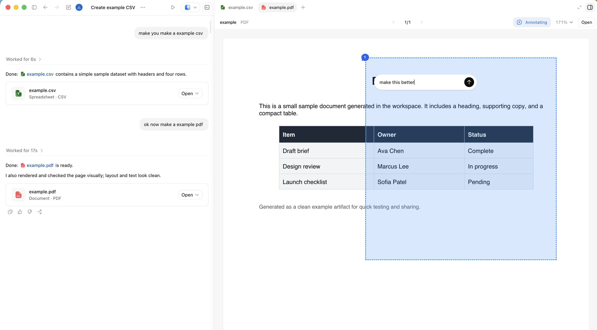
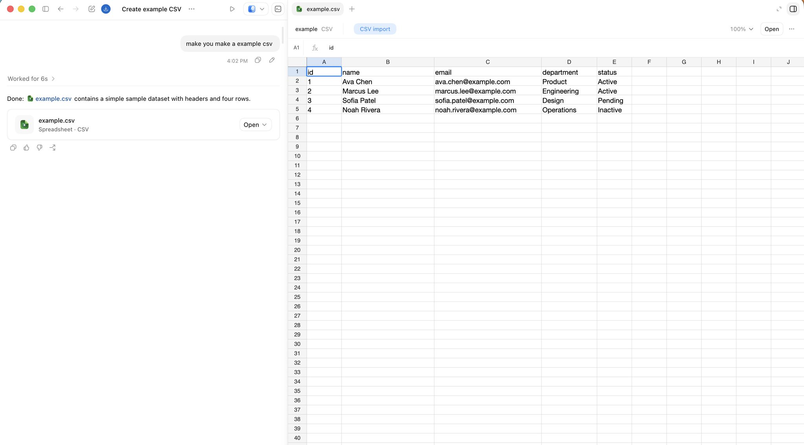
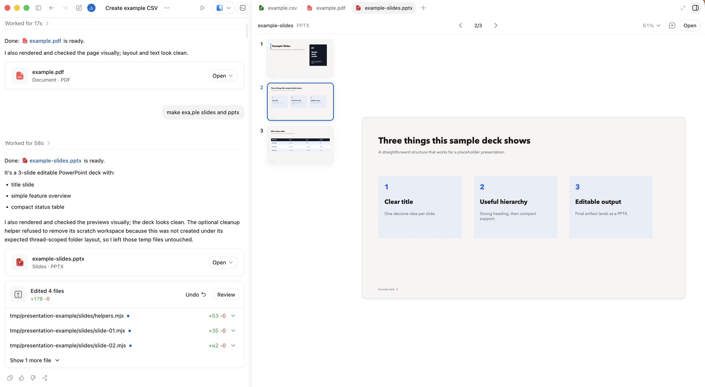

# 充分利用 Codex

**作者：** jason ([@jxnlco](https://x.com/jxnlco))  
**日期：** 2026年5月21日  
**来源：** [Getting the most out of Codex](https://x.com/Zephyr_hg/status/2057153744630890620)

大多数人第一次用编码智能体，想的都是同一件事：让它帮我写代码。看看仓库、改出一份 diff、跑一遍测试、提一个 PR——干完收工。

这些活儿，至今仍是 Codex 的看家本领。可话说回来，我们每天在电脑上做的事，其实大半本来就要靠代码：执行 shell 命令、翻网页、调 API、导出文档、收到消息就响应、顺手触发一堆自动化。这些场景一个个向 Codex 敞开之后，有意思的事情发生了——它越来越不像一个只会写代码的助手，而更像一个能帮你把电脑上的活儿统统接过去的帮手。

Codex 应用把这种转变落到了实处。一个线程能记住前因后果、能调用工具、能把做出来的东西摆给你看，还能跨好几轮对话一直接着干，而不是聊完一轮就清零、下一轮从头再来。

那要想真正把 Codex 用透，诀窍就是把下面这几样能力凑到一块儿用：

- 能记住上下文、长期留着的持久线程
- 趁你还在场时随手用的语音、引导和排队
- 让 Codex 走出代码仓库去办事的浏览器、电脑操作、MCP 服务器和各种连接器
- 你人不在的时候，替你把活儿往下推的线程自动化和目标
- 侧边面板——代码、文档、幻灯片，做出来的东西都能在这儿当面审

下面就一样一样来看。

## 持久线程

先说说什么叫持久线程：就是那种能跨好几次会话、把工作上下文一直保住、长期运行的 Codex 线程。

想让这样的线程随时在手边，一个办法是把它"固定"住。哪些活儿适合固定？那些会反反复复出现的，比如：

- 一个当幕僚长用的线程
- 一个专管发布的线程
- 一个做文档审阅的线程
- 一个专门盯着外部动态的线程

这些更像是你长期经营的工作台，而不是聊两句就散场的对话。Codex 隔三差五就能回来接着用，之前定下的决策、你的偏好、当时的来龙去脉，全都还在，不用每次推倒重来。

固定线程还配了快捷键，用起来更顺手：Command-1 到 Command-9，一按就直接跳进对应的线程。

## 语音输入

语音输入好在哪？好在它能趁一个念头还没被你打磨成规规矩矩的文字之前，先把它最毛糙的样子抓下来。

Codex 自带语音输入。尤其是那种说出来很顺、打字却特别费劲的模糊念头，用它最合适：

> 我记得好像有个叫 Ben 的人在 Slack 里提过这事。
> 细节我忘了。
> 你帮我去查查。

对一个能搜索、能自己收集背景、还能回头跟你汇报的智能体来说，给到这点信息，往往就够它干活了。

它还特别适合这种场合：任务还没想清楚，你先花两三分钟，把脑子里的想法一股脑倒出来。

转录稿也是一个道理。一份原始的会议记录、一段随口说出来的计划草稿，常常比一段工整的摘要更管用——因为那些没拿准的地方、特意加重的语气、说了一半的思路，它都给你留着了。

## 引导和排队

语音再配上对当前任务的直接掌控，就更得力了。

这里有两个动作，先说"引导"：意思是趁当前这一步还没干完，半路给一个正在进行的 Codex 任务塞进新方向。

什么时候用得上？当它走偏了、你得在它做完之前赶紧拉回来的时候。比方说你正在审一个网站，可以一边在侧边面板上圈圈点点，一边直接打断它：

- 这个再做小一点
- 这俩元素之间的间距看着不太对
- 这段文案写错了

再说"排队"，这就是另一回事了：是给 Codex 把当前这步做完之后再接着做的活儿提前安排好。

排队不打断手头的任务，只是把下一件事排进队里。你可能会这么说：

> 这事做完之后，把预览链接发给 Slack 里的审阅者。

说白了，引导改的是 Codex 此刻在做什么，排队改的是它接下来做什么。不管哪个，都让你在活儿展开的过程中一直跟得很近。

## 工具和能伸到的地方

线程一旦有了连续性，下一个问题自然就来了：它到底能在什么东西上动手？Codex 可以一层一层往外伸：

- `$browser`，对应侧边面板里的应用内浏览器，Codex 在这儿查看、标注网页
- `@chrome`，对应你已经登录好的浏览器状态和基于 Chrome 的工作流
- `@computer`，对应那些只能靠桌面图形界面才能做的活儿

各管各的：`$browser` 适合在侧边面板里审网页，`@chrome` 适合那种得借你 Chrome 登录状态的浏览器工作，`@computer` 则专管那些非得在桌面界面上点点划划才能完成的任务。

MCP 服务器和连接器，把同样的思路又往外铺了一层，铺到了工作流的其他环节。为什么 Slack、Gmail、日历这些这么重要？因为很多要紧的事，在变成代码之前，最先冒头的形式往往是一条消息、一封邮件，或者一个排不开的日程。

技能则让那些重复的流程能反复用。一套流程一旦被证明好使，就把它打包成技能，下次 Codex 直接拿来跑，不用从头再学一遍。

## 随时随地都能干活

有了 Codex 移动应用，你就不用死守在桌子前了。一个任务可以先在 Mac 上开个头——文件、权限、本地环境都是现成的——然后等你掏出手机，再接着往下走。

别小看这点，关键时候很管用。Codex 跑一个耗时长的任务时，你大可起身离开，在外头随手回个问题、点头放行下一步，或者趁还没回来，先把方向掰一掰。本地那套环境一直在原地候着，你不用陪着它。

## 自动化

自动化，就是让 Codex 按你定好的时间自己去跑活儿。这里要分两种。一件反复要做、每次都该从一个工作空间从头开始的事——比如每日报告、定期的仓库巡查——用计划自动化；要是这件事该回到一段还带着上下文的对话里接着干，那就用线程自动化。

线程自动化是什么呢？你可以把它想成一种"心跳"：像心跳那样按节奏定时把你唤醒，而且每次都回到同一个 Codex 线程上。

固定线程虽好，可它终归得等你回来。线程自动化不一样，它能每隔几分钟、几小时就主动去瞄一眼某件事，一直瞄到某个条件满足为止，还会看情况自己调节奏。

举个例子，一个当幕僚长用的线程，可能每 30 分钟就跑一回：

> 每 30 分钟，查一下 Slack 和 Gmail 里需要我处理、还没回的消息。
> 帮我理一理哪些最要紧。
> 要是有人问我问题，尽量帮我把答案研究透，替我起草一份回复——但先别发。

等你回来，收集背景这件最磨人的活儿，往往已经替你办妥了。至于最后发不发、发什么，仍旧是人说了算。

线程自动化还特别配反馈这种来来回回的场景。它可以盯着 PR 评论、Google Docs 评论或者 Slack 回复，趁你不在的时候，让相关的活儿一直往前走。

想象一个做动画的流程：一位审阅者在 Slack 里发来一段视频。线程自动化可以按点去看这个对话，评论一来就渲染出新的一版，再在同一个对话里回复、@ 上那位审阅者。万一某个集成搞不定最后的上传，桌面自动化还能通过图形界面把这一步收尾。

你看，这一圈下来，串起了三头：管反馈的 Slack、管渲染的代码库，还有管最终上传的桌面自动化。

## 目标

什么时候"目标"最见威力？当一个任务有一条实打实的终点线，智能体能一个劲儿朝它使劲的时候。反过来，下面这种就是没什么劲的目标——

先说清楚目标是什么：有明确终点线、智能体能长期朝它持续努力的 Codex 任务。

> 把这个 Markdown 文件里的计划实现出来。

这就太空了。一个更有劲的目标，得带上一个能量出来的成功标准。

打个比方，一位工程师想把一个内部工具从 Python 搬到 Rust。他可以先把新目录建好、把目标定下来，再把终点线钉死：新版本得等单元测试全过了，才算完工。

说到底，一个目标，就是把"一直干"和"一个验证器"绑在一块儿。你来定要什么结果、定干到哪儿停，再定一个信号——好让大家看清楚 Codex 到底有没有在靠近。

好用的验证器，比如：

- 一套测试
- 一个基准测试
- 一个 bug 复现
- 一张验证矩阵
- 一条必须一直跑得通的端到端流程

有雄心当然是好事。可光有雄心、不去验证，那到头来也就是空想一场。

## 侧边面板

侧边面板做的事很简单：把做出来的东西，就摆在产生它的那段对话旁边。你不用先导出、再在几个窗口之间来回切，当场就能审。产出可能是代码，也可能是一份幻灯片、一个 PDF、一个网页、一张表格，或者一路上顺手攒出来的别的什么。

它尤其擅长这四件事：

1. 查看做出来的东西
2. 标出哪儿要改
3. 操作网页
4. 审阅改动

Markdown、电子表格、数据表、文档、幻灯片，都能在侧边面板里就地审。你可以查看、标注、修改，从头到尾不打断手上这摊活儿。



**标注**

幻灯片或 PDF 可以一直开在产生它的线程旁边，看哪儿不对，随时审、随时改。



**Codex 里的表格**

应用内浏览器让 Codex 能查看一个渲染好的页面、能操控它，还能直接在你正审的那个界面上回应你的标注。对页面、对成果的意见，就留在这摊活儿里头，不用再单独走一趟交接。

这么一来，网页既是输出，也成了操控的界面。Codex 可以做出一个东西，在侧边面板里打开、查看、调试，就地把同一个对象一遍一遍打磨好。



下面这几类界面，配合起来尤其顺手：

- index.html，适合轻量的静态成果
- Storybook，适合审 UI
- Remotion Studio，适合用程序做动画
- 基于浏览器的幻灯片，适合做演示
- 数据应用，适合走分析类的流程

一个 index.html 文件，就能变成一个长期能用的交互式成果，连服务器都省了。线程自动化还能时不时帮你刷新这些静态成果——这样你一回来，线程里就有新东西候着了。

## 共享记忆

长期运行的线程，要是能把记忆从单个对话里拎出来、放到外面共享，会更顶用。

这就是"共享记忆"：存在单个线程之外的持久上下文，让往后的活儿能从一个明明白白、看得见的地方接着往下做。

有一个经得住时间的做法，是把持久线程锚在一个 Obsidian 库里。说白了，就是一个装着纯文本文件的文件夹——好查、好改、好搬，也方便长期留着。这个文件夹放哪儿都行：云存储、Git、Dropbox、Google Drive，哪个顺手用哪个。

一个库大概长这样：

```
vault/
├── TODO.md
├── people/
├── projects/
├── agent/
└── notes/
```

在最顶上，AGENTS.md 可以立个规矩：随着 Codex 越来越摸清相关的人、项目、决策和那些还没了结的事，它该怎么去更新这个工作空间。

别照搬别人某一套现成的库结构。真正要做的，是教会智能体三件事：持久上下文该放哪、哪些值得留下来、什么时候该收手别瞎折腾。

一份实用的 AGENTS.md，可能会这么写：

```
- 把 ~/vault 当作长期的工作记忆。
- 宁可几篇规整的笔记，也别让笔记到处泛滥。
- TODO、人、项目、每日小结、临时笔记，明确地各归各位。
- 决策、阻碍、负责人、日期、有用的链接，都得留好。
- 要是没什么实质变化，就别去折腾这个库。
```

仓库装的是代码，库装的是不断攒起来的上下文：都有谁掺和进来、什么变了、什么卡住了、什么还得跟进，还有那些本来会在一次次会话之间悄悄溜走的东西。

要紧的上下文，别让它只活在一份对话记录里。写下来，放在下一个线程能接着捡起来的地方。

对了，Codex 在"设置 > 个性化 > 记忆"里也自带一套记忆功能。它给你的偏好、常走的流程、踩过的坑提供一个本地的回忆层。它是给你写下来的那些上下文打打补充，而不是来替代它们。Chronicle 也是朝这个方向使劲的，它帮 Codex 从你最近的屏幕内容里把记忆攒出来。

## 从代码往外走

说到底，Codex 还是从代码起步的。可围着代码转的那一圈活儿，如今越来越多都能通过同一个系统够着了：MCP 服务器、浏览器界面、桌面操控、线程自动化，还有那些可以当面审的成果。

这就把"由谁掌控、怎么掌控"这件事给改了。引导，是半路打断手头进行中的活儿；排队，是把下一个任务排上;线程自动化，是趁你走开时让线程一直活着；目标，是给 Codex 立一条它能一直朝着使劲的具体终点线。

如今的 Codex，能把一个工作流从下指令、到执行、再到审成果，一路给你带下去——哪怕这活儿，早就走出了代码仓库。
