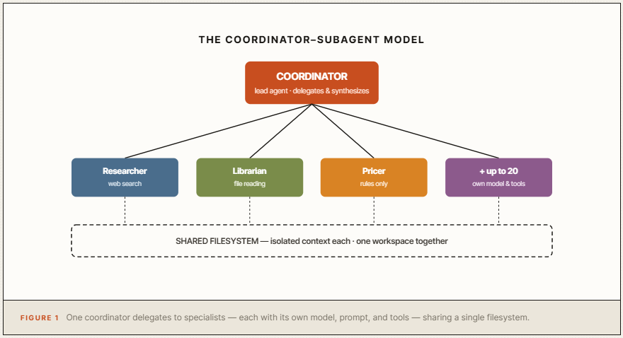
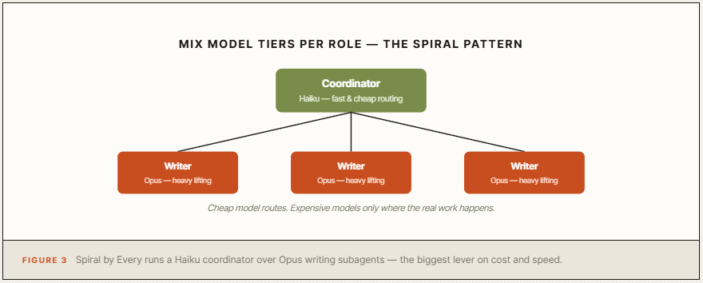
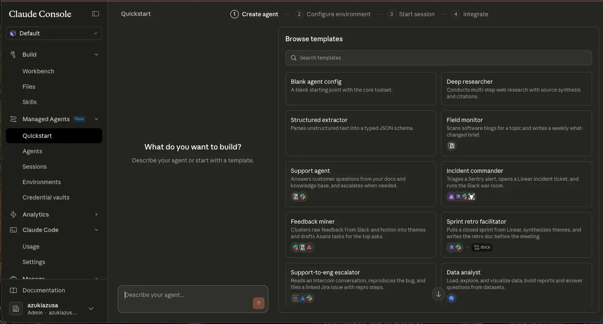
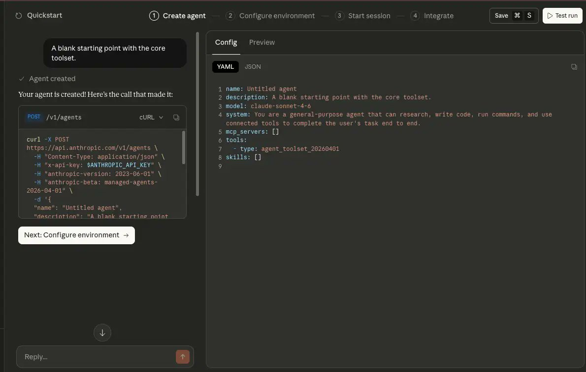
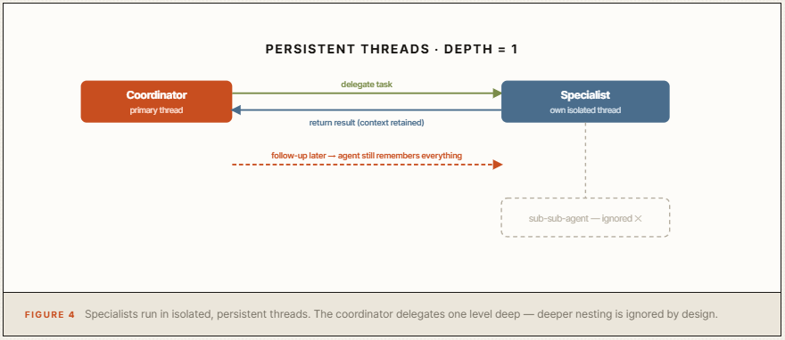
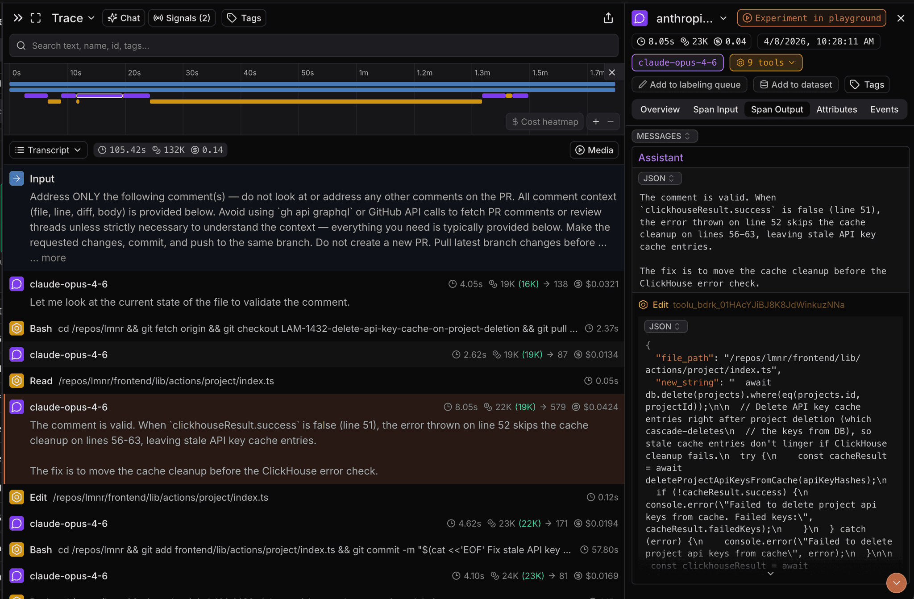

# How to build a team of Claude agents in 10 steps: from one agent to 20 working in parallel

**Author:** Codez ([@0xCodez](https://x.com/0xCodez))  
**Published:** May 24, 2026  
**Source:** [How to build a team of Claude agents in 10 steps](https://x.com/0xCodez/status/2058513716509913581)

I have combined everything that works about multi-agent orchestration on Claude — official docs, the cookbook, real setups from Netflix and Spiral — into one walkthrough.

Bookmark this. Save it. By the end you will know how to turn one overloaded agent into a coordinated team of up to 20, working in parallel.

Follow my Substack to get fresh AI alpha: movez.substack.com

That is not hyperbole. Until April 2026 this required months of infrastructure engineering. Now it is a YAML config and 10 steps.

## Why one agent hits a wall

You built one agent. It worked. So you gave it more to do.

Add a research capability. Add report writing. Add data analysis. Add a review step. Each addition made the system prompt longer, the tool list bigger, and the context window more crowded.

Then one day you noticed the agent getting slower, more confused, and worse at the things it used to nail. This is not a model problem. It is an architecture problem.

A single agent has one context window, and every capability you bolt on competes for the same limited attention. Past a certain complexity, a generalist juggling ten jobs performs worse than ten specialists each doing one.

The fix is a team. Not a bigger prompt — a division of labor.



Three facts define the architecture, straight from the docs: up to 20 unique agents in a roster, each in its own isolated context window, all sharing one filesystem. Isolated thinking, shared workspace — that is what lets a team work in parallel without chaos.

## Decide & Design

### 01. Confirm you actually need a team

Do not reach for multi-agent because it sounds impressive. It costs more tokens and adds coordination overhead. Reach for it when one of three things is true:

- **Parallelization.** The work splits into independent subtasks — separate log files, separate code modules. A single agent does these in sequence; a team does them at once.
- **Specialization.** Different problems need different expertise — a security reviewer, a doc writer, a pricing modeler — and one generalist context-switching between them degrades all of them.
- **Escalation.** Most work is simple, but some subtasks are unexpectedly hard. A team routes the hard ones to a more powerful model instead of paying for it on every step.

### 02. Map the roles before you write anything

Multi-agent design is org design. Before any code, sketch the team on paper: one coordinator, and a list of specialists with one clear job each.

Anchor it in a real pattern. Anthropic's documented incident-response example: a lead agent runs the investigation while subagents fan out through deploy history, error logs, metrics, and support tickets — all at once.

Four specialists, one coordinator, work that would be sequential for a single agent happening in parallel.

Name each role, give it a one-sentence job, note its model and tools. If two roles overlap, merge them. Fewer, sharper specialists beat many fuzzy ones.

### 03. Pick a model per role — this is where the savings live

The move most people miss: every agent in the team can run a different model. You are not locked to one.

The production pattern from Spiral by Every proves it — they use Haiku as the coordinator and Opus as the writing subagents.



The coordinator just routes and sequences, which a fast cheap model does fine. The expensive heavy lifting happens only in the specialists that need it.

Match the model to the job. Mixing tiers per role is the single biggest lever on cost and speed.

## Build the Team

### 04. Set up Managed Agents

Every multi-agent request runs on Claude Managed Agents and requires the beta header `managed-agents-2026-04-01`. The SDK sets it automatically.

Why Managed Agents and not your own setup? Because the moment a team needs to run remotely, scale to many users, share a filesystem, and persist state, you face an infrastructure problem — sessions, memory, security, sandboxing.

Managed Agents handles all of it so you only design the team. Install the Anthropic SDK, set your API key from the Console, and you are ready.



### 05. Create each specialist as its own agent

Build the specialists first, bottom-up. Each is a standalone agent with its own model, prompt, and scoped toolset. Create them and keep their agent IDs — the coordinator will reference them.

The discipline that matters: scope each specialist's tools tightly. In the cookbook's sales-proposal example, the researcher gets web search, the librarian gets file reading only, and the pricing modeler sees only the rules file and the seat count.

Each agent touches exactly what its job requires and nothing more — which keeps it focused and the whole system auditable.

### 06. Create the coordinator and declare the roster

Now the lead agent. You mark an agent as coordinator by setting the `multiagent` field, listing the subagent IDs it may delegate to. The config is deliberately concise:

```yaml
name: Engineering Lead
model: claude-opus-4-7
system: >
  You coordinate engineering work. Delegate code review
  to the reviewer agent and test writing to the test agent.
tools:
  - type: agent_toolset_20260401
multiagent:
  type: coordinator
  agents:
    - type: agent
      id: $REVIEWER_AGENT_ID
    - type: agent
      id: $TEST_WRITER_AGENT_ID
```

That `agent_toolset_20260401` tool is what gives the coordinator the ability to delegate at all. The roster takes up to 20 entries.



You can pin a specific agent version, reference the latest, or use `{"type": "self"}` to let the coordinator spawn copies of itself for recursive parallelization.

### 07. Write the coordinator's prompt as a manager, not a doer

This is where teams succeed or fail. The coordinator's system prompt should not try to do the work — it should describe how to delegate the work.

A good coordinator prompt says: here are your specialists, here is what each is for, here is how to decide who gets what, here is how to combine their outputs. It reasons about sequencing and synthesis, not domain details — those live in the specialists.

If you are writing domain instructions into the coordinator, that content belongs in a subagent instead.

Here is a real coordinator prompt for an incident-response team — notice it never investigates anything itself, it only routes and synthesizes:

```text
You are the incident-response coordinator. You do NOT
investigate anything yourself. Your only job is to delegate
to your specialists and synthesize what they return.

Your specialists:
- deploy_agent  → reviews recent deploy history for changes
- logs_agent    → searches error logs for anomalies
- metrics_agent → checks dashboards for abnormal patterns
- tickets_agent → scans support tickets for user reports

How to work:
1. When an incident arrives, delegate to ALL FOUR
   specialists in parallel — do not wait for one before
   starting the next.
2. Give each specialist only the incident description and
   the time window. Nothing else.
3. When results return, look for correlation across them
   (e.g. a deploy that lines up with a log spike and ticket
   surge points to a root cause).
4. If one specialist's finding is unclear, send it a
   follow-up — it remembers its previous turn.

Output format:
- ROOT CAUSE: one sentence, or "unconfirmed"
- EVIDENCE: one bullet per specialist that contributed
- RECOMMENDED ACTION: one clear next step

Never include raw logs or full ticket text in your final
answer — synthesize, do not dump.
```

Every line is about delegation, correlation, and output shape. The actual log-searching and metric-reading lives in the specialists, where it belongs.

## Run, Observe, Improve

### 08. Understand how the team communicates

When you run the coordinator, the mechanics are specific and worth knowing:

Each subagent the coordinator delegates to spawns its own session thread — a context-isolated event stream with its own history. The coordinator reports in the primary thread; new threads appear at runtime as it delegates.

Critically, threads are persistent: the coordinator can send a follow-up to an agent it called earlier, and that agent retains everything from its previous turns.



One hard constraint to design around: the coordinator can only delegate one level deep. Depth greater than 1 is ignored.

Specialists cannot run their own sub-teams. This is deliberate — it keeps the system predictable and traceable.

### 09. Watch the whole thing in Claude Console

The difference between a production multi-agent system and an experimental one is observability.

Every run produces a full trace in the Claude Console: which agent did what, in what order, and why. You can see each delegation decision, inspect each subagent's reasoning, follow the sequence end to end.



When a result is wrong, the trace tells you which specialist failed and whether the problem was the delegation or the specialist itself. Do not run a team blind — read the trace.

### 10. Scale to 20 and add shared memory

Once the small team works, scale it. Add specialists up to the 20-agent roster limit, and let the coordinator fan out across all of them in parallel.

Then close the loop with shared memory. When many subagents work in the same domain, the Dreaming feature can aggregate what they collectively learned and publish shared insights to a team-wide memory store — something no single agent session could produce alone.

The team does not just work in parallel; it gets smarter as a unit over time.

This is what Netflix's platform team runs in production: multi-agent orchestration processing logs from hundreds of simultaneous builds, parallel subagents surfacing recurring issues across thousands of applications — work that would be hopelessly sequential in a single-agent setup.

## The mistakes that break agent teams

- **Building a team when one agent would do.** Multi-agent costs more and coordinates slower. If the work does not parallelize, specialize, or escalate, you added complexity for nothing.
- **A coordinator that does the work itself.** If the lead agent has domain instructions instead of delegation logic, you built a bloated single agent wearing a team costume.
- **Loose tool scoping.** When every specialist can touch everything, focus collapses and the trace becomes unreadable. Scope each agent to exactly its job.
- **Fighting the depth-1 limit.** Coordinators delegate one level deep. Designing a hidden hierarchy of sub-coordinators wastes time — the depth is ignored.
- **Running blind.** The Console trace exists so you can see which agent did what. Skip it and you cannot debug a system with moving parts.

## Conclusion

Most people will keep stuffing more capability into one agent, watching it slow down and degrade, and concluding that agents just are not ready.

The ones who build teams will have something different: a coordinator that delegates, specialists that work in parallel with their own context, a shared filesystem they collaborate on, and a memory store that makes the whole team sharper over time.

Pick a task that splits into parallel pieces. Map three specialists and one coordinator. Build that small team first. That alone will change how much your agent can handle.
