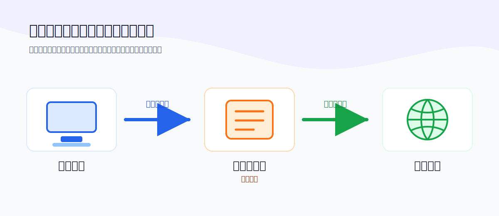
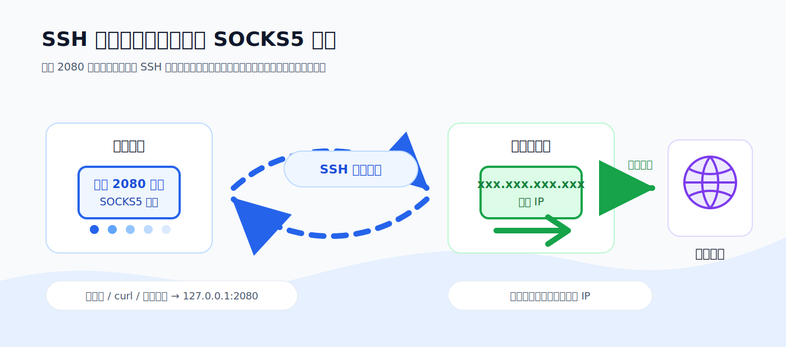

# 一条 SSH 命令，把远程服务器变成你的代理

> 读完这篇你能做到：手里只要有一台可以 SSH 登录的远程服务器（比如一台便宜的云主机），不装任何额外软件，仅用一条 SSH 命令，就能把它变成你专属的加密代理——隐藏真实 IP、加密本地流量、换一个出口位置。

---

## 一、先搞懂：什么是代理？

正常情况下，你的电脑访问网站是**直接连接**的：


用了**代理（Proxy）**之后，中间多了一个帮你转发的"中间人"：



这样一来，目标网站看到的是"代理服务器"在访问它，而不是你本人。所以代理常用来：

- **隐藏真实 IP**：网站只知道代理的 IP，不知道你的。
- **更换出口位置**：代理在哪，出口 IP 就在哪。
- **加密本地链路**：在不可信的网络（公司、咖啡店 WiFi）里，让别人看不到你在访问什么。

---

## 二、什么是 SOCKS5 代理？

SOCKS5 是一种**代理协议**——也就是"你的程序"和"代理服务器"之间该怎么对话的规则。

常见的代理协议分两大类：

| 类型 | 特点 |
|------|------|
| **HTTP 代理** | 只懂网页那一套（HTTP/HTTPS），会"看懂"你请求的内容 |
| **SOCKS5 代理** | 更底层、更通用，**不关心传的是什么**，只负责把数据原样转发 |

打个比方：

- HTTP 代理像一个**会拆包检查的快递员**，只收"信件类"的包裹。
- SOCKS5 代理像一个**只管搬运的搬运工**，你给什么它搬什么——网页、邮件、游戏、任何流量都能转。

所以 SOCKS5 的最大优势是**通用**：不只是浏览器，curl、各种软件的流量都能走它。末尾的 `5` 是版本号（第 5 版），相比老的 SOCKS4，它多了**身份验证**和**支持远程 DNS 解析**等能力。

---

## 三、用 SSH 开启代理

重点来了。SSH 自带一个叫**动态端口转发**的功能，参数是 `-D`。它会在你本地开一个 SOCKS5 代理端口，并把发到这个端口的流量，通过加密隧道送到远程服务器，再由远程服务器替你访问目标网站。

完整命令长这样（IP 用 `xxx.xxx.xxx.xxx` 占位，请替换成你自己服务器的）：

```bash
ssh -i /path/to/your_key.key -o ServerAliveInterval=30 -D 2080 -N ubuntu@xxx.xxx.xxx.xxx
```

### 逐个参数拆解

| 参数 | 含义 |
|------|------|
| `-i /path/to/your_key.key` | 指定用哪个私钥登录（如果你用密码登录可省略） |
| `-o ServerAliveInterval=30` | 每 30 秒向服务器发一次心跳，防止连接因空闲被断开 |
| `-D 2080` | **核心**：在本地开一个 SOCKS5 代理，监听 `2080` 端口 |
| `-N` | 登录后不执行任何远程命令，只用来做转发 |
| `ubuntu@xxx.xxx.xxx.xxx` | 登录的用户名@远程主机地址 |

执行后，整条链路是这样的：



### 怎么验证代理生效了？

让 curl 走代理去查"我现在的出口 IP 是多少"：

```bash
curl --proxy socks5h://127.0.0.1:2080 https://ifconfig.me
```

如果返回的是你**远程服务器的 IP**（`xxx.xxx.xxx.xxx`），就说明流量确实从远程服务器出去了，代理成功！

### 怎么在日常中使用

**curl：**

```bash
curl --proxy socks5h://127.0.0.1:2080 https://example.com
```

**浏览器插件（如 SwitchyOmega）：**

- 协议选 `SOCKS5`
- 服务器填 `127.0.0.1`，端口填 `2080`
- 勾选"通过代理解析域名"（避免 DNS 泄漏，见下）

### 小细节：`socks5` 和 `socks5h` 的区别

它俩只差在**域名由谁来解析**：

- `socks5`：你的电脑先把域名解析成 IP，再让代理连那个 IP → **本地解析，可能暴露你在查什么域名**。
- `socks5h`：把域名**原样**交给远程服务器去解析 → **远程解析，更隐蔽，也能解析本地解析不了的域名**。

所以一般推荐用 `socks5h`。

---

## 四、让代理永不掉线：AutoSSH

裸 SSH 有个问题：**一旦网络抖动、连接断了，它不会自己重连**，你的代理就失效了。这时候就轮到 `autossh` 登场。

### AutoSSH 的作用

`autossh` 是对 SSH 的一层包装。它会**监控隧道的健康状态，一旦发现连接断开，就自动把 SSH 重新拉起来**，从而保证代理一直在线。特别适合需要长期挂着的代理。

安装（以 macOS / Ubuntu 为例）：

```bash
# macOS
brew install autossh

# Ubuntu / Debian
sudo apt install autossh
```

### 用 AutoSSH 开代理

```bash
autossh -M 0 -f -N -D 2080 \
  -o "ServerAliveInterval=30" -o "ServerAliveCountMax=3" \
  -i /path/to/your_key.key ubuntu@xxx.xxx.xxx.xxx
```

### 逐个参数拆解

| 参数 | 含义 |
|------|------|
| `-M 0` | 关闭 autossh 自带的监控端口，改为依赖下面的 SSH 心跳来判断连接是否存活（现在更推荐这种方式） |
| `-f` | 让它在后台运行（不占用你的终端） |
| `-N` | 不执行远程命令，只做转发（同 SSH） |
| `-D 2080` | 本地开 SOCKS5 代理，监听 2080（同 SSH） |
| `-o "ServerAliveInterval=30"` | 每 30 秒发一次心跳 |
| `-o "ServerAliveCountMax=3"` | 连续 3 次心跳都没回应（即约 90 秒无响应），就判定连接已断，触发重连 |
| `-i /path/to/your_key.key` | 指定私钥 |
| `ubuntu@xxx.xxx.xxx.xxx` | 用户名@远程主机 |

简单说，**`ServerAliveInterval` × `ServerAliveCountMax` 决定了"多久没响应就认为掉线"**。上面的配置就是约 90 秒没反应就自动重连。

### 裸 SSH vs AutoSSH

| | 裸 SSH | AutoSSH |
|---|--------|---------|
| 断线后 | 代理失效，需手动重连 | 自动重新连接 |
| 适合场景 | 临时用一下 | 长期挂着当代理 |

---

## 五、安全小提示

- **`-D 2080` 默认只绑定 `127.0.0.1`**，即只有本机能用这个代理，相对安全。如果写成 `-D 0.0.0.0:2080`，会把代理暴露给整个局域网，**谨慎使用**。
- **保护好你的私钥文件**，权限建议设为 `600`（`chmod 600 your_key.key`），否则 SSH 会拒绝使用。
- 用 `socks5h` 而非 `socks5`，**避免 DNS 泄漏**。

---

## 六、常见问题

**Q：连接时提示私钥权限太开放（unprotected private key）？**
A：执行 `chmod 600 /path/to/your_key.key` 收紧权限即可。

**Q：curl 查出来的 IP 还是我本地的？**
A：检查是否真的加了 `--proxy`，端口是否写对（`2080`），以及 SSH/autossh 进程是否还活着（`ps aux | grep ssh`）。

**Q：端口 2080 被占用了？**
A：换一个没被占用的端口即可，比如 `-D 1080`，对应客户端配置也要同步改。

---

## 小结

> **SOCKS5 是一个"通用的流量搬运工"协议；而你用 SSH 的 `-D` 参数，给自己搭了一条加密管道，让远程服务器当这个搬运工。** 再用 `autossh` 包一层，就得到一条永不掉线的私人代理。

一台云服务器 + 一条命令，就这么简单。
