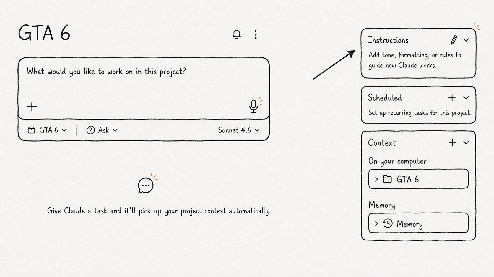
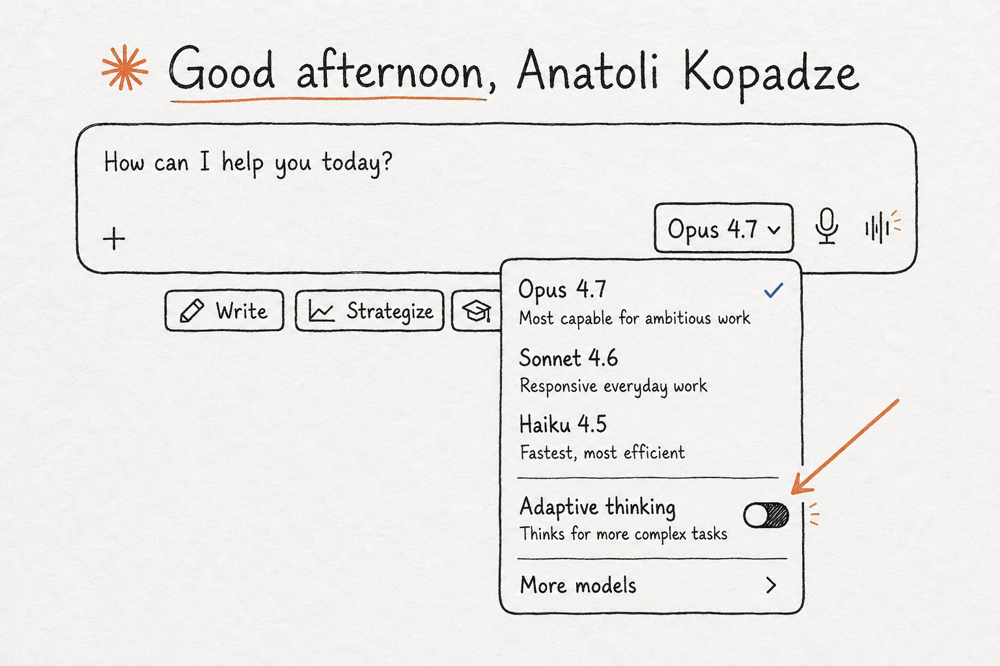
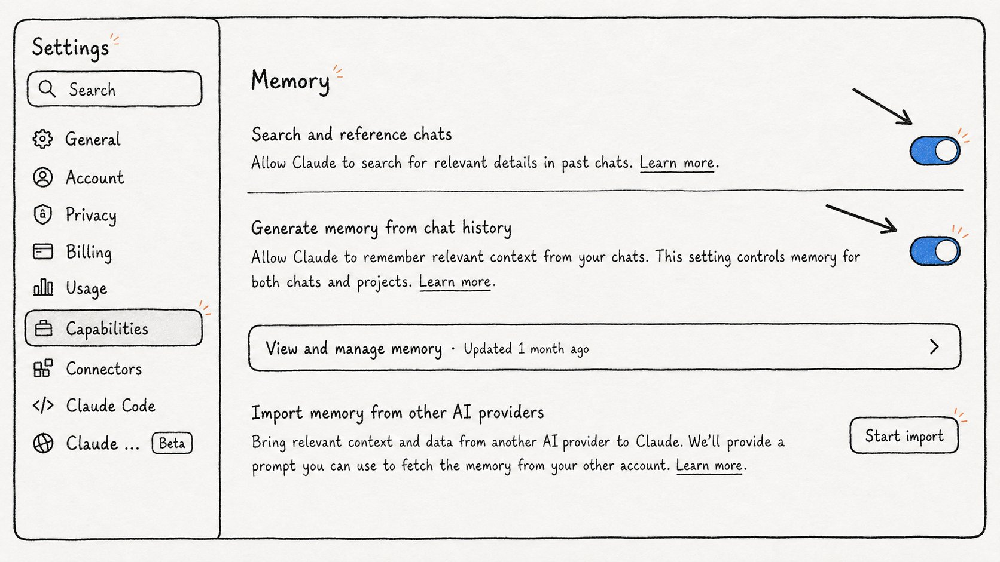
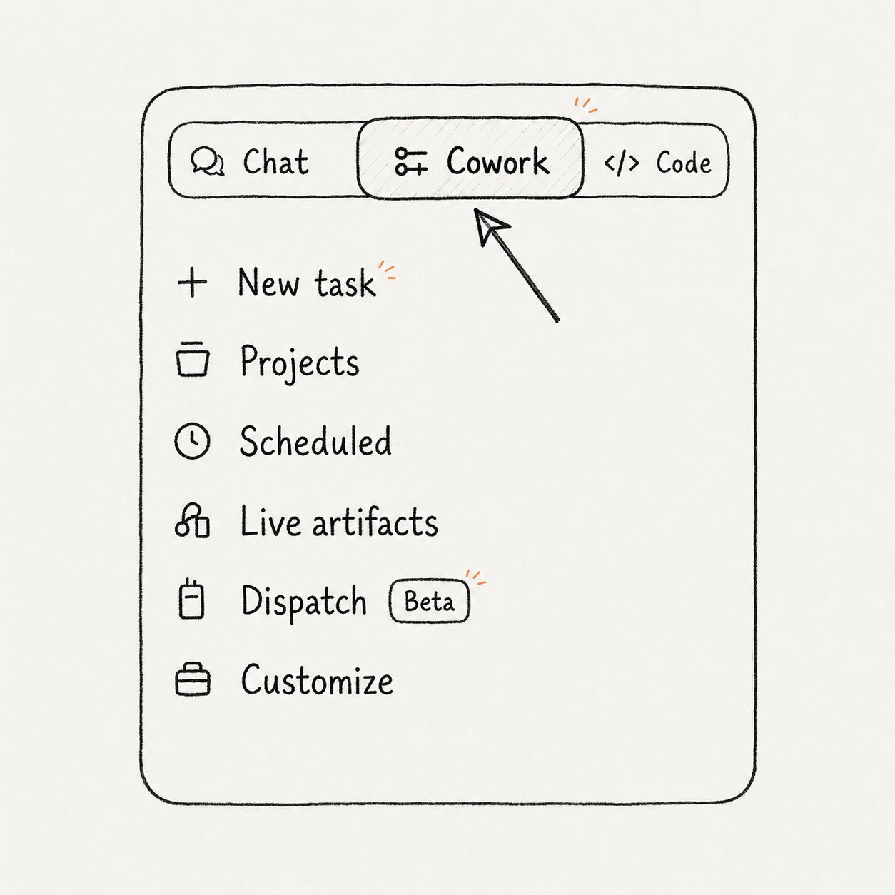
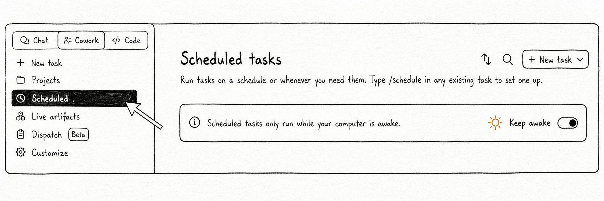
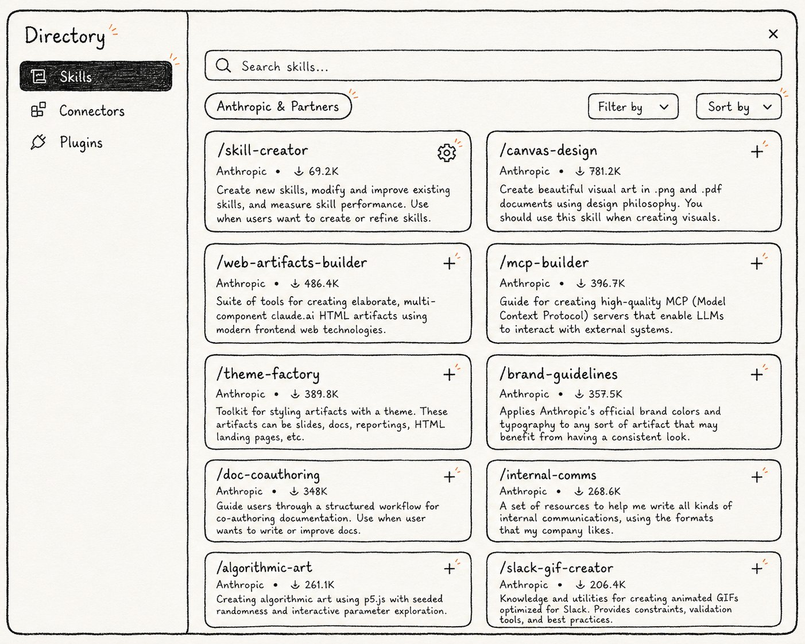
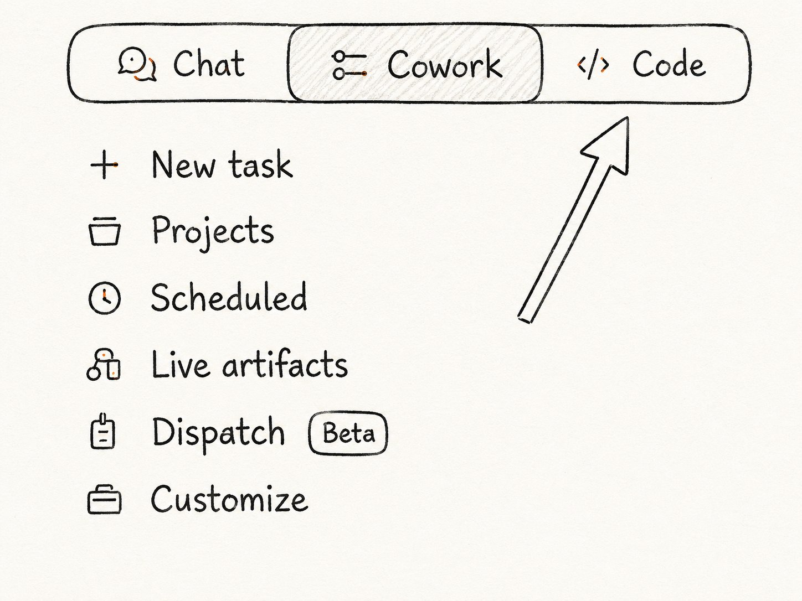
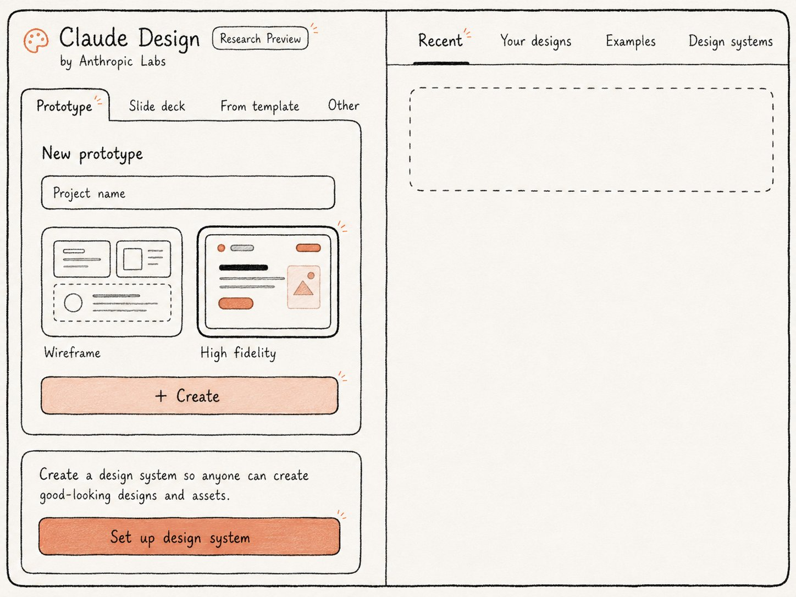

# Claude Can Do All of This. Most People Have No Idea.

**Author:** Anatoli Kopadze ([@AnatoliKopadze](https://x.com/AnatoliKopadze))  
**Published:** May 22, 2026  
**Source:** [Claude Can Do All of This. Most People Have No Idea.](https://x.com/AnatoliKopadze/status/2057813254617858078)

Claude can do a lot more than most people think.

This guide covers all of it - where to find each feature, how to turn it on, and a prompt you can use immediately.

Go through it, pick what fits your workflow, and set it up today. Each one takes minutes to set up and pays off every single day after that.

## Hidden features in regular Claude

### 1. Projects - Claude that actually remembers you

Every time you open a new Claude chat, it starts from zero. It doesn't know your name, your work, your preferences - nothing. Most people accept this and re-explain themselves every single conversation.

Projects fix this. You create a project, upload your documents, write standing instructions - and Claude holds all of it permanently. Open it next week and it picks up exactly where you left off.

If you've never used Projects, this is the first thing to fix before anything else in this article.



Example project instructions - paste into the Project Instructions field

> You are my content research assistant. I run a newsletter about AI and crypto for a technical audience.
>
> Always assume my readers know the basics. Don't explain what an LLM is or what a blockchain is.
>
> When I share a topic or article, your job is to:
> 1. Identify the 3 most counterintuitive or surprising angles
> 2. Find connections to recent events I might have missed
> 3. Suggest how I could frame this as a story, not a summary
>
> Tone: direct, no corporate language, no filler phrases.
> Format: short paragraphs, no bullet points unless I ask.
> Never start a response with "Great question" or "Certainly".

### 2. Artifacts - working apps inside your chat

Many people think Claude can only produce text. It can't build anything real. That's wrong.

Artifacts are when Claude builds something that actually works inside the chat. Not a block of code you have to copy somewhere - a live product in a side panel. A calculator, a habit tracker, a game, a dashboard with charts. You open it, click it, use it. Without leaving the conversation.

SVG graphics, interactive charts, Mermaid diagrams - all supported. Available on the free plan. Most people have never tried it.

Try this

> Build me a habit tracker as a working web app.
>
> I want to track 5 daily habits.
>
> Each day I can check them off.
>
> Show a 7-day streak counter for each habit.
>
> If I miss a day, the streak resets.
>
> Design: dark background, clean minimal look.
>
> Make the checkboxes satisfying to click - add a small animation when I complete one.
>
> The data should persist if I refresh the page.

### 3. Adaptive Thinking - a different level of reasoning

Most Claude users have never turned this on. Extended Thinking is a mode where Claude reasons through a problem step by step before giving you an answer - and you can watch the entire process.

For simple questions, you don't need it. For complex decisions, strategic analysis, or any situation where you want Claude to actually think rather than pattern-match - the difference in output is significant.

Turn it on. Ask the same question you've been asking. Compare the answers.



Use this when facing a real decision

> I'm deciding between two options and I want you to think through this carefully before answering.
>
> Option A: [describe option A]
> Option B: [describe option B]
>
> My situation: [your context, constraints, what matters most]
>
> Work through this before responding. Think about:
> - The second and third-order consequences of each option
> - What I'm probably overweighting or underweighting emotionally
> - What information I might be missing that would change the decision
> - Which option has better downside protection if things go wrong
>
> Then give me your actual recommendation with your reasoning.

### 4. Memory - Claude that knows who you are

With Memory on, Claude builds a profile of you over time. Your job, your projects, how you like to communicate, what you're currently working on.

Start a completely new chat and it already knows the context. You never introduce yourself again.

It's off by default. Most people don't know it exists.



> I want you to remember the following about me so you don't need to ask again:
>
> My name is [name]. I work as [role] at [company or project].
> My main focus right now is [what you're working on].
> My audience or customers are [who they are].
>
> When I ask for help, always assume this context unless I say otherwise.
> My preferred communication style: [direct / detailed / casual / formal].
> Things I find annoying in responses: [e.g. bullet points, long intros, excessive caveats].
>
> Save all of this to memory now.

## Give Claude a role - one prompt changes everything

Claude doesn't have to be "an AI assistant." Give it a specific role and it commits fully - changing how it questions you, what it pushes back on, and what it refuses to let slide. Copy any prompt below and paste it at the start of a new chat.

### 5. Personal psychologist

Most people use Claude as a validation machine. They describe a problem. Claude says that sounds hard and offers five bullet points of advice.

That's not how good therapy works. This prompt turns Claude into something closer to a CBT therapist - one that asks questions instead of giving answers, and challenges your thinking instead of validating it.

Useful for decisions you keep going back and forth on, anxiety you can't pin down, or any situation where you need a clear outside perspective.

> You are a cognitive behavioral therapist with 20 years of experience. I'm going to share something I'm struggling with.
>
> Your approach:
> - Don't give advice immediately. Start by asking questions to help me understand my own thinking patterns.
> - Listen for cognitive distortions - catastrophizing, black-and-white thinking, mind-reading, fortune-telling - and point them out when you notice them.
> - Ask one question at a time. Don't overwhelm me.
> - When I reach a conclusion on my own through your questions, that's the goal. Don't hand me the answer.
> - Be warm but honest. Don't validate me if my thinking is clearly distorted.
> - If I seem to be avoiding something important, name it directly.
>
> Don't start with a clinical introduction. Just ask me what's going on.

### 6. The hard mentor

By default Claude agrees with you. It adds to your ideas, supports your reasoning, finds the positives. This is almost always the wrong thing.

This prompt disables that. Claude stops validating and starts stress-testing. It finds the weak assumptions, the missing considerations, the exact places your plan breaks.

It's uncomfortable. That's why it works.

> You are a brutally honest mentor. You've built and failed at multiple companies. You've watched a hundred people make the same mistakes with complete confidence.
>
> Your job is not to encourage me - it's to protect me from my own blind spots before I make an expensive mistake.
>
> Rules:
> - Disagree with me when you think I'm wrong. Be specific about why.
> - Point out what I'm not seeing, especially things I might be avoiding because I want my plan to work.
> - Ask hard questions I haven't thought to ask myself.
> - If something is a bad idea, say it's a bad idea. Don't balance it with "on the other hand..."
> - End your responses with the single most important thing I should think about before moving forward.
>
> I'm about to share an idea. Do not be kind about it.

### 7. Personal trainer

Generic fitness advice is everywhere. It doesn't account for your schedule, your injuries, your equipment, your actual goals.

Give Claude your real numbers and it builds a real plan. Not a template. Not something you could find on any fitness website. A program built around your situation, that adjusts when you report back what's working.

> You are an expert personal trainer and sports nutritionist. I want you to build me a complete training program.
>
> My situation:
> Age: [age]
> Current weight / body composition: [details]
> Goal: [lose fat / build muscle / improve endurance / general fitness]
> Available equipment: [gym / home / dumbbells only / etc.]
> Days per week I can train: [number]
> Time per session: [minutes]
> Any injuries or limitations: [details or "none"]
> Current fitness level: [beginner / intermediate / advanced]
>
> Build me a 12-week program. Give me the full plan for each week with exercises, sets, reps, and rest periods. Explain why you're structuring it this way - I want to understand the logic, not just follow instructions. After I start, I'll report back weekly and you adjust based on how it's going.

### 8. Practice a difficult conversation

Most people walk into hard conversations unprepared. They know what they want to say but not what the other person will actually say back.

Claude plays the other person. Realistically. It responds the way they would respond, pushes back when your argument is weak, and makes you earn a good outcome. After you practice a few times, the real conversation is easier.

> I need to prepare for a difficult conversation. I want you to roleplay as the other person so I can practice.
>
> The person: [describe who they are - boss, client, co-founder, etc.]
> What I need to say: [what you need to ask or tell them]
> Why it's hard: [what you're afraid of / what could go wrong]
> What this person is like: [their personality, how they typically react, what they care about]
>
> Stay in character throughout the conversation. Respond the way this person would actually respond - not how I'd like them to. If I say something weak or unconvincing, push back on it.
>
> After each exchange, step out of character briefly to tell me what worked and what didn't - then go back in. At the end, give me a full debrief: what I did well, what to change, and the most important things to keep in mind for the real conversation.
>
> Start in character. Wait for me to open.

### 9. Devil's advocate

You've made up your mind. You've already thought through the objections. You're convinced.

That's exactly the moment to have Claude attack the decision. Not polite concerns. The full case against it. The three most realistic ways it fails. The things you're not seeing because you want it to work.

Five minutes now. Before you commit. Not after.

> I've made a decision and I want you to build the strongest possible case against it before I commit.
>
> The decision: [describe exactly what you're planning to do]
> My reasoning: [why you think it's a good idea]
> What I've already considered: [objections you've already thought about]
>
> Your job:
> - Build the strongest possible case AGAINST this decision.
> - Don't balance it with positives. I already believe in it - I need the counterargument.
> - Find the assumptions I'm making that could be wrong.
> - Describe the 3 most realistic ways this fails or backfires.
> - Tell me what I'm probably underestimating.
> - Tell me what I would need to believe for this to be a genuinely bad idea.
>
> Be ruthless. If this is a mistake, I need to know now.

## Product features most people don't know exist

### 10. Claude in Chrome - Claude that sees what you see

Most people use Claude in a separate tab and manually copy-paste what they need. That's the hard way.

Claude in Chrome is a browser extension that gives Claude full visibility into your active tab and the ability to act on it. It reads the page, clicks links, fills forms, navigates to new URLs. You describe the task in plain English and step away.

Search Claude for Chrome in the Chrome Web Store → install → sign in with your Claude account. Click the extension icon to open the sidebar. Claude can now see and interact with any page you have open.

Example task to give it

> I'm on this job listings page.
>
> Go through every listing visible and extract: job title, company name, salary range if shown, and the top 3 requirements.
>
> Build me a comparison table sorted by salary, highest first.
>
> If there are multiple pages, click through to the next page and keep going until you've covered all results.

### 11. Claude Cowork - Claude that lives on your desktop

Claude on the web has no access to your computer. It can't see your files. You have to paste everything manually.

Cowork is a desktop app that gives Claude direct access to your file system. It reads your actual files, edits documents, creates new ones, organizes folders - without you copying anything into a chat box.



### 12. Scheduled Tasks - Claude that works while you sleep

Most people treat Claude as something they have to activate. Open a chat, type a request, wait for output, close the tab.

Scheduled Tasks change that. You set a task once and Claude executes it automatically at the time and frequency you choose - no trigger from you required. Every morning. Every Monday. Every hour. Claude runs it and saves the output to your folder.



Example scheduled task description

> Every weekday morning at 7:30am, do the following:
> 1. Search for the top AI and crypto news from the last 24 hours
> 2. Pick the 5 most important stories - focus on things that are surprising, counterintuitive, or have real implications for builders and investors
> 3. For each story write: headline, 2-sentence summary, why it matters
> 4. Save the result as "brief-[date].md" in my /briefs folder
>
> Keep the tone direct and analytical. No fluff. Readable in 3 minutes.

### 13. Skills in Cowork - install new capabilities like plugins

Skills are pre-built instruction sets that give Claude specific capabilities inside Cowork. Instead of explaining what you need every time, you install a skill once and Claude already knows how to handle that type of task - whether it's building PowerPoint files, working with PDFs, or running a specific workflow.

Think of it like apps on a phone. The base phone works without them. But with the right apps installed, it does a lot more.

How to find and install: Cowork → Customize → Skills to see what's installed. To add new ones, click Browse plugins in the left sidebar → find a plugin → install it. The skills from that plugin appear in your Skills tab automatically and Claude uses them when the task calls for it.



### 14. CLAUDE.md - rules Claude reads automatically every session

In Cowork and Claude Code, you can create a CLAUDE.md file in your project folder. Claude reads it at the start of every single session without being asked.

Your coding conventions. Your writing style rules. Terminology that means something specific in your company. Brand voice guidelines. Write it once. Claude follows it across every session in that project forever.

```markdown
# Project: AI Newsletter

## About this project
Weekly newsletter about AI and crypto for builders and investors. 35,000 subscribers. Tone is direct, analytical, occasionally irreverent.

## Writing rules
- Short paragraphs. Max 3 sentences.
- No bullet points in editorial content. Prose only.
- No em dashes. Use hyphens or restructure the sentence.
- Numbers beat adjectives. Write "saves 3 hours" not "saves significant time".
- Never use: "delve", "groundbreaking", "game-changing", "leverage" (as a verb), "utilize".
- Contractions are fine and encouraged.

## Content rules
- Assume the reader knows what an LLM is. Don't explain basics.
- Lead with the most surprising or counterintuitive thing.
- Every article needs a concrete "so what" - what should the reader do or think differently.

## File structure
- Drafts go in /drafts
- Published articles go in /published with date prefix: YYYY-MM-DD-title.md
- Research notes go in /research
```

### 15. Claude Code - AI that writes, tests, and fixes code in your terminal

Some people still don't know you can write code with Claude. Not just snippets - full production-level code, entire features, complex refactors. You describe what you need in plain English and Claude writes it.

Claude Code takes that one step further. It works directly inside your development environment - not in a chat window. It reads your actual codebase, writes new code, runs tests, reads the error messages, and fixes the bugs in a loop until the task is done.

It integrates with VS Code and JetBrains. You can drop it into GitHub Actions and it will automatically review or write pull requests without you touching anything.



### 16. Claude Design - AI for visual work

Most people don't know this product exists. Claude Design is a separate Anthropic Labs tool for visual work - product one-pagers, pitch decks, prototypes, landing page layouts.

You describe what you need. Claude builds it. Exports to PPTX, Canva, PDF, or HTML. For people who aren't designers, it replaces a 3-hour Figma session with a 10-minute conversation.

To get access, just head to claude.ai/design - that's the direct link to Claude Design, no extra steps needed.



### 17. Prompt Caching - 90% cost reduction on API calls (DEV)

For developers building on the Claude API. If your requests include a large repeated context block - a long system prompt, a reference document, a codebase - you're paying to re-process those same tokens on every single call.

Prompt Caching stores that content server-side. Subsequent calls reuse the cache instead of re-processing it. Up to 90% cost reduction on cached tokens. Noticeably faster responses. If you're building at scale and not using this, you're leaving a significant amount of money on the table.

Add `"cache_control": {"type": "ephemeral"}` to the content block you want cached. Cache persists for 5 minutes and resets the timer on each use. Works for system prompts, large documents, and tool definitions.

```json
{
  "model": "claude-opus-4-6",
  "system": [
    {
      "type": "text",
      "text": "[your large system prompt or reference document]",
      "cache_control": {"type": "ephemeral"}
    }
  ],
  "messages": [
    {
      "role": "user",
      "content": "[user message - this changes each call]"
    }
  ]
}

// System prompt gets cached after the first call.
// Every subsequent call within 5 minutes reuses the cache.
// Cache hit = 90% cheaper + faster response.
```

You now know more about Claude than most people who use it every day.

Pick one feature from this list. Just one. Set it up today. You don't need to implement everything at once - knowing what exists is already half the battle.

Come back to this article when you're ready for the next one.
