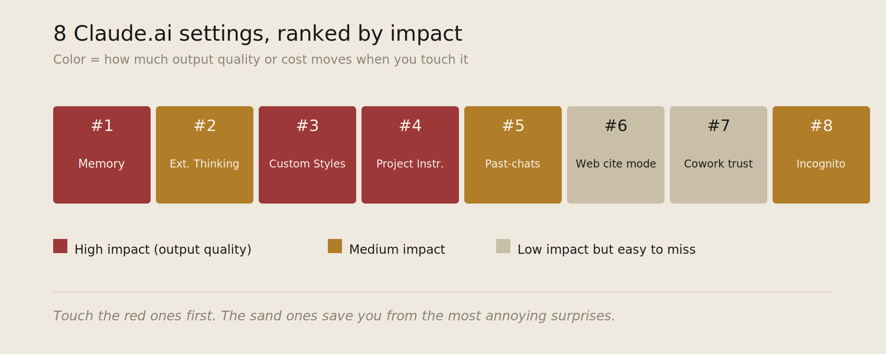
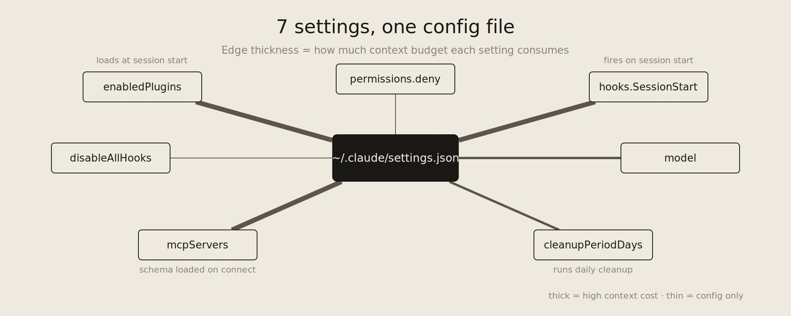
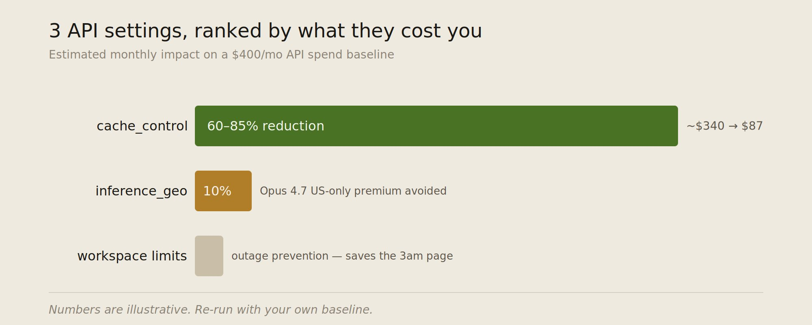

# 改变一切的 18 个 Claude 设置

**作者：** Mnimiy ([@Mnilax](https://x.com/Mnilax))  
**日期：** 2026年5月24日  
**来源：** [18 Claude settings that change everything](https://x.com/Mnilax/status/2058269663788736907)

事情是这样的。Anthropic 给 Claude Code 的 settings.json 一共塞进了 125 个以上的配置项，可官方文档只讲清楚了其中大约 40 个。

剩下那些没讲的，藏得有多深？有 14 个埋在 Claude.ai 界面里，得点上三层才点得到；还有 4 个，任何文档里都查不到。想把它们找出来，你只能去翻 GitHub 上的 issue，盯着工程师在 Discord 里随口漏一句，或者干脆凌晨一点爬起来 grep Claude Code 的二进制文件。

所以大多数人是怎么用的呢？还是半年前 Anthropic 发布时那套默认配置，一动没动。然后账单慢慢往上爬，输出慢慢跑偏，他们一拍大腿——这模型怎么越来越笨了。

问题其实不在模型。下面这 18 个设置，才是真正在替你开车的人。

- 8 个在 Claude.ai。
- 7 个在 Claude Code。
- 3 个在 API 和 Console。

每一个我都讲明白：它在哪、它管什么、一句话怎么改。

## 第一节：Claude（8 个设置）

### 1. Memory：范围、排除项，还有"忘掉这个"命令

**在哪：** Settings → Capabilities → Memory

**管什么：** Memory 在 2026 年 3 月对 Free 和 Pro 用户开放了。默认情况下，凡是 Claude 觉得值得记的，它统统记下来。但这里藏着三个大多数人都没留意的开关：按项目划范围、排除列表、还有随手就能用的忘记命令。

**为什么重要：** 默认的记忆，用着用着就会跑偏。也就四到六周，它里头就堆满了各种一次性的纠正——比如"我写 Python 喜欢用 tab"，可你其实只对某一个文件这么说过一次；还有些本该留在某个项目里的事实，悄悄泄到了别处的聊天里；再加上早就过时的角色设定。于是输出质量开始下滑。说到底，是因为 Claude 这会儿正照着一个错位的"你"在使劲。

**怎么改：**

先打开按项目划范围的记忆：Settings → Capabilities → Memory → Scope per Project。这样一来，项目里产生的记忆就只待在那个项目里。光这一招，大半的跑偏就治好了。

接着，把任何你不想在别处冒出来的话题，都加进排除列表。比如离婚、医疗、薪水数字、客户名字。这些东西你不主动排除，它就会一直跟着你，不管你在聊什么。

最后，记住这句随手就能打的命令：`forget what you remembered about [topic]`。Claude 会对着你的记忆库一条条比对，然后告诉你它删了哪些。不用翻菜单，也不用进设置页。

### 2. Extended Thinking：按聊天开关

**在哪：** 聊天输入框 → 模型选择下拉菜单 → Extended Thinking: Off / Light / Full

**管什么：** Extended Thinking 会在正式回答之前，先走一轮 `<thinking>` 推理。Anthropic 给 Opus 默认就开着它。这个三档开关是按单个聊天来的，会盖过你的全局设置。

**为什么重要：** 这东西用对地方很香——数学、调试、多步骤规划，都靠它。可一旦用在摘要、翻译、排版、改写、随手查个东西上，就纯属浪费了。这类活儿，它为了同一个答案，要多花 3 到 12 秒，还要多烧 20% 到 40% 的 token。

**怎么改：** 把默认设成 Light——意思是只在模型自己觉得有用时才动用推理；真碰上难活，再手动切到 Full。我给人演示过这个改动，大多数人头一周的 Opus token 开销就降了 18% 到 25%。

### 3. Custom Styles：这不是"语气"，是一份输出契约

**在哪：** 聊天输入框 → 样式选择器 → Create New Style

**管什么：** Styles 一开始只是个语气开关，无非"正式 / 简洁 / 解释型"几档。但 Custom Styles 其实是另一回事——它是一份输出契约。你粘一份 200 到 1500 字的指令进去，之后这个样式下的每一条回复，生成前都会先照着它来。

**为什么重要：** 大多数人拿 Styles 干嘛？"写短点"。可它真正的用处，是把一整套结构规则钉死在每条回复里，省得你一遍遍重新粘。引用用什么格式、哪些词不许出现、必须有哪几个小节、代码块标什么语言、长度封顶多少、要不要反过来问你问题——这些全都能定死。

**怎么改：** 给每个工作流建一个 Style。我自己的长这样：

```markdown
# Style: Draft for X

Output contract:
- Open with one concrete number or named entity. No "I've been thinking..."
- Sentences under 18 words where possible.
- No em-dashes unless rhythm requires.
- No "delve", "leverage", "robust", "unlock", "game-changing".
- If listing 3+ items, use a hyphen list, not numbered.
- End on a statement, not a question.

If a draft exceeds 280 characters and the user didn't ask for a thread,
say so before answering.
```

我轮着用其中三个——Draft for X、Code review、Summarize PDF，就顶掉了我存下来的八成 prompt。

### 4. Projects：那个大多数人留空的"instructions"字段

**在哪：** 任意 Project → 右上角 ⋯ → Edit project instructions

**管什么：** Projects 是那种能一直留着用的工作空间。里头有个 instructions 字段，作用相当于系统提示词，会被注入到这个 Project 的每一个聊天里。当初 Anthropic 介绍 Projects 时，配的是知识上传功能，大家也就记住了那个。可 instructions 字段就在同一个页面上，而我在外头见到的 Project，足足七成都把它空着。

**为什么重要：** 没它，Project 里每开一个聊天都是从零讲起。有它，你就再也不用反复交代背景了。比如：（"这是一个 Polymarket 研究工作流。默认保持怀疑。永远把概率算给我看。永远不要推荐交易——只描述 EV。"）

**怎么改：** 把它当成专门给 Claude 用的那份 CLAUDE.md。控制在 400 字以内，写清楚角色、默认要多怀疑、按什么格式、哪些事绝对别碰。每个月重读一次，顺手把没用的删掉。

### 5. 搜索过往聊天（Pro+），以及到底怎么搜才搜得到

**在哪：** Settings → Profile → Search past chats（得手动启用）

**管什么：** 让 Claude 在需要时回头翻你的对话历史。仅限 Pro+。

**为什么重要：** 对新账号来说，这功能默认是关的，哪怕你已经是 Pro。打开之后还有个门道：它走的是关键词匹配，不是语义匹配。你要是问"我们昨天聊的中国机器人是啥"，多半啥也搜不出来——除非你那条旧聊天里真出现过"Chinese robots"，或者同时有"China"和"robots"这两个词。

**怎么改：** 先打开它。然后学会怎么提问：用具体的内容名词，别用那些泛泛的词。"Polymarket Iran"搜得到，"我们上周聊的那个事"搜不到。

### 6. Web search：按对话开关，还有引用怎么显示

**在哪：** 聊天输入框 → + → Web search: On / Off

**管什么：** web search 这个开关是按对话来的。但它具体怎么显示引用，又取决于另一个不太有人知道的设置：Settings → Capabilities → Web search citations: Inline / Footnotes / Hidden。

**为什么重要：** 默认是 Inline，而 Inline 引用一复制粘贴就出岔子。你把 Claude 的回答复制到别处，跟着复制过去的，是一串指向空处的标记。换成 Footnotes 模式就清爽了：正文干干净净，来源统一列在末尾。

**怎么改：** 只要你会把 Claude 的搜索结果复制进别的文档、邮件或消息里，就切到 Footnotes。只有当你所有内容都在 Claude 里看完、不往外搬时，才留着 Inline。

### 7. Connectors：Cowork 里"信任此文件夹"的坑

**在哪：** Settings → Connectors → Cowork → Trusted folders

**管什么：** Cowork（2026 年 4 月正式上线）能让 Claude 访问你机器上的某个文件夹。默认情况下，每次会话开始前，Anthropic 都会先问你一句：这个文件夹，信任吗？而 trusted folders 这个列表，就是那道能绕过这一问的口子。

**为什么重要：** 一个文件夹一旦进了 trusted，往后每个 Cowork 会话，Claude 都会直接去读它，不再问你。这就有意思了——假设你三月做测试时随手加了一个文件夹，然后忘得一干二净，那从那天起的每一次会话，Claude 其实都在悄悄读它。

**怎么改：** 打开 trusted folders，把任何不是当前活跃项目的都删掉。这个列表，涨得比你想象的快多了。

### 8. Incognito 模式，以及它到底跳过了什么

**在哪：** 侧边栏 → New incognito chat（或 Cmd/Ctrl + Shift + N）

**管什么：** Incognito 聊天不保存、不记忆、搜不到，也不拿去改进模型。你一关掉，这段聊天就没了。

**为什么重要：** 很多人以为 Incognito 不过是把聊天从侧边栏里藏起来。其实它一口气跳过了四个环节：写入记忆、聊天历史、过往聊天的搜索索引，还有训练数据 opt-in（如果你开着的话）。

**怎么改：** 凡是涉及敏感信息的，都有意识地用它：薪水、医疗、家庭、法律草稿、客户名字。三个按键的事，根本不用多想。



## 第二节：Claude Code（7 个设置）

这些都在 `~/.claude/settings.json`（用户级）或 `.claude/settings.json`（项目级）里，两个一起在时，后者说了算。

v2.1.105 这个二进制里，配置项一共有 125 个以上。下面这七个，是真正能见效的。

### 9. enabledPlugins —— 禁用就行，别卸载

**在哪：** `~/.claude/settings.json` → enabledPlugins

**管什么：** 决定哪些已装的插件，会在会话启动时被加载。插件市场让安装变得特别容易，可卸载反倒更麻烦——而其实你压根不用卸，把值设成 false 就行。

**为什么重要：** 每一个活跃的插件，都会把自己的 hooks、SKILL.md 内容和工具 schema 一并加载进你的上下文预算。三个你早忘了的插件，就等于你还没敲下第一个字，就先被预扣掉 3 到 8K token。

我开始这次审计的时候，启用着 14 个插件。现在还活跃的，只剩 4 个。

**怎么改：**

```json
{
  "enabledPlugins": {
    "formatter@acme-tools": true,
    "deployer@acme-tools": false,
    "analyzer@security-plugins": false,
    "old-experiment@personal": false
  }
}
```

`false` 让插件还装着，但不加载。真要用的时候，用 `/plugin enable name@marketplace` 在当次会话里临时开一下就行。

### 10. permissions.deny —— 关于那个 bug，你得心里有数

**在哪：** `~/.claude/settings.json` → permissions.deny

**管什么：** 拦住 Claude，不让它运行某些工具、或者碰某些文件。本意很清楚：防住 rm -rf、防它去读 .env、防它往项目外头乱写。

**为什么重要：** 但这里有个已知的 bug——deny 规则有时候就是拦不住。这事已经有好几个 GitHub issue 报过了。被引用最多的那个是 anthropics/claude-code#11544，讲的是配置明明有效、hooks 却不加载；而 deny 的执行也有同样的毛病。规则明明就在你的配置里，debug 日志却冷冷地显示"0 matchers found"，然后 Claude 照样把那个文件读了。

**怎么改：**

```json
{
  "permissions": {
    "deny": [
      "Read(.env)",
      "Read(.env.*)",
      "Read(**/*secret*)",
      "Bash(rm -rf:*)",
      "Bash(sudo:*)"
    ]
  }
}
```

光靠 deny 列表不够，得在文件系统这一层再加一道保险。`chmod 600 .env`，这样就算 Claude 想读，操作系统也会替你把门关上。配好之后，在 Claude Code 里用 `/permissions` 核对一遍，要是你的规则没显示出来，重启会话再看。

### 11. hooks.SessionStart —— 让我上下文膨胀减了 30% 的那 4 行

**在哪：** `~/.claude/settings.json` → hooks.SessionStart

**管什么：** 每当你在某个目录里打开 Claude Code，SessionStart 就会触发。这时你想干啥都行：打印环境信息、检查 git 状态、注入一个上下文文件、提前预热缓存。

**为什么重要：** 大多数人的毛病是塞太多。CLAUDE.md 一路涨到 5K token，因为每条项目规则都往里堆。而 SessionStart 的好处，是让你只加载跟当前分支或目录有关的那几条规则。

**怎么改：**

```json
{
  "hooks": {
    "SessionStart": [
      {
        "matcher": "startup",
        "hooks": [
          {
            "type": "command",
            "command": "cat .claude/context-$(git branch --show-current).md 2>/dev/null || true"
          }
        ]
      }
    ]
  }
}
```

这样一来，main 分支加载 context-main.md，feat/auth 分支加载 context-feat-auth.md。每个文件都小小的，上下文预算也就不再白白往外漏了。

### 12. disableAllHooks —— 救急开关

**在哪：** `~/.claude/settings.json` → disableAllHooks: true

**管什么：** 一个开关，把所有 hook 全关掉。2026 年 3 月的更新里加的，大多数人都不知道它存在。

**为什么重要：** Claude Code 一旦开始犯邪门——莫名其妙跑命令、启动时卡住、神不知鬼不觉地写文件——八成是某个 hook 在乱触发。一个个去禁用太慢了，这个开关一下全关，好让你快点定位。

**怎么改：** 平时让它保持 false。出问题了，翻成 true，重启，看看毛病还在不在。要是没了，再一个个把 hook 开回来，揪出那个捣乱的；要是还在，那就说明 bug 在别的地方。

### 13. model 按项目覆盖

**在哪：** `.claude/settings.json`（项目根目录）→ model

**管什么：** 给这个项目单独指定默认模型，盖过你的全局设置。

**为什么重要：** 大多数人全局设的都是 Opus，图的是干难活时趁手。可一打开某个主要是改 markdown、写 shell 脚本的项目，就尴尬了——他们正用着 Opus 的价钱，做着 Haiku 花 1/20 成本就能搞定的事。

**怎么改：**

```json
// 在你的 /docs 项目里：
{ "model": "claude-haiku-4-5-20251001" }

// 在你的 /infra 项目里：
{ "model": "claude-sonnet-4-6" }

// 在你的 /core-engine 项目里：
{ "model": "claude-opus-4-7" }
```

项目级覆盖说了算。打开项目，自动就是对的模型，接着干活，不用操心。

### 14. mcpServers 配合 enabled 标志

**在哪：** `~/.claude/settings.json` → mcpServers

**管什么：** MCP server 负责把 Claude 接到外部工具上。可每接一个 server，它就把整套工具 schema 加载进你的上下文，一个 server 从 800 到 6000 token 不等。

**为什么重要：** 人们的习惯是这样：接上一个 MCP server 试试，然后就再也不断开了。三个月下来，你接着 12 个，真正还在用的就 3 个。剩下那 9 个闲置的，每次会话一启动，就白白吃掉你大约 25 到 40K token 的上下文 schema。

**怎么改：** 用 enabled 标志，让连接配置留着，但先不加载。

```json
{
  "mcpServers": {
    "github":   { "command": "...", "enabled": true },
    "postgres": { "command": "...", "enabled": true },
    "slack":    { "command": "...", "enabled": false },
    "linear":   { "command": "...", "enabled": false }
  }
}
```

真用上了，再在当次会话里翻成 true。我大多数日子开着 2 到 3 个，赶上规划的日子，6 个。

### 15. cleanupPeriodDays —— 没人提的那个缓存

**在哪：** `~/.claude/settings.json` → cleanupPeriodDays

**管什么：** 设定 Claude Code 把 transcript、debug 日志和中间会话数据保留多少天。默认 30。

**为什么重要：** Dreaming 和过往聊天搜索，全靠这些 transcript 吃饭。默认 30 天窗口下，Dreaming 只能从一个月的工作里学东西。给它六个月，能学到的信号一下就多了六倍。代价呢？磁盘上大约 200MB。

**怎么改：**

```json
{ "cleanupPeriodDays": 180 }
```

180 天的会话历史，留给 Dreaming，留给记忆整合，也留给你自己——哪天你想找"三月那会儿我跟 Claude 讲过的那个 auth bug 到底是啥来着"，正好还 grep 得到。

### Claude Code 成品：一份把 7 个设置全配好的 settings.json

把下面这份复制进 `~/.claude/settings.json`，路径和插件名换成你自己的，重启 Claude Code，再跑一遍 `/permissions` 和 `/hooks`，确认都加载上了。

```json
{
  "model": "claude-sonnet-4-6",

  "enabledPlugins": {
    "formatter@acme-tools": true,
    "old-experiment@personal": false
  },

  "permissions": {
    "deny": [
      "Read(.env)",
      "Read(.env.*)",
      "Read(**/*secret*)",
      "Bash(rm -rf:*)",
      "Bash(sudo:*)"
    ]
  },

  "hooks": {
    "SessionStart": [
      {
        "matcher": "startup",
        "hooks": [
          {
            "type": "command",
            "command": "cat .claude/context-$(git branch --show-current).md 2>/dev/null || true"
          }
        ]
      }
    ]
  },

  "disableAllHooks": false,

  "mcpServers": {
    "github":    { "command": "npx", "args": ["@modelcontextprotocol/server-github"], "enabled": true },
    "postgres":  { "command": "npx", "args": ["@modelcontextprotocol/server-postgres"], "enabled": false },
    "slack":     { "command": "npx", "args": ["@modelcontextprotocol/server-slack"], "enabled": false }
  },

  "cleanupPeriodDays": 180
}
```

项目级覆盖，放在项目根目录的 `.claude/settings.json` 里。最值得在那儿设的，是这一条：

```json
// .claude/settings.json（在一个 docs 项目里）
{ "model": "claude-haiku-4-5-20251001" }
```



## 第三节：API 和 Console（3 个设置）

这三个，要么在代码里，要么在 Anthropic Console 里。它们是全文最影响成本的设置——每一个，都能把你的账单改动 30% 到 90%。

### 16. cache_control 断点：到底放哪

**在哪：** API 请求体里，任意内容块上的 cache_control 字段

**管什么：** 把你 prompt 的某段前缀，标记成可以缓存的。之后只要请求带着同样的前缀，这部分就按大约 10% 的输入费率算，不再走全价。

**为什么重要：** 这是整个 API 里最大的那根省钱杠杆。大家都知道有这么个东西，可大多数人断点放错了地方，结果只省了一点点，没省到全部。就拿我自己的配置来说，光把断点挪对位置，每月账单就从 $340 砍到了 $87。

**怎么改：** 断点要卡在"静态内容"和"动态内容"的交界处。断点之前的，一律缓存；之后的，一律重算。

```python
# 错误 —— 断点放在用户消息之后，没有可复用的东西被缓存
messages = [
    {"role": "system", "content": SYSTEM_PROMPT},
    {"role": "user", "content": user_question,
     "cache_control": {"type": "ephemeral"}}
]

# 正确 —— 断点放在稳定的系统提示词之后，下次调用整段命中缓存
messages = [
    {"role": "system", "content": SYSTEM_PROMPT,
     "cache_control": {"type": "ephemeral"}},
    {"role": "user", "content": user_question}
]
```

TTL 有两种可选：5 分钟的 ephemeral（默认），还有 1 小时。那些会话之间根本不变的系统提示词，就用 1 小时：

```python
{"cache_control": {"type": "ephemeral", "ttl": "1h"}}
```

算笔账：缓存写入比基础输入贵 25%，缓存读取只要基础输入的 10%。临界点就在这——一段缓存的前缀，只要你在 TTL 窗口里读它 2 次以上，就回本了。

### 17. inference_geo，以及那笔数据驻留税

**在哪：** API 请求 → inference_geo 参数

**管什么：** 把推理路由到指定的地理区域，比如只走美国、只走欧盟，诸如此类。

**为什么重要：** 仅美国数据驻留，在 Opus 4.7 及以上会加 10% 的溢价。这笔钱不在标准价目表上，你只会在发票上撞见它。

**怎么改：** 要是你的合规要求其实并不真需要区域驻留，那就别设 inference_geo。很多应用都是"图个保险"就顺手设上了，因为法务里有人说过一句"确保数据留在美国"。先核实清楚：这要求到底是合同里白纸黑字写死的，还是只是个美好愿望？如果只是愿望，就把这个参数省掉，每次 Opus 调用都省下 10%。

要是你确实需要它，那就把这 10% 一并算进选模型的账里。基础价 $3 的 Sonnet，实际成了 $3.30，Opus 和 Sonnet 之间该选谁的那个平衡点，也就跟着挪了位置。

### 18. 工作空间级速率限制（防住凌晨三点宕机的那个）

**在哪：** Console → Settings → Workspaces → [你的工作空间] → Per-feature rate limits

**管什么：** 按工作空间、按功能单独设速率限制，跟你账号级的限制各管各的。

**为什么重要：** 账号级的限制，保的是你不破产。而工作空间级的限制，保的是另一回事——当某个失控的批处理任务想一口吞掉你整个 ITPM 额度时，它护着你那个交互式产品。想象一下：你上线一个新功能，它出 bug，卡进了死循环，把额度全吃光，于是你那个面向客户的聊天，开始一条条返回 429。工作空间限制要做的，就是不让一个功能把另一个活活饿死。

**怎么改：** 给每一类用途各开一个工作空间——交互式聊天、批处理、内部工具、实验，分开来。把每个工作空间的速率限制设成账号档位的 60% 到 70%，再留 30% 出来，给那个偶尔需要冲一下量的工作空间。

对了，本文开头说的第四个文档里查不到的设置，就藏在这儿：每个工作空间里头，还有一个功能级的上限，只有你点进某个具体的功能卡片才看得见——光看工作空间总览，是发现不了它的。它默认是无限制。

所以问题来了：要是你一个工作空间里塞了三个功能，其中一个就足以把另外两个饿死，而工作空间级的限制根本拦不住它。结论很简单——凡是会跑批处理的功能，都单独给它设一个功能级上限。



## 第四节：18 项清单

走一遍，20 分钟。说句实在的：任何你 12 个月里都没碰过的项，你大概这辈子也不会去碰了。

```markdown
## Claude.ai
- [ ] #1  Memory：项目范围打开，排除列表填好
- [ ] #2  Extended Thinking：默认 = Light
- [ ] #3  Custom Styles：至少建一个工作流样式
- [ ] #4  Project Instructions：每个活跃 Project 都填上
- [ ] #5  Past-chats search：打开（Pro+）
- [ ] #6  Web search citations：Footnotes 模式
- [ ] #7  Cowork trusted folders：审查、修剪过
- [ ] #8  Incognito：记住键盘快捷键

## Claude Code
- [ ] #9  enabledPlugins：只有活跃的 = true
- [ ] #10 permissions.deny：env 文件 + sudo + rm -rf 都拦住，OS 级备份就位
- [ ] #11 hooks.SessionStart：按分支加载上下文
- [ ] #12 disableAllHooks：false（知道开关在哪）
- [ ] #13 model：给 docs/infra/core 项目设好按项目覆盖
- [ ] #14 mcpServers：用 enabled 标志，别整个删掉
- [ ] #15 cleanupPeriodDays：180

## API / Console
- [ ] #16 cache_control：断点放在稳定的系统提示词之后，每日稳定的前缀用 1h TTL
- [ ] #17 inference_geo：只在合规确实要求时才设
- [ ] #18 Workspace rate limits：按工作空间 和 按功能的上限都设好
```

## 第五节：审计脚本（每周跑一次）

把下面这个放进 `~/bin/claude-audit.sh`，每周跑一遍。它会替你查清单里 Claude Code 那一半，外加 API 那一半里 cache_control 的部分。

```bash
#!/usr/bin/env bash
# claude-audit.sh — flags settings drift across the 7 Claude Code + 1 API checks

CLAUDE_DIR="$HOME/.claude"
SETTINGS="$CLAUDE_DIR/settings.json"

echo "=== Plugins enabled ==="
jq '.enabledPlugins // {} | to_entries | map(select(.value==true)) | length' "$SETTINGS" 2>/dev/null
echo "Target: 3-5 active. Re-enable per session for the rest."

echo
echo "=== MCP servers enabled ==="
jq '.mcpServers // {} | to_entries | map(select(.value.enabled==true)) | length' "$SETTINGS" 2>/dev/null
echo "Target: 3 always-on. Per-session enable rest."

echo
echo "=== permissions.deny rules present ==="
jq '.permissions.deny // [] | length' "$SETTINGS" 2>/dev/null
echo "Target: >=5 rules. .env / sudo / rm -rf at minimum."

echo
echo "=== SessionStart hook configured ==="
jq '.hooks.SessionStart // [] | length' "$SETTINGS" 2>/dev/null
echo "Target: >=1 entry."

echo
echo "=== cleanupPeriodDays ==="
jq '.cleanupPeriodDays // 30' "$SETTINGS" 2>/dev/null
echo "Target: 180."

echo
echo "=== Per-project model overrides ==="
find . -maxdepth 3 -name "settings.json" -path "*/.claude/*" 2>/dev/null | while read f; do
  model=$(jq -r '.model // "—"' "$f")
  echo "  $f → $model"
done
echo "Target: docs → haiku, infra → sonnet, core → opus."

echo
echo "=== API cache_control check (set API_KEY to run) ==="
if [ -n "$ANTHROPIC_API_KEY" ]; then
  echo "Manual check: every system_prompt over 1K tokens should have cache_control with 1h TTL."
else
  echo "Skipped — set ANTHROPIC_API_KEY to enable."
fi
```

存好，`chmod +x ~/bin/claude-audit.sh`，每周跑，一直跑到每一行都达标为止。

## 第六节：没能入选的几个

发布之前，我砍掉了四个候选项。这里点个名，免得你也跟着浪费时间去追。

**Adaptive Reasoning 开关。** Anthropic 把它做成了默认开启。覆盖项在 Settings → Capabilities → Reasoning mode。我对比了整整 30 天，愣是找不出哪个工作流是改了它就能明显改变结果的。信默认值吧，别折腾。

**Skill 自动激活。** 你可以选：让 Claude 按相关性自动加载技能，还是非得你显式调用。我本以为这事挺要紧，结果并不。带渐进式披露的自动激活——也就是用到之前只加载 SKILL.md 元数据——调得挺好，开着就行。

**Dispatch 手机控制桌面。** 是个有用的功能，但算不上设置审计项。要么你正好有个用得上它的工作流，要么没有，没哪个隐藏开关能改变这一点。

**按工作空间的 max_tokens 上限。** 你可以强制每条回复在 800、2000 或 4000 处截断。在那种话特别多的工作流上，它确实能省下真金白银，但代价是会把需要长输出的代码生成给毁了。值得按工作空间试试，但不值得当成默认推荐。

T H E _ E N D

今晚就把这份清单走一遍。你们大多数人会改 6 到 8 处，少数人会改 14 处以上。这 20 分钟到底值不值，不用我说——你账单仪表盘和用量图里的数字，会替你给出答案。
