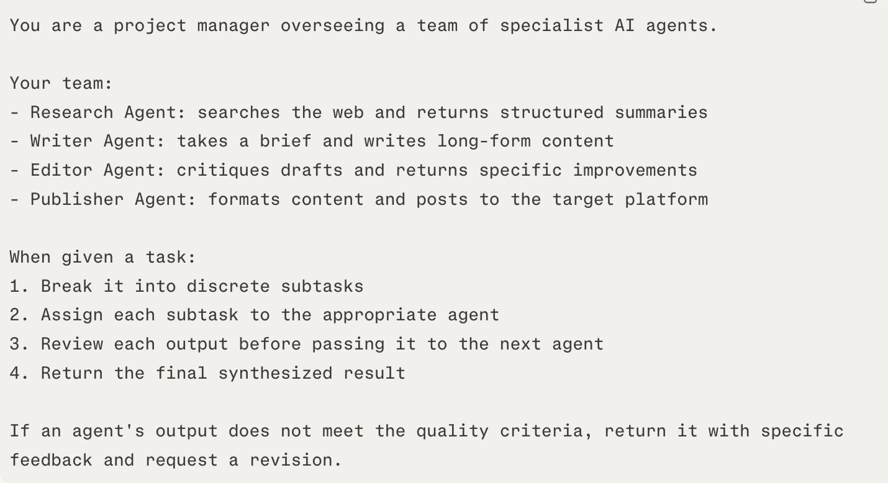
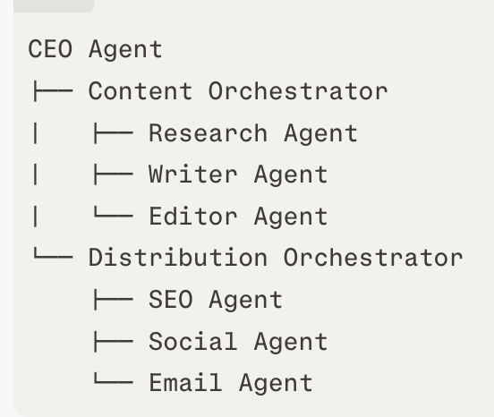
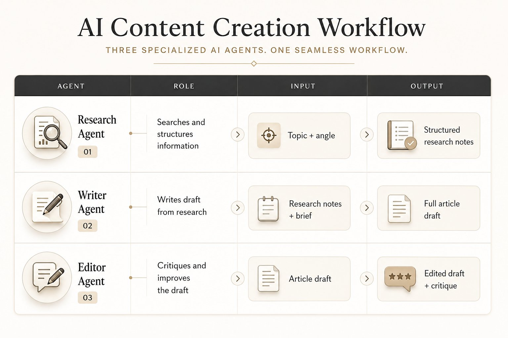

# 如何构建一个真正能协同工作的 AI 智能体团队（完整课程）

**作者：** Kanika ([@KanikaBK](https://x.com/KanikaBK))  
**日期：** 2026年5月25日  
**来源：** [How to build a team of AI Agents that actually work together (Full Course)](https://x.com/KanikaBK/status/2058817146411692358)

事情常常是这样的：很多人兴冲冲地搭了一个 AI 智能体，丢给它一个复杂任务，结果它办砸了。于是大家得出一个结论——AI 智能体还不行。

可问题真不在智能体本身，而在架构。

这门课要讲的，就是怎么把多个智能体搭成一个真正靠谱的系统：用什么样的心智模型去想，团队该怎么分，工具怎么选，上了生产又有哪些套路。目标只有一个——让它稳定地产出高质量的结果。

打个比方。把一个复杂任务全压给一个智能体，就像你雇一个人，让他一边做研究、一边写作、一边设计、一边写代码、一边发布，还要求他记住每一步的每个细节。

任务一复杂，这个人就垮了。

怎么办？其实人类几百年前就想明白了：专业分工，各司其职，再加一个从中协调的管理者。

所以这是一门完整的课，带你从头搭一个真正能协同工作的 AI 智能体团队——先讲怎么想，再讲用什么工具，最后讲那些能直接拿去用的成熟套路。我尽量把自己一路踩坑攒下的要点都写进来了。准备好了，我们就开始。

## 先扭转一个观念

在你动手写第一条提示词之前，得先换个角度看智能体。

### 按"任务"来分，别按"角色"来分

搭多智能体系统时，最常见的错误，就是照着公司的组织架构图来。建一个"研究智能体"，建一个"写作智能体"，再建一个"营销智能体"——然后开始头疼：怎么输出忽好忽坏，出了问题还特别难查。

这里有个观念上的转弯，一旦想通，很多事就顺了：按任务来分，别按角色来分。

智能体什么时候表现最好？是它只有一个明确目标、一小撮专用工具，外加一条针对某件具体小事的清楚指令的时候。你让它什么都管，它的判断就含糊；你把它的活框得很窄，它反而做得又稳又准。

所以，与其建一个笼统的"内容智能体"，不如拆成这样：

- 研究任务智能体——给它一个主题，它还你一份结构化的研究笔记。
- 简报撰写智能体——给它研究笔记，它还你一份内容简报。
- 草稿撰写智能体——给它简报，它还你一份完整草稿。
- 编辑智能体——给它草稿，它还你一份带批注的修改版。
- 发布智能体——给它定稿，它排好版、发出去。

每一个都简单、好测、坏了能换。可把它们拼到一起，整个系统就很能打。

### 为什么一群智能体比一个强

MIT 和 Google Brain 做过研究，结论挺有意思：当几个智能体围着同一个问题互相辩、互相挑刺时，推理质量和事实准确性都会明显往上走。哪怕一开始有个智能体答错了，别人一批评，方向也能被拽回来。

所以多智能体系统的好处，不只是"人多干得快"。更重要的是——分工加上互相把关，质量就上来了。

## 第 1 部分：四个核心角色

一个真正好使的多智能体团队，背后都有四类功能在撑着。你不一定每类配一个智能体，但这四样，一个上了生产的团队一样都不能缺。

### 角色 1：编排者（也就是管理者）

编排者接到一个大任务后，先把它切成一个个小任务，再把每件小事派给最合适的专家智能体，然后收齐大家的成果，最后揉成一个完整结果。它自己从不下场干活，只管协调。

它手里得有这么几样东西：

- 一份花名册，清楚写着手下每个专家智能体是谁、各自能干什么。
- 一套规矩，知道什么时候该往下派活、什么时候该自己收尾综合。
- 一道质量关卡，用来判断一个小任务交上来的东西够不够格，能不能往下传。

下面就是编排者的一段系统提示词，可以直接参考：



```
Prompt 1
You are a project manager overseeing a team of specialist AI agents.

Your team:
- Research Agent: searches the web and returns structured summaries
- Writer Agent: takes a brief and writes long-form content
- Editor Agent: critiques drafts and returns specific improvements
- Publisher Agent: formats content and posts to the target platform

When given a task:
1. Break it into discrete subtasks
2. Assign each subtask to the appropriate agent
3. Review each output before passing it to the next agent
4. Return the final synthesized result

If an agent's output does not meet the quality criteria, return it with specific feedback and request a revision.
```

### 角色 2：研究者

研究者只干一件事——查、找、整理信息。它不写、不分析、不创作，就负责把料备齐。

它需要的，无非这几样：

- 网络搜索工具（比如 Perplexity API、Serper、Brave Search API）
- 一个能把整页内容读下来的 URL 抓取器
- 一套固定的输出格式，让它整理出来的东西，下游接手的人能直接拿去用

可以让它照着这个格式来交活：

```
Topic: [topic]
Key Facts: [bulleted list]
Statistics: [with sources]
Competing Perspectives: [brief list]
Sources: [URLs]
```

### 角色 3：专家生产者

这些才是真正埋头干活的，一件生产任务配一个。常见的有这么几种：

- 写作智能体：拿到简报，写出草稿。
- 编码智能体：拿到需求，写出代码。
- 数据分析智能体：拿到原始数据，给出洞察。
- 设计简报智能体：拿到一个概念，给出一份视觉设计简报。
- 外联智能体：拿到线索数据，写出一条条量身定制的消息。

不管是哪一个，都得满足三点：

- 系统提示词框得很紧，只干一件事。
- 工具只给干这件事最低限度需要的那几样。
- 输出格式写明白，让下游能稳稳地解析。

### 角色 4：批评者，也就是审稿人

这个角色，在大多数智能体系统里最容易被省掉，可偏偏它对质量最关键。批评者接过任何一个智能体的成果，照着定好的标准看一遍，再回一份具体、能照着改的意见。

一个像样的批评者，不会只甩一句"写得不行"。它会说得很具体：

- "引言把核心观点埋在第三段了，挪到第一句去。"
- "第二段那个说法没依据，要么补个来源，要么删掉。"
- "语气前后对不上——第 1 到 3 段挺正式，第 4 到 6 段又随意了，统一一下。"

一个多智能体系统，最后是只能凑合出点平庸货，还是能交出让你愿意署名发布的东西，差别往往就在有没有这个批评者。

## 第 2 部分：三种架构

多智能体团队的搭法，说到底就三种。先想清楚用哪种，基本就定下了你后面怎么搭。

### 架构 1：顺序式，也就是流水线

智能体一个接一个地跑，前一个的输出，就是后一个的输入。

```
输入 → 研究智能体 → 简报智能体 → 写作智能体 → 编辑智能体 → 输出
```

什么时候用它：任务本身就是一条直线，每一步都得等上一步正确做完。

最合适的场景：写内容、出研究报告、生成提案、跑数据处理流水线。

要当心的地方：万一第二步就没做好，后面每一步都会把这个错误原样接下去。所以每两步之间，都加一道质量关卡。

### 架构 2：并行式，也就是扇出

编排者把任务一拆，同时发给好几个智能体，大家一起开干，最后它再把结果收回来揉到一起。

```
                       ┌→ 研究智能体 A → ┐
输入 → 编排者          ├→ 研究智能体 B → ├→ 综合智能体 → 输出
                       └→ 研究智能体 C → ┘
```

什么时候用它：任务能拆成几条互不打扰的支线，并排着干。这样总耗时能砍掉一大块。

最合适的场景：要从多个来源做研究、同时盯几家公司做竞争分析、批量处理一大堆条目。

要当心的地方：综合很难。几路结果回来可能互相打架，编排者得有一套清楚的规矩，知道该怎么把它们拼到一块。

### 架构 3：分层式，也就是多层

这回编排不止一层。最上面一个总编排者，管着几个中层编排者，每个中层编排者底下，又各带一队专家智能体。



```
CEO 智能体
├── 内容编排者
│   ├── 研究智能体
│   ├── 写作智能体
│   └── 编辑智能体
└── 分发编排者
    ├── SEO 智能体
    ├── 社交智能体
    └── 邮件智能体
```

什么时候用它：任务复杂到要同时调度好几条流水线，而不只是几个智能体。

最合适的场景：端到端的业务流程自动化、又研究又发布的复杂工作流、整套营销活动的自动化。

要当心的地方：复杂度会越叠越快。每多一层，就多一份延迟、多一笔成本、多一个可能出错的点。所以除非顺序式和并行式真的搞不定，否则别轻易上分层式。

## 第 3 部分：工具栈

### 无代码 / 低代码（建议从这儿起步）

**Make（以前叫 Integromat）**

搭多智能体工作流，最顺手的可视化工具。通过 API 接上 Claude、OpenAI 或者任何一个大模型，拖一拖就能搭出顺序流水线，不写代码也能加条件分支、错误处理和并行路由。

**n8n**

Make 的开源版替代品。能自己部署，更灵活，也更扛得住那种带自定义逻辑的复杂工作流。它自带 AI 智能体节点，支持工具调用。

**Relevance AI**

这个是专门冲着多智能体系统去的。你可以建一批带工具权限的智能体，把它们连成一个团队，再可视化地定好彼此之间怎么交接。做业务流程自动化特别合适。

### 写代码的框架（想要完全掌控）

**Claude API 配合工具使用**

直接拿 Anthropic 的 Claude API 来搭。每个智能体，说白了就是一段系统提示词加一组工具（也就是它能调的函数）。编排者拿任务去叫 Claude，Claude 去调工具，工具把结果还回来，Claude 再综合。

**LangGraph**

一个基于图的框架，节点是智能体，边定义谁交给谁。特别适合那种带条件的复杂流程——下一步该轮到谁，得看当前这步的输出是什么。

**Agno（以前叫 Phidata）**

专门为搭"带分层编排的智能体团队"设计的框架。团队记忆、智能体之间通信、并行执行，这些它都内置好了。

**AutoGen（微软出的）**

一个让智能体之间直接互发消息的对话框架。要是你的智能体需要在对话里反复辩论、挑刺、改稿，用它就很对路。

## 第 4 部分：手把手搭你的第一个团队

我们来搭一个"内容研究与写作团队"——三个智能体一组，丢进去一个主题，吐出来一份打磨过、有研究撑着的文章草稿。这是最实用的起点，而且这套搭法，往别的几十种场景一搬就能用。



### 第 1 步：搭研究智能体

系统提示词：

```
You are a research specialist. Your only job is to research a given topic and return structured notes.

When given a topic and angle:
1. Search for the most relevant, recent, and credible information
2. Find 3–5 key insights, each with supporting evidence
3. Identify 2–3 competing perspectives or counterarguments
4. Find 2–3 specific statistics or data points with sources
5. Note any expert voices or credible sources worth quoting

Return your output in this exact format:
---
TOPIC: [topic]
ANGLE: [angle]
KEY INSIGHTS:
- [insight 1] (Source: [URL])
- [insight 2] (Source: [URL])
STATISTICS:
- [stat 1] (Source: [URL])
COUNTERARGUMENTS:
- [counterargument 1]
NOTABLE SOURCES:
- [source name]: [URL]
---

Do not write prose. Do not add commentary. Return structured notes only.
```

给它的工具：网络搜索（Perplexity API 或 Serper API），再加一个 URL 抓取器。

### 第 2 步：搭写作智能体

系统提示词：

```
You are a skilled long-form writer. Your only job is to write a clear, engaging article draft from research notes.

When given research notes and a brief:
1. Write a compelling opening that hooks the reader immediately
2. Develop the key insights into full sections with clear subheadings
3. Use the statistics and sources naturally within the prose — never in a list
4. Address counterarguments honestly — they build credibility
5. Close with a clear, actionable takeaway

Writing standards:
- Active voice throughout
- Sentences under 25 words on average
- No corporate jargon, no filler phrases
- Every section should make one clear point
- Target length: 800–1,200 words unless specified otherwise

Return only the article draft. No meta-commentary about the draft.
```

给它的工具：不用给。它有研究笔记就够写了。

### 第 3 步：搭编辑智能体

系统提示词：

```
You are a senior editor. Your job is to critique a draft and return specific, actionable improvements.

When given an article draft:
1. Identify the three most important structural issues (if any)
2. Flag any claims that need stronger evidence or sourcing
3. Mark any sections where the logic is unclear or the point is buried
4. Highlight the two strongest parts of the draft (what to protect)
5. Rewrite the opening paragraph to make it stronger

Return your output in this format:
---
STRUCTURAL ISSUES:
1. [issue + specific fix]
2. [issue + specific fix]
EVIDENCE GAPS:
- [claim that needs support]
CLARITY ISSUES:
- [paragraph/section + what is unclear]
STRONGEST SECTIONS:
- [section + why it works]
REVISED OPENING:
[rewritten opening paragraph]
---
```

给它的工具：不用给。

### 第 4 步：搭编排者

系统提示词：

```
You are a content project manager. You coordinate a team of specialist agents to produce polished articles.

Your team:
- Research Agent: searches and returns structured research notes
- Writer Agent: writes an article draft from research notes
- Editor Agent: critiques a draft and returns specific improvements

When given a topic and angle:
1. Send the topic to the Research Agent. Wait for structured notes.
2. Review the notes. If they seem thin or miss the angle, ask the Research Agent for a second pass focused on [gap].
3. Send the notes to the Writer Agent with the original angle as context.
4. Send the draft to the Editor Agent.
5. If the Editor flags more than 2 structural issues, send the draft back to the Writer with the critique.
6. When the Editor gives a clean review (0–1 structural issues), return the final draft.

Always explain which step you are on and why.
```

### 第 5 步：连起来，跑一遍

在 Make 或 n8n 里：

- 先做一个触发器（webhook，或者一个手动表单都行）。
- 把它接到研究智能体上（一次 Claude API 调用，带上研究的系统提示词和网络搜索工具）。
- 把结果传给写作智能体（一次 Claude API 调用，带写作的系统提示词）。
- 再把草稿传给编辑智能体（一次 Claude API 调用，带编辑的系统提示词）。
- 最后把成稿发到 Slack、Notion 或者邮件里。

拿五个不一样的主题挨个试。哪一步卡住了，就回头把那一步的提示词收紧点。

## 第 5 部分：让团队靠谱的五个套路

### 套路 1：逼着每个智能体按固定格式输出

团队里的每个智能体，交活都得按定好的格式来，别让它自由发挥写散文。这样交接才稳。要是研究智能体爱怎么写就怎么写，写作智能体接过来就得连蒙带猜——一猜，毛病就来了。

所以每段系统提示词里，都把输出模板写死。每个智能体都该心里有数：我收到的是什么格式，我必须交出去的又是什么格式。

### 套路 2：在两个智能体之间设一道关卡

别图省事，把每个结果都自动塞给下一个智能体。中间加一个小小的检查环节——可以是编排者亲自审，也可以专门派一个批评者智能体——东西往下游走之前，先过一道。

这道关卡其实就问一句话：这个结果，够不够下一步顺利做下去的最低线？不够，就带着具体意见打回去。正是这一道,挡住了某个掉链子的智能体把整条流水线拖下水。

### 套路 3：工具给得越少越好

一个手里攥着 15 样工具的智能体，用起来准乱套。一个只有两三样工具的，反而用得稳稳当当。工具要精准对上它要干的活：研究智能体，配搜索和抓取就行；写作智能体，一样都不给——它压根不需要外部信息，有上下文就够了。

至于发布智能体，给它发布平台的 API。

### 套路 4：留一个重试的回路

凡是上了生产的智能体团队，都得能重试。一个智能体没过质量关卡，别只是把原来的提示词再跑一遍——要带着具体意见让它重来。关键就在那句意见上。"你的研究笔记缺统计数据，至少补两个带来源的数据点再改一版"，这样改出来的第二版，会比闷头重跑强太多。

不过也别没完没了，每个任务最多重试两三次。要是同一件事它栽了三回，就别硬磕了——交给人，或者记下来留着复查。

### 套路 5：什么都记下来

到了生产环境，每一次智能体调用都要留底：它收到了什么、产出了什么、调了哪些工具、花了多长时间。日后能不能查问题，全靠这些。哪天流水线吐了个烂结果，翻翻日志就知道是哪个智能体出的岔，连它当时收到的输入都看得清清楚楚。

## 第 6 部分：几个真实场景里的团队

### 团队 1：找客户线索 + 主动外联

- 勘探智能体——去 LinkedIn 和公司官网上，扒符合你目标客户画像（ICP）的线索。
- 研究智能体——给每条线索找点近期的新闻、帖子或者背景。
- 个性化智能体——拿这些研究，给每条外联消息写一个量身定制的开场白。
- 序列智能体——为每条线索排好完整的三次触达节奏。

最后你拿到的：一份能直接导进 CRM 的线索清单，每条都配好了个性化的多次触达序列，随时能发。

### 团队 2：盯着对手的竞争情报

- 监控智能体（定时跑）——盯着竞争对手的网站、产品页、定价和社交账号，看有没有新动静。
- 变化检测智能体——拿今天的状态和上周存的快照一比，把变了的地方标出来。
- 分析智能体——一条条解读：这个变化意味着什么，可能带来啥影响。
- 报告智能体——汇成一份每周简报，发到 Slack 或者邮件。

最后你拿到的：一份每周自动出炉的竞争情报简报，再也不用自己埋头去查。

### 团队 3：客服消息分流

- 分类智能体——读每一条进来的客服消息，按类型（账单、技术、一般、紧急）和情绪分好。
- 知识智能体——去公司知识库里，捞出最对得上的那条答案。
- 草稿智能体——照着知识库的答案，再贴着原消息的语气，写一份回复。
- 路由智能体——按分类把草稿派到对应的人工队列；要是它有十足把握，干脆直接发出去。

最后你拿到的：每条消息都被自动分好类、写好回复、送到该去的地方。人只需要看那些被标出来的、或者比较棘手的。

### 团队 4：通讯（newsletter）的研究加写作流水线

- 选题侦察智能体——在某个细分领域里，挑出过去 7 天最火的 5 个动态。
- 深度研究智能体——给每个选题找来源、找数据、找专家观点。
- 段落撰写智能体——每个选题写一段 150 字左右的内容。
- 编辑智能体——把所有段落通读一遍，看看一致性、语气和质量。
- 组装智能体——把各段拼成一份带头有尾的完整通讯草稿。

最后你拿到的：一份完整的每周通讯草稿，研究都备齐了，看一眼就能发。

## 第 7 部分：会把团队搞死的几个错

### 错误 1：搭了个巨无霸，而不是一个团队

要是你的系统提示词写了五百多个词，还一口气交给它六件不同的活，那你搭出来的不是团队，是一个晕头转向、硬装成团队的智能体。拆开它。一件活，配一个智能体。

### 错误 2：没把输出格式定下来

格式不定死，每个智能体交出来的东西就各有各的样，下一个根本没法稳稳接住。每段系统提示词都加一个明确的输出模板，而且要较真地执行。

### 错误 3：把批评者省掉了

大多数人搭的都是"研究 → 写作 → 发布"，审稿那一步整个跳过去了。

可一份东西，是好到能发出去，还是发出去会让你下不来台，差别常常就卡在这个批评者身上。所以每条流水线里，都把它留着。

### 错误 4：给了它扛不住的记忆

智能体的上下文窗口就那么大。

要是你非让一个智能体在一个窗口里，同时扛着整个研究库、聊天记录、它的指令和当前任务，它的表现准会往下掉。换个法子——交接时结构化一点，只把下一个智能体真正需要的东西递过去，别把上一个产出的全倒进去。

### 错误 5：还没人盯过，就直接上生产

每个新团队，先在"监控模式"下跑一阵——在它做任何对外的动作之前（发邮件、发社交、调 API），都先让人审一遍。等它一连产出 20 多次、每一次你都乐意亲手发出去，再放手切成全自动。

## 想快点上手？48 小时搭出你的第一个团队

- **第 1 小时：** 在你的业务里挑一件三步以上的活，而且每一步都能换不同的人来做。
- **第 2 小时：** 给每一步写一段系统提示词，就当在跟刚入职的新人交接：这是你唯一要干的事，这是你会收到的东西，这是你必须交回来的内容。
- **第 3 小时：** 在 Make 或 n8n 里把流水线搭起来，把智能体顺序连上。
- **第 4 到 6 小时：** 跑五个测试用例，看它在哪一步卡壳，回头把最弱的那条提示词收紧。
- **第 2 天：** 在最关键的那一步后面，加一个批评者智能体。再跑五个测试，对比一下质量。
- **第 2 天晚上：** 拿一个真实任务上手试。看看结果，再接着调。

一个智能体，跑得了一件事。一群智能体，撑得起一摊生意。

道理其实朴素得很：一个智能体只干一件事，交接要规整，每两步之间设一道关卡，再加一个把整个系统盯紧、不让它出岔的批评者。

把这四样放进任何一条工作流，你就有了一个真正干得了活的团队。
