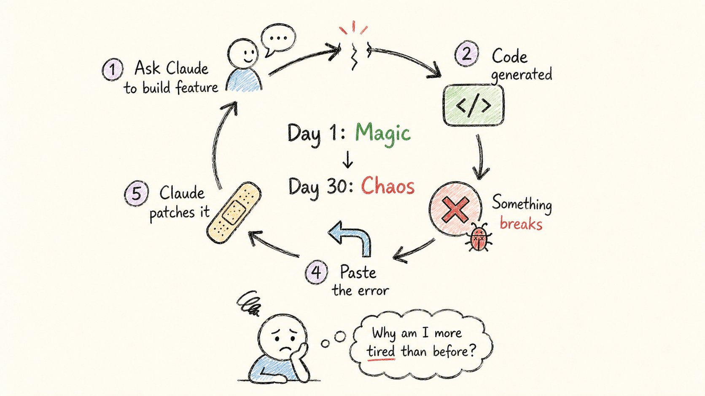
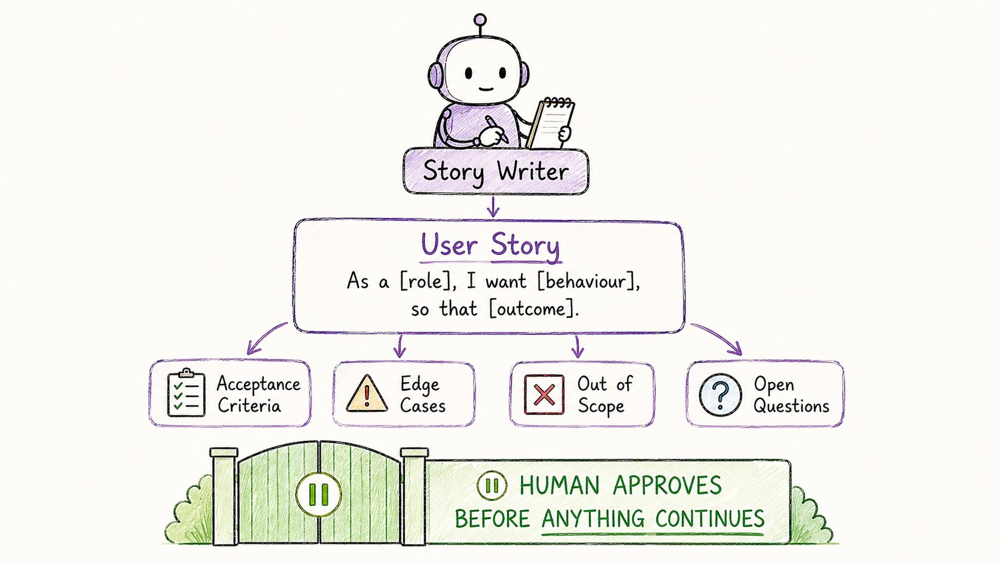
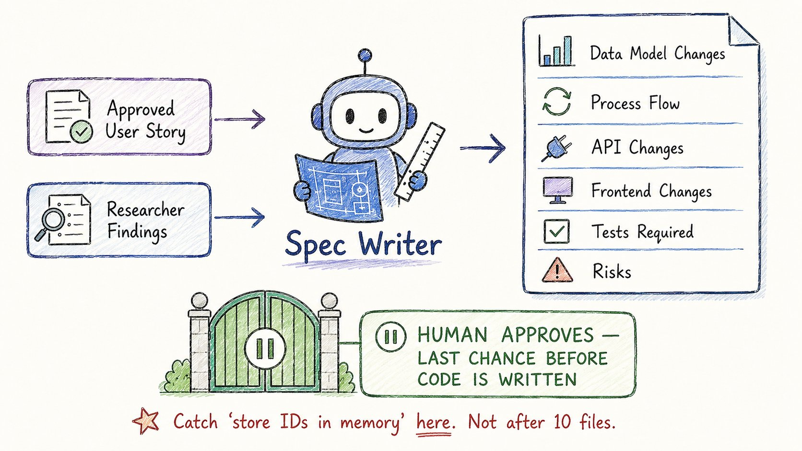
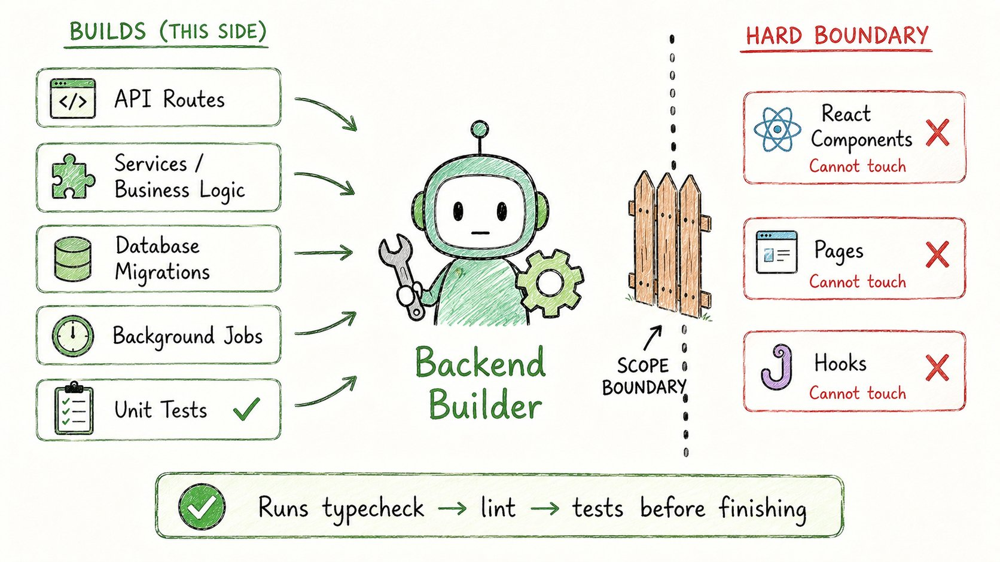
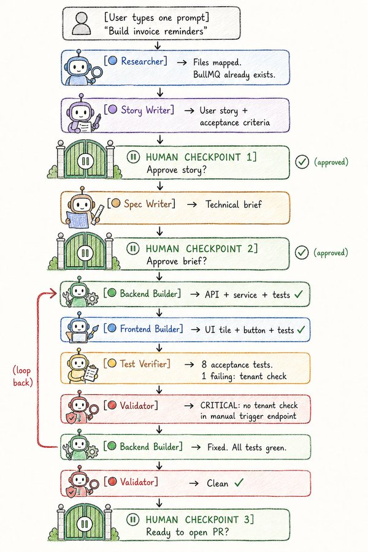
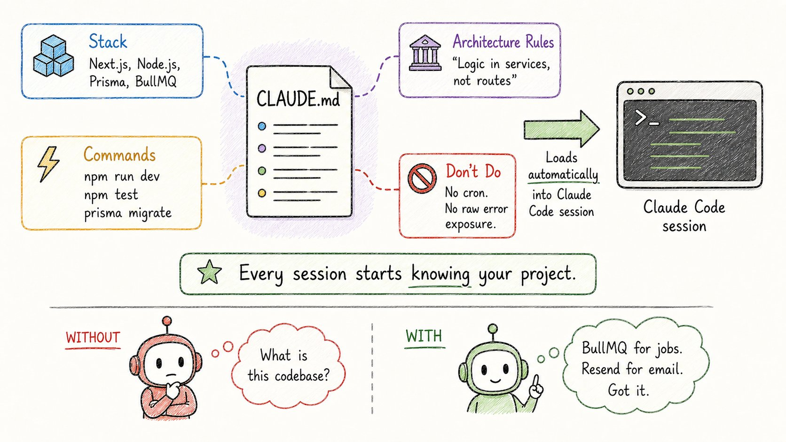
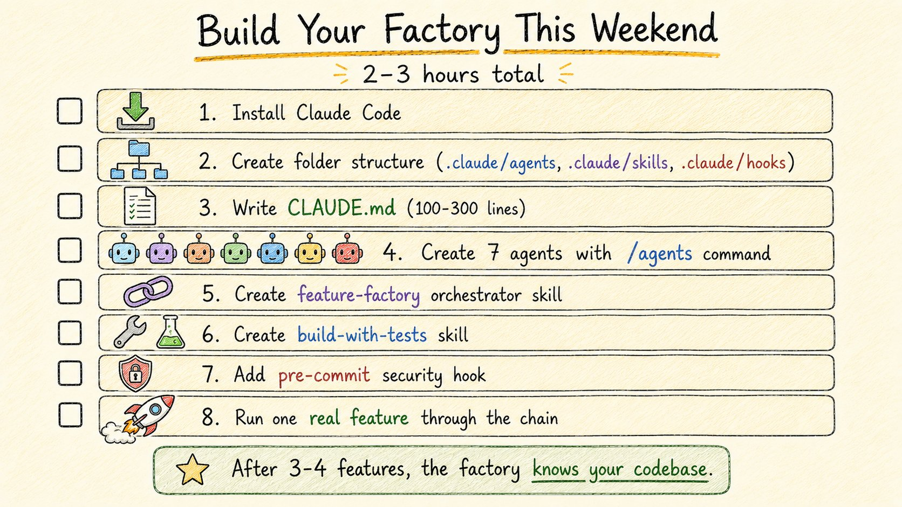

# How to Build a Software Factory with Claude Code That Ships Features While You Sleep

**Author:** Rahul ([@sairahul1](https://x.com/sairahul1))  
**Published:** May 25, 2026  
**Source:** [How to Build a Software Factory with Claude Code That Ships Features While You Sleep](https://x.com/sairahul1/status/2058832033628241931)

I thought I was using AI to code.

I was actually just typing faster.

Here is the difference — and the 7-agent system that changed everything.

Save this. It will save you months.

## THE PROBLEM NOBODY TALKS ABOUT

The loop that feels productive but isn't:

→ Ask Claude to build a feature → It generates code → Something breaks → Paste the error back → It patches it → Something else breaks → Ask again

Day 1: this feels like magic.

Day 30: you're spending more time supervising AI than you used to spend writing code.

Same logic appears in 3 different places.

Claude forgot the convention you set up two weeks ago.

New features break old ones.

Tests are missing or shallow.

You wake up and realize: the AI isn't failing.

Your workflow is.

The real problem is structural.

When you type "build this feature" into Claude Code, you're asking one AI session to be:

→ Product analyst → Architect → Backend engineer → Frontend engineer → Test engineer → Code reviewer

All at once.

In the same messy conversation.

Wrong assumptions in the plan become wrong database models.

Wrong database models become wrong APIs.

Wrong APIs become wrong UIs.

By the time you notice, the mistake has spread everywhere.

This is called vibe coding.

And it has a hard ceiling.

## THE SHIFT: FROM VIBE CODING TO A SOFTWARE FACTORY

What actually changes everything:

Real engineering teams don't work in one big conversation.

Different people own different jobs:

→ Someone clarifies the user problem → Someone thinks about architecture → Someone builds the API → Someone builds the UI → Someone thinks about edge cases → Someone reviews

When you collapse all of that into one AI session, mistakes compound silently.

The fix is to split the work across specialized agents.

Each agent gets: → One focused job → Its own clean context window → Only the tools it actually needs → Strict rules about what it cannot touch

The result: a software factory.

One developer + seven focused agents = a coordinated team.

Here are the seven agents that make it work.

## THE 7 AGENTS

### Agent 1: The Codebase Researcher

The biggest mistake developers make with AI?

Asking for code as the first move.

The AI accepts the prompt, makes guesses to fill the gaps, and starts generating.

That's when bad designs sneak in.

The Codebase Researcher fixes this.

Its only job: inspect the codebase and explain how things work — before a single line is written.

What it does: → Maps the relevant files and their roles → Documents existing patterns to follow → Finds similar features already built → Flags risks (timezone, multi-tenant, retry logic) → Lists what tests will need updating

What it cannot do: → Edit files (read-only access only) → Run any command that modifies state → Make assumptions — it asks instead

Tools: Read, Grep, Glob only.

The rule: explore before you build, every single time.

The Researcher runs first. Always.

### Agent 2: The Story Writer

Most features fail not because the code was wrong.

But because the problem was never clearly defined.

The Story Writer turns a rough feature idea into a real user story before any technical decisions are made.

Input it receives: → Your rough feature description → The Researcher's findings

What it produces:

One user story: "As a [role], I want [behaviour], so that [outcome]."

Acceptance criteria: Statements a test can verify directly. Happy path. Failure paths. Business rules.

Edge cases: Boundaries, retries, multi-tenant concerns.

Out of scope: What is explicitly NOT being built.

Open questions: Things it genuinely doesn't know — never guesses.

What it cannot do: → Invent business rules → Write any code or technical design → Move forward if something is genuinely unclear

Tools: Read only.

The rule: you read this story and approve it before anything else happens.

This is the human checkpoint that saves everything downstream.

### Agent 3: The Spec Writer

Once the story is approved, the Spec Writer turns it into a technical brief.

This is the blueprint every build agent follows.

Input it receives: → Your approved user story → The Researcher's findings → Your project's CLAUDE.md rules

What it produces:

→ Data model changes (fields, types, migrations) → Background flow / process flow → API changes (endpoints, request/response shapes) → Frontend changes (components, pages, hooks) → Tests required (success, failure, edge cases) → Risks and open questions → Every file that will change

What it cannot do: → Edit any file → Invent new infrastructure — calls it out explicitly instead → Skip tenant isolation or timezone concerns → Leave questions unanswered

Tools: Read, Grep, Glob only.

The rule: this brief is the second human checkpoint.

You read it and approve it before a single file is touched.

If you see "store IDs in memory" — that's your red flag.

Catch it now. Not after 10 files have been changed.

### Agent 4: The Backend Builder

Now the building starts.

The Backend Builder implements the backend half of the feature — and only the backend half.

Input it receives: → Approved technical brief → Researcher's findings → Your project's CLAUDE.md

What it builds: → API routes → Services and business logic → Database access and migrations → Background jobs → Unit tests for everything it writes

What it cannot do: → Touch React components, pages, or client-side hooks (that's Agent 5) → Invent new dependencies without instruction → Modify files outside agreed scope → Stop without running typecheck, lint, and the test suite

After finishing, it returns a summary: → Every file added or edited → Every existing helper or pattern reused → Any CLAUDE.md rule that would have helped

Tools: Read, Edit, Write, Bash — scoped to backend folders only.

The separation is the point.

Backend Builder cannot accidentally break the frontend. Ever.

### Agent 5: The Frontend Builder

The Frontend Builder implements the UI half — and only the UI half.

It reads the Backend Builder's summary first.

This matters.

It consumes the API exactly as the backend produced it.

It does not invent new endpoints.

If the API shape is wrong for the UI, it surfaces the mismatch as feedback — not as a patch.

Input it receives: → Approved technical brief → Researcher's findings → Backend Builder's summary (the API contract)

What it builds: → React components and pages → Client-side hooks and state → Loading and error states → Component and unit tests for everything it writes

What it cannot do: → Touch services, API routes, workers, or migrations (that's Agent 4) → Invent endpoints or response shapes → Add dependencies without instruction → Stop without running typecheck, lint, and the test suite

Tools: Read, Edit, Write, Bash — scoped to frontend folders only.

Two builders.

Two clean context windows.

Zero chance one breaks the other's work.

### Agent 6: The Test Verifier

Both builders wrote unit tests for their own code.

That's not enough.

The Test Verifier does one thing only: prove that the feature actually does what the user story said it should.

It writes acceptance tests.

Not unit tests.

Acceptance tests.

These test the feature from the outside — the way a real user would experience it.

Input it receives: → Approved user story (with all acceptance criteria) → Approved technical brief → Both builders' summaries

What it produces: → One acceptance test file covering every acceptance criterion → A report: which criteria passed, which failed, which can't be covered cleanly

What it cannot do: → Modify any backend or frontend code → Invent workarounds for untestable criteria → Mark a criterion as covered if it genuinely isn't

If a test fails: the feature doesn't satisfy the story.

It reports exactly which criterion failed.

It does not patch the code.

That goes back to the right builder.

Tools: Read, Edit, Write (test files only), Bash.

The rule: you don't have a feature until the acceptance tests pass.

### Agent 7: The Implementation Validator

This is the agent that catches everything everyone else missed.

The Validator compares the current implementation against the approved story and brief — and reports gaps.

It never fixes anything.

It just tells the truth.

Every check it runs, every time:

→ Acceptance criteria from the story not yet implemented → Failure paths with no test coverage → Security issues: missing auth checks, tenant isolation gaps, secrets in logs, raw errors exposed to clients → Files changed outside agreed scope → Patterns inconsistent with CLAUDE.md or existing code → Duplicate logic that should reuse existing helpers → Timezone or multi-tenant concerns from the brief that were quietly skipped

Output is always grouped by severity:

Critical — must fix before merge. Important — should fix before merge. Minor — opinion-based, reviewer's call.

Every finding includes the file path and line number.

If there's nothing wrong, it says so plainly.

It doesn't invent issues to look thorough.

Tools: Read, Grep, Glob only.

This agent is why the factory is trustworthy.

A self-graded paper is worthless.

A validator that sees only what's on disk — not how it was written — is honest.

## HOW THE CHAIN RUNS

The full flow — one prompt starts it all:

You open Claude Code and type:

"Build invoice reminders for invoices unpaid for more than 7 days."

Here's what happens without you typing anything else:

Step 1 → Researcher maps your invoice, payment, and email code. Returns relevant files, existing patterns, risks.

Step 2 → Story Writer produces the user story and acceptance criteria.

⏸ PAUSE: You read and approve the story.

Step 3 → Spec Writer turns the approved story into a technical brief.

⏸ PAUSE: You read and approve the brief. (Catch that "store IDs in memory" mistake right here.)

Step 4 → Backend Builder implements the service, API route, BullMQ job, and unit tests. Returns: files changed, patterns reused, all tests green.

Step 5 → Frontend Builder reads the Backend Builder's API summary, builds the admin UI tile and reminder button, writes component tests. All tests green.

Step 6 → Test Verifier writes acceptance tests for all six acceptance criteria. Reports: 7 passing, 1 failing — manual trigger doesn't check tenant ownership.

Step 7 → Validator finds it. Reports as Critical with file path and line number.

→ Loop back to Backend Builder. Fix applied. All 8 acceptance tests pass. Validator runs again. Clean.

⏸ PAUSE: You review and open the PR.

Three human checkpoints.

Everything else runs on its own.

## THE FOUNDATION: BEFORE AGENTS WORK, YOU NEED THIS

CLAUDE.md — the memory that survives every session:

Every time you open Claude Code, it starts with zero memory.

CLAUDE.md fixes this.

It's a Markdown file at your repo root that loads automatically every session.

It's where permanent project facts live:

→ Your stack (Next.js App Router, Node.js, Prisma, BullMQ, Resend) → Your commands (npm run dev, npm test, npx prisma migrate dev) → Architecture rules ("Business logic lives in services. API routes stay thin.") → What not to do ("Do not add cron — use BullMQ. Do not log raw payment payloads.") → Pointers to deeper docs (docs/billing.md, docs/architecture.md)

Keep it 100-300 lines.

Every time AI makes a mistake that surprises you, ask: would a rule in CLAUDE.md have prevented this?

Add the rule.

In a few weeks, your CLAUDE.md becomes a record of every assumption the AI got wrong — and your sessions get noticeably better.

**Context drift — the silent killer:**

Most Claude Code sessions don't fail dramatically.

They drift.

A wrong assumption enters the context.

The model keeps building on top of it.

You ask Claude to build subscription management.

It designs: User → Subscription.

You remember: subscriptions belong to the company, not the user.

If you just say "no, subscriptions belong to companies" — Claude patches.

Now you have both user.subscriptionId and company.subscriptionId floating around.

Rule:

→ Small typo? Correct it inline. → Wrong architectural assumption? Throw the conversation away and start fresh with the right assumption baked into the first prompt.

A clean session with the right mental model beats a patched session every time.

## THE RESULTS: WHAT ACTUALLY CHANGES

Before the factory:

→ Vibe coding loop: prompt → generate → error → patch → repeat → Session context fills up with noise → Wrong assumptions compound into broken features → One engineer can only do one thing at a time → Every feature waits for the right person to be available

After the factory:

→ Structured chain: research → story → brief → build → verify → validate → Each agent gets a clean context window with only what it needs → Wrong assumptions get caught at the brief approval — not after 10 files → One engineer ships a complete vertical slice: backend, frontend, tests, validation → The team's best knowledge lives in the agents — not trapped in people

The real shift:

The payments specialist builds a payments-integration agent.

Now every engineer on the team can ship a feature that touches billing.

Without waiting.

Without a handoff.

The frontend lead's component patterns live in the frontend-builder agent.

The DevOps engineer's CI checks live in a hook.

The QA lead's edge cases live in the test-verifier rules.

Expert knowledge, shared as agents.

Not trapped in availability.

## HOW TO BUILD YOURS THIS WEEKEND

8-step setup checklist:

1. Install Claude Code → code.claude.com
2. Create the folder structure: → .claude/agents/ → .claude/skills/feature-factory/ → .claude/skills/build-with-tests/ → .claude/hooks/
3. Write your CLAUDE.md (100–300 lines: stack, commands, architecture rules, don't-do list)
4. Create the 7 agents using the /agents command in Claude Code. Describe each agent's role. Claude writes the file. You review and commit.
5. Create the feature-factory orchestrator skill. Ask Claude to write it — it reads your 7 agent files and wires the chain.
6. Create the build-with-tests skill. Describes how your team builds: match existing patterns, write tests alongside code, run typecheck at the end.
7. Add a pre-commit hook. Blocks commits that include .env, .key, .pem, or secrets.json files. Takes 5 minutes. Prevents disasters.
8. Run one real feature through the full chain. Pick something small. Watch where it stumbles. Add rules. The factory tunes itself.

Total time: 2–3 hours.

Then run a few features.

After 3–4, the factory knows your codebase.

You'll spend less time supervising.

More time deciding what to build next.

## THE 7 AGENTS — QUICK REFERENCE

→ Researcher — maps the code before anything is built (Read only) → Story Writer — turns idea into user story with acceptance criteria (Read only) → Spec Writer — turns story into technical brief (Read only) → Backend Builder — builds API, services, jobs, unit tests (backend folders only) → Frontend Builder — builds components, pages, hooks, UI tests (frontend folders only) → Test Verifier — writes acceptance tests against the user story (test files only) → Validator — compares implementation against story and brief, reports gaps (Read only)

3 human checkpoints: → Approve the story → Approve the brief → Approve the PR

Everything else runs on its own.

Most developers using Claude Code are still vibe coding.

Prompting → generating → patching → hoping.

That's not wrong.

It's just a ceiling.

The factory doesn't remove you from the process.

It removes you from the parts that don't need you.

You stay in the loop where your judgment matters:

Is this the right problem? Is this the right design? Is this safe to ship?

The agents handle everything in between.

That's the difference between using AI as a faster keyboard —

and using AI as a coordinated team.
