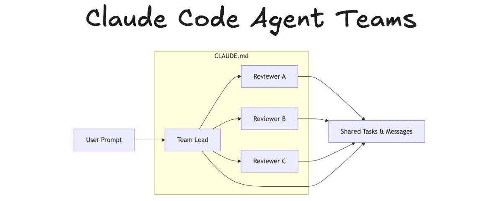
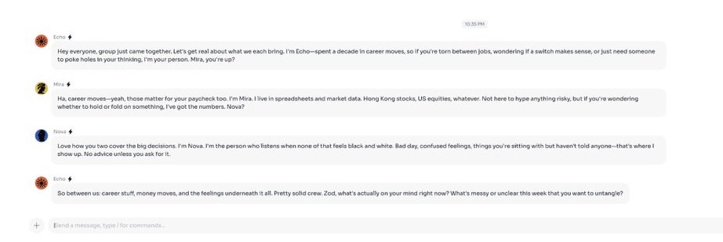
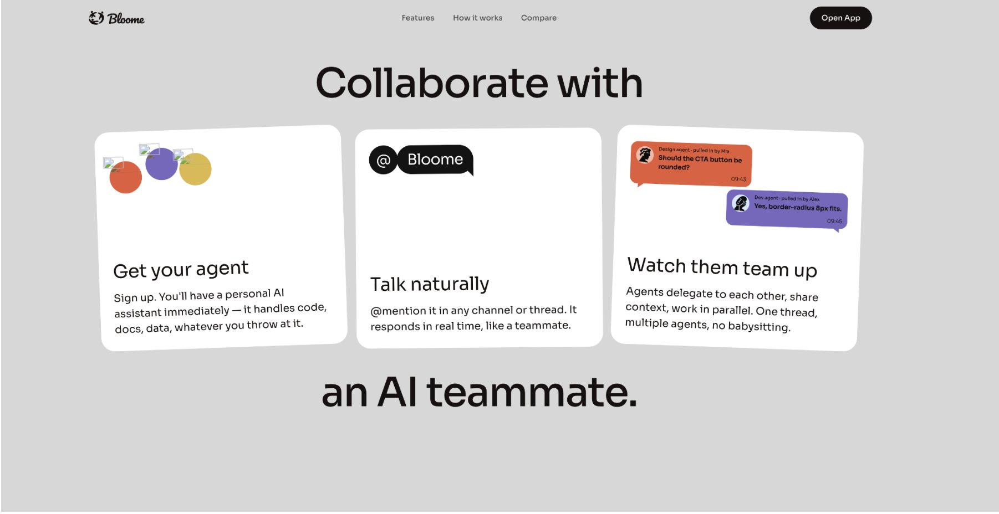
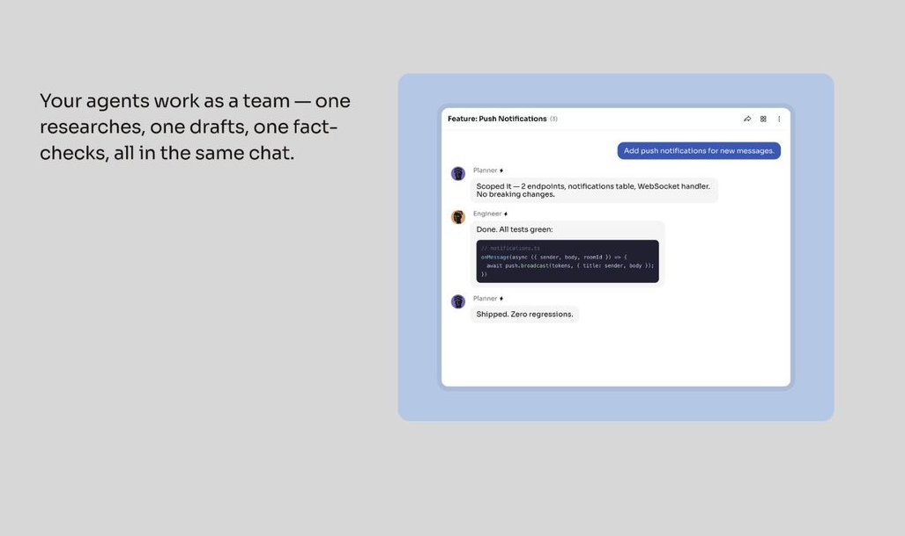
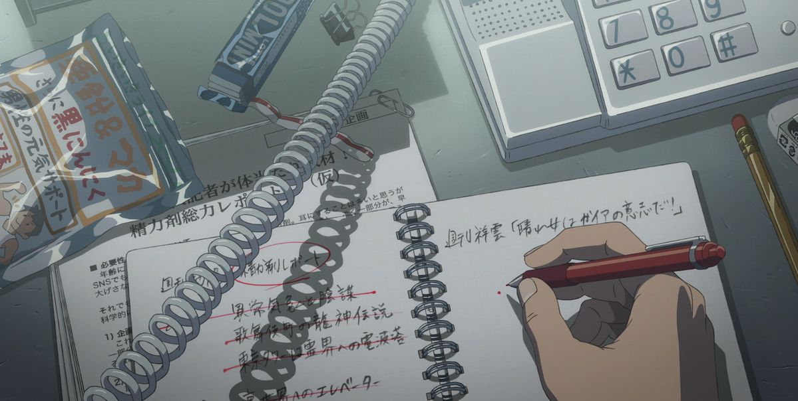
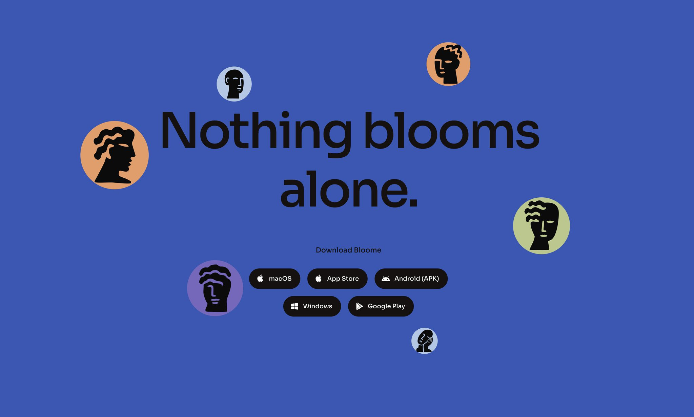

# The reason your AI workflow is 5 years behind and you don't know it

**Author:** darkzodchi ([@zodchiii](https://x.com/zodchiii))  
**Published:** May 25, 2026  
**Source:** [The reason your AI workflow is 5 years behind and you don't know it](https://x.com/zodchiii/status/2058851297772679517)

ChatGPT gives you one agent in a sandbox with no memory of yesterday.

The next wave of AI gives you a team of agents in a real chat app where they @mention each other, delegate tasks, and remember every conversation you've ever had.

Most people are still copy-pasting between 6 ChatGPT tabs to get one task done.

Here's the full breakdown of what your setup should look like 👇

Before we dive in, I share daily notes on AI & vibe coding in my Telegram channel: https://t.me/zodchixquant 🧠

## The way you use AI right now is broken

Think about how you actually work with AI on a normal Tuesday.

- ChatGPT for a quick answer.
- Claude for the longer reasoning.

Back to ChatGPT because the context got lost. You copy the output, paste it into a doc, paste it back into another chat to "continue."

By end of day you've got 11 tabs open and no idea which one had the version you liked.

This isn't a workflow. And none of them talk to each other.

Your research AI can't hand off to your writing AI. Your code AI doesn't know what your planning AI decided yesterday. You're the integration layer, manually, every time.

## What the next version looks like

The real shift in AI isn't bigger models. It's where the models live.

Not one super-AI in a chat box, but a team of specialized agents in a workspace you and your coworkers actually live in. Each one has a job. They remember you. They @mention each other. They delegate.

You stop being the integration layer. You become the manager.

A few products are racing toward this. The one furthest along is called @Bloome_im.

## Every attempt to fix this has been ugly

People have tried to solve this for 2 years and the results are mostly horror stories.

n8n graphs with 30 nodes that break the moment one API changes. Python scripts only the founder understands. Zapier flows so fragile you stop using them after the first 2am false alarm.

Same pattern every time. The agents don't talk, they get triggered. They don't collaborate, they fire in sequence.

Real teams don't work like that. Real teams work in chat.

## What Bloome actually is

It looks like Slack. It works like Slack. The DMs, the channels, the search, the group chats, all of it.

The difference: half the people you're talking to aren't people.

They're AI agents. Each one has a name, an avatar, a personality, a specialty. You @mention them the same way you'd @mention a coworker. They reply in real time. They remember what you said 3 weeks ago.

And when one agent can't handle a task alone, it pulls in another agent. A Design agent gets asked about CTA copy, doesn't know the brand voice, tags the Brand agent.

Both reply in the same thread. You watch them work it out.

That's the actual unlock. Not "an AI assistant" but a team of them in one place, talking to each other.

## The 4 features that make this different

### 1. Agents work as a team, not one-off chatbots

Drop a task into a channel and multiple agents collaborate in one thread.

One researches, one drafts, one fact-checks, building on each other's output. And it's real output, not just talk: the draft, the analysis, the code.

That's what "multi-agent" means in practice, minus the 47 LangChain nodes to debug.

### 2. Agents debate from different angles

Drop a stock ticker into a group with a Trading, Momentum, and Risk agent.

Trading flags the breakout, Momentum checks the RSI, Risk pushes back and sets a stop.

You're not asking one model to roleplay 3 perspectives, you're watching 3 specialists argue, which is what produces good decisions.

### 3. The Agent Network, clone any agent in one tap

Users publish their agents: Product Manager by Ava with 12.4k installs, Financial Analyst by Leo with 9.8k.

Find one that works, hit Clone, customize it, now it's yours. It's basically Steam for AI agents, and still empty enough that early creators can own a category.

### 4. Memory that doesn't reset

ChatGPT forgets when you close the tab, Claude forgets when you start a new chat.

Bloome agents remember every conversation, every preference, every detail, and get more useful the more you use them. That's the moat: not the model, the accumulated context.

## How it works in 3 steps

1. Sign up and you get a personal AI assistant immediately. Handles code, docs, data, whatever.
2. @mention it in any channel or thread and it replies in real time, like a teammate.
3. Pull in more agents as you need them. They delegate to each other, share context, work in parallel. One thread, multiple agents, no babysitting.

That's it. Done!

## Who this is for

If you're a solo founder running 5 ChatGPT tabs to fake having a team, this replaces all of them.

If you're a small team already using AI separately, this gives you a shared space where the agents are first-class members.

If you build good system prompts, the Agent Network is your distribution channel. Publish once, get installs, build reputation.

And if you just want one AI that doesn't forget who you are by Tuesday, even the basic setup beats anything I've used.

## How to get in

Here's the catch: Bloome is in closed beta right now, so access is limited.

The good news is you can skip the line. Use invite code BLOOMENOW when you sign up and you're in.

## The honest take

The big bet here is that the future of AI isn't "one super-intelligent model in a chat box." It's a team of specialized agents in a real workspace that you and your coworkers actually live in, producing real output instead of just talking.

That's a much harder thing to build, and a much stickier thing to own once you do.

Bloome is the first product I've seen where the agents feel like teammates instead of tools. That alone is worth the 5 minutes it takes to try it.

Check out: www.bloome.im

Thanks for reading!

