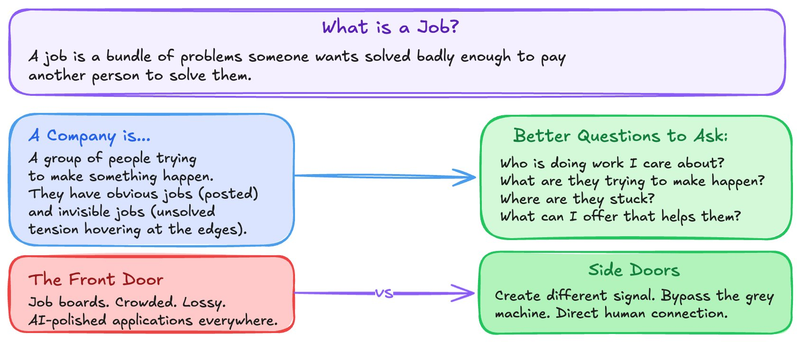
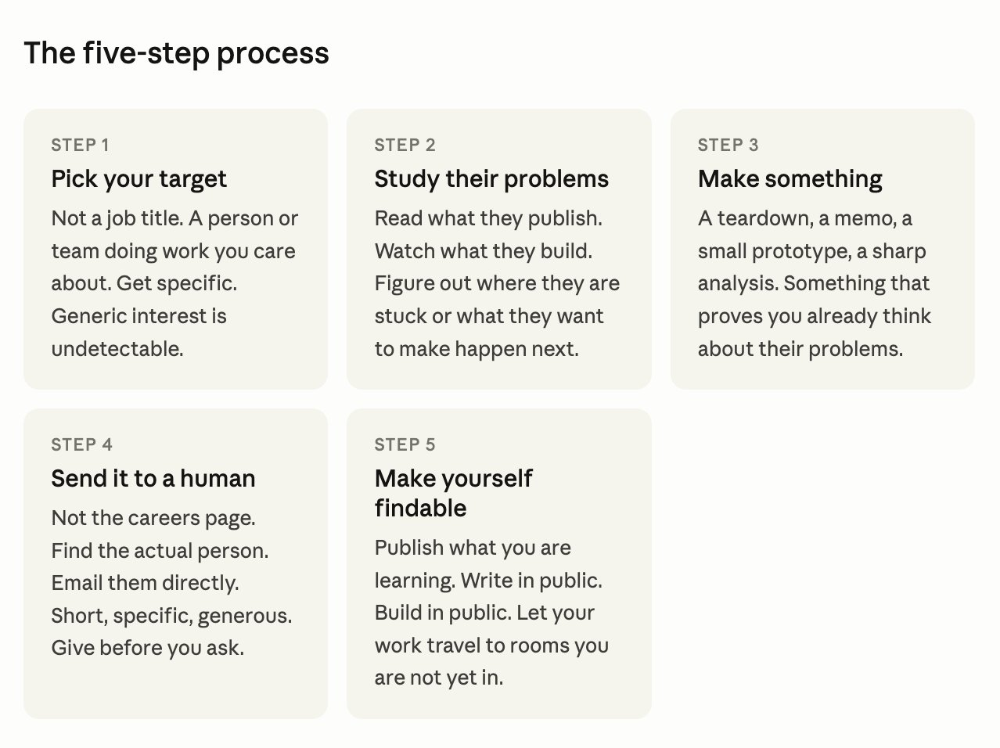
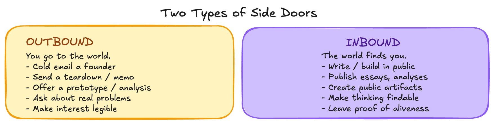
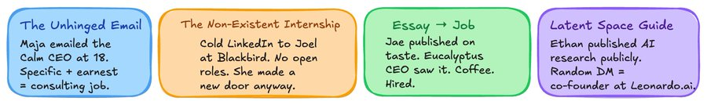
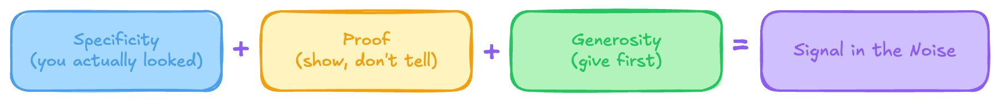

# How to crack any job in the world

**Author:** Prakarsh | Blockchain Balak ([@blockchainbalak](https://x.com/blockchainbalak))  
**Published:** May 25, 2026  
**Source:** [How to crack any job in the world](https://x.com/blockchainbalak/status/2058878015279644883)

## First, change how you see the game

Most people treat job hunting like a queue. You wait your turn. You submit the form. Someone on the other side decides if you are good enough.

That model is not wrong. It is just weak. It puts all the power on the other side and leaves you passive.

Here is the reframe that changes everything: a job is not a thing that exists until someone makes it. It is a bundle of problems a person or team needs solved badly enough to pay someone to solve them. Your job is to find that bundle before it becomes a job posting, and show up as the answer.

Stop asking what roles are open. Start asking who is stuck and what you can do about it.

That one shift moves you from applicant to problem solver. And problem solvers get hired faster than applicants almost every time.

## The two moves that actually work

Every side door fits into one of two categories. You should be running both in parallel.

**Move 1 / outbound — you go to the world**

You find the person. You study them. You send something useful before you ask for anything. A cold email to a founder that contains a real idea. A teardown of their product with a specific observation. A memo on a growth gap they have not publicly addressed. This is not spraying your resume into inboxes. This is picking one human, doing the work, and making your interest impossible to ignore.

**Move 2 / inbound — the world finds you**

You publish. You build. You document what you are learning in a form other people can find. Essays. Analyses. Guides. Tools. Public artifacts that show how you think. The goal is not followers. The goal is becoming visible to the specific kind of person who cares about the same problems you do. Ethan published an AI research guide from his bedroom. A stranger from Australia found it on Discord and asked him to co-found Leonardo.ai. His obsession traveled ahead of him.

## How to write a cold outreach that gets a reply

Most cold emails fail for one reason: they are about the sender. The person reading it does not care about your resume. They care about their problems. Here is the structure that works.

1. **Open with something specific you noticed about their work.** Not generic praise. A real observation that required you to actually pay attention.
2. **Give them something.** A sharp take. A short analysis. A thing you made. Make the value of opening your email higher than the cost of reading it.
3. **Tell them what you are trying to do.** One sentence. Not a job title. What you want to make happen and why their world is where you want to do it.
4. **Ask for something small.** A fifteen-minute call. A reaction to the thing you sent. Not a job. Not a big favor. Something easy to say yes to.
5. **Keep it short.** If it takes more than ninety seconds to read, it is too long. Respect their time. It signals you understand how busy people actually are.

The worst version of outreach is entitlement disguised as boldness. The best version is attentive. It proves you noticed something real.

## What to publish and where

You do not need a big platform. You need a consistent artifact trail. Here is what actually moves the needle.

**Best formats — things that travel well**

Sharp essays on a specific problem in your field. Breakdowns of how something works that most people handwave. Public analyses of companies or products you find interesting. Guides that teach something you learned the hard way. Small tools, datasets, or templates other people can use. The format matters less than the specificity. A focused 600-word piece on one real insight beats a sprawling 3,000-word overview every time.

**Where to put it — distribution is the product**

LinkedIn for professional reach. Substack or a personal site for longer pieces that live permanently. X or Twitter for real-time thinking and fast feedback. GitHub for anything technical. The goal is that when someone searches your name or your area of expertise, they find evidence of how you think. Not a resume. Proof of aliveness.

## The thing most people get wrong

They wait for clarity before they act.

They want the perfectly scoped role to appear before they move. They want to know it will work before they try. That is not how this works. The clarity comes from moving, not from waiting.

Most doors will not open. Most emails will not get a reply. Most things you publish will not find the right person immediately. That is fine. The process is not wasted when it does not immediately convert. You are learning which parts of the world respond to your particular frequency. You are finding your people by making your signal stronger.

What you are really doing is compressing the time between having the right skills and being in the right room. The job board puts that time on the company's schedule. Side doors put it on yours.

## The formula, distilled

- **S — Specificity.** You actually looked. You studied the person, the company, the problem. You are not spraying need.
- **P — Proof.** You show, not tell. Something small and real that makes it easier for someone to imagine working with you.
- **G — Generosity.** You give before you ask. The ask comes last, after you have already created value.

Specificity plus proof plus generosity equals signal in the noise. All it takes is one person who sees the signal and has the problem you can solve.

Audacity is a practical skill. If you want an unusual outcome, you have to move unusually. You do not need permission to notice where you might be useful. You do not need an open role to reach out to someone whose work you have actually studied. You do not need a big audience to start publishing what you know. Start with one person. Make one thing. Send one email. The door you are looking for is usually a door that does not yet have a sign on it.
