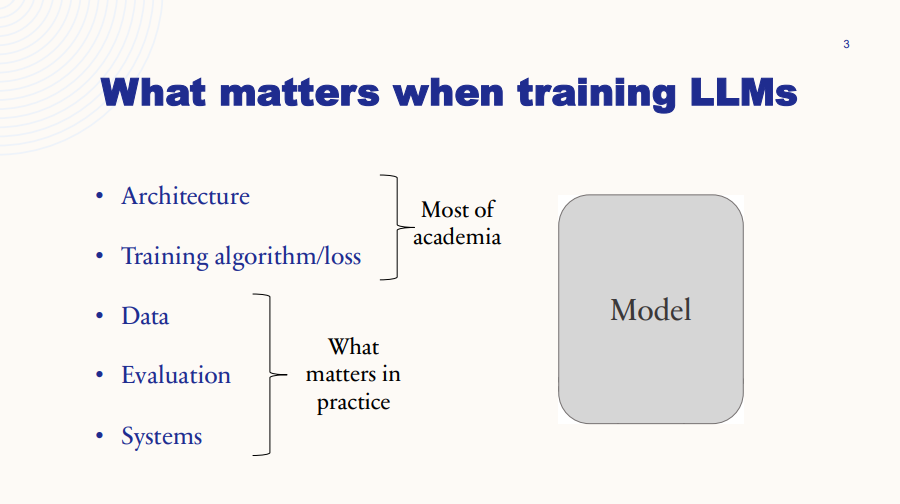
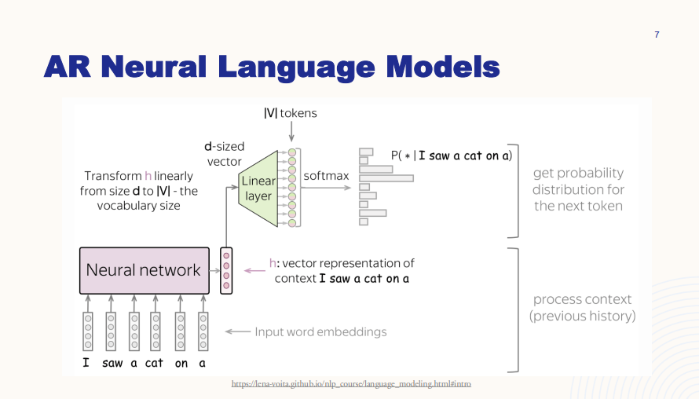
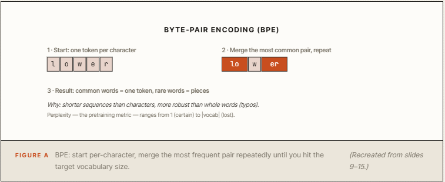
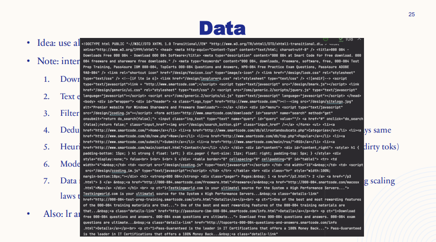
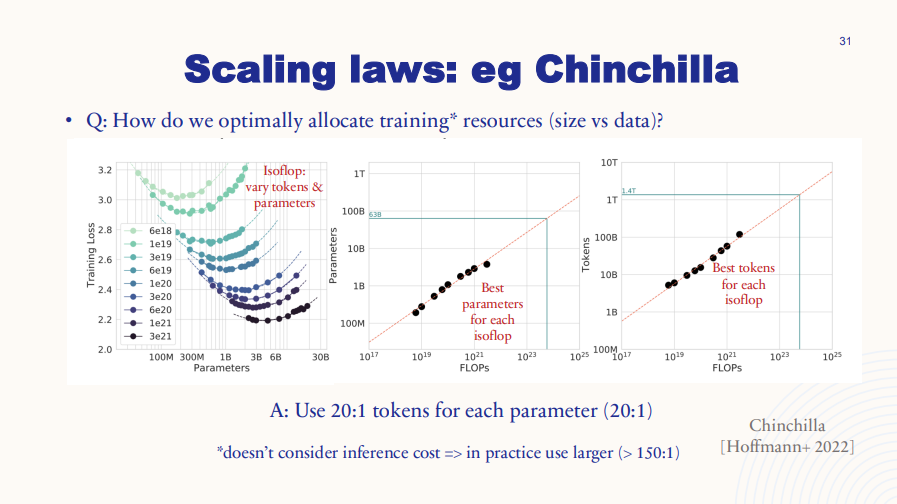
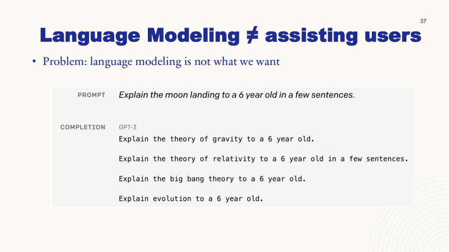
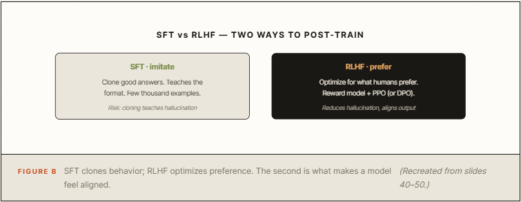
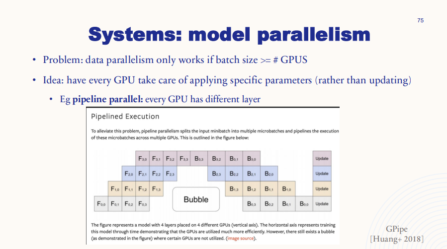

# How to build your own LLM from scratch in 5 Stages: exact pipeline behind GPT and Claude

**Author:** Codez ([@0xCodez](https://x.com/0xCodez))  
**Published:** May 25, 2026  
**Source:** [How to build your own LLM from scratch in 5 Stages: exact pipeline behind GPT and Claude](https://x.com/0xCodez/status/2058911661973454915)

I pulled apart how large language models are actually built - the entire pipeline behind ChatGPT, Claude, and Gemini - and compressed it into one map.

Bookmark this. Save it. By the end you will understand the exact five-stage path from raw internet text to a model that answers like an assistant.

That is not hyperbole. Most people think building an LLM is about the architecture. The core lesson here is that the architecture is the part that matters least.

## The lie everyone believes about LLMs

Ask most people how you build a model like Claude and they will say "transformers." As if the secret is the neural network design.

It is not. The transformer architecture is largely standardized and freely published. Every major lab uses roughly the same building blocks. If architecture were the moat, everyone would have GPT-4.

Here is the line that reframes everything: in practice it is data, evaluation, and systems that make or break a model - not architectural tweaks. The best models are not just trained. They are engineered.

So this guide is built around what actually matters. Five stages. The architecture is a footnote inside Stage 1. The other four are where real models are won and lost.

## 01. Pretraining - teach model language itself

Everything starts with one deceptively simple objective: predict the next word. This is autoregressive language modeling. Given a sequence of words, the model learns the probability distribution of what comes next.

Do this across enough text and the model absorbs grammar, facts, and reasoning patterns - not because anyone taught them, but because predicting the next word well requires them.

### Tokenization comes first

Before the model sees text, the text is broken into tokens. The standard method is Byte-Pair Encoding (BPE), and its logic shapes everything downstream.

### The architecture - the part that matters least

The model is a transformer. That is essentially it for this section, and that is the point. You do not win by inventing a cleverer transformer. You win at the other four stages.

The lecture proves it with scaling curves: transformers simply have a better constant and slope than LSTMs - pick the standard tool and move on.

## 02. Data - where models are actually won

If architecture matters least, data matters most. This is the stage that separates a good model from a mediocre one, and the one most people underestimate.

The pipeline starts with Common Crawl - a scrape of the public web so large it is measured in petabytes: 250 billion pages, over a million gigabytes. But raw web data is filthy.

Turning it into training material is a brutal multi-step filter.

The processing pipeline looks like this:

- Extract text from HTML - handling special cases like math and boilerplate.
- Filter undesirable content - NSFW, harmful, personal data.
- Deduplicate by URL, document, and line - the web repeats endlessly (headers, footers, menus).
- Heuristic filtering - remove low-quality docs by word count, outlier tokens, dirty tokens.
- Model-based filtering - predict whether a page could be referenced by Wikipedia.
- Data mix - classify into categories (code, books, entertainment) and reweight domains using scaling laws.

The refrain worth burning in: data quality trumps quantity. Collecting data well is ~the key to a practical LLM - and the most guarded secret in the field.

Closed datasets dwarf open ones: LLaMA 3 trained on 15 trillion tokens; GPT-4 on an estimated 13 trillion.

## 03. Scaling laws - spend compute optimally

You have 10,000 GPUs for a month. What model do you train? Bigger, or trained on more data? Guessing wastes millions. Scaling laws answer it predictably.

The empirical finding: more data and larger models reliably mean better performance, and you can predict a model's performance from its size and data before training it.

The modern pipeline tunes hyperparameters on small models, then extrapolates up the curve to the one huge final run.

The famous Chinchilla answer: roughly 20 tokens of training data per parameter is compute-optimal. But that is for training cost alone.

Once you account for the cost of running the model - inference - the practical ratio rises sharply, past 150 tokens per parameter. You train a smaller model on far more data because you pay to run it millions of times.

And the meta-lesson, the "bitter lesson": don't over-complicate. Do the simple things and scale them. In the long run, the only thing that matters is leveraging computation.

## 04. Post-training - turn a predictor into an assistant

After pretraining you have something powerful but useless for chat. It completes text, but it does not know it is supposed to answer you.

Ask it a question and it might reply with three more questions - a perfectly plausible next-word continuation.

### Supervised Fine-Tuning (SFT)

You show the model thousands of examples - a prompt followed by a good response - and it learns to imitate that pattern. This is behavior cloning, and it was the key step from GPT-3 to ChatGPT.

The surprising part: you need very little data. A few thousand examples is enough, because SFT only teaches the format of a good answer - the knowledge is already in the pretrained model.

The Alpaca project even generated its data with another LLM: 52,000 instruction-response pairs, used to fine-tune a LLaMA 7B into a capable assistant.

### RLHF - align with human preference

SFT has three problems: it is bound by human ability, it teaches hallucination (cloning a "correct" answer the model doesn't actually know teaches it to make things up), and ideal answers are expensive. RLHF fixes this by optimizing for preference, not imitation.

The model generates two answers. A human picks the better one. Those preferences train a reward model, and the LLM is optimized to maximize that reward - classically with PPO.

A simpler modern alternative, DPO, reaches comparable quality with plain supervised learning and is now standard in the open-source community.

## 05. Evaluation & systems - prove it works, make it feasible

Two things wrap around the whole pipeline. Skip either and you do not have a real model.

### Evaluation: measuring something open-ended

During pretraining the metric is perplexity - how many tokens the model is "hesitating" between. Between 2017 and 2023, the best models dropped from hesitating among ~70 tokens to fewer than 10. But perplexity breaks after alignment, so evaluation shifts to benchmarks and comparisons:

- MMLU & HELM - task suites with gold answers across many domains. MMLU is the most trusted pretraining benchmark.
- Chatbot Arena - humans blind-compare two models and vote; 300K+ votes power an Elo leaderboard.
- AlpacaEval - an LLM judges other LLMs. 98% correlation with Chatbot Arena, under 3 minutes and under $10 - but it has biases, like favoring longer answers.

The honest takeaway: evaluating an aligned model is genuinely hard, and no single number captures it. The same model can score 0.637 or 0.488 on MMLU depending only on the prompt format.

### Systems: making training physically possible

Everyone is bottlenecked by compute - GPUs are expensive, scarce, and physically limited by communication speed. A 7B model needs ~112GB just to train naively. So the systems layer is not optional; it is what makes the whole thing feasible:

- Low precision - 16-bit (bf16) instead of 32-bit, halving memory and boosting speed.
- Operator fusion & tiling - minimize slow trips to global memory; FlashAttention alone gives a ~1.7x end-to-end speedup.
- Data parallelism - split the dataset across GPUs (sharding optimizer state with ZeRO to save memory).
- Model parallelism - split the model across GPUs by layer (pipeline) or by matrix (tensor).
- Sparsity - Mixture of Experts: more parameters, same FLOPs, by activating only a subset per token.

## What this whole pipeline teaches

Walk back through the five stages and the thesis is undeniable. Architecture - the part everyone obsesses over - got the least attention. Data, scaling, alignment, evaluation, and systems are where every real decision gets made.

That is why two labs with the same architecture produce wildly different models. The architecture is shared. Everything that matters is not.

## The mistakes that sink LLM projects

- Obsessing over architecture. The most copied, least differentiating part of the stack.
- Treating data as a commodity. Dirty data caps your ceiling no matter the compute. Quality over quantity.
- Skipping the Chinchilla math. A model too big for its data is undertrained and wastes compute.
- Stopping at SFT. A fine-tuned model imitates; without RLHF or DPO it never learns what people prefer.
- Trusting perplexity after alignment. Post-training changes the distribution - perplexity stops being meaningful.

## Conclusion

A great model is not trained. It is engineered.

Most people will keep believing that building an LLM is about the architecture, keep reading transformer explainers, and keep missing where the real work happens.

The ones who understand the pipeline will see it clearly: language modeling, then clean data, then optimal scaling, then alignment, then honest evaluation on efficient systems. Five stages. The architecture is one paragraph of one of them.

Pick one stage you have been ignoring — probably data or evaluation. Go deep on it. That is where the difference lives.
