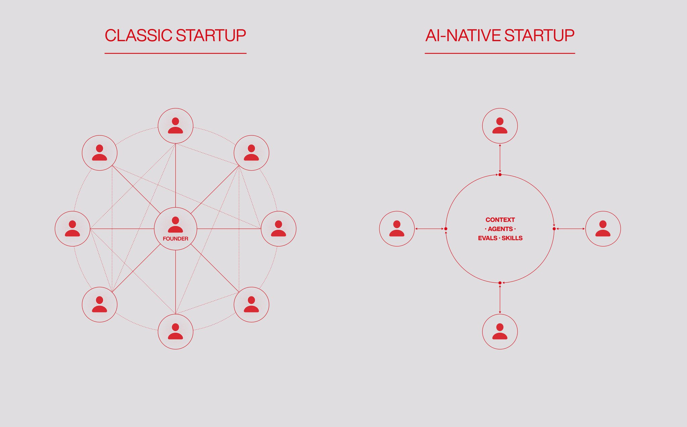
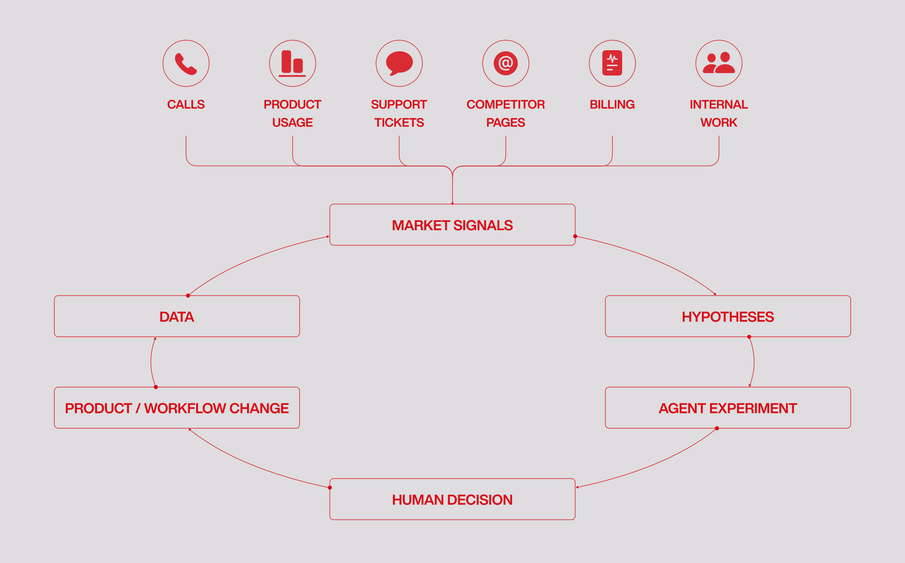
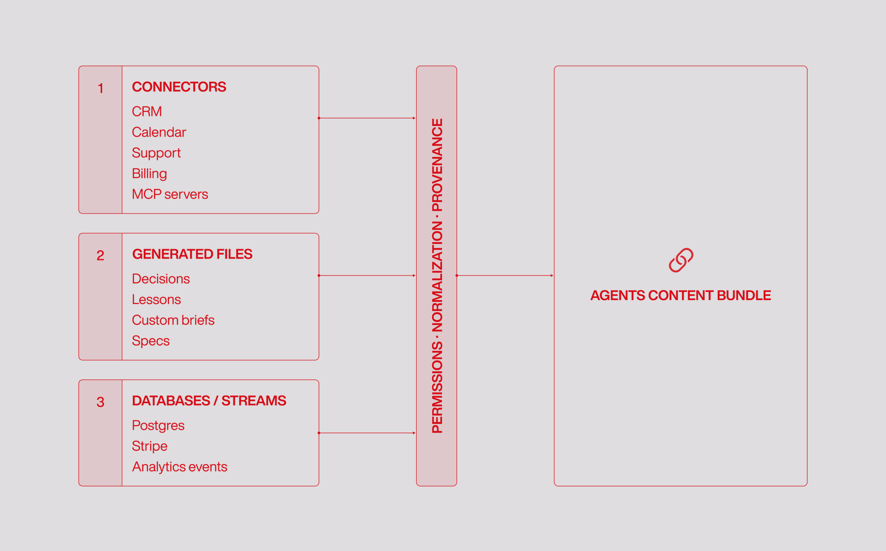
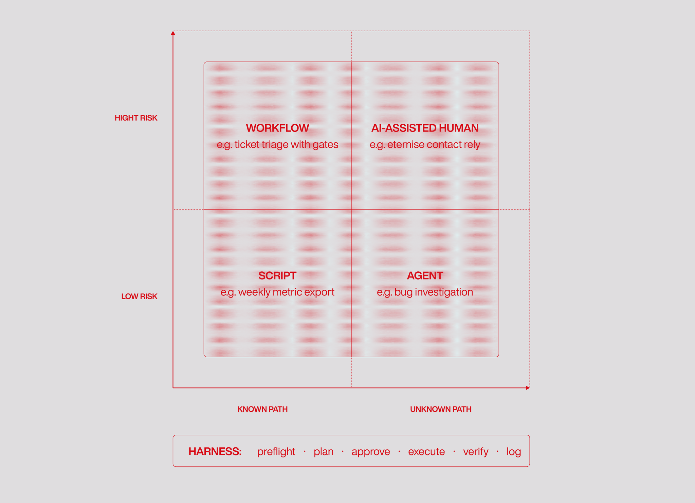
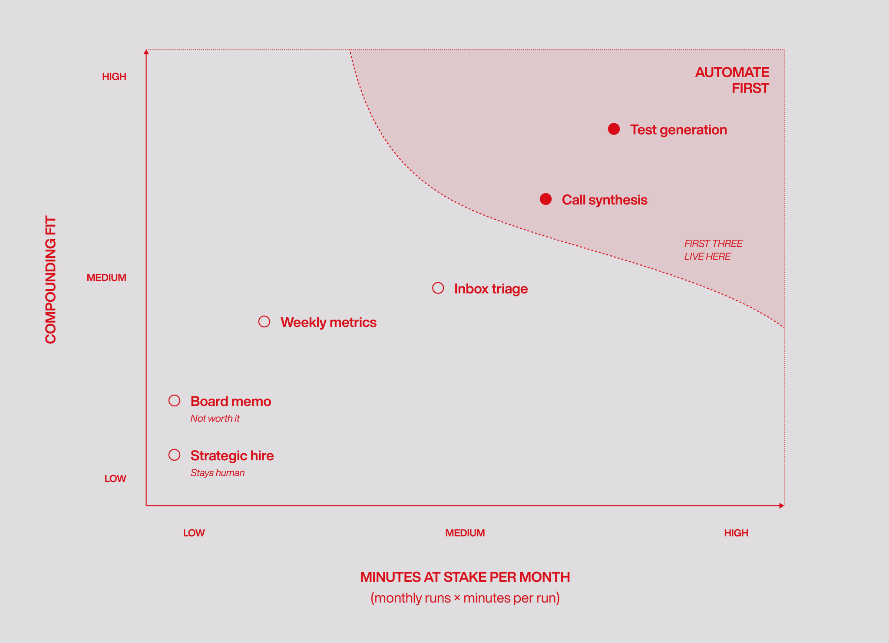

# 如何打造一家 AI 原生创业公司

**作者：** Stepan Gershuni ([@cyntro_py](https://x.com/cyntro_py))  
**日期：** 2026年5月26日  
**来源：** [How to Build an AI-Native Startup](https://x.com/cyberfund/status/2058950286324986294)

这是一份写给创始人的实操指南，讲怎么从零把公司带向 AI 原生：先梳理工作，再搭好上下文，写出评测，最后把这个循环跑起来。

先看一个画面。

同一个月成立的两家公司，做的是同一个市场。现在都是早上 9 点。

第一家公司里，运营负责人还在翻积压的旧工单，分析师在重做上周那张仪表盘，创始人正开着一个站会，讨论一通谁都接不住的客户电话。所有人都在补昨天的窟窿，产品就这么停在原地。

第二家公司，这些事昨晚就办完了。智能体把工单分流了，把仪表盘刷新了，还把藏在那通电话里的流失风险挖了出来。创始人这会儿已经把问题解决，正和团队一起往前推产品。

你可能会说，无非是创始人时间花得不一样了。可这不是关键。真正的区别，是一家公司能多快地学、多快地改、多快地变。第二家公司每天都比第一家多学一点。一周下来，这点差距变成了杠杆。一年下来，活下来的只会有一家。



什么时候算 AI 原生？是公司的运作方式真的变了的时候：更少的人、更少的来回协调，重复的活大多交给智能体去做，而人腾出手来管方向、把品味、维护关系、做验证、扛责任。

听起来像个大工程。但其实不必怕。它就是从几个步骤起步，反复地、一层套一层地迭代，慢慢就把整家公司的运作重新捋了一遍。

大致是这么几步：

- 梳理工作
- 搭建上下文系统
- 给每一块活挑最简单管用的自动化
- 把重复的活变成技能
- 写出评测，让它来判断活干得好不好
- 以每周改进的节奏，把整个循环跑起来

## 第一步：梳理工作

先画一张工作图谱。

把公司过去两周干过的、会重复的活全列出来：客户电话纪要、线索调研、外联草稿、支持分流、产品 QA、新人入职、发布说明、投资人更新、每周指标、缺陷复现、招聘初筛、发票审核、竞品监控——一个都别落下。只要会重复，它就有可能被"编码"下来。大多数创始人的日历里，这样的事有 20 到 40 件；要是一个早期团队肯老实列一遍，往往会发现有十来件早就成了例行公事，自己却没察觉。



列完，再按"能放多少手"给每件事分个级：

- **L1，只能人来：** 一个战略决策、一次最终拍板的录用、一笔大额退款、一份法律签字、一次董事会沟通。
- **L2，AI 起草、人来批：** 投资人更新的草稿、合同的红线修订、定价页的重写、一个支持话术模板。
- **L3，AI 来做、人盯着：** 入站分流、会议纪要的路由、线索富集、测试生成。
- **L4，在清楚的边界里自己跑：** 竞品监控、夜里生成报告、从熟悉的供应商那里抽发票、简单的异常检测。

有意思的是，越无聊的活越值得先动手。一份每周战略备忘录，听着体面，像是该自动化的"大事"。可每天给支持工单打标签——又琐碎又不起眼——反而帮你省回更多时间，还能攒下更干净的真实样本，因为它跑的次数是前者的十倍。频率比体面重要。第一个该下手的工作流，要高频、能衡量、出了错能撤回，而且正好卡在一个真实的瓶颈上。

反过来，有几类活先别碰：太罕见的、说不清的、要靠高度信任的、还没定型的。C.H. Robinson 有个团队就吃过亏：他们想把每天 10,000 封邮件的分流直接推到 L4，结果发现根本盯不过来，只好退回 L2。量一大，每一次分错的代价就被淹没了，看不见。说到底，如果团队连"好的输出长什么样"都讲不清楚，这活就还不能编码；如果一个错就能伤到一段客户关系，那就慢慢来；如果流程每周都在变，那就等它稳了，或者干脆先当成 AI 辅助的人工活来做。

这一步做完，你手上会有一页纸，外加三个能开干的工作流：一个是给自己的（收件箱分流、每日简报、投资人更新草稿），一个是对客户的（电话综合、工单分类、线索富集），一个是对内的（测试生成、发票提取、每周指标的叙述）。千万别一口气铺太多。同时上太多实验，注意力一散，最后就是二十个半拉子项目——这是这个阶段最常见的翻车方式。

## 第二步：搭建上下文系统

上下文，是 AI 原生公司的运营记忆。说白了，就是公司关于自己的全部所知，放在智能体读得到的地方。

模型这东西是可以换的，而且每个月都在变强。真正属于你的，是上下文。一个智能体到底像个联合创始人，还是像个一脸懵的临时工，差别就在这儿。

有个信号很说明问题：如果团队改智能体写出来的东西，比看它写得对不对还费时间，那毛病多半不在提示词，也不在模型。是智能体对公司了解得太少了——不懂你的客户、不懂你的产品、不知道你最看重什么、更不知道你之前做过哪些决定、为什么这么定。

想知道现在到了哪一步，有个简单的法子，每周做一次就行：挑一个有代表性的任务，交给一个只带着工作区上下文、其他什么都不知道的全新智能体，让它给你三个下一步建议。要是能给出两个或更多像样的建议，说明上下文这一层在扛事；要是三个都泛泛而谈，那就是上下文太薄了——再怎么调提示词也救不回来。



从一个共享的 Git 仓库开始，让每个人、每个智能体都能读。

为什么是 Git？道理很朴素：它有版本、能比对，人和智能体都看得懂，而且不绑在任何厂商的运行时上。你经它跑过的模型和框架换了一茬又一茬，它还在。到第七天，整个工作区可以就是一个根目录，里头放着 CLAUDE.md、context/company.md、context/product.md、context/customers.md、context/lessons.md，再加一个 GTD.md 管手头的活。

有个经验值：手写内容控制在 40 到 60 行就好。一份写清楚"别干什么"的精简清单，胜过 400 行机器生成的废话。它不会替你解决所有上下文问题，但解决得够多了——至少智能体不会再对你自己公司的基本事实张口就编。

公司一长大，就该按权限边界把上下文系统拆开。拆法不止一种。比如：一个共享的公司仓库，外加每个职能（销售、产品、工程、财务、支持）各自一个私有仓库。又比如：每个项目或每个客户一个私有仓库，再配一个放全公司通用上下文的共享根。

到了企业规模，就上一个私有的 Git 服务器（自托管的 Gitea、GitHub Enterprise，或者 GitLab），它能按目录或按仓库给权限，让人和智能体都只看到自己该看的那部分。Block 内部的框架 Goose 就是这么干的：它读的是全公司都能看到的同一份产物流，只是按角色限定了范围。一旦这个范围跑偏了，麻烦就来了——智能体会把对外的公开口径，和私密交易里的内部信息混着说。边界为什么这么要紧，原因就在这里。

往这个系统里供数据的，有三类。

**第一类是连接器**，负责从外面往里拉：SaaS 工具、API、MCP 服务器、邮件、日历、CRM、支持、分析、GitHub、Linear、Stripe、数仓、文档。每一个连接器都得配上身份、限定好权限、留下审计日志、把凭据管起来——不然这一摊子东西迟早悄悄变成你最大的安全漏洞。像 Zitadel 这样的 IAM 层，就是来扛这份身份纪律的。还有，怎么加载工具也有讲究：Anthropic 在 MCP 代码执行上的实践显示，用一种"把每台服务器当成文件夹、组成一个文件系统"的办法，比起一上来就把每个工具定义全塞进去，能把上下文用量从约 150,000 token 压到约 2,000——开销直接砍掉 98.7%（你的财务团队会谢谢你）。

**第二类是公司自己生成的数据**：规格、客户摘要、决策、教训、项目笔记、运营规则。默认用 Markdown 存。这里有一条规则比别的都重要：原始的和提炼过的，分开放。一份通话记录是原始的；而那通电话上拍的板、客户提的异议、谁来跟进、续约有没有风险——这些是提炼过的，也才是智能体真正会去查的。决策日志保持只往后追加，一行一个决策，让"为什么"跟着"结论"一起留下来。要是把原始的和提炼的搅在一块儿，你最后只会被一堆通话记录淹没，那个真正有用的层却始终没建起来。

**第三类是数据库和数据流**，真实来源本就待在这儿：产品数据在 Postgres，市场数据在数仓，事件在分析里。别傻乎乎地把它们抄进 markdown。让数据库继续当那个唯一的真相，给智能体开一个只读受限的账号，把 schema 写进一个面向智能体的文件（data-models/postgres.md），再把"到底允许查什么、写什么"一条条写明白。默认情况下，智能体就不该有删生产数据的本事。2025 年年中那起 Replit 事故——一个编码智能体在会话当中把一个生产数据库给抹了——就是个长久的提醒：提示词里写的那句话，不是一道安全边界。

更进阶的玩法，是搭一张结构化的上下文图。智能体在查任何东西之前，原始材料先被处理成"实体"和"关系"：人、公司、异议、承诺、功能请求、续约风险、跟进、日期、决策、来源链接。你不再囤通话记录，而是把里头的内容提出来，再把每一通涉及同一批人或同一个项目的电话，串成一条链。这样一来，智能体就能回答"Vandelay Industries 的续约风险是什么？"，还能直接引到客户说这话的那一行原文。

把这一整套撑住的，是来源追溯。每一份智能体给出的摘要，都得能顺着追回它的出处——那份通话记录、那张工单、那次提交、那张发票、数据库里的那一行。没有它，公司里会塞满一堆听着挺像那么回事、却谁也核不了的摘要；而只要有一个自信满满的答案被发现是错的，大家对整个智能体层的信任就会一下子塌掉。有了它，智能体就变得可查：一个同事点进去看一眼源头，几秒钟就把分歧摆平了。

## 第三步：挑最简单管用的自动化

上下文搭好了，你可能手痒，想让机器在公司里的每件事上都撒开了跑。打住。跟我念一遍：别把每一个工作流都做成智能体。

最好的 AI 原生系统，从来不是清一色的智能体，而是脚本、AI 辅助的人、确定性工作流、智能体掺在一起，各干各擅长的。你作为创始人要做的，是挑那个能把活安全跑起来的最轻的工具——零件越少越好，前提是还能过得了质量这关。

- 步骤是死的，就用**脚本**：导报告、转 CSV、跑测试、查链接、校验 JSON、把每周指标包排个版。
- 输出在发出去之前得有人把把关，就用 **AI 辅助的人工**：投资人更新、创始人的邮件、定价文案、合同备注。
- 步骤事先就定好了，就用**工作流**：接入电话、做摘要、提取异议、写 CRM 备注、建跟进。顺序、重试、可观测这些事，交给工作流引擎（LangGraph、Temporal、Inngest、Prefect）去管。
- 路径事先说不清，才用**智能体**：查一个生产缺陷、调研一个市场、处理一个不寻常的支持案子、理清一个乱成一团的客户账户。Browserbase 的 bb 智能体就是个例子——它是个面向 Slack 的通用选手，每接一个任务就加载一套不同的技能文件和限定权限。这比给每个任务都造一个专门的机器人强，因为时间一长，那一堆机器人各跑各的，最后全飘了。

围着模型的那层安全网，叫框架（harness）。它不是可有可无的，是底线。一个能用的初版，分六步：

1. **预检**——在智能体烧掉第一个 token 之前，先把上下文和权限查清楚。
2. **规划**——把任务拆开，把打算怎么走的步骤摆出来。
3. **批准**——一道关卡，人来把或者裁判模型来把，在动手之前先拦下烂计划。
4. **执行**——把活跑起来。
5. **核验**——拿输出去对测试、对 schema、对评分表、对示例。
6. **记录**——把这一趟发生了什么写进一个运行文件，好让下一轮有据可依。

还有一点：护栏要写在代码和配置里，不能写在提示词里。一句"不要删除生产数据"的提示词，根本不是安全边界。那些不能让步的事，得一条条明明白白地定死：每次运行、每天的成本上限，重试上限，工具调用能套多深，每个智能体身份配什么范围的凭据，没经批准就不准写生产，代码不许自动合并，外加一个能一键停掉整个机群的急停开关。2025 年那一连串"递归派生"的事故——智能体叫子智能体、子智能体又叫子智能体——在框架层补上之前，是真烧掉了团队不少钱。这些上限得设在运行时，设在模型还没机会无视那句话之前。

## 第四步：把技能和评测编码下来



到这儿为止，干的都还只是搭台子。真正的引擎，是把会重复的活编码成技能，再用评测给它打分。它能让一家公司从"把活干完"，变成"每周都把活复利地干好一点"。

所谓技能，就是一项重复任务的可复用指令，再配上几个示例。先手动跑它两遍，然后把重复的部分固定下来。一个像样的技能，得有清楚的轮廓：范围、输入、要加载哪些上下文、流程、输出格式、示例、什么时候升级求助、谁来维护、运行日志。

要是一个文件没说清楚它收什么、还什么、什么时候求助、谁管它，那它就只是一段长提示词，算不上技能。

下面是一个创始人可以照着改的技能模板：

```
Skill: customer-call-synthesis
Scope: sales calls after transcript is available
Inputs: transcript, account record, product context, open opportunities
Load: ICP, pricing, product roadmap, objection taxonomy
Steps: extract facts → cluster objections → identify risks → write follow-ups
Output: CRM note · customer brief · feature requests · next actions
Examples: 3 prior calls with expected notes
Escalate: legal or security issue, churn risk, enterprise pricing
Owner: revenue lead
Logs: runs/<date>/<account>.md
Eval: 30 historical calls with expected extraction fields
```

可以先从几个创始人天天会用到的技能上手：

- **客户电话综合**——从原始通话记录里，把异议、功能请求、风险、承诺、下一步行动都拎出来。
- **收件箱分流**——把投资人、客户、招聘、运营这几类消息分好类，再给前三类把回复草稿写出来。
- **投资人更新**——根据指标和决策起草那段叙述，并把两边都引上。
- **定价页拆解**——拿线上的页面，对着最新的客户异议日志比一比。
- **每周指标叙述**——讲清楚什么变了、什么坏了、接下来该盯哪儿。
- **测试生成**——把一份规格变成测试，外加一个草稿 PR。

让技能产生复利的，是评测。一个技能一旦有了能用的评测，调提示词就成了可有可无的事：一个小的反思模型提一堆改法，评测给它们排个名，最好的那个自动上线。要是没有评测，每一次迭代都只是创始人和上一版作者之间，关于"品味"的口水仗。

一个评测分三层，按顺序往上叠。

第一层，**人工标注的真实基准**：让人在真实的例子上，亲手标出"好的输出"长什么样。

第二层，**确定性检查**。这层不花成本，给的判断也毫不含糊：schema 对不对、数字和来源合不合、链接通不通、引用在不在、测试过没过。

第三层，**LLM 裁判**。但它只管确定性检查够不着的地方——写得好不好、语气对不对、是不是符合简报。一个又小又快的模型就够用；不过在你放心让它去判其余的之前，得先拿人工标注的例子把它校准过。

拿客户电话综合当个例子，看看这事怎么落地。找三十通过去的电话，让营收负责人挨个标——哪些是要紧的事实、有哪些异议、有什么风险、要怎么跟进。一部分检查是确定性的：名字写对了没？金额跟合同对得上不？跟进日期落在对的那一周没？而机器查不了的那部分——这份简报听起来到底像不像那通电话——就交给 LLM 裁判。

大约跑到第五十次，你就能看出它在哪儿出问题，而且翻来覆去就那两样：电话上一旦有三个人以上，它就跟不上谁在说话；要么就是把两个本不相干的异议揉成了一个。这两样，就是你要去修的。你跑之前担心的那些问题，往往压根没出现；你照着这几类毛病一遍遍改技能，直到它能稳稳地干活。

外联线索分类的路子不太一样，但评测的搭法是一样的。三百条旧线索，创始人给每条标一个干脆的是或否——合不合 ICP。机械检查很基础：公司是真的、网站打得开、人数填了。剩下的，交给一个对着 ICP 描述打分的 LLM 裁判。评测一搭好，一个开源的提示词进化循环（GEPA、DSPy）就能连夜照着这些标签，把分类器的提示词重写一遍。创始人压根不用去读那个最终的提示词。评测给出的判断，才是唯一算数的东西。

两个例子，走的是同一个套路：先有人工标注的真实基准，再叠确定性检查，剩下的交给 LLM 裁判，然后让循环对着评测一直跑，直到接受率越过那条线。

评测的成熟，分五个台阶，一阶比一阶高：

1. 先手动抽查一个例子
2. 对着一份写好的评分表，给几个案例打打分
3. 把这份评分表，跑到 20 到 300 个历史案例上
4. 拿一个智能体从没见过的留出集来测
5. 盯住这个技能本来就是冲着它去的那个业务指标

评测能让一个技能准备好上线。可"一直保持好"是另一码事，你得靠每周追的六个数字来回答它：接受率、覆盖率、每次运行成本、周期时间、审阅时间、事故数。

这里头最该盯的是接受率。要是低于大概 70%（小修小补也算被接受），那这个技能就还没资格往上升一级、换成更松的监督来跑。接受率一低，很多人第一反应是去重写提示词。可那几乎从来都不是解药。真正管用的，通常是这四招之一：运行时多喂点上下文、把技能的范围收窄、往文件里多塞几个做过的示例，或者给那些智能体本就不该接的案子，写一条更清楚的升级规则。

## 第五步：让团队也变得 AI 原生

创始人先上。

想让一个团队换上新的干活方式，最快的办法，就是在自家真实的场景里，当场演示给他们看。把那份通宵从日历、收件箱、Slack 里拉出来的晨间简报摆出来；把昨天那几通电话的客户综合摆出来；把智能体照着规格开出来的那个测试 PR 摆出来；把从上一份指标包搭出来的投资人更新草稿摆出来。

目的是校准——让大家亲眼看清楚，这层智能体到底能干什么、不能干什么。据说整个 2025 年，Jack Dorsey 每天早上都要花好几个小时，亲手用这些工具；之后 Block 才围着它们做了重组。那场大刀阔斧的效率重构背后，拍板的是真正上手用过这些智能体的领导层。

这事从第一天就得装上。新人入职，结尾应该是一件有用的 AI 产物。每个人走出第一次会话，手里都该攥着一件当天就能交付的东西——一份理干净的客户简报、一个支持话术模板、一个测试 PR、一份定价页的点评。不出活的培训，下一周就被忘干净了。Ramp 的 Glass 工具三个月里从 20 个日活涨到大约 700 个，靠的正是这一条：每次入职会话，都以新人往共享库里添一个技能或一件产物收尾。

这么一来，人的角色是变大了，不是变小了。人来设计系统、维护关系、判断输出、扛住责任；执行这块交给智能体。在这套模型里，那种只会跑窄任务的同事，处境其实挺悬；而那种能把判断变成指令、示例和评测的人，比从前更值钱了。

招聘也跟着变了。现在开一个岗位的门槛更高——过去得招一个人才能干的活，有些已经变成一个技能了，所以新岗位要留给那些真的离不开人的活。真要招人时，就照着这份工作的新样子来考：别考死记硬背的东西，丢给候选人一个在规定时间里靠手根本做不完的项目，看他怎么指挥智能体把它推下去。你招的是判断、是品味、是智能体跑偏时能把局面拉回来的本事。这几样，恰好是刚刚变得更金贵的那部分。

具体长什么样呢？给分析师三小时，产出一份真报告——收集来源、抽出证据，最后交一份打磨过的简报。给工程师一天，去克隆一个真实的产品界面，或者照着规格搭一个内部工具，测试得带上。给增长岗的人一张覆盖 50 到 100 家公司的市场地图，外加一份活动计划——抓取、聚类、撰写、排优先级。这些活，没有一件是在规定时间里靠手能做完的。这正是重点：你要看的，就是他们在压力底下怎么跟智能体配合。

## 第六步：把公司当成一个反馈循环来跑

到这一步，你的自动化和你的团队，都被压力测试过了。接下来，回到开头，再来一遍。一家 AI 原生公司，每周都在升级自己的操作系统。

每周这场复盘，要回答这么几件事：

- 智能体都做了什么
- 人在哪些地方推翻了它们
- 哪些评测没通过
- 哪些上下文是缺的
- 哪些技能该收窄
- 哪些工作流该砍
- 哪些可以往上升一个自主级别

同时跑两个循环。内循环把手头的活越做越顺——每次运行更便宜、周期更短、事故更少、每件产物花在审阅上的时间更少。外循环则在四下张望，找下一个机会：新的客户群、产品点子、定价的调整、合作、竞品的动作、监管的变化、流失的苗头。后台的智能体全天候地往外循环里送候选项；至于追哪个，由人来定。



内循环里最大的一块，是软件工厂。人写规格和测试，智能体照着去实现。确定性检查自己跑，合并之前总有人过一遍眼。从哪儿起步呢？挑那些验收标准清楚、就算出错也波及不大的地方：测试生成、依赖升级、迁移、内部工具、集成脚手架、QA 脚本、安全自动修复。

这里有两条铁律：什么都不许自动合并，没有任何智能体能往生产里写。连大规模跑自主云端智能体的 Cursor，到 2026 年初也仍然守着合并这一道人工审阅关。正是这道关，才让他们敢把其余的部分放心铺开。

外循环则是市场学习系统。录下电话、提取异议、把功能请求聚类、追竞品、看用量怎么挪、读支持里反复出现的模式、研究你输掉的那些单子。把发现的东西攒成假设，再挑最有把握的去试——找客户聊、测落地页、做产品实验、对数据跑新的查询。智能体负责提议，你负责拍板。要是把提议和战略上的拍板一股脑都丢给智能体，它要么沉成一团没棱角的共识，要么一头扎进那个最好刷的指标里使劲爬。

公司层面的自我改进，归根到底就看一件事：这个团队会不会写评测。把几百个例子手动标成好或坏，搭起评测，再把它接到一个提示词进化循环上。GEPA、DSPy 这类框架干的就是这事——一个小的反思模型提出提示词的变异，评测在标注集上给它们排名，胜出的那个上线，循环往复。创始人只管写评测、读那几类失败。那个进化出来的提示词，创始人从头到尾不写、也不读。

说到底，拖住你的，很少是智能体的能力。只要你能把"什么叫好"编码出来——二元标签、一份评分表、几个业务指标——这个循环就能在整家公司的尺度上转起来。要是编不出来，模型再强也补不上这道缺口。会写代码当然有帮助，但它不是瓶颈；一个能稳稳地把输出判成好或坏的领域专家，一个人就能把整个循环跑通。评测，才是那件最吃劲的东西。哪天评测没人写了，公司的复利也就在那一刻停了。

这一切，都不需要天才，也不需要一支大团队。它要的是一份纪律：梳理工作、搭建上下文、写好评测，每周都把这个循环跑一遍。纪律，就是现在的护城河。模型谁手里都有同一批；操作系统，才是那个秘方。

The Monastery 的存在，就是为了和你一起把这套操作系统造出来：十二周的纯粹专注、200 万美元，外加一批已经在跑这个循环的运营者，从第一天起就和你并肩，把它一点点嵌进你的公司。

进 The Monastery，和我们一起做那件看上去不可能的事。
