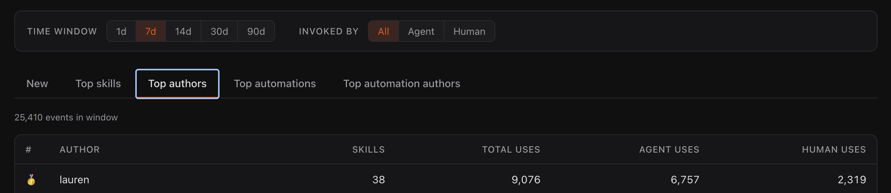
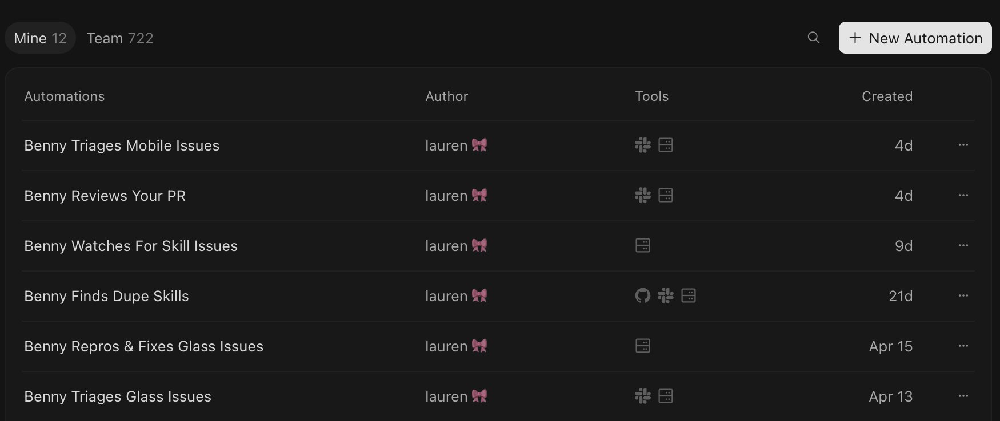
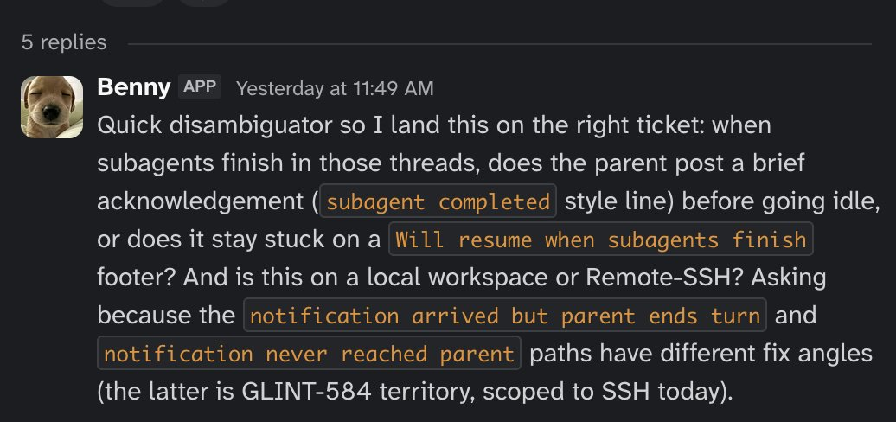
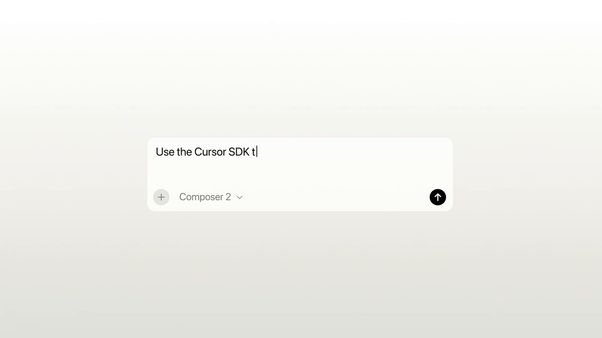
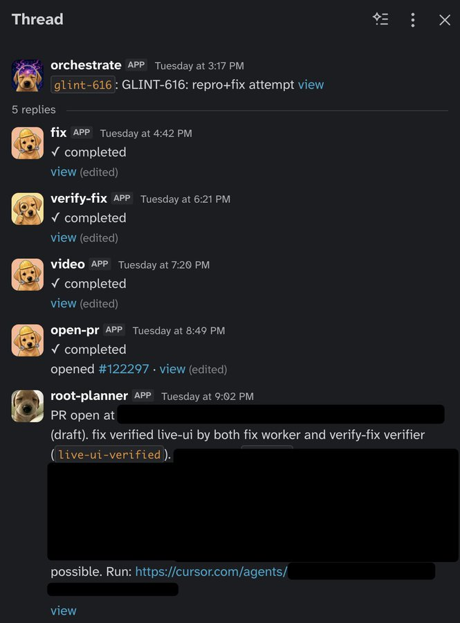

# How I Use Cursor

**Author:** lauren ([@poteto](https://x.com/poteto))  
**Published:** May 26, 2026  
**Source:** [How I Use Cursor](https://x.com/poteto/status/2058975157503570132)

I need to get something off my chest. Before my interview @cursor_ai, I had never actually used Cursor.

At Meta, Claude Code was explosively taking off. I even paid for a personal $200 a month plan for my side projects. I loved how simple it was, and how quickly I could feel productive. The sticking point for me was in developing my own set of skills that turned cc into almost anything I wanted. I even started developing my own agent orchestrator tool on top of it.

During my onsite interview, I used Cursor over the course of 2 days, using it to build the interview project. This was before Cursor 3's release, so I was using the Editor Window. I've been using vscode for so many years at this point that most of the keyboard shortcuts were still in my context window, so getting back on the IDE was not too difficult. I can't lie though. During the first hour or two I was certainly missing the cli. Clicking on things felt almost barbaric. But there were a few things that really stood out to me.

First, the models I was used to at the time - Opus and Codex - felt smarter, somehow. And it was amazing being able to switch models on the fly and use both of them at the same time on different parts of my project (Opus for the frontend, Codex for systems). Prior to my interview, I was already raving about multi-model adversarial review, so being able to do this natively in the UI felt very natural. Even better was the ability to spawn subagents of different models, so I could get the best of both worlds in one conversation.

Second, compaction was insanely quick. As a cc user I was used to compacting taking many minutes, and so I was always in a state of constant vigilance of my context and plan usage. So I was utterly shocked at how fast it was in Cursor. So much so that I basically never needed to look at how much context I was using. It just worked, while I often felt like the model just got super dumb after compaction in cc.

And the third thing I noticed was how much GUIs could offer over TUIs. Being able to open your app directly in Cursor's browser and make design changes with Design Mode felt intuitive and got me thinking about how much purpose-built UIs could make agentic coding more effective.

## Building Cursor with Cursor

Since joining at the end of March, I've been working primarily on Cursor 3's Agent Window, and using it as my daily driver. While I still think cc is a cool product with a great team, I have noticed that its simplicity tends to drive people to want to build their own abstractions wrapping it. In my last job, it felt like there was a new internal orchestrator tool built on top of cc announced every week.

@bcherny talks a lot about this idea of "latent demand":

> "There's this really old idea in product called latent demand... you build a product in a way that is hackable, that is kind of open-ended enough that people can abuse it for other use cases. Then you see how people abuse it and then you build for that."

This was exactly it! Folks converging on orchestration tools exposes the latent demand in that using a cli just makes you, the human, the orchestrator.

But every agent workflow I had used was focused on the wrong thing. Running multiple CLIs in a GUI was missing the point entirely. The approach I was interested in was building trust in agents.

As a former engineering manager, I quickly realized that managing agents felt similar to building a human engineering team. New hires need to be onboarded so they understand the codebase, but also how work gets done. They join already pre-trained with skills they acquired from their past experiences: how to debug, how to write high quality code and tests, and how to communicate, to name a few.

Agents are like new hires in a constant state of amnesia and idiocy. They don't remember what you tell them, and they never really learn anything new. But we can equip them with rules, skills, tools, and long term memory which can approximate that. They're capable yet stupid, and very teachable. And I saw their failure modes as opportunities to teach them everything I know about doing deep, rigorous engineering.

Because when there is no rigor, agents will sycophantically do whatever it takes to write that code you asked for. And boy, can and will it write a lot of it. Naive parallelization just makes them write slop faster.

> **lauren** [@poteto](https://x.com/poteto) · Apr 26
>
> i'm increasingly convinced that the value of orchestrating many agents in parallel comes from going deep, not broad. you want to go deeper on a single or a few problems, so you can maximize your chances of getting great results:
>
> - best of N style races to find the best solution

## If you want to go fast, go deep first

I do think that agent orchestration can be done productively. But we need to go depth first.

I'm open sourcing pstack, my personal set of skills and engineering principles that I use everyday to build @cursor_ai. I started developing early iterations of these skills in my side projects, and have been refining them ever since.

Get it here: https://cursor.com/marketplace/cursor/pstack

```markdown
/add-plugin pstack
```

These skills have become some of the most used skills by the Cursor team, so I'm excited to share it with all of you.



Cursor's company leaderboard. My skills were used 9k times this week!

pstack teaches agents to be more rigorous using multiple models. I've taken all the failure modes I've observed and turned them into skills. The heart of the plugin is /poteto-mode, which is a higher order skill that gives agents the right playbook to follow for a given task. The goal is not maximal LOC, but the opposite: maximum impact with the least amount of code.

The rigor is applied by approaching problems the same way experienced engineers do. For example, a great way to approach debugging is to binary search the problem space. You start out with some hypotheses of what might be going on, and then try to systematically rule them out until you can get closer to the true root cause. If it's hard to repro, you might try to synthetically force the bug to occur. Or you might try adding instrumentation or console logging to check program state as it runs.

These steps form a playbook that can be used by agents to thoroughly debug issues instead of guessing, which they are happy to do if you let them. pstack ships with many skills and playbooks that let you approach software engineering with this same level of rigor. I currently have playbooks for:

- Skill authoring and evals
- Working autonomously
- Bug fixes and runtime forensics
- Feature development
- Visual parity and prototyping
- And more

Whenever you need rigor, prefix your prompt with /poteto-mode. For example:

```markdown
/poteto-mode this pr has a subtle bug where the scroll drifts every 750ms even when idle. repro first, then fix and verify.
/poteto-mode a big list takes a second or two to load even though we virtualize. run a cpu trace and tell me why.
/poteto-mode build a small feature behind a feature flag. verify it really works.
/poteto-mode build two prototypes of the markdown renderer so we can compare. spawn an agent for each.
/poteto-mode open source these skills as a plugin. nothing internal leaks, work in a temp dir, show me the dependency graph first.
/poteto-mode i'm going to bed. land the stack even if ci flakes. i want everything merged by morning.
/poteto-mode the row spacing is too tall when this flag is on. the second image is correct. repro and fix until it matches.
```

You can also optionally invoke on demand the other skills:

- **/how:** you want a walkthrough of how a subsystem actually works.
- **/why:** you want to know why something was built this way. uses your available MCPs to query each evidence category in parallel (source control, issue tracker, long-form docs, real-time chat, infra observability, error tracking, analytics warehouse).
- **/architect:** you're about to write code that crosses a function boundary and want the types and data structures settled first.
- **/arena:** you want N parallel attempts at the same thing, then to grab the best parts of each.
- **/interrogate:** you want to have different models adversarially review something.
- **/tdd:** you're fixing a bug. write the failing test first, then the fix.
- **/unslop:** you're cleaning up any kind of AI writing. makes them speak plainly.
- **/reflect:** you want to continually improve your skills after long conversations.
- **/figure-it-out:** doing something unusual? designs a rigorous, auditable playbook for the task.
- **/show-me-your-work:** you want a reviewable decision trail. logs decisions to a tsv you can commit.

And finally, you can make your own mode skill with /automate-me. It mines your recent transcripts, drafts a your-mode skill from how you've worked, and routes through pstack underneath.

pstack works with any agentic coding tool, but it works especially well in multi-model tools like Cursor. Many of the skills use multi-model workflows to take advantage of the unique strengths and weaknesses of each model. It's agent orchestration, but applied depth first rather than breadth first.

The bottleneck with agents is verification. Agents can write a large amount of code quickly. Making sure it's all correct is exceedingly difficult. When you can get there, true agent parallelism, like in a dark factory for software, might be possible.

But first, we need to go deep and be rigorous. I think we get there by dialing up the trust.

Give pstack a try and let me know what you think.

## Zen and the Art of Software Maintenance

These skills help me move with more confidence when writing code. But maintaining code is now a nightmare with agents writing all the code. Bugs, performance issues, and feature requests still take time to work through. And now there's so much more of it!

I make extensive use of Cursor automations at Cursor. They're cloud agents that can be scheduled, or run in response to events like new messages in a Slack channel. One such example is my bot Benny. I've given him the same skills I have in pstack.



The many incarnations of Benny

Benny is still a work in progress, but my vision is to automate as much of the software maintenance process as possible. The idea is this: if we now have the confidence to mostly "one shot" problems with pstack, with a good degree of certainty that the PR quality is high, surely we can automate feedback as well.

This factory starts its life with triage: collecting information from employees about bug reports. We dogfood Cursor a lot and so we get a lot of feedback from employees on our release candidates. Benny understands images and video attachments, explores the codebase using pstack skills, and chats with the reporter for information on reproduction steps if it's not clear.



Benny asking for more information

This is an important part of the bug reporting process. Without clear reproduction steps and an understanding of what's broken, agents can only guess at the solution. We need to give them a clear understanding of exactly where and how it breaks.

Once triaged, Benny creates a ticket with his findings from looking at code, git history for recent bug regressions, Slack for other messages about the same bug, and even Notion for design and product decisions on how a feature should work: is it a bug, or was it designed to work this way?

After the ticket is filed, another Benny bot picks it up using another skill I created called /orchestrate.

> **Cursor** [@cursor_ai](https://x.com/cursor_ai) · May 8
>
> Introducing /orchestrate, a skill that recursively spawns agents to tackle your most ambitious tasks with the Cursor SDK.
>
> We've used it to:
> - Autoresearch our internal skills, cutting token use by 20% while improving evals
> - Cut cold start times on our internal backend by 80%



First, he tries to reproduce the problem through computer use. Cursor Cloud Agents can run Cursor itself in the cloud, where they interact with the desktop, click on things, and send keyboard input. Internally, this uses more skills I made to control our products programmatically using protocols like CDP or equivalent.

This allows us to demonstrate whether the bug report can be reproduced. If it does consistently repro the bug, he then tries to fix it. If it's a perf issue, Benny can take before and after CPU traces and heap snapshots. Subplanners spawn more workers to verify the fix using pstack skills and checking the work against the ticket if it was fixed.

Additional workers are spawned in this run to take a video of the before and after, and finally a worker opens the PR for review with the video in the description.



A recent run that was successfully reproduced and fixed

This is all still a work in progress and there's a ton more work to do, but I'm excited about having a team of agents to help me fix bugs with confidence while I sleep or do other things. Making code review scalable is another big area, and I think Cursor will have some cool upcoming features to help.

But the key for building your own software factory is trust. Unless you can trust an agent to own a problem end-to-end, including verification, you cannot automate your processes. As you dial up the trust using plugins like pstack that give your agents more engineering depth, you can start tackling more ambitious problems. Trying to parallelize agents you don't trust yet is a huge waste of tokens and introduces more slop into your codebase.

Thanks for reading!
