# Pydantic fixed my Agent's Memory

**Author:** Akshay ([@akshay_pachaar](https://x.com/akshay_pachaar))  
**Published:** May 26, 2026  
**Source:** [Pydantic fixed my Agent's Memory](https://x.com/akshay_pachaar/status/2058976178908885210)

Your agent remembers everything and understands nothing.

Agent memory started with vector databases. Store facts as chunks, retrieve by similarity.

It works until a query needs to connect facts across chunks. Then it falls apart. The problem isn't similarity. It's structure.

Knowledge graphs were the fix. Entities as nodes, relationships as edges, traversal instead of matching.

But most teams hit a different wall.

When you give an agent a knowledge graph for memory, the default behavior is that the LLM handling extraction decides the structure on its own.

It picks the entity types, the relationship labels, and the attributes.

The results are generic.

For example, you're building a customer support agent. You feed it 50 support conversations covering customers, tickets, features, and escalation history.

You ask: "Which enterprise customers have open sev-1 tickets?"

The graph has the data. But every support ticket is stored as a "Topic" node. Every customer is an "Object." Every relationship is "RELATES_TO."

There's no way to filter by type, severity, or plan tier. The query returns noise.

The agent didn't forget anything. Nobody told it what to pay attention to.

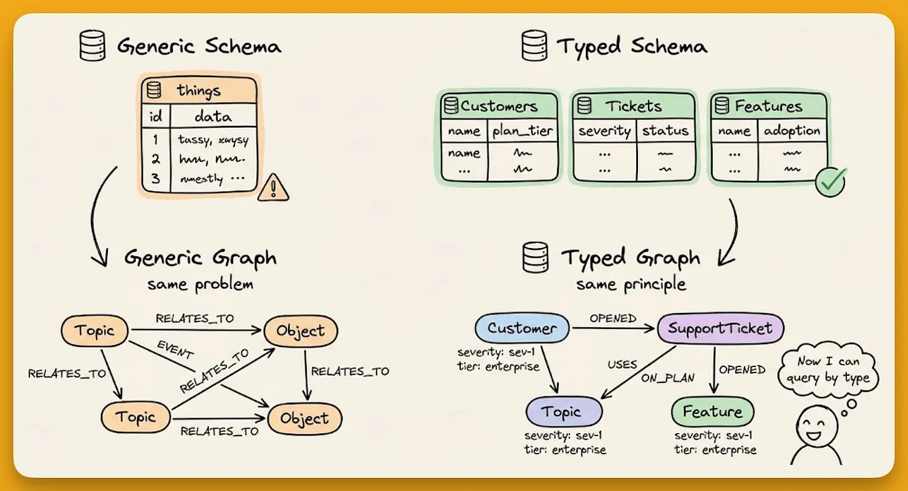

The fix is straightforward: define the schema upfront. Tell the extraction model what types of entities exist in your domain, what relationships are valid, and what attributes each one carries.

That organizational blueprint is called an ontology. Think of it as the schema for your agent's brain.

Let's walk through why this matters, what breaks without it, and how to implement it using a 100% open-source solution.

## Why flat retrieval breaks on multi-hop reasoning

Vector-based memory stores facts as text chunks and retrieves them by semantic similarity. That works until a query requires connecting facts that don't appear in the same chunk.

Consider three facts stored about a project.

- Alice manages Project Atlas
- Project Atlas runs on PostgreSQL
- The PostgreSQL cluster went down Tuesday

A query like "was Alice's project affected by Tuesday's outage" needs all three.

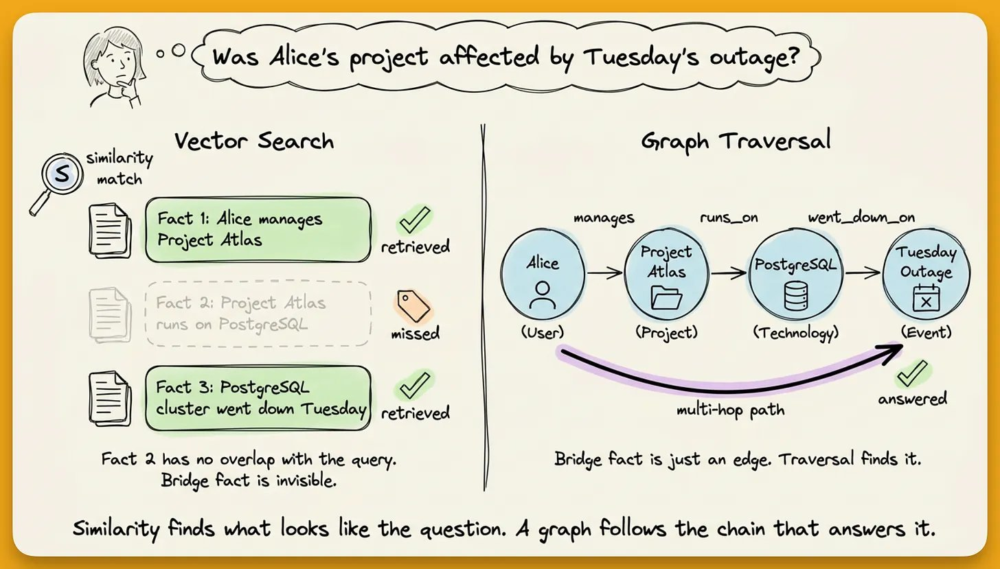

Vector search will retrieve just facts 1 and 3 because both mention relevant terms. Fact 2 is the bridge connecting Alice to PostgreSQL through Project Atlas, but it mentions neither Alice nor Tuesday. Similarity search misses it.

A knowledge graph stores entities as nodes and relationships as edges. Instead of matching text, it traverses connections.

That chain (Alice → manages → Project Atlas → runs on → PostgreSQL) is what makes multi-hop reasoning work, and it is invisible to flat vector retrieval.

## The memory pipeline and where extraction fits

Every graph-based agent memory system follows a common pipeline:

- **Ingest:** Raw data comes in (conversation messages, documents, JSON business data)
- **Extract:** An LLM reads the raw data and decides what entities exist, what relationships connect them, and what attributes matter
- **Store:** Extracted entities become nodes, relationships become edges, all persisted in the graph
- **Retrieve:** At query time, the system searches the graph and assembles relevant facts
- **Deliver:** Retrieved facts are formatted into a context block and injected into the agent's prompt

The extraction step is where everything is decided. It determines what your graph contains, how it's structured, and what's queryable downstream.

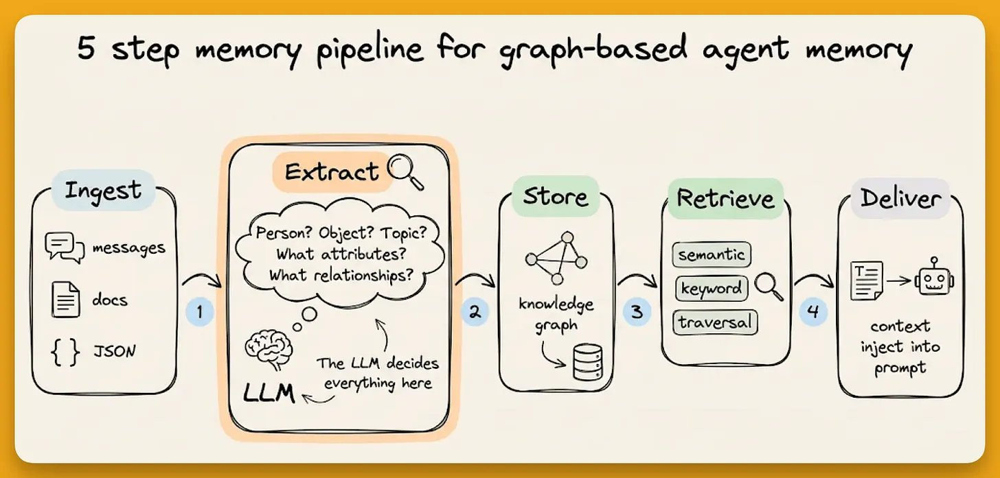

Here's the problem. In most frameworks, this step is a black box. You pass in text, an LLM pulls out "entities" and "relationships," and you get nodes and edges. The LLM decides the types, the labels, the attributes on its own.

You have zero control over what it classifies or how.

Let's understand how to fix it.

## Defining the schema with Pydantic

The fix is the same pattern used everywhere in the AI stack.

FastAPI endpoints get Pydantic response models.

Function calling tools get Pydantic schemas.

Agent memory works the same way in Zep.

Define custom entity types using `EntityModel` (a subclass of Pydantic's `BaseModel`) with `EntityText` fields and descriptions that guide the extraction model.

```python
from zep_cloud.external_clients.ontology import EntityModel, EntityText
from pydantic import Field

class Project(EntityModel):
    """
    Represents a specific software project, application, 
    or codebase that the user is building or contributing to.
    """

    project_status: EntityText = Field(
        description="Current status: active, completed, paused, or archived.",
    )
    project_type: EntityText = Field(
        description="Type of project: web app, mobile app, API, CLI tool, etc.",
    )
```

The docstrings and field descriptions are important here because good descriptions with concrete examples give the extractor enough signal to classify accurately.

The Pydantic descriptions above aren't just classification instructions. They teach the extractor vocabulary it doesn't know.

A Technology entity follows the same pattern.

```python
class Technology(EntityModel):
    """
    Represents a programming language, framework, library, 
    database, or tool that the user works with.
    """

    tech_category: EntityText = Field(
        description="Category: programming language, framework, database, etc.",
    )
```

Edge types use `EdgeModel` and carry their own attributes.

```python
from zep_cloud.external_clients.ontology import EdgeModel

class WorksOn(EdgeModel):
    """The user is currently working on, building, or contributing to a project."""
    role: EntityText = Field(
        description="User's role: lead developer, contributor, maintainer, etc.",
    )

class UsesTechnology(EdgeModel):
    """The user actively uses or works with a specific technology."""
    proficiency: EntityText = Field(
        description="Proficiency level: beginner, intermediate, advanced, or expert.",
    )
```

Finally, wire these into the graph with source/target constraints using `EntityEdgeSourceTarget`, which defines which entity types can connect through which edge types:

```python
from zep_cloud import EntityEdgeSourceTarget

client.graph.set_ontology(
    entities={"Project": Project, "Technology": Technology},
    edges={
        "WORKS_ON": (
            WorksOn,
            [EntityEdgeSourceTarget(source="User", target="Project")],
        ),
        "USES_TECHNOLOGY": (
            UsesTechnology,
            [EntityEdgeSourceTarget(source="User", target="Technology")],
        ),
    },
)
```

The code enforces that

- `WORKS_ON` can only connect a User to a Project
- `USES_TECHNOLOGY` can only connect a User to a Technology.

Any relationship that doesn't match these constraints won't produce a typed edge.

To summarise, this is what we've got so far:

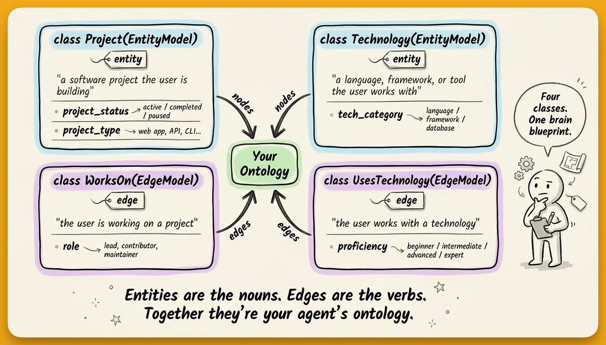

## What happens under the hood

When a conversation is ingested with a schema active, Zep's extraction pipeline runs five steps:

- **Entity extraction** identifies named entities in the text
- **Entity resolution** merges duplicates ("Nexus" and "the Nexus project" become one node)
- **Fact extraction** identifies relationships and outputs them as typed edges
- **Fact resolution** detects contradictions and invalidates outdated facts (preserving history)
- **Temporal extraction** parses time references and maps them to validity windows on each edge

Your pydantic schema guides steps 1 and 3. Entity types tell the extractor what to look for. Edge types with their constraints tell it what relationships to classify. Resolution and temporal processing happen automatically.

## Practical walkthrough of how it looks

We ingest a conversation where a developer named Alex discusses their work (an active web app called Nexus, their tech stack, proficiency levels):

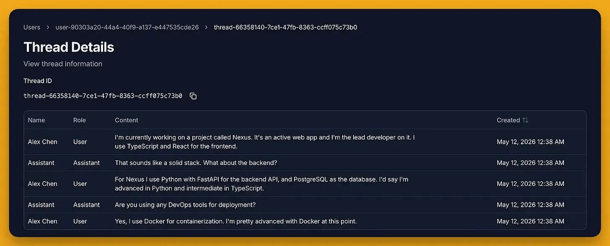

Querying for Project nodes returns Nexus with populated `project_status` and `project_type` attributes.

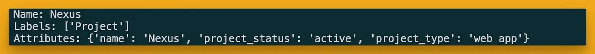

The node isn't a generic "Topic" or "Object." It's a Project with structured fields as defined in the schema.

The edges are typed too.

`WORKS_ON` carries role: lead developer

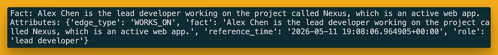

`USES_TECHNOLOGY` carries proficiency: advanced for Python and Docker, proficiency: intermediate for TypeScript.

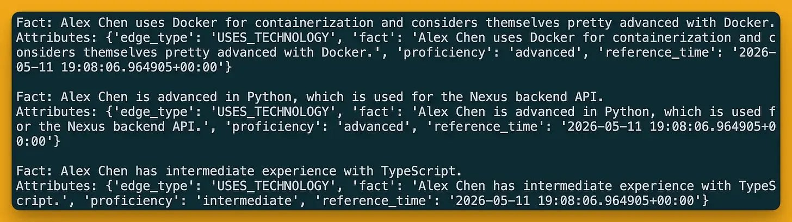

This can now filter projects by status, technologies by category, and query "which active projects use PostgreSQL" with a precise answer.

## Context templates

The final piece is context templates, which assemble typed facts into a prompt-ready block.

You can define which edge types and entity types to include, and Zep formats them with temporal annotations into a single string injected into the agent's prompt.

```python
client.context.create_context_template(
    template_id="dev-context",
    template="""# PROJECTS
%{edges types=[WORKS_ON] limit=5}

# TECH STACK
%{edges types=[USES_TECHNOLOGY] limit=10}

# PROJECT DETAILS
%{entities types=[Project] limit=5}

# TECHNOLOGIES
%{entities types=[Technology] limit=10}""",
)
```

It looks like this:

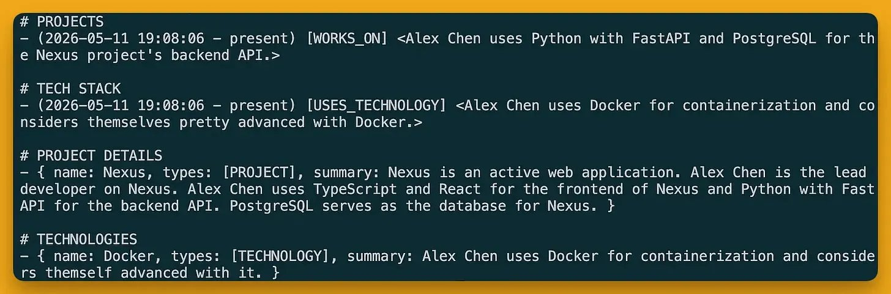

Every entry in the resulting context block is typed, temporally annotated, and carries the attributes defined. Save the template once, reference it by ID in agent calls.

## The 10/10/10 constraint and schema as a reasoning boundary

Zep enforces a hard limit of 10 custom entity types, 10 custom edge types, and 10 fields per type.

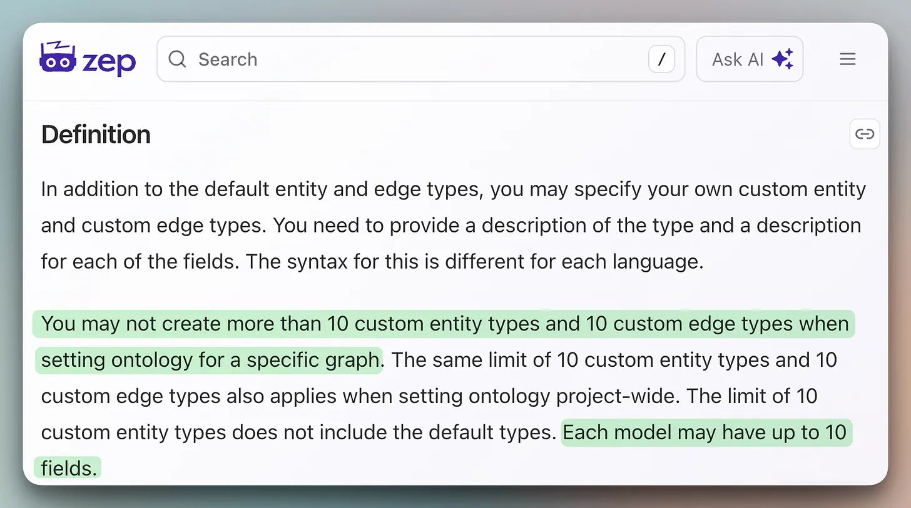

That's intentional to force a dev to think about what matters in a domain rather than modeling everything.

The source/target constraints also act as guardrails on what an agent is allowed to remember. If a schema doesn't include an edge type connecting Project to Competitor, the extraction model won't create that relationship, even if a conversation mentions both.

The schema defines the space of valid memories.

This is the same principle behind typed function calling, where we constrain the LLM's output space so that it can't produce invalid arguments. Memory schemas apply that same constraint to what the agent stores.

Start with 3-4 entity types and 3-4 edge types that capture 80% of your domain logic, and add complexity incrementally.

Agent memory without schema discipline is a graph that behaves like a vector store.

In a way, you pay the cost of graph construction without getting the benefit of structured retrieval.

The schema is how you get that benefit back, and the fact that it's Pydantic means there's nothing new to learn.

This is especially true for domain-specific applications. LLM extraction works reasonably well on general knowledge, but the moment your domain has internal terminology, product names that collide with common words, or jargon absent from the training data, unguided extraction produces nonsense. The schema closes that gap. It carries the domain vocabulary directly into the extraction step, so the LLM doesn't need to have seen your terminology before. It just needs the definitions you wrote.

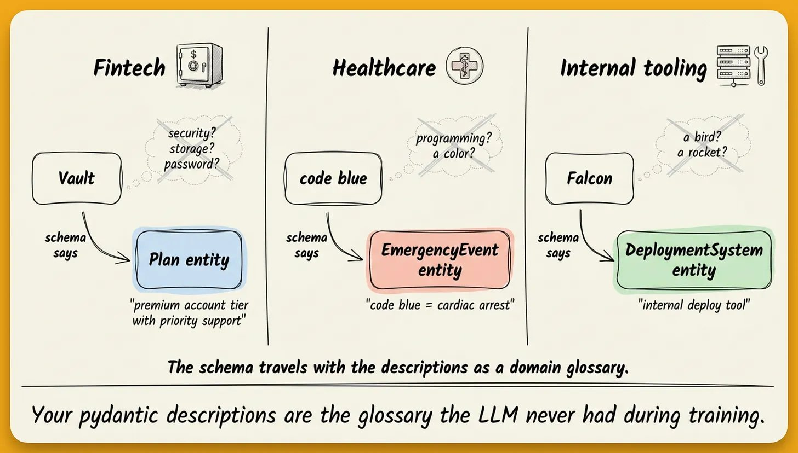

You can find Zep's GitHub repo here → (don't forget to star 🌟)

Thanks for reading!
