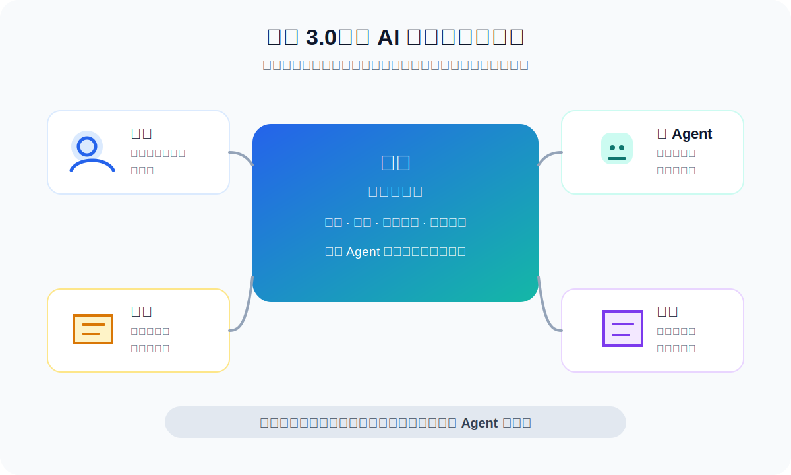
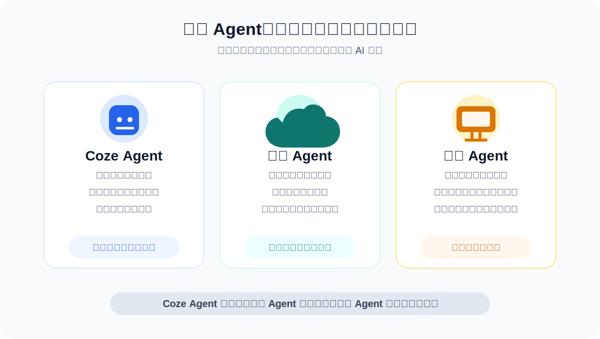
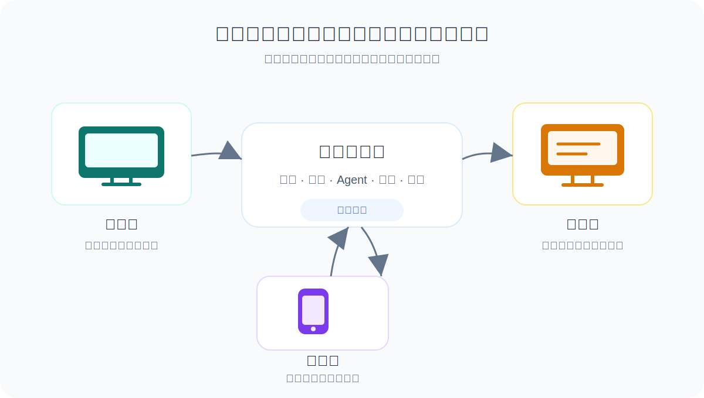

# 字节扣子 3.0 到底升级了什么？所有人都能看懂的版本

扣子 3.0 上线之后，官方介绍里出现了很多新词：

项目、多 Agent、Coze Agent、云端 Agent、本地 Agent、多模型、技能包、三端同步……

这些词看起来都很专业，但如果你只是一个普通用户，真正需要先搞懂的其实不是这些名词本身，而是一个更简单的问题：

**扣子 3.0 到底想让我们怎么用 AI？**

我的理解是，扣子 3.0 最大的变化，不是又多了几个功能按钮，也不是又换了一个更强的模型，而是它想把 AI 从「聊天助手」变成「项目里的协作成员」。

更具体一点说：

**你可以为一件复杂任务创建一个项目，把人、Agent、资料、过程和结果都放进去。多个人和多个 Agent 在同一个项目上下文里分工协作，不同 Agent 可以有不同能力，也可以搭配不同模型。**

这是理解扣子 3.0 的关键。

这张图可以先帮你抓住扣子 3.0 的主线：项目是中间的工作现场，人、Agent、资料和结果都围绕它展开。

项目、多 Agent、多模型、多端同步这些能力，不应该拆开看。它们合在一起，才是扣子 3.0 真正想表达的产品方向：让 AI 不只是回答问题，而是参与一件事的持续推进。

过去我们用 AI，更像是在和一个助手聊天。

你问一句，它答一句。

你让它写一段文案，它写。

你让它总结一份资料，它总结。

你让它翻译一段文字，它翻译。

这当然有用，但它更适合处理一些比较短、比较单一的任务。

一旦任务变复杂，问题就来了。

比如你要写一篇稍微认真一点的文章，或者做一期视频。

这件事不只是让 AI 直接生成一段文字，它可能包括：

- 先查清楚背景资料。
- 再确定这篇内容想讲给谁听。
- 然后整理核心观点。
- 接着列提纲。
- 还要写初稿。
- 还要修改表达和结构。
- 最后可能还要起标题、配图、准备发布。

如果这些事情都放在一个普通聊天窗口里做，很快就会变乱。

你前面告诉过 AI 的背景，后面可能又要重复一遍。

你前面生成过的内容，后面不一定接得上。

AI 一会儿当资料助手，一会儿当写作者，一会儿当编辑，一会儿当标题助手，角色也很混乱。

扣子 3.0 想解决的，就是这种复杂任务的问题。

所以，如果只用一句话概括扣子 3.0：

**它不是让你多一个 AI 聊天窗口，而是让多个人和多个 AI 助手围绕同一个项目一起工作。**

## 第一个变化：从「聊天」变成「项目」

扣子 3.0 里最重要的一个能力，是「项目」。

公开介绍里也会把它叫作「项目空间」。如果你在产品里操作，看到的可能更像是「新建项目」「创建项目」。这两个说法可以放在一起理解：项目是你要做的那件事，项目空间是承载这件事的工作区域。

这个词听起来很普通，但它其实是整个 3.0 版本的核心。

什么是项目？

可以先不用想得太复杂。

你可以把它理解成：**给一件复杂任务准备的专属工作空间。**

比如你要写一份商业计划书，就可以建一个项目。

这个项目里可以放：

- 你的目标。
- 你上传的资料。
- 你和 AI 讨论过的内容。
- AI 生成过的草稿。
- 不同 AI 助手的工作结果。
- 最终要交付的文档。

它有点像一个专门的工作群，也有点像一个项目文件夹。

区别是，这个空间里不只有人，还有 AI。

这件事很关键。

以前我们用 AI，经常是一段对话结束之后，任务也就散了。下一次再聊，你可能又要重新告诉 AI：「我之前在做什么」「背景是什么」「目标是什么」「前面已经产出了什么」。

这很麻烦。

因为真实工作不是一问一答，而是持续推进。

项目的价值，就是把一件事的上下文装起来。

这也是为什么「项目」要放在最前面讲。没有项目，多 Agent 很容易变成多个分散的聊天窗口；有了项目，多个人、多个 Agent、不同资料和阶段产出才有了共同的任务背景。

所谓上下文，其实就是这件事的来龙去脉。

你要做什么，为什么做，已经做了什么，手里有什么资料，前面讨论过哪些方案，哪些结果已经确定，哪些地方还没完成。

这些东西如果都在同一个项目里，后续不管是你自己继续做，还是让另一个 Agent 接着做，都更容易接上。

这也是项目最重要的地方：

**一个项目里的多个人和多个 Agent，可以围绕同一个项目上下文工作。**

你不需要给每个 Agent 从头解释一遍背景，也不需要把前一个 Agent 的结果手动复制到另一个对话里。项目里的目标、资料、讨论过程和阶段产出，会成为后续协作的共同基础。

如果这个项目里不只你一个人，还有同事、朋友或团队成员，大家也可以基于同一套项目背景协作。也就是说，扣子 3.0 说的「多人多 Agent」，可以理解成：多个人和多个 AI 助手在同一个项目里一起推进一件事。

当然，这不等于每个成员或每个 Agent 都能无条件读取项目里的全部内容。实际使用中仍然可能受到权限、文件授权、上下文窗口等限制。但对普通用户来说，可以先把它理解成：项目让多人和多个 Agent 有了一个共同的任务现场。

所以，「项目」不是一个普通文件夹。

它真正代表的是：**AI 开始围绕一件持续性的任务工作，而不是只回答一次性的问题。**

## 第二个变化：从「一个 AI」变成「多个 Agent」

扣子 3.0 里另一个核心词，是 Agent。

Agent 这个词经常被翻译成智能体，但对普通用户来说，可以先简单理解成：

**一个有特定能力和任务分工的 AI 助手。**

比如你可以有一个专门做调研的 Agent，一个专门写文案的 Agent，一个专门做数据分析的 Agent，一个专门写代码的 Agent。

这就是多 Agent。

它的意义不是「AI 数量变多了」这么简单。

真正的意义是：**不同的 AI 可以负责不同的事情。**

这和现实里的团队很像。

如果你要做一场活动，不会让同一个人同时负责市场调研、视觉设计、文案撰写、流程排期、预算控制和现场执行。

你通常会把事情分给不同的人。

AI 也是一样。

一个万能助手当然方便，但复杂任务里，「一个 AI 什么都干」往往不是最好的方式。

因为每一类任务需要的能力不一样。

调研需要找资料、比信息、看趋势。

写作需要组织结构、把话说清楚。

数据分析需要处理表格、识别规律。

写代码需要理解项目、修改文件、运行命令。

如果把这些都交给同一个 AI，它能做，但不一定稳定，也不一定高效。

多 Agent 的好处，就是让 AI 也可以分工。

比如你要写一篇行业文章，可以这样安排：

- 调研 Agent 先收集资料。
- 分析 Agent 总结核心观点。
- 写作 Agent 负责写初稿。
- 校对 Agent 检查逻辑和表达。

你自己不用每一步都从零开始做，但你仍然可以控制方向。

这就是多 Agent 相比单个 Agent 的优势：

**单个 Agent 像一个全能助手，多 Agent 更像一个小团队。**

## 第三个变化：Agent 不只是同一种，还分成几类

扣子 3.0 里提到了几种不同的 Agent：Coze Agent、云端 Agent、本地 Agent。

这些名字第一次看可能会有点绕。

但如果换成人话，其实可以这样理解。

### Coze Agent：扣子平台里的原生 AI 助手

Coze Agent 可以理解成在扣子平台里创建和运行的原生 AI 助手。

严格来说，它也运行在扣子的云端能力里。

但它的重点不是让你去管理运行环境，而是让你用一种门槛比较低的方式创建或使用 AI 助手。

它不是某一个固定助手，而是一类可以被配置出来的助手。

比如你可以给它设定角色，选择模型，配置技能，接入知识库或工具。

配置之后，它就可以变成写作助手、分析助手、办公助手、客服助手，或者某个更具体的任务助手。

扣子提供了模板或技能包，普通用户也不需要从零配置，可以直接选择一个接近自己需求的 Agent，再做调整。

对普通用户来说，Coze Agent 最大的好处是不用折腾。

你不用安装环境，也不用了解背后的技术，就可以在扣子里创建或使用这类 Agent。它更像扣子已经帮你准备好的标准 AI 助手。

### 云端 Agent：有云端运行环境的 AI 助手

云端 Agent 也在云端，但它和 Coze Agent 的重点不太一样。

你可以把它想象成一个运行在云电脑里的 AI 助手，或者说，一个有自己云端工作环境的远程 AI 成员。

它不依赖你的电脑一直开着。

你的电脑关了，它也可以在云端继续存在。

更重要的是，它的能力不只是「一直在线」。

你还可以根据任务需要，为它选择更合适的模型、框架、工具或环境能力。

当然，这不是说你拥有一台可以完全自由运维的云服务器。

更准确地说，它是在扣子提供的云端能力范围内，让 Agent 的工作环境更适合某类任务。

这类 Agent 适合做一些需要持续推进、长期在线、随时可调度的任务。

比如一个项目不是今天问一句就结束，而是未来几天都要不断推进。那云端 Agent 就比只在本地运行的工具更方便。

它更像一个被配置好的远程团队成员。

你不用管它的电脑在哪，也不用管它什么时候开机，只要项目需要，它就在那儿。

所以，Coze Agent 和云端 Agent 的区别，不是一个在云端、一个不在云端。

更准确地说：

- Coze Agent 更标准、更轻量，适合普通用户快速创建和使用。
- 云端 Agent 更强调云端运行环境，适合承载需要特定配置或持续运行的任务。

### 本地 Agent：把你电脑上的 AI 工具接进来

本地 Agent 则正好相反。

它的重点是「本地」。

有些 AI 工具本来就是运行在你电脑上的，尤其是一些编程类工具，比如 Claude Code、Codex CLI、OpenClaw 这类。

这些工具的优势是离你的本地环境很近。

它可以看到你的代码目录，可以和你的开发工具配合，可以在你的电脑上执行一些操作。

扣子 3.0 的本地 Agent，就是把这类本来在你电脑上独立运行的 AI 工具，接入到扣子的项目里。

这样它就不再只是一个孤立的本地工具，而是可以成为项目组里的一个成员。

简单说：

- Coze Agent：扣子平台里的原生 AI 助手，标准、轻量、门槛低。
- 云端 Agent：运行在云端环境里的 AI 助手，可以按任务配置更适合的能力。
- 本地 Agent：你电脑上的 AI 工具，被接进扣子项目里。

这三类 Agent 放在一起，扣子就不只是自己提供几个 AI 助手，而是试图把不同来源、不同运行方式的 AI 都组织进一个项目里。

换句话说，Coze Agent、云端 Agent、本地 Agent 不是三个孤立功能，而是三种不同类型的项目成员。它们都可以进入项目，围绕同一件事参与协作。

如果只记一个区别：Coze Agent 更像扣子里的标准助手，云端 Agent 更像带云端工作环境的远程成员，本地 Agent 更靠近你的电脑和本地工具。

## 第四个变化：不同 Agent 可以有不同能力

还有一个很重要，但普通用户容易忽略的点：

**不同 Agent 不只是名字不同，它们的能力配置也可以不同。**

这意味着什么？

可以这样理解。

一个模型再强，也不一定适合所有任务。

有的模型更擅长写文章。

有的模型更擅长写代码。

有的模型更擅长推理。

有的模型更擅长处理长文档。

有的模型速度快，适合做简单任务。

有的模型更贵、更强，适合处理关键任务。

如果所有 Agent 的能力都一样，那多 Agent 很多时候只是「换了不同名字的 AI 助手」。

但如果不同 Agent 可以有不同角色、不同工具、不同知识来源，也可以选择不同模型，事情就不一样了。

你可以让写作 Agent 使用更擅长表达的模型。

让编程 Agent 使用更擅长代码的模型。

让分析 Agent 使用更擅长推理的模型。

让日常助手使用速度更快、成本更低的模型。

这就更接近真实团队的感觉：

不是所有人都干一样的活，也不是所有人都用同一套工具。

每个角色都可以配上更适合自己的能力。

所以，多 Agent 加上不同能力配置，真正带来的变化是：

**你不是在使用一个 AI，而是在组合一组 AI 能力。**

而且这组能力不是散落在不同地方，而是放在同一个项目里服务同一个目标。谁负责写作，谁负责分析，谁负责代码，谁用什么模型、工具或环境，都可以围绕项目来安排。

## 第五个变化：多人和多个 Agent 可以在同一个项目里协作

很多人看到多 Agent，可能会有一个误解：

是不是以后人就不用管了，让 AI 自己互相协作就行？

我觉得还不是。

至少对普通用户来说，更合理的理解是：

**人仍然负责目标、判断和验收，Agent 是执行成员。**

如果项目里有多个人，他们也可以一起参与。有人负责提需求，有人负责补资料，有人负责审结果；同时，项目里还可以有多个 Agent 分别承担调研、写作、分析、开发等任务。

人负责什么？

人负责定目标。

比如你要做的是一篇文章、一场活动、一个产品原型，还是一个视频。

人负责给背景。

比如你的目标用户是谁，你的预算是多少，你希望风格是什么，哪些内容不能碰。

人负责判断。

AI 给了三个方案，哪个靠谱，哪个不适合，哪个需要继续改，这需要人来判断。

人还负责验收。

最后产出的东西能不能用，是否符合你的真实需求，仍然要由人来拍板。

那 Agent 做什么？

Agent 负责把中间那些耗时、重复、需要大量信息处理的环节推进下去。

比如查资料、列提纲、写初稿、整理表格、生成图片、修改代码、做总结。

一个比较理想的协作方式是这样的：

你创建一个项目，告诉扣子：「我要做一份新品发布方案。」

然后你可以让调研 Agent 先分析市场和竞品。

再让策划 Agent 根据调研结果设计活动方案。

再让文案 Agent 写宣传稿。

再让执行 Agent 拆出任务清单。

你在中间不断检查、调整、确认。

这就是多人和多 Agent 协作的基本形态。

至于 Agent 和 Agent 之间怎么协作，也不要理解得太自动化。

现阶段更准确的说法是：项目里的成员 @ 不同的 Agent，让它们分别参与任务。

比如你可以先 @ 调研 Agent，让它整理资料；再 @ 写作 Agent，让它根据前面的资料写初稿；最后 @ 校对 Agent，让它检查表达和逻辑。

这里的关键不是 Agent 之间互相 @、互相派活，而是项目里的成员在同一个项目里调度不同 Agent。

前一个 Agent 产出的资料、结论、草稿，会沉淀在项目里。后一个 Agent 可以基于这些内容继续工作。

这就是「一个项目里的人和多个 Agent 共享上下文」的意义。

没有共享上下文时，每个 Agent 都像单独拉了一个新对话，彼此不知道前面发生过什么。

有了项目之后，它们就可以围绕同一个目标、同一批资料、同一组过程产出接力工作。

所以，扣子 3.0 里的多 Agent 协作，现阶段更像是「人调度多个 AI 助手接力干活」，而不是「AI 助手们完全自主开会分工」。

## 第六个变化：网页、桌面、手机三端同步

扣子 3.0 还有一个很实际的变化：三端同步。

也就是网页端、桌面端、手机端都可以使用。

这个能力也要放回「项目」里理解。它的重点不是你可以从三个入口打开扣子，而是同一个项目可以在不同设备上继续推进。

这里需要稍微区分一下。

扣子之前并不是完全没有移动端。这次更值得关注的，是桌面端的加入和强化。

为什么桌面端重要？

因为很多真实工作发生在电脑上。

你的文件在电脑上。

你的代码在电脑上。

你的素材在电脑上。

你的本地 AI 工具也在电脑上。

如果 AI 只能在网页里聊天，它离真实工作还有一段距离。

桌面端的意义，是让扣子更靠近你的电脑环境。

特别是本地 Agent 这种能力，本身就需要和你的电脑、本地工具、本地文件发生关系。没有桌面端，这件事会很难自然地落地。

手机端的意义则不一样。

手机端适合随时查看、随时补充、随时推进。

比如你在路上突然想到一个新想法，可以把它加进项目。

你不在电脑前，也可以看一下 Agent 做到哪一步了。

你甚至可以在手机上继续给项目里的 Agent 分配任务。

所以三端同步真正带来的不是「多了几个入口」，而是：

**项目不再被设备打断。**

电脑适合深度工作。

网页适合快速访问。

手机适合随时跟进。

三端连起来之后，AI 项目才更像一个持续运转的工作空间。

所以三端同步不是为了让你到处打开扣子，而是为了让同一个项目在不同设备上都能接着做。

## 第七个变化：技能包让 Agent 更像专业角色

扣子 3.0 还提到了技能包和职业模板。

这部分也可以用很简单的话理解：

**技能包就是给 Agent 装上一套专业能力。**

比如一个普通 AI 助手，如果你让它帮你做法律分析，它也能答。

但它可能不知道法律工作里常见的格式、流程、注意事项。

如果你让它做投研分析，它也能答。

但它可能不知道投研报告通常怎么组织，应该关注哪些指标。

技能包的作用，就是让 Agent 一开始就更接近某个专业角色。

比如法务、金融、科研、自媒体、电商、办公等方向，都可以通过技能包或者模板降低使用门槛。

对普通用户来说，这件事的好处是：

你不用从零开始教 AI 怎么扮演某个岗位。

你可以直接选择一个更接近你需求的角色，再把它放进项目里。

这也和多 Agent 的逻辑是一致的。

既然一个项目里可以有多个 Agent，那这些 Agent 就应该有不同专业能力，而不是只换个名字。

## 举个完整例子：如果我要做一篇文章

为了把上面的能力串起来，我们可以用一个普通例子。

假设你要写一篇关于「扣子 3.0」的文章。

以前你可能会打开一个 AI 聊天窗口，然后问：

「帮我写一篇扣子 3.0 的介绍文章。」

AI 很快给你一篇。

但这篇文章可能比较泛，像发布稿，也不一定适合你的读者。

如果用扣子 3.0 的项目方式，过程可以变成这样：

你先创建一个「扣子 3.0 文章项目」。

然后把官方文档、发布信息、自己的理解都放进去。

接着让调研 Agent 总结扣子 3.0 的核心功能。

让分析 Agent 判断这些功能对普通用户意味着什么。

让写作 Agent 按「所有人都能看懂」的方向写初稿。

让校对 Agent 检查有没有术语太多、解释不清楚的地方。

如果你想写得更有传播感，还可以让标题 Agent 提供几个标题方向。

你自己负责判断：

哪些观点准确，哪些例子好懂，哪些地方需要删掉，哪些地方应该补充。

这个过程就不是「问 AI 要一篇文章」，而是「带着几个 AI 助手一起完成一篇文章」。

这就是扣子 3.0 想表达的产品方向。

## 再举个例子：如果我要做一个小产品

以前你可能要分别找 AI：

一个对话问产品需求。

一个对话问页面设计。

一个对话问代码怎么写。

一个对话问怎么部署。

这些对话彼此之间不一定能接上。

但在项目里，你可以把这件事作为一个完整项目来推进。

产品 Agent 帮你梳理需求。

设计 Agent 帮你设计页面结构。

编程 Agent 帮你写代码。

本地 Agent 接入你的电脑项目目录，帮你修改真实文件。

云端 Agent 在你不操作的时候继续处理一些任务。

你用桌面端处理文件和开发，用手机端查看进展，用网页端随时补充想法。

这时候 AI 不再只是给建议，而是更接近参与执行。

当然，它不等于完全替代你。

你还是要判断需求是否合理，代码能不能用，产品方向对不对。

但很多中间工作，确实可以交给不同 Agent 去推进。

## 所以，普通用户到底该怎么理解扣子 3.0？

如果把扣子 3.0 的升级压缩成几句话，我会这样理解。

第一，它把 AI 从聊天窗口带进了项目。

以前是一问一答，现在是一件事可以持续推进。

第二，它让多人和多个 Agent 可以共享项目上下文。

项目里的目标、资料、讨论过程和阶段产出，不再散落在不同对话里，而是成为大家共同工作的基础。

第三，它让 AI 开始有分工。

以前是一个助手什么都干，现在可以有多个 Agent 分别负责调研、写作、分析、开发、视频、办公等任务。

第四，它让不同 Agent 可以有不同能力配置。

这意味着你可以按任务选择更合适的角色、模型、工具或环境，而不是所有事情都交给同一个 AI。

第五，它让多人和多个 Agent 在同一个项目里协作。

人负责目标、判断和验收，Agent 负责执行、接力和产出。

第六，它通过网页端、桌面端和手机端，把 AI 工作空间接到了更多真实场景里。

电脑上的文件、本地工具、移动端的随时跟进，都可以被纳入进来。

所以，扣子 3.0 最重要的不是某个单点功能。

项目是底座，多人多 Agent 是协作方式，不同能力配置是分工基础，多端同步是使用入口。

它真正想改变的是我们使用 AI 的方式。

过去我们使用 AI，经常是：

「我问，你答。」

而扣子 3.0 想变成：

「我定目标，你们分工，一起把这件事往前推进。」

这就是它和普通聊天机器人的区别。

如果你只是偶尔让 AI 写几句话、翻译几段文字，那可能不会立刻感受到扣子 3.0 的全部价值。

但如果你经常要做一些连续性的复杂任务，比如写文章、做方案、搞活动、做产品、剪视频、写代码、做调研，那项目和多 Agent 的意义就会明显很多。

因为这些任务从来都不是一句话能完成的。

它们需要背景、资料、分工、过程、修改和最终交付。

扣子 3.0 的方向，就是把这些东西放到一个 AI 工作空间里。

换句话说：

**AI 不再只是一个回答问题的工具，而是开始变成可以参与项目的人机协作系统。**

这句话听起来还是有点大。

如果再说得简单一点，就是：

**以前你是找一个 AI 帮忙，现在你可以带着一组 AI 一起干活。**
